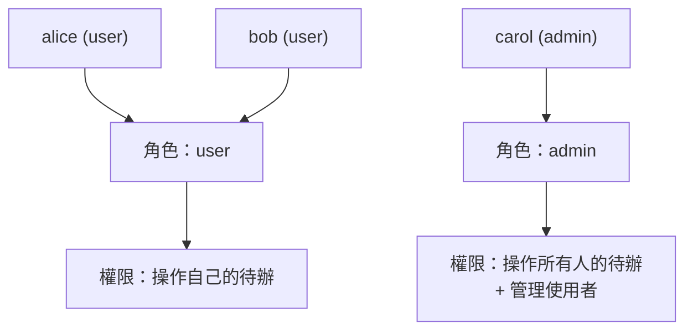

# [4-D-7] 角色與權限（RBAC）：後台系統與一般前台如何共用同一組 API

> **本章目標**：學會用「角色」來管理權限，讓同一組 API 能同時服務「一般使用者」和「管理員」，而不必為後台另寫一套。

## 你會學到

- RBAC（Role-Based Access Control，角色型存取控制）是什麼
- 為什麼用「角色」管權限，比針對每個人設定更好
- 怎麼把角色放進 JWT，並寫一個檢查角色的中介層
- 一般前台和管理後台如何共用同一組 API

---

## 概念說明

### 從「認證」走到「授權」

前面幾章解決的是**認證**（你是誰）。這章要處理**授權**（你能做什麼）。回顧 4-D-2 的機場類比：你過了海關（認證），但經濟艙登機證不能進商務艙休息室（授權）。

現在的問題是：一個系統裡有不同身分的人——一般使用者、管理員、客服……他們能做的事不一樣。怎麼管理「誰能做什麼」？

---

### 不要針對「每個人」設權限，要針對「角色」

最直覺但最糟的做法，是針對每一個人單獨設定：

```
❌ 針對個人設權限：
   alice  → 能刪自己的待辦
   bob    → 能刪自己的待辦
   carol  → 能刪自己的待辦、能看所有人的待辦、能停用帳號
   david  → 能刪自己的待辦
   ...一萬個使用者，設一萬次...
```

問題是：新員工進來要重設一遍、權限規則一改要改一萬筆。

**RBAC 的核心想法**：把人歸到「角色」，權限綁在角色上：

```
✅ 用角色管權限：
   角色 user（一般使用者）  → 能操作自己的待辦
   角色 admin（管理員）     → 能操作所有待辦、能管理使用者

   然後只要指定「每個人是什麼角色」：
   alice → user
   carol → admin
```

新人來只要給角色、權限規則改一次就好。這就是為什麼幾乎所有系統都用角色管權限。



這張圖表達 RBAC 的結構：人 → 角色 → 權限。中間多了「角色」這層，讓管理變得可規模化。

---

### 同一組 API，怎麼同時服務前台和後台？

關鍵洞察：**後台不需要另一套 API，只需要在同一組 API 上「依角色給不同權限」。**

```
GET /todos
    user 來呼叫  → 只回「他自己的」待辦
    admin 來呼叫 → 回「所有人的」待辦

DELETE /todos/:id
    user 來呼叫  → 只能刪「他自己的」
    admin 來呼叫 → 哪一筆都能刪
```

同一個端點，依「呼叫者的角色」給不同的行為。前台 App 和後台管理介面，背後其實是同一組 API——這大幅減少了要維護的程式碼。

---

## 程式碼範例

### 範例一：把角色放進 JWT

登入簽發 token 時，把角色一起寫進 payload，這樣每個請求都帶著「我是什麼角色」：

```typescript
// 簽 token 時，除了 userId 也帶上 role
const token = jwt.sign(
  { userId: user.id, role: user.role }, // role 例如 "user" 或 "admin"
  JWT_SECRET,
  { expiresIn: "15m" },
)
```

對應地，認證中介層解出 token 後，也把 role 記到 request 上（延續 4-D-5）：

```typescript
const payload = jwt.verify(token, JWT_SECRET) as { userId: number; role: string }
request.userId = payload.userId
request.userRole = payload.role
```

---

### 範例二：一個檢查角色的中介層

仿照 `requireAuth`，再寫一個「要求特定角色」的中介層。注意它是個「**會回傳中介層的函式**」，這樣才能傳入「需要哪個角色」：

```typescript
import type { Request, Response, NextFunction } from "express"

// requireRole("admin") 會產生一個「只放行 admin」的中介層
export function requireRole(role: string) {
  return (request: Request, response: Response, next: NextFunction): void => {
    if (request.userRole !== role) {
      // 注意是 403 不是 401：你登入了（認證過），但沒權限（授權不過）
      response.status(403).json({ error: "權限不足" })
      return
    }
    next()
  }
}
```

還記得 4-D-2 的 401 vs 403 嗎？這裡用 **403**——使用者身分是有效的，只是不被允許做這件事。

---

### 範例三：疊加中介層保護管理員專屬端點

中介層可以一層層疊。一個「只有管理員能用」的端點，先過認證、再過角色檢查：

```typescript
// 一般使用者就能用：先認證即可
app.get("/todos", requireAuth, todoController.getAll)

// 管理員專屬：先認證（你是誰）→ 再檢查角色（你是不是 admin）
app.get(
  "/admin/users",
  requireAuth,
  requireRole("admin"),
  adminController.listUsers,
)
```

讀這行就像讀一句話：「要拿使用者清單，**先登入、而且必須是 admin**。」中介層的疊加讓權限規則一目了然。

> 把「認證」「角色檢查」「業務邏輯」拆成各自獨立、可組合的中介層，正是單一職責與模組化的實踐 → [課外讀物 E-7-1：SOLID 總覽](../../課外讀物/E-7-solid/E-7-1-solid-overview.md)

---

## POC V5 — 完整架構 + 登入功能

> **你現在要做的事**：把 V4 升級成「有結構、要登入」的版本——後端重構成分層架構，Todo 操作需要登入，並依角色控制權限。
> 程式碼在 `poc/v5/`，先跑起來體驗登入流程，再回來對照說明。

這是 Part 4 的集大成之作，你的 Todo App 第一次有了「使用者」的概念：

```
相較於 V4，升級了：
    ✅ 後端分層：Controller / Service / Repository（4-D-1）
    ✅ 註冊 / 登入：密碼用 bcrypt 雜湊，登入簽發 JWT（4-D-3, 4-D-4）
    ✅ 受保護的 API：requireAuth 中介層，沒登入不能操作待辦（4-D-5）
    ✅ 每筆待辦綁定擁有者：只能看 / 改 / 刪自己的
    ✅ 角色控制：admin 可以看所有人的待辦（4-D-7）
```

```
V5 架構：
┌──────────┐     ┌──────────────────────────────┐
│  前端     │     │  後端（分層）                  │
│  登入頁   │ ──> │  routes → middleware(requireAuth) │
│          │     │        → controllers            │
│  帶 JWT   │ <── │        → services               │
│  發請求   │     │        → repositories           │
└──────────┘     └──────────────────────────────┘
                  資料仍在記憶體（永久保存等 V6 接資料庫）
```

**和 V4 的本質差異**：V4 是「工程成熟的單人工具」，V5 是「有使用者、有權限的真實應用」——它具備了幾乎每個正式產品都需要的登入與授權骨架。

---

## 小練習

**練習 1**：在 V5 註冊兩個帳號，登入其中一個新增幾筆待辦。然後登入另一個帳號——確認你**看不到**第一個帳號的待辦。這驗證了「待辦綁定擁有者」。

**練習 2**：用自己的話說明 RBAC 為什麼比「針對每個使用者設權限」好。如果公司新來 50 個員工，兩種做法各要做多少設定？

**練習 3**：`requireRole("admin")` 回的是 403 而不是 401。解釋這個選擇的理由——什麼情況該回 401、什麼情況該回 403？

---

## 課外讀物

> RBAC 把權限拆成可組合的角色與中介層，是模組化設計的展現 → [課外讀物 E-7-1：SOLID 總覽](../../課外讀物/E-7-solid/E-7-1-solid-overview.md)

> 整個登入授權機制，最終都依賴 HTTPS 保護傳輸安全 → [課外讀物 E-3-2：HTTPS 與 TLS](../../課外讀物/E-3-network/E-3-2-https-tls.md)
