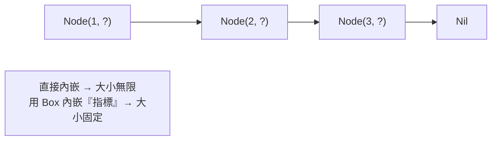

# [rust-8-1] 智慧指標 `Box`：把資料放到堆積上、遞迴型別

> **本章目標**：認識第一個「智慧指標」`Box`——一個讓你明確把資料放到堆積上的工具，並用它解決「遞迴型別」這個沒有它就無解的問題。

## 你會學到

- 「智慧指標」是什麼（直覺版）
- `Box<T>`：把一個值放到堆積上
- 為什麼「遞迴型別」需要 Box
- Box 怎麼自動清理（呼應所有權）

## 概念說明

### 什麼是智慧指標？

「指標」就是「一個指向某塊記憶體的東西」——你其實見過了，[rust-2-5] 的參考 `&` 就是最基本的指標。

**智慧指標（smart pointer）** 是「指標 plus」——它不只指向資料，還**附帶一些額外能力或行為**（例如自動管理記憶體、計算有幾個人在用）。`Box` 是最簡單的智慧指標。

`Box<T>` 的作用：**把一個值放到堆積上**，而在堆疊上只留一個指向它的 box。比喻：

```
一般的值：東西直接放在你手邊的桌上（堆疊）。
Box：    東西寄放到倉庫（堆積），你手邊只拿一張「寄物單」（box）。
```

大多數時候你不用特地 Box（Rust 會自動決定東西放哪）。但有幾種情況需要明確說「放堆積」，最經典的就是遞迴型別。

> 堆疊 vs 堆積的基礎 → 複習 [rust-2-1]；Box 把資料放堆積，但仍受所有權管轄

## 程式碼範例

### 基本用法

```rust
fn main() {
    let b = Box::new(5);       // 把整數 5 放到堆積上
    println!("{}", b);         // 5（用起來幾乎和一般值一樣）
    println!("{}", *b + 1);    // 6（* 解參考，拿到裡面的值）
}   // ← b 離開範圍，它擁有的堆積資料自動被清理
```

說明：`Box::new(值)` 把值放堆積、回傳一個 `Box`。用起來幾乎和普通值一樣（`*b` 解參考拿到裡面的值，呼應 [rust-6-1] 的 `*`）。而且——**Box 一樣遵守所有權規則**：`b` 離開範圍時，它擁有的堆積資料自動釋放，不用你管。這就是「智慧」的一部分。

對 `Box::new(5)` 這種小整數其實沒必要（整數放堆疊就好），這只是示範語法。真正非用不可的是下面這個。

### 非用不可的場景：遞迴型別

想像你要定義一個「鏈結串列」——每個節點存一個值，加上「指向下一個節點」。直覺會這樣寫：

```rust
enum List {
    Node(i32, List),      // ❌ 一個 List 裡面又包含一個 List……
    Nil,                  // 結尾
}
```

但這編譯失敗！錯誤是 `recursive type has infinite size`（遞迴型別大小無限）。為什麼？因為編譯器要算「一個 `List` 佔多少記憶體」：

```
一個 Node 的大小 = i32 + 「一個 List 的大小」
              = i32 + (i32 + 一個 List 的大小)
              = i32 + (i32 + (i32 + ...))   ← 永遠算不完！無限大
```



**解法：用 `Box` 把「下一個節點」放到堆積上**，這樣節點裡存的不是「另一個完整的 List」，而是「一個指向它的 box（指標）」。指標的大小是固定的（就一個記憶體位址），無限遞迴的問題就解決了：

```rust
enum List {
    Node(i32, Box<List>),     // ✅ 存一個「指向下一個 List 的 box」
    Nil,
}

use List::{Node, Nil};

fn main() {
    // 建立 1 -> 2 -> 3 -> Nil
    let list = Node(1, Box::new(Node(2, Box::new(Node(3, Box::new(Nil))))));
    print_list(&list);
}

fn print_list(list: &List) {
    match list {
        Node(value, next) => {
            println!("{}", value);
            print_list(next);          // 遞迴印下一個
        }
        Nil => println!("(結束)"),
    }
}
```

說明：`Box<List>` 讓 `Node` 的大小變成「一個 i32 + 一個指標」——固定大小，編譯器算得出來。這就是為什麼遞迴資料結構（鏈結串列、樹）在 Rust 一定要透過 Box 之類的指標。

> 鏈結串列、樹這些遞迴資料結構的完整介紹 → **dsa 課程 Part 2（鏈結串列）、Part 4（樹）**

## 小練習

1. 用 `Box::new` 把一個 `String` 放到堆積上，印出它和它的長度。
2. 把本章的 `List` 例子打出來，建立一個 `5 -> 10 -> 15 -> Nil` 的串列並用 `print_list` 印出。
3. 思考題：為什麼「直接內嵌的遞迴型別」大小是無限的，而「用 Box 內嵌指標」就變成固定大小？（提示：一個「記憶體位址」佔的空間是固定的嗎？）

<details>
<summary>參考解答</summary>

**第 1 題：把 `String` 放到堆積上，印出它和長度**

```rust
fn main() {
    let text = Box::new(String::from("哈囉，Rust"));
    // Box 會自動解參考，所以 text 用起來幾乎跟 String 一樣：
    println!("內容：{}", text);        // 哈囉，Rust
    println!("長度：{}", text.len());  // len() 回傳的是「位元組數」，不是字元數
}   // ← text 離開範圍，它擁有的堆積資料（含 String 內部的緩衝區）自動清理
```

說明：`Box<String>` 本身在堆疊上只是一個指標，指向堆積上的 `String`（而 `String` 內部又指向另一塊放實際文字的堆積）。這裡不用寫 `*text`，因為 Rust 的「自動解參考（Deref coercion）」會幫你把 `text.len()` 當成 `(*text).len()`。

小提醒：`len()` 算的是 **UTF-8 位元組數**，中文一個字通常佔 3 個位元組，所以印出來的數字會比你看到的字數大——這是正常的，不是 bug。

**第 2 題：建立 `5 -> 10 -> 15 -> Nil`**

```rust
enum List {
    Node(i32, Box<List>),
    Nil,
}

use List::{Node, Nil};

fn main() {
    let list = Node(5, Box::new(Node(10, Box::new(Node(15, Box::new(Nil))))));
    print_list(&list);
}

fn print_list(list: &List) {
    match list {
        Node(value, next) => {
            println!("{}", value);
            print_list(next);      // next 的型別是 &Box<List>，會自動解參考成 &List
        }
        Nil => println!("(結束)"),
    }
}
```

執行輸出會是：
```
5
10
15
(結束)
```

重點：建串列時是「由內往外包」——最裡面先寫 `Box::new(Nil)`，一層層往外包成 `Node`。`print_list` 收 `&List`（借用，不奪走所有權），這樣印完串列還在。

**第 3 題（思考題）：為什麼直接內嵌是無限大、Box 就固定？**

關鍵在編譯器「算型別大小」的方式。編譯器必須在編譯期就知道每個型別佔多少 bytes，才能決定怎麼在記憶體裡擺放它。

- **直接內嵌 `Node(i32, List)`**：算一個 `Node` 的大小時，它包含「一個完整的 `List`」，而那個 `List` 又可能是 `Node`，裡面又包一個完整 `List`……這是一條永遠停不下來的展開，算出來是「無限大」，編譯器只好放棄（報 `recursive type has infinite size`）。

- **用 Box `Node(i32, Box<List>)`**：`Box<List>` 存的不是「一整個 List」，而是「一個指向 List 的**記憶體位址**」。而記憶體位址的大小是**固定的**（在 64 位元機器上就是 8 bytes，不管它指向的東西多大）。所以一個 `Node` 的大小 = `i32`（4 bytes）+ 指標（8 bytes）= 固定值，編譯器算得出來。

所以提示的答案是：**「記憶體位址」佔的空間是固定的**——不論它指向 1 bytes 還是 1 GB 的資料，位址本身都一樣大。Box 就是用「一個固定大小的指標」換掉「一個大小未知的內嵌值」，把無限遞迴斬斷在指標這一層。

</details>

## 課外讀物

> 鏈結串列、樹的概念與操作 → **dsa 課程 Part 2、Part 4**

> 下一節：當「一個資料需要多個擁有者」時——Rc 與 RefCell → [rust-8-2]
