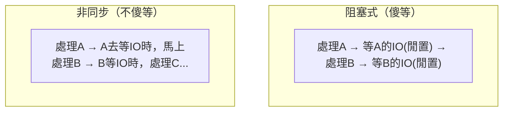
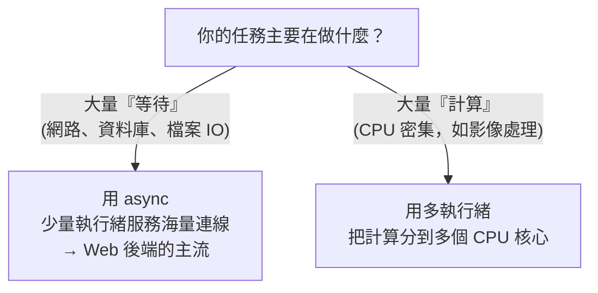

# [rust-8-5] 非同步初探：`async` / `await` 是什麼、何時用

> **本章目標**：建立對非同步程式設計的直覺——理解 `async`/`await` 解決什麼問題、和多執行緒有何不同，為 Part 9 的 Web 後端鋪路。

## 你會學到

- 「等待」造成的浪費：阻塞是什麼
- 非同步（async）的核心點子：等待時去做別的事
- `async` / `await` 語法的直覺
- 非同步 vs 多執行緒：各自適合什麼

## 概念說明

### 問題：很多時間都花在「等」

後端程式常常在「等」——等資料庫回應、等網路請求、等檔案讀完。這些等待中，CPU 其實**閒著沒事**，卻被「卡住」不能做別的。這叫**阻塞（blocking）**。

比喻：一個服務生（執行緒）幫客人點完餐，然後**站在廚房門口傻等這道菜做好**，期間完全不理其他客人。如果有 100 桌客人、每桌都要等上菜，你需要 100 個服務生站著等——太浪費了。

### 非同步：等待時去服務別人

**非同步（asynchronous）** 的點子是：**遇到「要等」的事，先把它掛著、轉去做別的事，等那件事好了再回來處理。**

比喻升級：一個聰明的服務生，幫 A 桌點完餐（送進廚房），**不傻等**，立刻去幫 B 桌、C 桌點餐；哪道菜好了就去端哪道。**一個服務生就能同時招呼很多桌**，因為他把「等待的時間」拿去做別的事了。



這張圖在說：阻塞式在「等 IO」時白白浪費時間；非同步把那些等待的空檔填滿（去處理別的任務），所以**用很少的執行緒就能同時處理大量「主要在等待」的工作**——這正是高並發網路服務（要同時服務上萬連線）的關鍵。

## 程式碼範例

### async / await 語法直覺

```rust
// async 標記這個函式是「非同步的」，回傳一個「未來會完成的東西」(Future)
async fn fetch_data() -> String {
    // 假設這裡有個要等待的網路請求
    String::from("資料")
}

async fn process() {
    // .await：在這裡「等」fetch_data 完成，但等待期間執行器可以去跑別的任務
    let data = fetch_data().await;
    println!("拿到：{}", data);
}
```

說明：

- `async fn`：標記一個非同步函式。它**不會立刻執行**，而是回傳一個 `Future`（「未來會產生結果的承諾」，有點像其他語言的 Promise）。
- `.await`：放在一個 `async` 呼叫後面，意思是「**在這裡等它完成**，但等的期間，讓背後的執行器（runtime）去處理其他任務」。
- 關鍵差異：`.await` 的「等」和傻等不同——它**讓出控制權**，所以不浪費。

### 需要一個「執行器（runtime）」

Rust 語言本身提供 `async`/`await` 語法，但**實際去調度這些非同步任務的「執行器」不在標準庫裡**，要用外部 crate，最主流的是 **`Tokio`**。所以非同步程式通常長這樣：

```rust
#[tokio::main]                    // Tokio 提供的執行器，驅動所有 async
async fn main() {
    let data = fetch_data().await;
    println!("{}", data);
}
```

說明：`#[tokio::main]` 把 `main` 變成非同步的進入點，並啟動 Tokio 執行器來調度。這個 `Tokio` 就是 Part 9 你做 Web 後端時，Axum 框架底下的引擎——[rust-9-1] 會再見到它。

### 非同步 vs 多執行緒：怎麼選

兩者都能「同時做事」，但適合的場景不同：



這張圖的重點：

- **IO 密集**（大部分時間在等網路/磁碟）→ **非同步**最划算。Web 伺服器同時處理上萬連線，靠的就是 async。
- **CPU 密集**（大部分時間在算東西）→ **多執行緒**（[rust-8-3]）把工作分到多核心才有意義。

很多真實系統兩者並用。現階段你只要建立這個直覺即可——**Web 後端 = IO 密集 = 非同步的主場**，這也是為什麼下一個 Part 一定會用到 async。

## 小練習

1. 用自己的話解釋「阻塞」和「非同步」的差別，並用「服務生」的比喻說一遍。
2. 判斷以下任務該用「非同步」還是「多執行緒」：(a) 一個同時服務一萬個使用者連線的聊天伺服器；(b) 一個要把一張 4K 圖片套用複雜濾鏡的程式。
3. 觀念題：為什麼 `.await` 的「等待」不像傻等那樣浪費 CPU？（提示：等的時候，執行器拿去做什麼了？）

<details>
<summary>參考解答</summary>

**第 1 題（阻塞 vs 非同步，用服務生比喻）**

- **阻塞（blocking）**：程式遇到「要等」的事（等網路、等資料庫、等檔案），就**卡在那裡什麼都不做**，直到那件事完成才往下走。這段等待期間，CPU/執行緒是被佔著卻閒置的。
- **非同步（asynchronous）**：遇到要等的事，**先把它掛起來、讓出控制權去做別的事**，等那件事好了再回來繼續。等待的空檔被拿去做有用的工作了。

服務生版本：阻塞式服務生幫 A 桌把菜單送進廚房後，就**站在廚房門口傻等這道菜做好**，期間完全不理其他客人——要服務 100 桌就得請 100 個服務生站著等。非同步服務生幫 A 桌送單後**不傻等**，馬上去幫 B 桌、C 桌點餐，哪道菜好了就去端哪道——**一個服務生就招呼得了很多桌**，因為他把「等菜的時間」拿去服務別人了。

**第 2 題（判斷用非同步還是多執行緒）**

- **(a) 同時服務一萬個連線的聊天伺服器 → 用「非同步」。** 這是典型的 **IO 密集**：大部分時間在等網路（等使用者送訊息、等下游回應），CPU 其實很閒。非同步能用少量執行緒服務海量連線，最划算。
- **(b) 對 4K 圖片套用複雜濾鏡 → 用「多執行緒」。** 這是 **CPU 密集**：全程都在做大量計算，沒有在「等」什麼。要加速就得把運算**分到多個 CPU 核心**同時算，這是多執行緒（[rust-8-3]）的主場；非同步在這裡幫不上忙（沒有等待空檔可以利用）。

**第 3 題（為什麼 `.await` 不浪費 CPU）**

關鍵在於 `.await` 會**讓出控制權（yield）**。傻等（阻塞）是「執行緒卡死在這一行，CPU 被佔著空轉」；而 `.await` 遇到還沒好的事情時，會把「我卡在這裡了」回報給背後的**執行器（runtime，例如 Tokio）**，然後執行器就**把這個執行緒拿去跑其他已經準備好的任務**。等到原本那件事（例如網路回應）真的到了，執行器再回頭把這個任務叫醒、從 `.await` 之後繼續。

所以同一個執行緒在「等 A 的 IO」時，其實正在「處理 B、C、D」，沒有一刻是閒著空轉的。這就是為什麼少量執行緒（甚至一個）就能同時撐住上萬個「主要在等待」的連線。

</details>

## 課外讀物

> 並行 vs 平行、IO 密集 vs CPU 密集的底層概念 → **cs 課程 Part 5：作業系統**

> 非同步是高並發後端的基礎 → 下一個 Part 實戰：[rust-9-1] Axum + Tokio

> 高並發系統的效能與可靠性 → **sre 課程**、[課外讀物 E-11：效能](../../../課外讀物/E-11-performance/E-11-6-backend-profiling.md)
