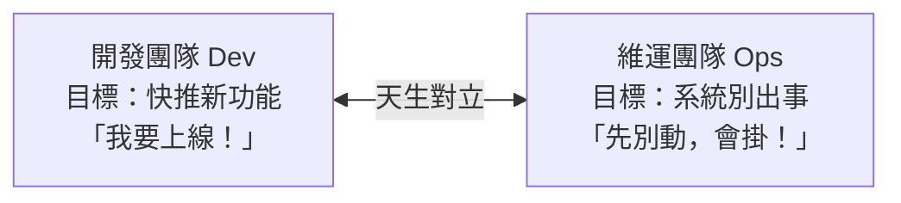

# [sre-1-1] SRE 的誕生：讓軟體工程師來做維運

> **本章目標**：理解 SRE 這個職位是怎麼來的、它要解決什麼問題，以及「用寫程式的方法做維運」這句話的真正含義。

## 你會學到

- SRE（Site Reliability Engineering）這個詞是什麼意思
- 傳統「開發 vs 維運」的對立，造成了什麼問題
- Google 怎麼用一個大膽的想法解決它
- 為什麼「可靠性」值得一個專門的工程職位

## 概念說明

### 先拆解這個詞

**SRE = Site Reliability Engineering，網站可靠性工程。** 拆三個字：

- **Site（網站 / 服務）**：你要照顧的線上服務。
- **Reliability（可靠性）**：它穩不穩、會不會掛、使用者用起來順不順。
- **Engineering（工程）**：用**工程（寫程式）**的方法去處理，而不是靠人力硬撐。

一句話總結：**SRE 是「用寫軟體的方式，來解決系統可靠性問題」的一門學問。**

---

### 問題的起點：開發與維運的世仇

要懂 SRE 為何誕生，先看它要解決什麼。傳統上，公司裡有兩個角色，目標天生衝突：



- **開發（Dev）**：他們的績效是「推出多少新功能」，所以想**快、想一直改**。
- **維運（Ops）**：他們的績效是「系統別出事」，而改動正是出事的最大來源，所以想**慢、想穩、想少改**。

結果就是無止境的拉扯：開發想上線，維運踩煞車；一出事就互相甩鍋——「是你的程式有 bug！」「是你的機器設定爛！」。系統越大，這個對立越痛苦。

---

### Google 的大膽提問

2003 年左右，Google 的 Ben Treynor 問了一個改變業界的問題：

> **「如果讓一個『軟體工程師』去做維運的工作，會發生什麼事？」**

傳統維運的人，遇到重複的工作就「手動再做一遍」。但軟體工程師的本能不一樣——**他看到重複的工作，會想「我來寫個程式自動化掉它」**。

這個視角的轉換，就是 SRE 的核心。SRE 工程師面對維運問題時，不是「捲起袖子手動處理」，而是「**寫程式讓問題自動被處理**」。維運從此不再是無止境的人力消耗，而變成一個**可以用工程方法持續改善**的領域。

---

### SRE 怎麼化解 Dev 與 Ops 的對立

SRE 最聰明的地方，是它不只換了做事方法，還**用數據化解了那個世仇**。

它的做法是：**不再爭論「要快還是要穩」，而是用一個共同的數字來決定。** 這個數字叫 **錯誤預算（error budget）**——先講結論，細節 Part 2 會深入：

- 大家一起定一個可靠性目標（例如「99.9% 的時間要正常」）。
- 沒達標的那 0.1%，就是「可以容許出錯的預算」。
- 預算還有剩 → 開發可以放心快推新功能。
- 預算用光了 → 大家一起停下來，先把穩定性顧好。

突然之間，Dev 和 Ops 不再是敵人，而是**看著同一個儀表板、為同一個目標合作**。這正是 SRE 帶來的文化革命。

---

### 所以 SRE 到底在追求什麼？

一句話：**讓系統「可靠」這件事，變成一門可以被工程、被衡量、被持續改善的學問——而不是靠運氣和加班硬撐。**

接下來整門課，就是一步步教你這套方法：怎麼用數字定義可靠（Part 2）、怎麼觀測系統（Part 3）、怎麼設計告警（Part 4）、怎麼處理事故（Part 5）、怎麼消除苦工（Part 6）、怎麼為失敗做設計（Part 7-8）。

## 範例：兩種心態的對比

同樣面對「伺服器磁碟每週都會滿、要去清」這個問題，兩種人的反應天差地遠：

```
傳統維運的反應：
  每週一收到磁碟告警
  → SSH 進去，手動清掉舊日誌
  → 下週一，再來一次……（永遠做不完）

SRE 的反應：
  「我為什麼要每週做同一件事？」
  → 寫一個腳本自動清理 + 設定 logrotate（infra Part 7-1 學過）
  → 從此這個問題自己解決，我去處理更有價值的事
```

看出差別了嗎？傳統維運把時間花在「**重複處理同一個問題**」；SRE 把時間花在「**讓問題不再需要人處理**」。這就是「用軟體工程做維運」最具體的樣子。

## 小練習

### 練習 1：用自己的話解釋

不看上面，回答：

1. SRE 三個字（Site / Reliability / Engineering）各代表什麼？
2. 「用軟體工程的方法做維運」跟傳統維運最大的差別在哪？

---

### 練習 2：理解 Dev vs Ops 的對立

回答：

1. 為什麼開發團隊想「快」、維運團隊想「穩」？這個衝突的根源是什麼？
2. SRE 用什麼方法，讓這兩個角色從對立變成合作？

---

### 練習 3：找出你生活中的「該被自動化的重複工作」

想一件你（或你看過的人）一直手動重複做的電腦工作。用 SRE 的視角想：能不能寫個程式讓它自動完成？這個「看到重複就想自動化」的直覺，就是 SRE 的起點。

## 課外讀物

> SRE 是站在 infra 的肩膀上——想先理解「系統怎麼跑起來、怎麼維護」 → 參見 **infra 課程**：`lessons/infra/課程大綱.md`
