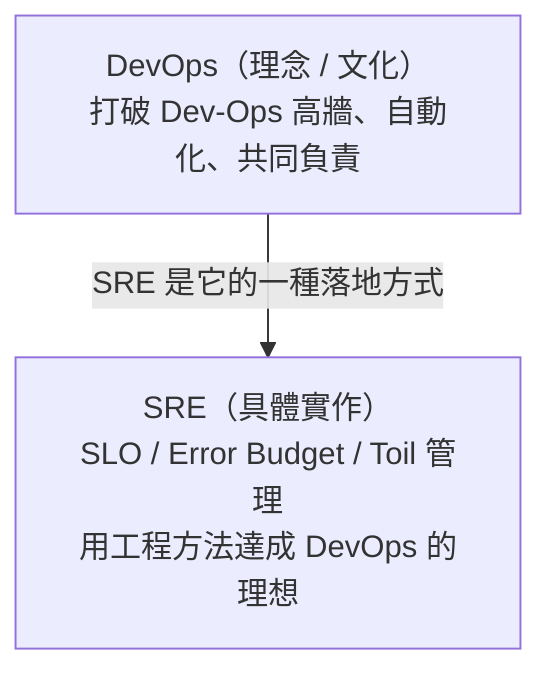

# [sre-1-2] SRE vs DevOps vs Infra vs 傳統維運：到底差在哪

> **本章目標**：釐清幾個常被混用的詞——SRE、DevOps、Infra、傳統維運，知道它們各自的定位與關係，不再被名詞搞混。

## 你會學到

- 傳統維運（SysAdmin）在做什麼
- DevOps 是一種「文化」，不是一個職位
- SRE 與 DevOps 的關係
- Infra、SRE 怎麼分工

## 概念說明

### 這些詞為什麼讓人混亂

求職網站上你會看到 DevOps 工程師、SRE、維運工程師、平台工程師……職責看起來都很像「顧伺服器、搞自動化、處理上線」。它們到底差在哪？

先給你一個一句話的全景，再逐一拆解：

| 名詞 | 一句話定位 |
|------|-----------|
| **傳統維運（SysAdmin）** | 手動照顧機器與系統的人 |
| **DevOps** | 一種「打破 Dev 與 Ops 高牆」的**文化與方法**（不是職位） |
| **SRE** | Google 提出的、**實踐 DevOps 理念的一套具體工程作法** |
| **Infra 工程師** | 專注「基礎建設本身」——機器、網路、平台 |

---

### 傳統維運（SysAdmin）

最古老的角色。職責是「讓機器運轉」——裝伺服器、設定系統、出事了去救。特色是**大量手動操作**，而且常和開發團隊分得很開（就是上一章說的那道高牆）。它不是不好，而是「規模一大就撐不住」——人力跟不上系統成長。

---

### DevOps：一種文化，不是一個人

這是最常被誤解的詞。**DevOps 不是一個職位，而是一種理念**：

> 別讓開發（Dev）和維運（Ops）各做各的、互相甩鍋。讓他們**緊密協作、共同負責**整個服務的生命週期——從寫程式到上線到維運。

DevOps 強調的是**文化**（合作、共同負責）和**實踐**（自動化、CI/CD、快速回饋）。但它比較像一個「理想方向」，沒有規定「具體要怎麼做」。

> 所以嚴格說，「DevOps 工程師」這個職稱有點怪——DevOps 是團隊該有的文化，不是某一個人的工作。但業界已經習慣用它指「負責自動化與部署流程的工程師」。

---

### SRE：DevOps 的「具體實作版」

如果 DevOps 是「理念」，那 **SRE 就是 Google 提出的、把這個理念落地的一套具體方法**。有句經典的話：

> **「SRE 是 DevOps 的一種具體實作（class SRE implements DevOps）。」**

（這是借用程式的比喻：DevOps 像一個「介面（interface）」定義了該達成什麼，SRE 像一個「實作（implementation）」給出了具體怎麼做。）

DevOps 說「要合作、要自動化、要快速回饋」；SRE 則給出**具體工具**：用 SLO 定義可靠性、用 error budget 平衡開發與穩定、用 toil 的上限逼自己自動化……。這些你接下來都會學到。



---

### SRE 與 Infra 工程師怎麼分工

你剛上完 infra 課（或正在學），可能想問：SRE 和 infra 工程師差在哪？

一個好記的分法：

| | Infra 工程師 | SRE |
|---|------------|-----|
| 重點問題 | 「系統怎麼**跑起來**？」 | 「系統怎麼**跑得可靠**？」 |
| 關注 | 機器、網路、平台、部署 | 可靠性、SLO、事故、韌性 |
| 比喻 | 蓋好房子、接好水電 | 確保房子**地震也不倒、停電也有備援** |

infra 把系統**建起來、維護好**；SRE 在這之上，用數據和工程方法，確保它**又穩又可靠**。兩者高度互補——很多人兩種能力兼具。這也是為什麼這門課建議搭配 infra 課一起學。

> 實務上，這些界線在不同公司很模糊。小公司可能一個人全包；大公司才會細分。重點不是糾結頭銜，而是理解**這些工作背後的思維**。

## 範例：同一個問題，四種角色的反應

「網站上線後常常變慢」這個問題：

```
傳統維運：收到抱怨，手動重啟伺服器，暫時好了（治標）
Infra 工程師：加機器、調設定、優化架構，讓它跑得動（建設）
SRE：先問「變慢到什麼程度才算『不可靠』？我們的目標是多少？」
     → 定義 SLO、量化問題、用數據決定要不要投入資源修
DevOps（文化）：讓開發和維運一起看這個問題，而不是互推
```

SRE 的獨特之處：它不急著動手，而是**先用數據定義「這到底算不算問題、嚴重到什麼程度」**。這就是下一章「核心信念」的精神。

## 小練習

### 練習 1：一句話區分

不看上面，用一句話分別說明：傳統維運、DevOps、SRE、Infra 各自的定位。

---

### 練習 2：理解「DevOps 不是職位」

回答：

1. 為什麼說「DevOps 是文化，不是一個人的工作」？
2. 「SRE 是 DevOps 的一種實作」這句話是什麼意思？

---

### 練習 3：分辨工作性質

下面的工作，比較像 infra 還是 SRE 的職責？

1. 設定一台新伺服器、裝好環境
2. 決定「我們的 API 該保證 99.9% 還是 99.99% 可用」
3. 寫一份事故的事後檢討報告
4. 設計公司的網路架構

## 課外讀物

> 想深入「系統怎麼跑起來、怎麼維護」的那一面 → 參見 **infra 課程**：`lessons/infra/課程大綱.md`
