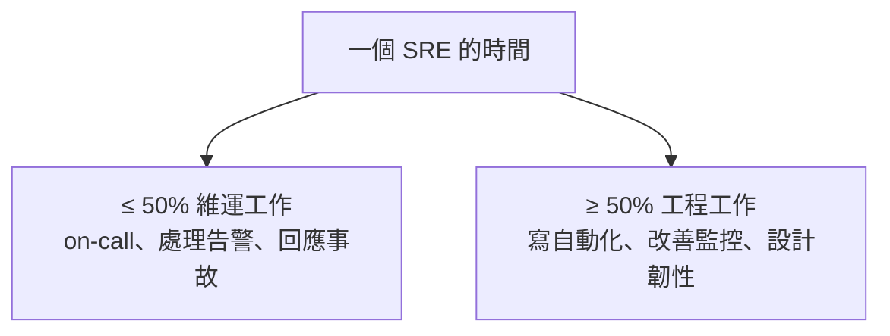

# [sre-1-4] 一個 SRE 的一天：工作的真實樣貌

> **本章目標**：透過「一個 SRE 的典型一天」，把前面的抽象概念連到具體工作，讓你對「當 SRE 到底在做什麼」有真實的畫面。

## 你會學到

- SRE 日常工作的幾大類型
- On-call（待命輪值）是什麼、為什麼又重要又讓人緊張
- SRE 怎麼分配時間（為什麼一半時間該拿來做工程）
- 這些日常各自對應到後面哪些 Part

## 概念說明

### SRE 的時間花在哪？

SRE 的工作不是單一一件事，而是幾種類型的組合。Google 有一條著名的原則：

> **SRE 花在「維運（toil）」的時間，上限是 50%；另外至少 50% 要拿來做「工程」。**

為什麼硬性規定？因為如果不設限，維運工作會像水一樣淹滿所有時間（上一章說的 toil 會暴增），讓你永遠沒空做真正能改善系統的事。強制留一半給工程，才能跳出「一直救火、系統卻沒變好」的惡性循環。



---

### SRE 日常的幾大類型

**① On-call（待命輪值）**

SRE 會輪流「值班」——在值班期間，如果系統出事、告警響了，你要負責第一時間處理。這是 SRE 最有壓力、也最核心的職責之一，下一段細講。

**② 處理告警與事故**

值班時，監控系統偵測到異常會發告警。你要判斷：這是真的問題嗎？嚴重嗎？怎麼止血？大事故還要協調團隊一起處理。（Part 4 告警、Part 5 事故）

**③ 寫自動化、消除 toil**

非值班時間的重點。把重複的維運工作寫成程式，讓它自己處理。每自動化掉一件 toil，未來就少救一次火。（Part 6）

**④ 改善監控與可靠性**

設計更好的儀表板、更聰明的告警、為系統加上韌性（重試、降級、冗餘）。這是「預防勝於治療」——讓事故更少發生。（Part 3、7、8）

**⑤ 事後檢討（Postmortem）與規劃**

事故過後，寫檢討報告、找出根因、規劃改善。還有容量規劃——預測未來流量、提前準備資源。（Part 5、7）

---

### On-call：SRE 的核心壓力來源

**On-call（待命）** 值得單獨說，因為它是 SRE 工作最獨特、也最讓人又愛又恨的部分。

用類比：on-call 像**醫院的急診室值班醫生**。值班期間，你不能跑太遠、要隨時能回應；警報一響（系統出事），你得馬上判斷、馬上處理。值完班可以休息，由下一個人接手。

On-call 為什麼讓人緊張：

- **時間不定**：可能半夜被叫醒（這就是為什麼 Part 4 一直強調「別設無謂的告警」）。
- **壓力大**：系統掛了，使用者在抱怨，你要在壓力下冷靜判斷。
- **責任重**：你的決定直接影響服務恢復的快慢。

但好的 SRE 團隊會努力讓 on-call **健康可持續**：合理的輪班、好的告警設計（只在真的需要時才響）、完整的 runbook（出事照著做就好）。把 on-call 從「恐怖的折磨」變成「可控的責任」——這本身就是 SRE 要解決的問題（Part 4-3）。

---

### 一個 SRE 的典型一天（範例）

把上面的類型，組成一個具體畫面：

```
09:00  看一下昨晚的監控、有沒有需要注意的趨勢（儀表板巡禮）
09:30  站立會議，同步團隊狀況
10:00  寫一個腳本，把「每次上線都要手動做的檢查」自動化（消除 toil）
12:00  午餐
13:30  ☎️ 告警響了：某 API 延遲變高
       → 看儀表板判斷、找到是某台機器資源吃滿、擴容止血（事故處理）
14:30  事故解除，記錄下來，排進之後的 postmortem
15:00  繼續上午的自動化專案（工程時間）
17:00  幫開發團隊 review 一個新功能的「可靠性設計」
        （它有沒有處理好逾時、重試？）
```

注意這一天的平衡——有救火（告警），但也有大量「讓未來少救火」的工程工作。這正是 SRE 和「整天救火的傳統維運」最大的差別。

---

### 這些日常對應到後面的學習

| 日常工作 | 在哪個 Part 深入學 |
|---------|------------------|
| 用數據判斷「算不算問題」 | Part 2（SLI/SLO）|
| 看儀表板、觀測系統 | Part 3（監控與觀測性）|
| 處理告警、on-call | Part 4（告警與 On-Call）|
| 處理事故、寫 postmortem | Part 5（事故處理）|
| 寫自動化、消除 toil | Part 6（消除 Toil）|
| 容量規劃、效能 | Part 7 |
| 為系統設計韌性 | Part 8 |

換句話說，這門課接下來的安排，就是依照「一個 SRE 真實會用到的能力」一個個展開。

## 小練習

### 練習 1：理解 50/50 原則

回答：

1. 為什麼 SRE 要規定「維運時間不超過 50%」？
2. 如果一個 SRE 整天都在救火，完全沒有工程時間，長期會發生什麼事？

---

### 練習 2：理解 On-call

用「急診室值班醫生」的類比，解釋 on-call 是什麼、為什麼讓人有壓力，以及好的團隊怎麼讓它變得可持續。

---

### 練習 3：分類你的想像

想像你是一個 SRE，把下面的工作分成「維運」還是「工程」：

1. 半夜被告警叫醒、重啟服務
2. 寫一個讓服務「掛了自動重啟」的機制
3. 手動幫某個使用者重設資料
4. 設計一個更好的監控儀表板

> 想想看：哪些是「這次處理完、下次還要再做」（維運/toil），哪些是「做一次、未來都受惠」（工程）？

## 課外讀物

> SRE 處理的事故，很多和系統的網路、效能有關，想先建立基礎 → [課外讀物 E-11-8：多層次快取全景：瀏覽器到資料庫](../../../課外讀物/E-11-performance/E-11-8-cache-layers.md)
