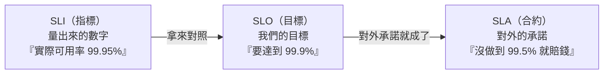

# [sre-2-1] 什麼叫「可靠」？從使用者角度定義

> **本章目標**：理解「可靠」這個模糊的詞，必須從**使用者的角度**用具體的方式定義，才能拿來衡量與改善。這是整個 Part 2 的思想起點。

## 你會學到

- 為什麼「系統很穩」這種說法毫無用處
- 可靠性要從「使用者體驗」而非「機器狀態」來定義
- 「可衡量」為什麼是一切的前提
- SLI / SLO / SLA 三個詞的關係（本 Part 的地圖）

## 概念說明

### 「我們系統很穩」——這句話沒有意義

問一個工程師「你們系統可靠嗎？」，常得到「還不錯啦、蠻穩的」這種答案。但這種說法**完全沒用**，因為：

- 「穩」是多穩？99% 還是 99.99%？
- 是誰覺得穩？工程師覺得，還是使用者覺得？
- 怎麼證明？有數據嗎，還是憑感覺？

SRE 的第一課就是：**模糊的形容詞不能拿來工程。** 你無法改善一個你無法衡量的東西。所以我們要把「可靠」這個模糊的詞，變成**具體、可衡量的數字**。

---

### 關鍵轉換：從「機器視角」到「使用者視角」

傳統維運看可靠性，常看「機器的狀態」：CPU 正常嗎？服務在跑嗎？機器活著嗎？

但 SRE 主張一個關鍵轉換：

> **可靠性，要從「使用者實際體驗到什麼」來定義，而不是「機器看起來如何」。**

為什麼？因為**機器全綠燈，使用者還是可能很痛苦**：

- 伺服器 CPU、記憶體都正常（機器視角：健康）
- 但因為程式 bug，使用者每次結帳都失敗（使用者視角：完全不可用）

機器很健康，但對使用者來說服務根本壞了。所以**只有使用者的體驗才算數**——他們能不能成功完成想做的事？快不快？會不會出錯？

用類比：評斷一家餐廳好不好，不是看「廚房設備有沒有開機」，而是看「**客人有沒有及時吃到好吃的菜**」。SRE 看可靠性也一樣——看的是使用者這端的真實體驗。

---

### 從使用者角度，可靠通常意味著什麼

把「可靠」翻譯成使用者實際在乎的事，通常是幾個面向：

| 使用者在乎的 | 具體是什麼 | 例子 |
|------------|-----------|------|
| **可用** | 服務能不能用、回不回應 | 網站打得開嗎？ |
| **快** | 回應夠不夠快 | 點下去要等多久？ |
| **正確** | 結果對不對、會不會出錯 | 結帳會不會失敗、算錯錢？ |
| **新鮮** | 資料夠不夠即時 | 看到的是不是最新的？ |

SRE 的工作，就是把這些「使用者在乎的事」變成**可以量化的數字**，然後設定目標、持續追蹤。

---

### 本 Part 的地圖：SLI → SLO → SLA

要把「可靠」變成可管理的東西，SRE 用三個一組的概念。先看它們的關係（後面各章深入）：



一句話記住三者關係：

- **SLI（Indicator，指標）**：你**實際量到**的數字。（Part 2-2）
- **SLO（Objective，目標）**：你**想達到**的目標值。（Part 2-3）
- **SLA（Agreement，合約）**：你**對客戶承諾**、沒做到要負責的底線。（Part 2-5）

簡單說：**SLI 是「現在幾分」，SLO 是「我們的目標幾分」，SLA 是「低於幾分要賠錢」。** 三者環環相扣，是 SRE 用數據管理可靠性的基礎。

## 範例：把「可靠」翻譯成可衡量的東西

老闆說「我要購物網站很可靠」。一個 SRE 會把它翻譯成具體、可量的定義：

```
模糊：「網站要可靠」
              ↓ 從使用者角度拆解
具體：
  - 可用：99.9% 的時間，首頁能正常開啟
  - 快：95% 的頁面，載入時間在 1 秒內
  - 正確：99.95% 的結帳請求成功完成
  - 新鮮：商品庫存顯示，延遲不超過 5 秒
```

看出差別了嗎？右邊每一條都是**可以量測、可以設目標、可以追蹤**的。「可靠」從一句空話，變成了一組工程可以處理的指標。這就是 SRE 的起手式。

## 小練習

### 練習 1：為什麼機器視角不夠

舉一個例子說明：「機器看起來全部正常，但使用者體驗其實很糟」的情況。為什麼 SRE 堅持要用使用者視角？

---

### 練習 2：翻譯模糊的可靠性

把下面這句模糊的話，從使用者角度翻譯成 3~4 條具體可衡量的定義：

> 「我們的影音串流服務要很順。」

> 提示：使用者在乎什麼？能不能播放、會不會卡頓、畫質、開始播放要等多久……

---

### 練習 3：分清三個詞

不看上面，用一句話分別解釋 SLI、SLO、SLA 的差別。

## 課外讀物

> 「可靠」很大一部分是「快」，而效能優化是讓服務變快的關鍵 → [課外讀物 E-11-8：多層次快取全景：瀏覽器到資料庫](../../../課外讀物/E-11-performance/E-11-8-cache-layers.md)
