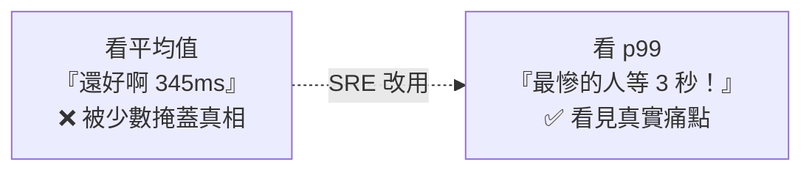

# [sre-2-2] SLI：可靠性怎麼「量」

> **本章目標**：理解 SLI（服務水準指標）是什麼，學會用「好事件 ÷ 總事件」的方式量化可靠性，並認識最常用的幾種 SLI。

## 你會學到

- SLI（Service Level Indicator）是什麼
- 好的 SLI 怎麼設計：好事件比例
- 四種最常用的 SLI：可用率、延遲、錯誤率、吞吐量
- 為什麼「平均值」會騙人，要看百分位數（percentile）

## 概念說明

### SLI 是什麼

上一章說，要把「可靠」變成可衡量的數字。**SLI（Service Level Indicator，服務水準指標）就是那個數字**——它是「**對使用者體驗的一個量化測量**」。

定義很簡單，但有個關鍵：**好的 SLI 通常表示成「好事件佔總事件的比例」**：

```
SLI = 好的事件數 ÷ 總事件數 × 100%
```

例如：

```
可用率 SLI = 成功的請求數 ÷ 總請求數
         = 9,995 ÷ 10,000 = 99.95%
```

為什麼用比例？因為它**直覺、好對照目標**——99.95% 一看就懂，而且可以直接拿去跟「目標 99.9%」比較。

---

### 四種最常用的 SLI

不是所有東西都值得量。SRE 通常聚焦在「使用者最有感」的幾種：

| SLI | 量什麼 | 好事件的定義 | 對應使用者在乎的 |
|-----|--------|------------|----------------|
| **可用率（Availability）** | 服務回不回應 | 回傳成功（非錯誤）的請求 | 「能不能用」 |
| **延遲（Latency）** | 回應多快 | 在 X 毫秒內回應的請求 | 「快不快」 |
| **錯誤率（Error Rate）** | 出錯多少 | 沒有出錯的請求 | 「會不會壞」 |
| **吞吐量（Throughput）** | 能處理多少量 | （通常看每秒請求數） | 「扛不扛得住」 |

這四個正好對應上一章使用者在乎的「可用、快、正確」。Part 3 你會看到，這幾個再加一個「飽和度」，就是著名的「四個黃金訊號」。

---

### 一個關鍵陷阱：平均值會騙人

量延遲時，新手最常犯的錯是「看平均值」。但**平均值會嚴重誤導**，這點一定要懂。

假設 10 個請求的回應時間（毫秒）：

```
50, 50, 50, 50, 50, 50, 50, 50, 50, 3000
```

- **平均值** = (50×9 + 3000) ÷ 10 = 345ms。看起來還好？
- 但真相是：**有一個使用者等了 3 秒**！平均值把這個慘痛體驗「稀釋」掉了。

服務規模一大，「少數很慘的使用者」會被平均值完全掩蓋。所以 SRE 不看平均，而看**百分位數（percentile）**。

---

### 百分位數（Percentile）：看「最糟的那群人」

**百分位數**的意思是「有多少比例的請求，比這個值好」。常用的：

| 寫法 | 唸法 | 意思 |
|------|------|------|
| **p50** | p-fifty | 50% 的請求比這快（這就是中位數） |
| **p95** | p-ninety-five | 95% 的請求比這快（看「較慢的那 5%」） |
| **p99** | p-ninety-nine | 99% 的請求比這快（看「最慘的那 1%」） |

用上面的例子：p50（中位數）是 50ms（一半的人很順），但 **p99 會抓到那個 3000ms**——它揭露了「最倒楣的使用者有多痛」。

為什麼 SRE 在乎 p99、甚至 p99.9？因為——**那「最慘的 1%」可能正是你最重要的大客戶**，或是同一個使用者每 100 次操作就遇到 1 次卡頓。平均值讓你自我感覺良好，百分位數才逼你面對真相。

用類比：一個班「平均分」90 分看起來很棒，但如果有 5 個人考 20 分被 35 個 100 分平均掉了——平均分騙了你，那 5 個人才是要救的。p95/p99 就是專門揪出「那群被平均掩蓋的倒楣鬼」。



## 範例：設計一組 SLI

幫一個 API 服務設計 SLI，每一條都遵循「好事件 ÷ 總事件」：

```
可用率 SLI：
  好事件 = 回傳 HTTP 狀態碼非 5xx 的請求（infra/basic 學過狀態碼）
  SLI = 非 5xx 請求 ÷ 總請求 = 99.95%

延遲 SLI：
  好事件 = 在 300ms 內回應的請求
  SLI（用 p95 表示）= 95% 的請求都在 300ms 內 → p95 = 280ms ✅

錯誤率 SLI：
  好事件 = 業務邏輯成功的請求（沒回傳錯誤）
  SLI = 成功請求 ÷ 總請求 = 99.9%
```

注意延遲那條——我們不說「平均 300ms」，而說「**p95 在 300ms 內**」。這保證了「絕大多數使用者（95%）」都有好體驗，而不是被平均值蒙蔽。

## 小練習

### 練習 1：算一個 SLI

某 API 今天收到 50,000 個請求，其中 49,900 個成功、100 個回傳 500 錯誤。

1. 它的可用率 SLI 是多少？
2. 用「好事件 ÷ 總事件」的格式寫出算式。

---

### 練習 2：拆穿平均值

有 5 個請求的延遲是：`100, 100, 100, 100, 5000`（毫秒）。

1. 平均值是多少？
2. 這個平均值「隱藏」了什麼真相？
3. 為什麼看 p99 比看平均值誠實？

---

### 練習 3：為你的服務設計 SLI

為一個「線上訂票網站」設計 3 條 SLI（可用率、延遲、錯誤率各一），每條都用「好事件 ÷ 總事件」的方式定義「什麼算好事件」。

## 課外讀物

> 延遲 SLI 背後，是「怎麼讓系統更快」的效能工程 → [課外讀物 E-11-3：Redis 與快取策略](../../../課外讀物/E-11-performance/E-11-3-redis-cache.md)
