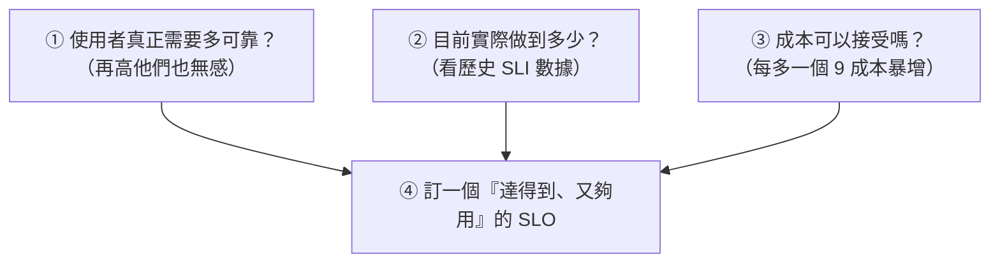

# [sre-2-3] SLO：99.9% 到底代表一年可以掛多久？

> **本章目標**：理解 SLO（服務水準目標）是什麼，看懂「幾個 9」實際代表多少停機時間，並學會怎麼設定一個合理的 SLO。

## 你會學到

- SLO（Service Level Objective）是什麼，跟 SLI 的關係
- 「幾個 9」對照表——99.9% 一年到底能掛多久
- 怎麼設定一個「剛剛好」的 SLO（呼應「擁抱風險」）
- 為什麼 SLO 不是越高越好

## 概念說明

### SLO 是什麼

上一章的 SLI 是「**實際量到的數字**」（例如可用率 99.95%）。但光有數字還不夠——你得知道「**這個數字算好還是不好**」。這就需要一個**目標**來對照。

**SLO（Service Level Objective，服務水準目標）就是你為 SLI 設定的目標值。**

```
SLI（實際）= 99.95%      ← 我現在實際做到的
SLO（目標）= 99.9%       ← 我設定要達到的
→ 99.95% > 99.9%，達標！✅
```

關係很簡單：**SLI 是「考幾分」，SLO 是「及格線設幾分」。** 有了 SLO，可靠性才從「一個數字」變成「達標 / 沒達標」的明確判斷——也才能拿來做決策（Part 2-4 的 error budget 就靠它）。

---

### 「幾個 9」實際代表多少停機？

SLO 常用「幾個 9」來講（infra Part 9-2 提過，這裡精算）。重點是：**每多一個 9，能容許的停機時間就少 10 倍**。實際感受一下：

| SLO | 俗稱 | 一年可容許停機 | 一個月可容許停機 |
|-----|------|--------------|----------------|
| 99% | 兩個 9 | 約 **3.65 天** | 約 7.2 小時 |
| 99.9% | 三個 9 | 約 **8.76 小時** | 約 43 分鐘 |
| 99.95% | — | 約 4.38 小時 | 約 22 分鐘 |
| 99.99% | 四個 9 | 約 **52 分鐘** | 約 4.3 分鐘 |
| 99.999% | 五個 9 | 約 **5 分鐘** | 約 26 秒 |

這張表非常重要，它把抽象的百分比變成「**一年能掛多久**」的真實感受：

- 「99.9%」聽起來很高，但其實**一年可以掛將近 9 小時**——對很多服務來說綽綽有餘。
- 「五個 9」聽起來只多一點點，但代表**一整年只能掛 5 分鐘**——這幾乎要求全自動故障轉移、沒有人類反應得及的餘地，成本極高。

---

### 怎麼設一個「剛剛好」的 SLO

這裡呼應 Part 1-3 的「擁抱風險」信念：**SLO 不是越高越好，而是要剛剛好。**

設定 SLO 的思考步驟：


```mermaid
graph TB
    A["① 使用者真正需要多可靠？<br/>（再高他們也無感）"]
    B["② 目前實際做到多少？<br/>（看歷史 SLI 數據）"]
    C["③ 成本可以接受嗎？<br/>（每多一個 9 成本暴增）"]
    D["④ 訂一個『達得到、又夠用』的 SLO"]
    A --> D
    B --> D
    C --> D
```

幾個實用原則：

1. **以使用者為準**：使用者感覺不到的可靠性，多做就是浪費。若使用者的網路本身就只有 99% 可靠，你做到 99.999% 他也無感。
2. **參考現況**：先看你過去實際的 SLI。如果一直都做到 99.95%，訂 99.9% 是合理的；訂 99.999% 則不切實際。
3. **算成本**：每多一個 9，要投入的冗餘、自動化、人力都指數成長。要值得。
4. **不要訂 100%**：100% 是不可能也是不該的目標（Part 1-3）——它沒有留任何「可以出錯、可以改動」的空間。

---

### 為什麼「太高的 SLO」反而有害

訂一個達不到的 SLO，比沒訂還糟：

- **永遠在「沒達標」的焦慮中**，團隊疲於奔命。
- **逼大家不敢改動**（因為任何改動都可能讓你掉出那個嚴苛的目標），扼殺開發。
- **失去意義**：當目標永遠達不到，大家就乾脆無視它。

所以好的 SLO 是「**踮起腳尖搆得到**」的——有挑戰性，但達得到；高到使用者滿意，但留了「可以出錯、可以創新」的空間。這個空間，就是下一章的主角：**錯誤預算**。

## 範例：為服務設定 SLO

幫一個內部使用的報表系統設定 SLO：

```
分析：
  - 使用者：公司內部員工，白天上班時間用
  - 影響：掛掉的話員工等一下、不開心，但不會直接損失營收
  - 現況：過去一年實際可用率約 99.5%

決策：
  SLO 設「99.5% 可用率」
  理由：
    - 對「內部、非營收關鍵」的系統，99.5% 已足夠（一年可掛約 1.8 天，多在非上班時間沒差）
    - 訂 99.99% 太嚴苛，要投入大量資源做高可用，不值得
    - 99.5% 是現況做得到、又夠用的「剛剛好」目標
```

對比一下：如果這是「對外的金流系統」，掛一分鐘就損失大筆營收、傷害信任——那 SLO 就該訂得高很多（如 99.99%），並投入對應資源。**同樣的「可靠」，不同服務的合理 SLO 天差地遠。**

## 小練習

### 練習 1：讀懂「幾個 9」

不查表，回答（可以推算）：

1. SLO 99.9%，一年大約可以容許停機多久？
2. 從 99.9% 提升到 99.99%，可容許的停機時間變成原本的幾分之幾？

<details>
<summary>參考解答</summary>

**1.** SLO 99.9%（三個 9），代表「允許 0.1% 的時間不可用」。一年的總時間約 365 天：

```
一年可容許停機 = 一年總時間 × (1 − 99.9%)
             = 365 天 × 0.1%
             = 0.365 天
             ≈ 8.76 小時
```

所以一年大約可以掛 **8.76 小時**（將近 9 小時）。

**2.** 本章的關鍵規律：**每多一個 9，能容許的停機時間就少 10 倍**。從 99.9%（0.1% 不可用）提升到 99.99%（0.01% 不可用），不可用的比例從 0.1% 降到 0.01%，剛好是**十分之一**。

驗證：99.99% 一年可容許停機 ≈ 8.76 小時 ÷ 10 ≈ 52 分鐘，正好對得上表格。所以可容許停機時間變成原本的 **1/10**。

</details>

---

### 練習 2：批評一個 SLO

某新創團隊只有 3 個工程師，卻把所有服務的 SLO 都訂成「99.999%（五個 9）」。用本章的原則，說說這為什麼是個壞主意。

<details>
<summary>參考解答</summary>

用本章的原則來拆解，這個決定至少踩了以下幾個雷：

- **達不到，所以毫無意義**：五個 9 代表一整年只能掛 **5 分鐘**。這幾乎要求全自動故障轉移、多區域冗餘、完善的自動化——一個只有 3 人的新創幾乎不可能做到。訂一個永遠達不到的目標，團隊只會永遠處在「沒達標」的焦慮裡，最後乾脆無視它，目標就失去意義。

- **成本完全不划算**：每多一個 9，要投入的冗餘、自動化、人力都是**指數成長**。3 個工程師把全部心力砸在追求五個 9 上，等於沒有人力去做真正重要的事（開發產品、找到市場）。對一個還在求生存的新創，這是嚴重的資源錯置。

- **扼殺開發速度**：目標訂這麼嚴，任何改動都可能讓你掉出目標，於是大家不敢上線、不敢實驗。這對最需要快速迭代、快速試錯的新創是致命的。

- **多半超過使用者真正的需求**：使用者感覺不到的可靠性，多做就是浪費。新創的早期使用者通常能容忍偶爾的小故障，硬追五個 9 是把資源花在使用者根本無感的地方。

- **「全部服務」一視同仁也錯**：不同服務的合理 SLO 天差地遠。核心金流也許需要高一點，但內部後台、非關鍵功能訂那麼高完全沒必要。

**正確做法**：先看使用者真正需要多可靠、參考現況做得到多少、評估成本，訂一個「踮起腳尖搆得到、又夠用」的 SLO（例如先從 99% 或 99.9% 起步），把省下的資源拿去做開發與成長。

</details>

---

### 練習 3：設定合理的 SLO

為下面兩個服務各設一個合理的 SLO，並說明理由：

1. 一個個人部落格
2. 一個線上支付系統

> 提示：想想「掛掉的後果有多嚴重」「使用者多在乎」「值不值得花那個成本」。

<details>
<summary>參考解答</summary>

**1. 個人部落格：SLO 設「99%（兩個 9）」左右就夠。**

理由：
- **掛掉的後果很輕**：部落格掛個幾小時，讀者晚點再看就好，不會有人損失金錢或造成信任危機。
- **使用者不太在乎**：讀者對個人部落格的可靠度期待很低，偶爾打不開完全能接受。
- **不值得花成本**：99% 一年可掛約 3.65 天，對部落格綽綽有餘。硬要往上追 99.9%、99.99% 得投入冗餘與自動化，對一個個人專案完全不划算。

**2. 線上支付系統：SLO 應該訂得很高，例如「99.99%（四個 9）」甚至更高。**

理由：
- **掛掉的後果極嚴重**：支付系統掛一分鐘，就可能損失大筆營收、讓交易失敗、嚴重傷害使用者信任，甚至有法律與合約責任。
- **使用者非常在乎**：付款當下失敗，使用者立刻就有感、立刻就會抱怨或流失。
- **值得投入成本**：正因後果嚴重，投入高可用架構（多區域冗餘、自動故障轉移）是划算的。99.99% 一年只容許掛約 52 分鐘，逼團隊把穩定性做到很扎實。

**核心觀念**：同樣是「可靠」，合理的 SLO 由「掛掉的後果有多嚴重 + 使用者多在乎 + 值不值得花成本」共同決定，不同服務可以天差地遠。而且無論哪個，都不該訂 100%——要留可以出錯、可以改動的空間。

</details>

## 課外讀物

> 達成高 SLO 常需要規模化的架構支撐，想了解大型系統如何設計 → [課外讀物 E-13-4：Monolith vs Microservices](../../../課外讀物/E-13-scaling/E-13-4-monolith-vs-microservices.md)
