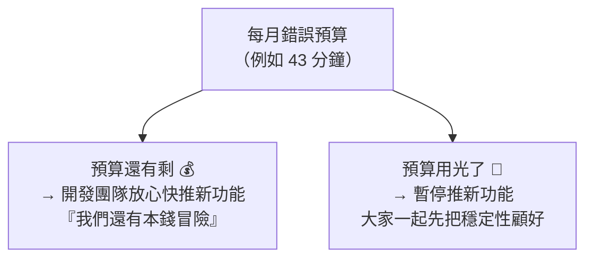

# [sre-2-4] Error Budget：可靠性與開發速度的平衡桿

> **本章目標**：理解錯誤預算（error budget）這個 SRE 最精妙的發明，它怎麼把「要快還是要穩」這個千年爭論，變成一個用數字就能解決的問題。

## 你會學到

- 錯誤預算（Error Budget）是什麼、怎麼算
- 它如何把 Dev 與 Ops 的對立變成合作
- Error Budget Policy：預算用光了該怎麼辦
- 為什麼「沒用完預算」也是一種浪費

## 概念說明

### 從 SLO 自然長出的概念

上一章你訂了 SLO，例如「99.9% 可用率」。現在反過來想那剩下的 0.1%：

> 如果目標是 99.9% 可用，就代表你「**允許** 0.1% 的時間不可用」。

這 0.1% 不是失敗——是你**主動允許、預留的「可以出錯的額度」**。這個額度，就是**錯誤預算（Error Budget）**：

```
錯誤預算 = 100% − SLO
```

例如 SLO = 99.9%，那錯誤預算 = 0.1%。換算成時間（用上一章的表）：**一個月大約 43 分鐘的「可以掛掉」的額度**。

把它想成「預算」非常貼切——就像你每月有一筆零用錢，可以自由花，但花完就沒了。

---

### 這個發明為什麼天才：化解 Dev vs Ops 的戰爭

還記得 Part 1-1 那個「開發要快、維運要穩」的世仇嗎？錯誤預算就是用來終結它的。

關鍵洞察：**每一次上線新功能、每一次改動，都會「花掉」一點錯誤預算**（因為改動有風險，可能造成短暫不穩）。於是：



突然之間，「要快還是要穩」不再是兩派人吵架，而是**看一個數字就有答案**：

- **預算充足** → 開發團隊可以大膽上線、快速迭代。維運沒理由阻擋——因為數據顯示還有餘裕。
- **預算耗盡** → 自動觸發「凍結上線」，所有人（包括開發）都同意先停下來修穩定性。因為再上線就會違反對使用者的承諾。

**Dev 和 Ops 不再對立，因為他們都服從同一個數字。** 這就是錯誤預算最美的地方——它把情緒化的爭論，變成理性的、數據驅動的決策。

---

### Error Budget Policy：白紙黑字的遊戲規則

光有預算還不夠，要事先講好「**預算花到不同程度時，大家該怎麼做**」。這份事先講好的規則叫 **Error Budget Policy（錯誤預算政策）**。典型長這樣：

| 預算狀態 | 行動 |
|---------|------|
| 還很充足（用不到一半） | 開發全速前進，可以大膽嘗試 |
| 快用完（剩一點點） | 放慢上線、加強測試、開始留意 |
| 已用光 | **凍結新功能上線**，全員專注修穩定性，直到預算回補 |

重點是**事先講好、白紙黑字**——這樣預算用光時，不會有人吵「到底要不要停」，因為規則早就定好、所有人都同意過了。這是 SRE 把「文化」變成「制度」的關鍵。

---

### 反直覺的一課：沒用完預算，也是一種浪費

新手會覺得「錯誤預算當然是省越多越好、最好都不要用」。SRE 說：**錯。預算大量沒用完，反而代表你做錯了。**

為什麼？如果你的錯誤預算月底還剩一大半，代表：

- 你的系統**過度可靠**了——可靠到超過 SLO 一大截。
- 而「過度可靠」是用**過度保守**換來的——你太不敢上線、太不敢創新、把太多資源砸在穩定上。
- 這些「省下來的預算」，其實可以拿去**換成更快的開發、更多的實驗**。

所以健康的狀態是：**剛好用掉差不多的預算**。這代表你在「可靠」和「進步」之間取得了最佳平衡——既沒有犧牲使用者體驗，也沒有因為過度保守而停滯。

這完美呼應了 Part 1-3 的「擁抱風險」：**預算就是用來花的，花得剛剛好，才是真本事。**

## 範例：錯誤預算怎麼運作

一個服務 SLO = 99.9%，看它一個月的預算故事：

```
月初：錯誤預算 = 0.1% ≈ 43 分鐘（這個月可以「掛」的額度）

第 1 週：上線新功能，出了個 bug，掛了 10 分鐘
  → 預算剩 33 分鐘。還很充足，繼續開發。

第 2 週：一次部署失誤，掛了 15 分鐘
  → 預算剩 18 分鐘。開始留意了。

第 3 週：又一次事故，掛了 20 分鐘
  → 預算剩 -2 分鐘，超支了！
  → 觸發 Error Budget Policy：凍結所有新功能上線
  → 全員轉去：修穩定性、補測試、做事後檢討
  → 直到下個月預算重置，或穩定性明顯改善

決策完全由數字驅動，沒有人需要吵架。
```

對比沒有錯誤預算的世界：第 3 週這次事故後，開發說「再上一個就好」，維運說「不行」，然後兩邊吵到老闆那裡……。錯誤預算讓這種內耗消失了。

## 小練習

### 練習 1：算錯誤預算

某服務 SLO = 99.95%。

1. 它的錯誤預算是多少百分比？
2. 換算成一個月，大約是多少分鐘？（提示：參考 2-3 的表）

---

### 練習 2：解釋它的威力

用自己的話回答：錯誤預算是怎麼把「開發要快 vs 維運要穩」的爭吵，變成一個不用吵的決策？

---

### 練習 3：理解「沒用完也是浪費」

某團隊月底發現錯誤預算幾乎沒動用（用不到 5%）。

1. 這代表系統很糟還是很好？
2. 一個 SRE 會建議他們做什麼？為什麼？

> 提示：過度可靠 = 過度保守的代價。那些沒用的預算，本可以換成更快的進步。

## 課外讀物

> 錯誤預算政策是「開發與 SRE 協作」的制度基礎，Part 9-1 會深入這個文化面 → [課外讀物 E-8-7：Git Flow 與 GitHub Flow](../../../課外讀物/E-8-git/E-8-7-git-flow.md)
