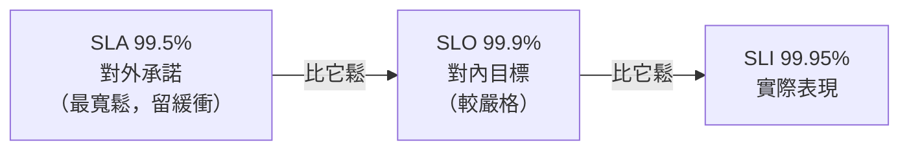

# [sre-2-5] SLA：對外的承諾與罰則

> **本章目標**：理解 SLA（服務水準協議）是什麼、和 SLO 的關鍵差別，以及為什麼「對外承諾的 SLA」要比「對內目標的 SLO」更寬鬆。

## 你會學到

- SLA（Service Level Agreement）是什麼
- SLA 與 SLO 的關鍵差別（對外 vs 對內、有無罰則）
- 為什麼 SLA 應該「比 SLO 寬鬆」
- 三個詞（SLI/SLO/SLA）的完整關係收尾

## 概念說明

### SLA 是什麼

**SLA（Service Level Agreement，服務水準協議）是你跟「客戶」之間，白紙黑字的合約承諾——保證服務達到某個水準，否則要負責（通常是賠償）。**

關鍵字是「**合約**」和「**罰則**」。SLA 不是內部目標，而是**對外的法律承諾**，常見於你付費使用的雲端服務。例如：

> 「我們保證每月可用率達 99.9%。若未達標，將退還當月 10% 費用。」

這就是一份 SLA——有明確的承諾數字、有沒做到的後果（退費）。

---

### SLA vs SLO：最重要的區別

這兩個最容易搞混，務必分清。它們數字看起來很像，但本質完全不同：

| | SLO（目標） | SLA（合約） |
|---|-----------|-----------|
| 對象 | **對內**（團隊自己的目標） | **對外**（對客戶的承諾） |
| 性質 | 工程目標，沒達到是「該改善」 | 法律合約，沒達到要**賠償** |
| 後果 | 觸發 error budget policy | 退費、賠款、客戶流失 |
| 誰在乎 | 工程團隊 | 業務、法務、客戶 |

用類比：

- **SLO 像你給自己訂的「目標體重」**——沒達到，你會檢討、調整，但沒人罰你。
- **SLA 像你跟健身房簽的「保證合約」**——「沒幫你減到 X 公斤就退費」，沒做到真的要賠錢。

---

### 關鍵原則：SLA 要比 SLO 寬鬆

這是這章最重要的一課。一個聰明的組織會讓：

```
SLA（對外承諾）< SLO（對內目標）< SLI（實際做到，最好）

例如：
  對外 SLA  = 99.5%   ← 對客戶承諾的底線（留安全邊際）
  對內 SLO  = 99.9%   ← 團隊自己努力的目標（比較嚴格）
  實際 SLI  = 99.95%  ← 平常實際做到的
```

為什麼 SLA 要「比 SLO 鬆」？因為要**留安全邊際（buffer）**：



道理是：**你應該在「違反對客戶的承諾（SLA）」之前，就先發現自己「沒達到內部目標（SLO）」並開始補救。**

如果 SLO 比 SLA 還鬆（或一樣），那等你內部警報響時，可能已經違約賠錢了——太遲了。讓 SLO 比 SLA 嚴格，你就有一段「內部已經緊張、但還沒對外違約」的緩衝時間去處理問題。這是經營可靠性的安全網。

---

### 不是每個服務都需要 SLA

要釐清：**SLA 是「對外、有合約關係」時才需要的**。

- 你賣 SaaS 給企業客戶 → 客戶會要求 SLA。
- 你的**內部**服務、個人專案 → 通常**不需要 SLA**，有 SLO 就夠了。

很多團隊只有 SLO 沒有 SLA，這完全正常。SLO 是工程的核心工具（每個服務都該有），SLA 則是商業合約的產物（看有沒有對外承諾的需求）。

---

### 收尾：SLI / SLO / SLA 完整關係

到這裡，Part 2 的三個核心概念都齊了，最後串一次：

| 詞 | 是什麼 | 一句話 | 給誰看 |
|----|--------|--------|--------|
| **SLI** | 指標 | 「我實際做到 99.95%」 | 工程團隊（量測） |
| **SLO** | 目標 | 「我目標是 99.9%」 | 工程團隊（努力方向） |
| **SLA** | 合約 | 「沒做到 99.5% 就退費」 | 客戶（對外承諾） |

記憶法：**I 是 Indicator（量到的）、O 是 Objective（想達到的）、A 是 Agreement（承諾的）**。三者由嚴到鬆：實際 SLI ≥ 內部 SLO ≥ 對外 SLA。

## 範例：一家 SaaS 公司的完整設定

```
某 SaaS 公司的 API 服務：

SLI（怎麼量）：成功請求 ÷ 總請求，用 5 分鐘為單位統計
SLO（內部目標）：99.9% 可用率
                → 錯誤預算每月約 43 分鐘
                → 用光就凍結上線（error budget policy）
SLA（對客戶）：99.5% 可用率
             → 未達標退還當月 10% 費用

安全邊際：
  SLO（99.9%）比 SLA（99.5%）嚴格
  → 當內部 SLO 開始亮紅燈時，離「違約賠錢」還有很大緩衝
  → 有時間從容處理，不會一出事就賠錢
```

這就是一套成熟的可靠性管理體系——量測（SLI）、自我要求（SLO）、對外負責（SLA），環環相扣、層層有緩衝。

## 小練習

### 練習 1：分清 SLO 與 SLA

用一句話說明 SLO 和 SLA 最關鍵的兩個差別（提示：對誰、沒達到的後果）。

---

### 練習 2：為什麼 SLA 要比 SLO 鬆

假設一家公司把 SLA 和 SLO 都設成 99.9%（一樣）。這會有什麼風險？為什麼讓 SLO 比 SLA 嚴格比較安全？

---

### 練習 3：判斷需不需要 SLA

下面的服務，哪些需要 SLA、哪些有 SLO 就夠？

1. 你自己的個人作品集網站
2. 一個賣給企業、按月收費的雲端服務
3. 公司內部給員工用的請假系統

## 課外讀物

> SLA 違約常和重大事故有關，而事故的處理與檢討是 SRE 的核心能力（Part 5）。想先看安全事件的應變思維 → [課外讀物 E-10-1：Web 安全總覽 — OWASP Top 10](../../../課外讀物/E-10-security/E-10-1-web-security-overview.md)
