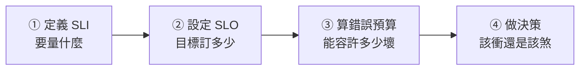

# [sre-2-6] 🔧 動手做：定義 SLI/SLO，算出錯誤預算

> **本章目標**：把 Part 2 學的全部用上——為一個真實服務定義 SLI、設定 SLO、算出這個月的錯誤預算，並判斷「現在該衝刺還是該踩煞車」。

## 你會學到

- 把抽象的 SLI/SLO 落地成具體定義
- 用實際數字算錯誤預算與「已用掉多少」
- 寫一份簡單的 SLO 文件
- 用錯誤預算做出「該不該繼續上線」的決策

## 概念說明

### 這一章在做什麼

前面五章建立了概念，這一章你要當一次「可靠性的設計者」——拿一個服務，走完「定義 SLI → 設 SLO → 算錯誤預算 → 做決策」的完整流程。這是 SRE 最核心的日常技能。

我們用一個假想但具體的服務：**一個線上筆記 App 的後端 API**。



## 範例：完整走一遍

### 第一步：定義 SLI（Part 2-2）

先想「使用者在乎什麼」，再定義「什麼算好事件」：

```
SLI 1 — 可用率：
  好事件 = HTTP 狀態碼非 5xx 的請求
  量法 = 非 5xx 請求數 ÷ 總請求數

SLI 2 — 延遲：
  好事件 = 在 300ms 內回應的請求
  量法 = 用 p95（95% 的請求都該在 300ms 內）
```

### 第二步：設定 SLO（Part 2-3）

依「使用者需求 + 現況 + 成本」訂目標：

```
SLO 1 — 可用率：99.9%
  理由：個人筆記 App，使用者重視但非金流關鍵，99.9%（月可掛約 43 分）夠用
SLO 2 — 延遲：95% 的請求 < 300ms
  理由：超過 300ms 使用者開始覺得卡
```

### 第三步：算這個月的錯誤預算（Part 2-4）

```
SLO = 99.9%
錯誤預算 = 100% − 99.9% = 0.1%

換算成「請求數」（更實用的算法）：
  假設這個月總共 1,000,000 個請求
  允許失敗的請求 = 1,000,000 × 0.1% = 1,000 個
  → 這個月的錯誤預算 = 「1,000 個請求可以失敗」

換算成「時間」：
  一個月約 43,200 分鐘 × 0.1% ≈ 43 分鐘
  → 這個月可以「掛」約 43 分鐘
```

### 第四步：算「已經用掉多少」並做決策

假設月中盤點，發現這個月到目前為止：

```
總請求 = 600,000
失敗請求 = 800

已用掉的錯誤預算 = 800 ÷ 1,000（總預算）= 80%
→ 預算只剩 20%，但月份才過一半！

決策（依 error budget policy，Part 2-4）：
  ⚠️ 預算消耗過快，剩不多了
  → 放慢新功能上線，加強測試
  → 排查那 800 個失敗是怎麼來的、有沒有共同原因
  → 若繼續這個速度，月底前一定爆預算、違反 SLO
```

看到了嗎？**同一筆數據，因為有 SLO 和錯誤預算，就能做出明確、不靠拍腦袋的決策。** 這就是 SRE 用數字管理可靠性的威力。

---

### 第五步：寫成一份 SLO 文件

把上面的決定，寫成一份團隊共用的文件（這是真實 SRE 會交付的東西）。建立 `slo.md`：

```markdown
# 筆記 App API — SLO 文件

## SLI 定義
- 可用率：非 5xx 請求 ÷ 總請求
- 延遲：p95 回應時間

## SLO 目標
- 可用率：99.9%（每月錯誤預算 ≈ 1,000 個請求 / 43 分鐘）
- 延遲：p95 < 300ms

## Error Budget Policy
- 預算用掉 > 75%：放慢上線、加強測試
- 預算用光：凍結新功能，全員修穩定性

## 對外 SLA（若有）
- 對使用者承諾 99.5%（比 SLO 寬鬆，留緩衝）
```

這份文件就是團隊「可靠性的共同契約」——每個人都看著同一個目標和規則做事。

## 小練習

### 練習 1：算一個服務的錯誤預算

某 API 這個月預計有 2,000,000 個請求，SLO = 99.95%。

1. 錯誤預算是多少百分比？
2. 換算成「可以失敗幾個請求」？
3. 換算成「可以掛幾分鐘」（一個月約 43,200 分鐘）？

---

### 練習 2：做一個決策

承上題。月底盤點，這個月實際失敗了 1,200 個請求。

1. 已經用掉多少比例的錯誤預算？
2. 有沒有超支？
3. 如果你是 SRE，下個月會建議團隊怎麼做？

---

### 練習 3：為你自己的專案定 SLO

挑一個你做過或想做的服務，走完整流程：定義 2 條 SLI、設 SLO、算出錯誤預算、寫成一份簡單的 `slo.md`。

> 這就是 SRE 工作的起點——往後的監控（Part 3）、告警（Part 4）、事故判斷（Part 5），全都建立在這份 SLO 之上。沒有 SLO，後面一切都是憑感覺。

## 課外讀物

> 定義好 SLO 後，下一步就是「實際把這些指標量出來、看著它」——也就是監控。infra 課教你架監控工具，SRE Part 3 教你怎麼用 → [課外讀物 E-11-8：多層次快取全景](../../../課外讀物/E-11-performance/E-11-8-cache-layers.md)
