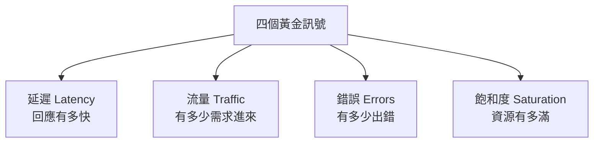

# [sre-3-1] 監控的四個黃金訊號

> **本章目標**：學會 Google SRE 提出的「四個黃金訊號」——延遲、流量、錯誤、飽和度。當你不知道一個服務該監控什麼時，先看這四個就對了。

## 你會學到

- 為什麼需要一個「該監控什麼」的標準清單
- 四個黃金訊號：延遲、流量、錯誤、飽和度，各是什麼
- 每個訊號怎麼量、異常代表什麼
- 它們和 Part 2 的 SLI 怎麼對應

## 概念說明

### 問題：一個服務有上千個指標，該看哪些？

infra Part 7 你學會了架監控、收集一堆指標。但新手很快會遇到下一個問題：**指標太多了**——CPU、記憶體、磁碟、網路、各種應用數據……盯著幾百個圖表，反而不知道哪個重要、哪個是雜訊。

Google SRE 給了一個極簡的答案：

> **如果你只能監控四件事，就監控這四個「黃金訊號」：延遲、流量、錯誤、飽和度。**

這四個涵蓋了「使用者體驗」最關鍵的面向。先把它們顧好，你就抓住了 80% 的重點。

---

### 四個黃金訊號



**① 延遲（Latency）——回應有多快**

處理一個請求要多久。但有個關鍵細節：**要把「成功的延遲」和「失敗的延遲」分開看**。

為什麼？因為一個「快速失敗」的請求（例如瞬間回傳 500 錯誤）延遲很低，會把你的延遲數字「美化」掉。如果不分開，你可能看到「平均延遲很低」就放心了，殊不知低是因為一堆請求快速失敗。所以要分開：成功請求的延遲、失敗請求的延遲。

> 而且要看 p95/p99，不看平均（Part 2-2 的教訓）。

**② 流量（Traffic）——有多少需求進來**

系統正承受多少「需求量」。對 Web 服務通常是「每秒請求數（requests per second, RPS）」。

流量本身不是好壞，但它是**理解其他訊號的背景**。例如「錯誤數上升」——是因為流量暴增（總量大，錯誤跟著多）還是系統真的壞了？看流量才知道。它也是容量規劃的基礎（Part 7）。

**③ 錯誤（Errors）——有多少出錯**

失敗的請求比例。包括：

- **明顯的錯誤**：回傳 5xx 狀態碼。
- **隱性的錯誤**：回傳 200 成功，但內容其實是錯的（最難抓，要靠應用層判斷）。

錯誤率直接對應使用者的「會不會壞」體驗，是最該警覺的訊號之一。

**④ 飽和度（Saturation）——資源有多滿**

系統「有多接近極限」。CPU、記憶體、磁碟 I/O、連線數……哪個資源最接近用滿，就是你的瓶頸。

飽和度是**最有預警價值**的訊號——它告訴你「還能撐多久」。CPU 已經 95%、記憶體快用光，代表再來一點流量就會崩。（這個概念 infra Part 7-2 講過。）

---

### 四個黃金訊號 vs Part 2 的 SLI

你會發現它們高度重疊——這不是巧合：

| 黃金訊號 | 對應的 SLI（Part 2-2） |
|---------|---------------------|
| 延遲 | 延遲 SLI |
| 錯誤 | 可用率 / 錯誤率 SLI |
| 流量 | 吞吐量 SLI |
| 飽和度 | （預警用，較少直接當 SLI） |

關係是：**SLI 是「你對使用者承諾的指標」，黃金訊號是「你日常該盯著的監控」。** 你的 SLI（延遲、錯誤）一定要在黃金訊號裡看得到——這樣監控才和你的可靠性目標對齊。

---

### 為什麼是「這四個」

這四個訊號的精妙在於：**前三個（延遲、流量、錯誤）直接反映「使用者現在的體驗」，第四個（飽和度）預測「未來會不會出事」。**

```
延遲 + 錯誤 → 使用者現在痛不痛
流量       → 理解前兩者的背景、規劃容量
飽和度     → 提前預警：再不處理就要爆了
```

顧好這四個，你就同時掌握了「現況」和「趨勢」——這正是監控最該做的事。

## 範例：用四個黃金訊號描述一個服務的健康

某 API 的監控儀表板，依四個黃金訊號組織：

```
【延遲】
  成功請求 p95：180ms ✅（SLO 是 300ms）
  失敗請求 p95：20ms（快速失敗，分開看才沒被混淆）

【流量】
  目前 1,200 RPS（平常尖峰約 1,500，還在正常範圍）

【錯誤】
  錯誤率：0.05% ✅（SLO 容許 0.1%）

【飽和度】
  CPU：45%、記憶體：60%、資料庫連線池：85% ⚠️
  → 連線池快滿了！這是最該注意的早期警訊
```

注意飽和度那欄——延遲、錯誤都還很健康，但**資料庫連線池已經 85%**。一個好的 SRE 會在這裡就警覺：「再多一點流量，連線池就滿了，到時延遲和錯誤會一起爆。」這就是飽和度的預警價值——**在使用者受影響之前就看見問題**。

## 小練習

### 練習 1：背出四個黃金訊號

不看上面，說出四個黃金訊號，並各用一句話解釋它量什麼。

---

### 練習 2：理解「延遲要分成功與失敗」

回答：為什麼量延遲時，要把「成功請求」和「失敗請求」的延遲分開看？如果混在一起會有什麼盲點？

---

### 練習 3：哪個訊號最有預警價值

某服務延遲正常、錯誤率正常，但 CPU 飽和度已達 92%。

1. 這代表現在有問題嗎？
2. 為什麼一個 SRE 還是會警覺？
3. 這體現了哪個黃金訊號的價值？

## 課外讀物

> infra 課教你怎麼「架起監控工具」收集這些訊號，是這章的實作基礎 → 參見 **infra 課程** Part 7（`lessons/infra/課程大綱.md`）
