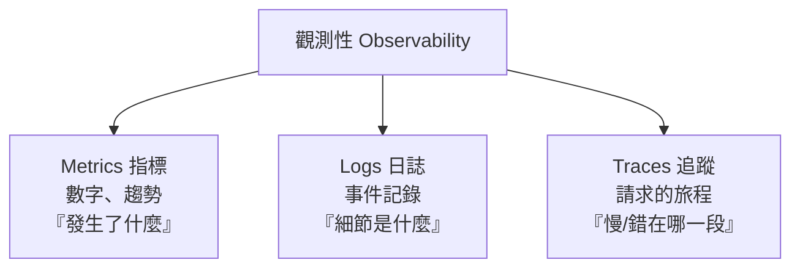

# [sre-3-2] 觀測性三支柱：Metrics、Logs、Traces

> **本章目標**：理解「觀測性（Observability）」和「監控」的差別，並搞懂它的三根支柱——指標、日誌、追蹤，各自回答什麼問題、何時用哪個。

## 你會學到

- 監控（Monitoring）vs 觀測性（Observability）的差別
- 三支柱：Metrics（指標）、Logs（日誌）、Traces（追蹤）
- 每根支柱回答什麼問題、適合什麼場景
- 三者怎麼配合，從「發現問題」到「找到根因」

## 概念說明

### 監控 vs 觀測性

這兩個詞常混用，但有個重要差別：

- **監控（Monitoring）**：盯著「**你預先知道要看的東西**」。例如你設好「CPU 超過 90% 就告警」——你**事先就知道**要看 CPU。它回答「**已知問題**發生了嗎？」
- **觀測性（Observability）**：讓你能「**事後追問你當初沒預料到的問題**」。系統出了個你從沒想過的怪狀況，你能不能透過手邊的資料，一路追查到根因？它回答「**到底發生了什麼、為什麼？**」（包括你沒預設的問題）

用類比：監控像汽車儀表板上**固定的幾個錶**（時速、油量）——只顯示設計時決定要顯示的。觀測性像有一個**萬能的診斷接口**，車子出任何怪問題，技師都能接上去深入追查。

現代系統很複雜，故障常常是「你沒預料到的」。所以光有監控不夠，要有**觀測性**——而觀測性建立在三根支柱上。

---

### 三支柱



**① Metrics（指標）——數字與趨勢**

隨時間變化的**數值**：CPU 使用率、每秒請求數、p95 延遲。就是前一章的黃金訊號、Part 2 的 SLI。

- **強項**：便宜、可長期保存、適合畫趨勢圖、設告警。
- **回答**：「**發生了什麼**」——延遲變高了、錯誤變多了。
- **侷限**：只給你「數字」，不告訴你「為什麼」。它告訴你「錯誤率上升到 5%」，但不告訴你「是哪個使用者、哪個請求、為什麼錯」。

**② Logs（日誌）——一筆筆事件記錄**

系統寫下的**離散事件記錄**（infra Part 7-1 學過）：「14:03 使用者 123 登入失敗，原因：密碼錯誤」。

- **強項**：細節豐富，能告訴你「具體發生了什麼事」。
- **回答**：「**細節是什麼**」——指標告訴你錯誤變多，日誌告訴你「錯誤訊息具體寫什麼」。
- **侷限**：量大、儲存貴；在分散式系統裡，一個請求的日誌散落在很多台機器，難拼湊。

**③ Traces（追蹤）——一個請求的完整旅程**

追蹤**一個請求，從頭到尾穿過了哪些服務、每段花多久**。這在微服務架構特別重要（下一章 3-5 深入）。

- **強項**：看見「一個請求的全貌」，精準定位「是哪一段慢/出錯」。
- **回答**：「**慢在哪、錯在哪一段**」——一個請求穿過 10 個服務，trace 告訴你卡在第 7 個。
- **侷限**：建置成本較高，需要在程式裡埋點。

---

### 三者怎麼配合：一次除錯的旅程

三支柱不是三選一，而是**接力合作**。典型的除錯流程：

```
① Metrics 發現異常
   「儀表板顯示 p99 延遲從 200ms 飆到 2 秒」
   → 知道「有問題」，但不知道為什麼
        ↓
② Traces 定位是哪一段
   「追蹤一個慢請求，發現它在『呼叫資料庫』那段花了 1.8 秒」
   → 縮小到「資料庫查詢」這個環節
        ↓
③ Logs 找到根因
   「看資料庫日誌，發現某個查詢沒用索引、掃了全表」
   → 找到真正原因，可以修了
```

看出來了嗎？**Metrics 告訴你「哪裡不對」，Traces 告訴你「在哪一段」，Logs 告訴你「為什麼」。** 三者由粗到細、接力縮小範圍，最後找到根因。這就是觀測性的威力——不只發現問題，還能追到底。

---

### 一個記憶口訣

| 支柱 | 一句話 | 何時用 |
|------|--------|--------|
| **Metrics** | 數字趨勢，發現異常 | 設告警、看趨勢、第一線發現 |
| **Traces** | 請求旅程，定位環節 | 「是哪個服務/哪一段慢」 |
| **Logs** | 事件細節，找出根因 | 「具體發生什麼、為什麼」 |

## 範例：同一個問題，三支柱各看到什麼

「使用者反映結帳很慢」這個問題，三支柱各自呈現：

```
Metrics（指標）：
  結帳 API 的 p95 延遲 = 3 秒（平常 400ms）→ 確認「真的變慢了」

Traces（追蹤）：
  追一個慢的結帳請求，看到它的旅程：
    驗證使用者：50ms
    查詢購物車：30ms
    呼叫金流服務：2,800ms ← 兇手在這！
    寫入訂單：40ms
  → 鎖定「金流服務」這一段

Logs（日誌）：
  看金流服務的日誌：
    「14:20 金流 API 連線逾時，重試 3 次...」
  → 根因找到：金流服務的第三方 API 在逾時
```

三支柱接力，從「使用者覺得慢」一路追到「第三方金流 API 逾時」。少了任何一根，這個追查都會卡住。

## 小練習

### 練習 1：監控 vs 觀測性

用「汽車儀表板 vs 診斷接口」的類比，解釋監控和觀測性的差別。為什麼複雜系統需要觀測性，光有監控不夠？

---

### 練習 2：配對支柱與問題

下面的問題，主要該靠哪根支柱回答？

1. 「過去一週的錯誤率趨勢如何？」
2. 「這個特定請求為什麼花了 5 秒？是卡在哪個服務？」
3. 「那筆失敗的交易，錯誤訊息具體寫什麼？」

---

### 練習 3：設計一次除錯流程

假設「網站首頁突然變慢」，描述你會怎麼用三支柱（依 Metrics → Traces → Logs 的順序）一步步找到根因。

## 課外讀物

> infra 課的監控章節（Prometheus/Grafana）主要在做「Metrics」這根支柱的實作 → 參見 **infra 課程** Part 7（`lessons/infra/課程大綱.md`）
