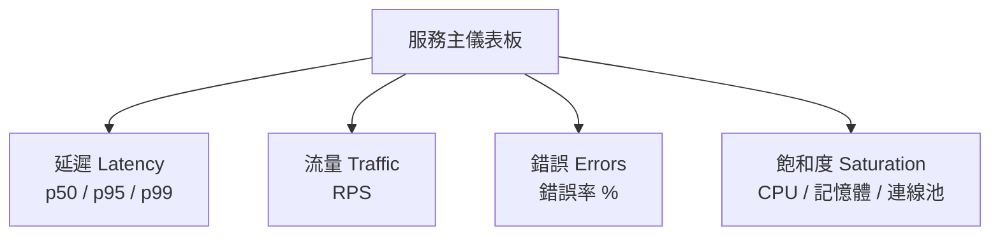

# [sre-3-4] Grafana 儀表板設計：什麼該放、什麼是雜訊

> **本章目標**：學會設計「有用的」儀表板——不是把所有圖都塞上去，而是讓人一眼就能判斷「系統現在健康嗎」。

## 你會學到

- 為什麼「圖越多」不等於「越有用」
- 好儀表板的設計原則：依黃金訊號與使用者組織
- 儀表板的分層：總覽 vs 細節
- 常見的儀表板反模式

## 概念說明

### 陷阱：把所有圖都塞上去

infra 課你學會用 Grafana 畫圖、匯入現成儀表板。但很快會遇到一個問題：**儀表板上塞了 50 個圖，反而沒人看得懂。**

新手常以為「監控越多越好、圖越多越專業」。錯。一個塞滿 50 個圖的儀表板，跟沒有儀表板差不多——因為**出事時，沒有人能在那片混亂中快速判斷「到底哪裡不對」**。

好儀表板的目標只有一個：

> **讓人在 10 秒內回答「系統現在健康嗎？如果不健康，問題大概在哪？」**

---

### 原則一：依「黃金訊號」組織

不要依「技術元件」隨便排圖，而是依**使用者體驗**（黃金訊號）來組織。一個服務的主儀表板，最上面就該是這四塊：


```mermaid
graph TB
    DASH["服務主儀表板"]
    DASH --> L["延遲 Latency<br/>p50 / p95 / p99"]
    DASH --> T["流量 Traffic<br/>RPS"]
    DASH --> E["錯誤 Errors<br/>錯誤率 %"]
    DASH --> S["飽和度 Saturation<br/>CPU / 記憶體 / 連線池"]
```

這樣任何人打開，第一眼看到的就是「使用者體驗好不好」——而不是一堆看不懂的技術指標。這是 Part 3-1 黃金訊號最直接的應用。

---

### 原則二：分層——總覽在上，細節在下

好儀表板像一篇好文章，有層次：

| 層次 | 放什麼 | 給誰看 |
|------|--------|--------|
| **最上層：總覽** | 四個黃金訊號、SLO 達成率、紅綠燈 | 一眼判斷健康與否 |
| **中層：分類** | 各 API、各服務的細分指標 | 縮小問題範圍 |
| **下層：細節** | 單一元件的深入指標 | 深入診斷 |

出事時的使用流程：先看**最上層**發現「錯誤率紅了」→ 往**中層**找「是哪個 API」→ 再往**下層**看「那個 API 的細節」。這呼應 Part 3-2 三支柱「由粗到細」的除錯邏輯。

> **最重要的數字放最上面、最大。** 出事時人是慌的，最關鍵的健康指標要讓人不用找就看到。

---

### 原則三：放「可行動」的東西，刪掉純好奇的

每加一個圖，問自己：**「如果這個圖變紅，我會採取什麼行動？」**

- 有明確行動 → 留著（例如「錯誤率」高了我會去查、「磁碟」滿了我會去清）。
- 想不出行動、只是「看了覺得酷」→ **刪掉**。它只是雜訊，會稀釋真正重要的訊號。

這個「可行動性」測試，和 Part 4 告警的設計原則一脈相承——**監控和告警都該服務於「行動」，而非滿足好奇。**

---

### 常見的儀表板反模式

| 反模式 | 問題 | 怎麼改 |
|--------|------|--------|
| **儀表板黑洞** | 50 個圖塞一頁，沒人看得懂 | 精簡到關鍵幾個，細節拆到下層 |
| **只有技術指標** | 全是 CPU/記憶體，看不出使用者體驗 | 最上層放黃金訊號 |
| **沒有 SLO 對照** | 看到「延遲 300ms」不知道算好算壞 | 圖上標出 SLO 線，一眼看出有沒有超標 |
| **沒有時間脈絡** | 只看當下，看不出趨勢 | 用折線圖看趨勢，不只看數字 |

最後一點特別實用：**在圖上畫出 SLO 的「目標線」**。例如延遲圖上畫一條 300ms 的紅線——這樣不用思考，曲線一旦衝破紅線就知道超標了。把「判斷」內建進儀表板。

## 範例：好儀表板 vs 壞儀表板

```
❌ 壞儀表板：
  一頁塞了 40 個圖：
  node_cpu_seconds、node_memory_bytes、go_goroutines、
  process_open_fds、http_request_size_bytes…
  → 全是技術指標，出事時根本看不出「使用者有沒有受影響」

✅ 好儀表板（同一個服務）：
  ┌─────────────────────────────────────┐
  │ 【最上層・一眼判斷】                    │
  │  SLO 達成率：99.93% ✅                 │
  │  錯誤率：0.05%（紅線 0.1%）            │
  │  延遲 p95：180ms（紅線 300ms）         │
  │  流量：1,200 RPS                       │
  │  飽和度：CPU 45% / 連線池 85% ⚠️       │
  ├─────────────────────────────────────┤
  │ 【中層・分類，需要時往下看】            │
  │  各 API 端點的延遲與錯誤率…            │
  └─────────────────────────────────────┘
```

好的那個，任何人 10 秒內就知道「整體健康，但連線池要注意」。壞的那個，得是專家才看得懂，而且還不一定看得出重點。

## 小練習

### 練習 1：10 秒測試

回答：一個好儀表板，應該讓人在 10 秒內回答什麼問題？依這個目標，最上層該放什麼？

<details>
<summary>參考解答</summary>

**要能回答的問題**：「**系統現在健康嗎？如果不健康，問題大概在哪？**」——出事時人是慌的，儀表板要讓人不用翻找、一眼就能下這個判斷。

**最上層該放什麼**：放**四個黃金訊號 + SLO 對照**，也就是最能反映「使用者體驗好不好」的關鍵數字：

- 延遲（p50 / p95 / p99）
- 流量（RPS）
- 錯誤率（%），並標出 SLO 紅線（例如 0.1%）
- 飽和度（CPU / 記憶體 / 連線池）
- 最好再加一個 **SLO 達成率**或紅綠燈式的整體健康指示

原則是「**最重要的數字放最上面、最大**」，而且圖上要標出 SLO 線——這樣曲線一旦衝破紅線就知道超標，把「判斷」直接內建進儀表板，不用心算。技術細節（各種 CPU/goroutine 之類）則往下層放。

</details>

---

### 練習 2：可行動性測試

你想在儀表板加一個「Go 語言 goroutine 數量」的圖。用「可行動性測試」判斷：該加嗎？（提示：問自己「它變高時，我會做什麼？」如果答不出來……）

<details>
<summary>參考解答</summary>

用可行動性測試問自己：「**如果這個 goroutine 數量圖變高（變紅），我會採取什麼行動？**」

對大多數服務的**主儀表板（尤其是最上層）來說，答案是「想不太出明確行動」**——goroutine 數量高低本身不直接對應使用者體驗，看到它跳動我通常也不知道該做什麼。既然想不出行動、只是「看了覺得像在監控」，那它就是**雜訊**，會稀釋真正重要的訊號（延遲、錯誤、飽和度）。**結論：不該加到主儀表板。**

但要補一句「看情境」：如果你這個服務**曾經因為 goroutine 洩漏（goroutine leak）出過事**，那「goroutine 數量持續往上爬」對你就是一個有明確行動的早期警訊（去查是不是又洩漏了）——這時它就通過了可行動性測試，可以放，但適合放在**下層的深入診斷區**，而不是搶最上層黃金訊號的版面。

核心精神：**監控和告警都該服務於「行動」，而非滿足好奇。**

</details>

---

### 練習 3：改造一個壞儀表板

假設你接手一個塞了 30 個技術指標、卻看不出使用者體驗的儀表板。用本章三原則，說說你會怎麼重新設計它的最上層。

<details>
<summary>參考解答</summary>

這是一個示範答案，重點是把本章三原則套上去：

**原則一：依黃金訊號組織最上層。** 把最上層清空，只放四塊反映使用者體驗的面板：
- 延遲 p95 / p99
- 流量 RPS
- 錯誤率 %
- 飽和度（CPU、記憶體、連線池）
再加一個 SLO 達成率或紅綠燈當整體健康總結。這樣任何人打開第一眼看到的是「使用者體驗好不好」，而不是一堆看不懂的技術指標。

**原則二：分層，把那 30 個技術指標往下移。** 原本那 30 個 CPU/記憶體/goroutine/fd 之類的圖不是全刪，而是**降到中層與下層**——最上層總覽、中層依各 API/服務分類、下層放單一元件的深入指標。出事時的動線是「上層發現錯誤率紅了 → 中層找是哪個 API → 下層看那 API 的細節」。

**原則三：對每個保留的圖做可行動性測試。** 逐一問「這圖變紅我會做什麼」，答不出行動的（純好奇、看了覺得酷的）直接刪掉，別讓它們稀釋訊號。

**別忘了畫 SLO 線。** 錯誤率面板畫 0.1% 紅線、延遲面板畫 300ms 紅線，讓超標一目了然，把判斷內建進儀表板。

一句話：**最上層從「30 個技術指標」變成「4 個黃金訊號 + SLO 對照」，技術細節下沉分層，並砍掉無法行動的雜訊。**

</details>

## 課外讀物

> Grafana 的實際操作（連資料來源、匯入儀表板）在 infra 課有完整動手做 → 參見 **infra 課程** Part 7-4（`lessons/infra/課程大綱.md`）
