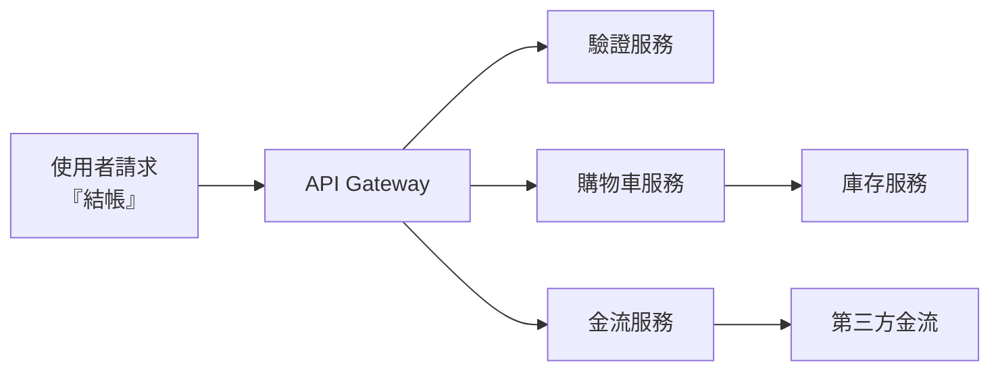
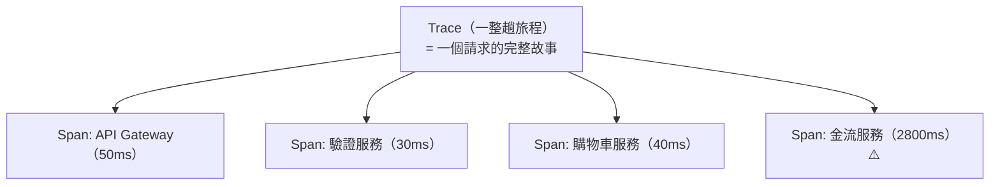

# [sre-3-5] 分散式追蹤：一個請求穿過十個服務，怎麼找瓶頸

> **本章目標**：理解為什麼微服務架構下「找出哪裡慢」變得很難，以及分散式追蹤（distributed tracing）怎麼用「請求的完整旅程」解決這個問題。

## 你會學到

- 為什麼微服務讓「定位慢/錯」變困難
- 分散式追蹤的核心概念：Trace 與 Span
- 追蹤怎麼把散落的資訊串成一個請求的旅程
- OpenTelemetry 與常見追蹤工具

## 概念說明

### 問題：請求在微服務裡「失蹤」了

在一個簡單的單體應用（basic 課程那種），一個請求就在一支程式裡跑完，要查很容易。

但現代系統常是**微服務**——一個請求進來，會接力呼叫好多個服務：



現在使用者說「結帳很慢」。問題來了：**到底是哪一段慢？** 是驗證、購物車、庫存、金流，還是第三方？

- 看 Metrics（3-3）：知道「結帳整體很慢」，但不知道是哪一段。
- 看 Logs（7-1）：每個服務各寫各的日誌，散落在不同機器，**你很難把「同一個請求」在各服務的日誌拼起來**。

請求像在這張網裡「失蹤」了——你知道它慢，但追不到是哪一站出問題。這就是分散式追蹤要解決的。

---

### 解法：給每個請求一個「追蹤碼」

分散式追蹤的核心點子很簡單：

> **給每個進來的請求一個獨一無二的 ID，讓它一路帶著這個 ID 穿過所有服務。這樣就能把它在每個服務的足跡串起來。**

用類比：像**宅配的追蹤碼**。你網購一個包裹，它經過「賣家 → 集貨站 → 轉運中心 → 配送站 → 你家」。因為有一個追蹤碼，你能查到它「現在到哪、每一段花多久、卡在哪裡」。分散式追蹤就是給每個請求一個這樣的追蹤碼。

---

### 兩個核心概念：Trace 與 Span



- **Trace（追蹤）**：**一個請求的完整旅程**，從頭到尾。有一個唯一的 trace ID。
- **Span（跨度）**：旅程中的**一段**——某個服務做某件事的記錄，含「花了多久、成功還失敗」。一個 Trace 由很多 Span 組成。

關鍵在於：每個 Span 都帶著同一個 trace ID，也記錄自己的耗時。把同一個 trace ID 的所有 Span 收集起來、按時間排好，就**重建出這個請求的完整旅程**——而且一眼就能看出**哪一段（哪個 Span）花最久**。

上圖中，金流服務那個 Span 花了 2800ms——兇手立刻現形。這在沒有追蹤的世界裡，可能要查老半天。

---

### 追蹤工具：OpenTelemetry 與後端

實作分散式追蹤，會用到：

- **OpenTelemetry（OTel）**：現在業界的**標準**——一套統一的規範與工具，讓你在程式裡「埋點」產生 trace 和 span。用標準的好處是不被特定廠商綁定。
- **追蹤後端（收集與視覺化）**：例如 **Jaeger**、**Tempo**、**Zipkin**，或雲端的 AWS X-Ray。它們收集 span、把 trace 畫成那種「一段一段的瀑布圖」讓你看。

實作上需要在程式裡加入追蹤的 library，讓每個服務在處理請求時自動產生 span、並把 trace ID 往下游傳。這部分偏開發，SRE 要懂的是「**怎麼讀 trace、用它定位問題**」。

---

### 三支柱的完整威力（回顧 3-2）

分散式追蹤補齊了 Part 3-2 三支柱的最後一塊。現在你有完整的除錯能力：

```
Metrics  → 「結帳 p95 延遲飆到 3 秒」（發現問題）
   ↓
Traces   → 「追一個慢請求，卡在金流服務那段 2.8 秒」（定位環節）← 這章
   ↓
Logs     → 「金流服務日誌：第三方 API 逾時重試」（找到根因）
```

有了追蹤，「在複雜的微服務裡定位問題」從大海撈針，變成精準制導。

## 範例：用 trace 讀出問題

一個「載入個人頁面」的請求慢，它的 trace 瀑布圖長這樣：

```
Trace ID: abc123（總耗時 2,400ms）
├─ Span: API Gateway              [▓] 20ms
├─ Span: 驗證服務                  [▓] 35ms
├─ Span: 使用者資料服務            [▓] 45ms
└─ Span: 推薦服務                  [▓▓▓▓▓▓▓▓▓▓▓▓▓▓▓▓] 2,280ms ⚠️
   └─ Span: 推薦服務 → ML 模型 API [▓▓▓▓▓▓▓▓▓▓▓▓▓▓] 2,200ms
```

一眼就看出：總共 2.4 秒，其中 2.2 秒卡在「推薦服務呼叫 ML 模型 API」。問題範圍從「整個頁面慢」精準縮小到「ML 模型 API 太慢」——接下來去看那段的 logs 找根因就好。

**沒有追蹤**，你可能要一個一個服務去猜、去翻日誌，花好幾小時。**有追蹤**，30 秒定位。這就是它的價值。

## 小練習

### 練習 1：為什麼微服務需要追蹤

用「宅配追蹤碼」的類比，解釋為什麼微服務架構特別需要分散式追蹤，而單體應用比較不需要。

---

### 練習 2：分清 Trace 與 Span

回答：

1. Trace 和 Span 的關係是什麼？
2. 是什麼東西讓「散落在各服務的記錄」能被串成同一個請求的旅程？

---

### 練習 3：讀一個 trace

某 trace 顯示一個請求總共 1,500ms，其中：Gateway 20ms、服務 A 30ms、服務 B 1,400ms、服務 C 50ms。

1. 問題出在哪？
2. 你接下來會用三支柱的哪一根，去查那一段「為什麼」慢？

## 課外讀物

> 微服務架構是分散式追蹤存在的前提，想了解單體 vs 微服務的取捨 → [課外讀物 E-13-4：Monolith vs Microservices](../../../課外讀物/E-13-scaling/E-13-4-monolith-vs-microservices.md)
