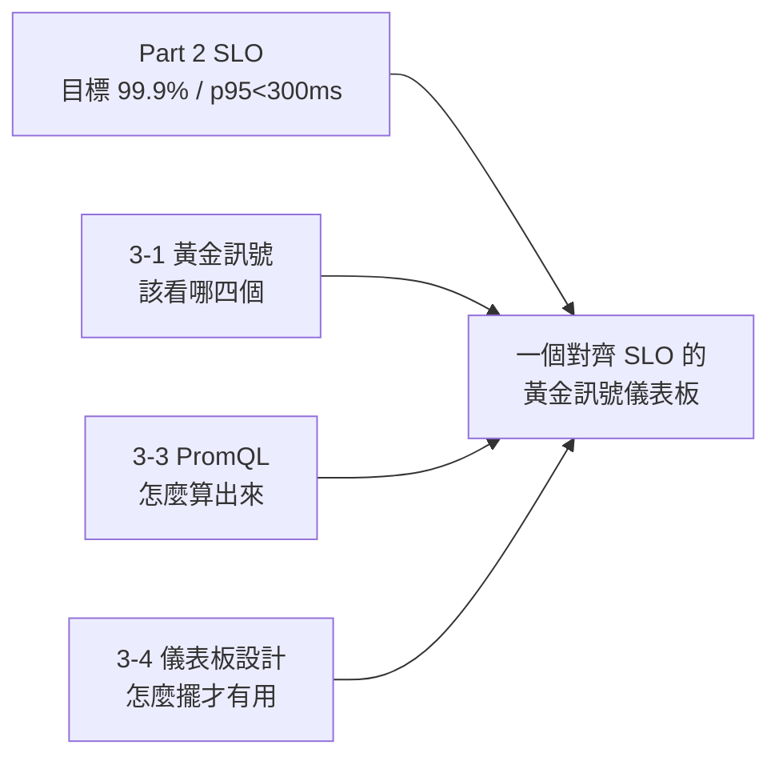

# [sre-3-6] 🔧 動手做：依四個黃金訊號設計監控

> **本章目標**：在 infra 課架好的 Prometheus + Grafana 之上，為一個服務建立「依四個黃金訊號組織、對照 SLO」的監控儀表板。

## 你會學到

- 把 SLO（Part 2）、黃金訊號（3-1）、PromQL（3-3）、儀表板設計（3-4）全部整合
- 讓應用程式輸出 Prometheus 指標
- 用 PromQL 建出四個黃金訊號的面板
- 在圖上標出 SLO 線，讓超標一目了然

## 概念說明

### 這一章把 Part 2-3 全部串起來

這是 Part 2、3 的整合演練。你會把學過的東西組成一個真正可用的監控：



> 前提：infra Part 7-4 的 Prometheus + Grafana 已經跑起來。在 WSL 上練完全可以。

## 程式碼範例

### 第一步：讓你的應用輸出指標

要監控應用層的黃金訊號（延遲、錯誤），應用本身要「吐出」Prometheus 格式的指標。以 Node 為例，用官方的 `prom-client`：

```bash
npm install prom-client
```

在你的服務（呼應 infra Part 4/5 那個 app）加入指標：

```javascript
const client = require("prom-client");

// Counter：累計請求數（依狀態碼與路徑分標籤）
const httpRequests = new client.Counter({
  name: "http_requests_total",
  help: "HTTP 請求總數",
  labelNames: ["method", "status", "path"],
});

// Histogram：請求延遲分布（用來算 p95）
const httpDuration = new client.Histogram({
  name: "http_request_duration_seconds",
  help: "HTTP 請求延遲",
  labelNames: ["method", "path"],
  buckets: [0.05, 0.1, 0.3, 0.5, 1, 2, 5],   // 延遲分桶
});

// 在每個請求結束時記錄（中介層概念，呼應 basic Part 4）
function recordMetrics(req, res, durationSeconds) {
  httpRequests.inc({ method: req.method, status: res.statusCode, path: req.path });
  httpDuration.observe({ method: req.method, path: req.path }, durationSeconds);
}

// 開一個 /metrics 端點，讓 Prometheus 來抓
// app.get("/metrics", async (req, res) => {
//   res.set("Content-Type", client.register.contentType);
//   res.end(await client.register.metrics());
// });
```

重點：`/metrics` 這個端點，就是 Part 3-3 說的「把指標攤開成網頁，等 Prometheus 來拉」。Counter 算流量與錯誤、Histogram 算延遲 p95——正好對應黃金訊號。

---

### 第二步：讓 Prometheus 抓你的應用

在 infra Part 7-4 的 `prometheus.yml` 加一個抓取目標：

```yaml
scrape_configs:
  - job_name: 'myapp'
    static_configs:
      - targets: ['myapp:3000']    # 你的應用（容器名:port）
```

重啟 Prometheus（`docker compose restart prometheus`）。到 Prometheus 介面（`:9090`）確認 `myapp` 這個 target 是 `UP`。

---

### 第三步：在 Grafana 建黃金訊號面板

在 Grafana 新建一個儀表板，依 3-4 的原則，**最上層放四個黃金訊號**，每個用 3-3 的 PromQL：

**流量面板：**
```promql
sum(rate(http_requests_total[5m]))
```

**錯誤率面板（對應錯誤 SLI）：**
```promql
sum(rate(http_requests_total{status=~"5.."}[5m]))
  / sum(rate(http_requests_total[5m]))
```

**延遲 p95 面板（對應延遲 SLI）：**
```promql
histogram_quantile(0.95,
  sum(rate(http_request_duration_seconds_bucket[5m])) by (le))
```

**飽和度面板**（用 infra 的 node_exporter 指標）：
```promql
100 - (avg(rate(node_cpu_seconds_total{mode="idle"}[5m])) * 100)
```

---

### 第四步：標出 SLO 線（3-4 的關鍵技巧）

在「錯誤率」面板，加一條 **0.1% 的閾值線**（對應你的 SLO）；在「延遲 p95」面板，加一條 **300ms 的線**。

Grafana 的面板設定裡有 **Thresholds（閾值）** 功能，設定後超過閾值的部分會變紅。這樣——**曲線只要碰到紅線，就代表正在違反 SLO**，不用心算、不用思考，一眼判斷。這就是 3-4 說的「把判斷內建進儀表板」。

---

### 第五步：製造狀況，驗證監控有效

像 infra Part 7-4 那樣，主動製造狀況看監控會不會反應：

```bash
# 對你的服務灌一些會 500 的請求（假設有個會出錯的端點）
for i in {1..50}; do curl -s http://localhost:3000/some-failing-endpoint > /dev/null; done
```

然後看 Grafana 的「錯誤率」面板——它應該在幾秒內竄高、甚至衝破你畫的 0.1% 紅線。**你親眼看到「SLO 被違反」這件事被監控即時捕捉到了**。這個監控接下來就能拿去設告警（Part 4）。

## 小練習

### 練習 1：建立黃金訊號儀表板

在你的環境，讓應用輸出指標、讓 Prometheus 抓到、在 Grafana 建出「流量 / 錯誤率 / 延遲 p95 / 飽和度」四個面板。

---

### 練習 2：標出 SLO 線

幫「錯誤率」和「延遲 p95」面板各加一條對應 SLO 的閾值線。確認超標時會變紅。

---

### 練習 3：驗證它真的會反應

製造一些錯誤或負載，觀察對應的黃金訊號面板有沒有即時反應、有沒有衝破 SLO 線。寫下你的觀察。

> 你現在有了「對齊 SLO 的黃金訊號監控」。但光看圖還不夠——你不可能 24 小時盯著。下一個 Part 4 就要解決：怎麼讓系統在「SLO 快被違反時」主動通知你，而且只在「真的需要」時才響。

## 課外讀物

> 這章的 Prometheus/Grafana 環境，來自 infra 課的動手做 → 參見 **infra 課程** Part 7-4（`lessons/infra/課程大綱.md`）
