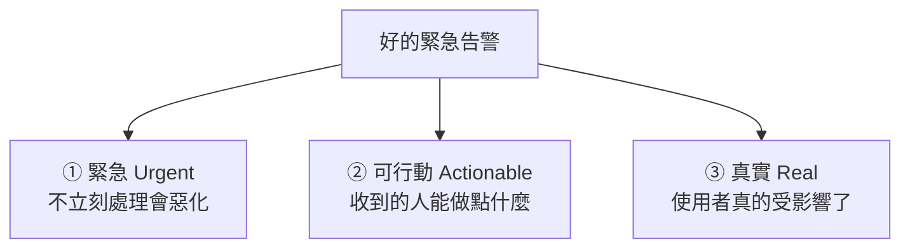

# [sre-4-1] 好告警 vs 壞告警

> **本章目標**：理解告警的目的，分辨「好告警」和「壞告警」，並建立一條鐵律：每個會吵醒人的告警，都必須是「緊急、真實、需要人立刻行動」的。

## 你會學到

- 告警（alert）的真正目的是什麼
- 「半夜被吵醒卻沒事可做」為什麼是最糟的設計
- 好告警的三個條件：緊急、可行動、真實
- 告警該分級——不是每件事都要把人挖起來

## 概念說明

### 告警的目的：把人叫來「行動」

Part 3 你建好了監控、能看到系統狀態。但你不可能 24 小時盯著儀表板。**告警（alert）** 就是讓系統在出事時「主動來找你」。

但這裡有個關鍵——告警的目的**不是「通知你發生了什麼」，而是「叫你來採取行動」**。這個區別決定了一切：

> **如果一個告警響了，但收到的人「不需要做任何事」，那它就不該存在。**

---

### 最糟的設計：半夜被吵醒，卻沒事可做

想像你是 on-call（Part 1-4），半夜三點，手機狂響——你驚醒、心跳加速、抓起電腦登入……結果發現：

- 「CPU 到 80% 了」——然後呢？它自己降回去了，根本沒影響使用者。
- 「某台機器重啟了」——但服務有冗餘，使用者根本沒感覺。

你白白被吵醒、損失睡眠、累積壓力，**卻什麼都不用做**。這是 SRE 眼中**最糟糕的告警設計**，因為：

1. 它**傷害人**——睡眠被毀、長期累積成 burnout（過勞）。
2. 它**製造「狼來了」效應**——被無謂告警吵多了，人會開始忽略所有告警，包括真正重要的那個（下一章的「告警疲勞」）。

**鐵律：會把人叫起來的告警，必須是「不立刻處理就會傷害使用者」的真實緊急狀況。**

---

### 好告警的三個條件

一個值得「叫醒人」的告警，要同時滿足三個條件：



- **① 緊急**：這事**不能等**。如果「明天上班再處理也沒差」，那它就不該在半夜響——做成一張工單、隔天看就好。
- **② 可行動**：收到的人**有明確的事可做**。如果響了卻只能「看著它、不知道幹嘛」，這告警沒意義。
- **③ 真實**：使用者**真的受到影響**，不是假警報、不是無關緊要的內部波動。

三個缺一不可。少了任何一個，這個告警就該被降級或刪除。

---

### 告警要分級

不是所有事都同等緊急。成熟的告警系統會**分級**，用不同方式通知：

| 級別 | 狀況 | 通知方式 |
|------|------|---------|
| **緊急（Page）** | 使用者正在受影響、要立刻處理 | **打電話 / 狂響**，把人叫起來 |
| **警告（Ticket）** | 需要處理，但能等（如磁碟 70%） | 開一張工單、上班看 |
| **資訊（Log）** | 只是記錄，不用人理 | 寫進日誌，需要時查 |

關鍵原則：**只有「緊急」級才該把人從睡夢中挖起來。** 「磁碟用到 70%」這種，做成工單隔天處理就好，半夜挖人是災難性的設計。

很多團隊的告警之所以爛，就是因為**把所有東西都設成「緊急」**——結果人被無關緊要的事吵到崩潰，真正的緊急反而被淹沒。

---

### 一個好用的判斷：對照 SLO

怎麼決定「什麼值得緊急告警」？回到你的 SLO（Part 2）：

> **最該緊急告警的，是「SLO 正在被違反、或即將被違反」——也就是錯誤預算正在快速燃燒。**

因為 SLO 就是「使用者可接受的底線」。當 SLO 要破了，代表使用者真的在受苦——這完全符合好告警的三條件（緊急、可行動、真實）。這種「**基於 SLO / 錯誤預算燃燒率的告警**」，是現代 SRE 的最佳實踐（Part 4-5 會實作）。

## 範例：把壞告警改成好告警

```
❌ 壞告警：「CPU 使用率 > 80%」
   問題：
   - 不一定緊急（可能瞬間尖峰，馬上降回去）
   - 不一定可行動（CPU 高但使用者沒受影響，要做什麼？）
   - 不一定真實影響使用者
   → 這種半夜響，純粹折磨人

✅ 改成好告警：「錯誤率 > 1% 持續 5 分鐘」
   或：「延遲 p95 > SLO 上限，且錯誤預算燃燒過快」
   為什麼好：
   - 緊急：使用者正在遇到錯誤，會持續惡化
   - 可行動：有明確問題要去查、去止血
   - 真實：直接反映使用者體驗變差
   → 這種響，值得把人叫起來
```

注意改造的方向：**從「對機器內部狀態告警（CPU）」改成「對使用者體驗告警（錯誤率、延遲）」**。這正是下一章「對症狀告警，而非對原因告警」的精神。

## 小練習

### 練習 1：好告警的三條件

不看上面，說出好告警的三個條件，並各舉一個「不符合該條件」的壞告警例子。

---

### 練習 2：該不該半夜響

下面的狀況，哪些值得「緊急告警把人叫起來」，哪些做成「工單隔天處理」就好？

1. 網站完全打不開，使用者大量回報
2. 磁碟使用率到 65%
3. 結帳成功率掉到 90%
4. 某台機器重啟了，但服務有冗餘、使用者無感

---

### 練習 3：改造壞告警

把這個壞告警改成好告警：「記憶體使用率 > 75%」。

> 提示：問自己——它緊急嗎？可行動嗎？真的影響使用者嗎？改成「對使用者體驗」告警會是什麼樣子？

## 課外讀物

> 告警設計建立在 SLO 之上，務必先讀懂 Part 2 的 SLO 與錯誤預算（同課程 `sre-2-3`、`sre-2-4`）。
