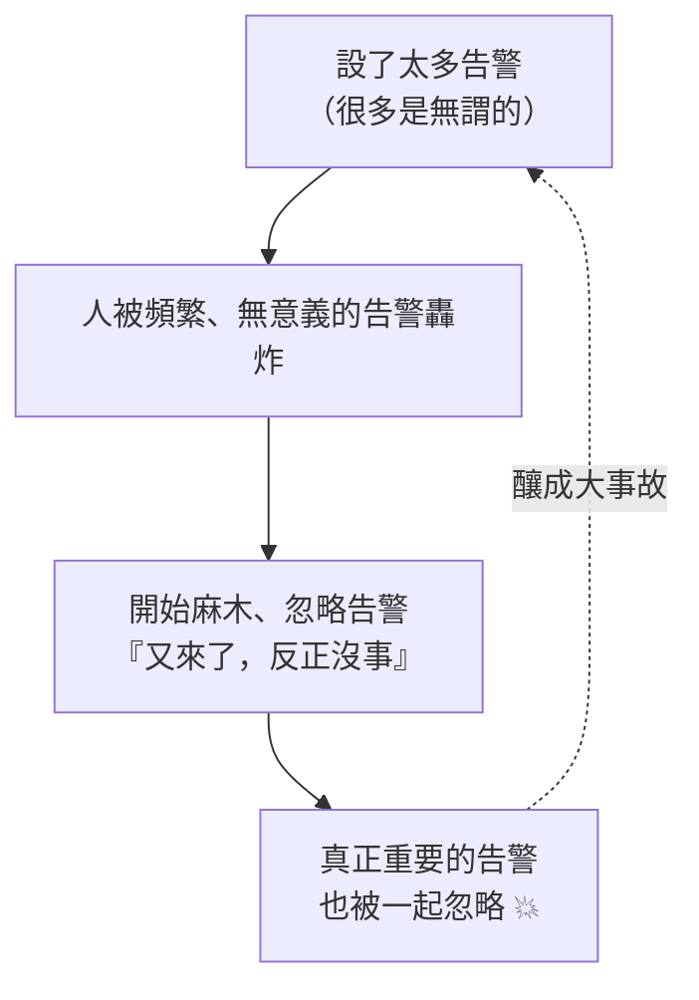

# [sre-4-2] 告警疲勞：告警太多等於沒有告警

> **本章目標**：理解「告警疲勞」這個 on-call 的頭號殺手，知道它怎麼形成、有多危險，並學會幾個對抗它的具體方法。

## 你會學到

- 告警疲勞（alert fatigue）是什麼、怎麼形成
- 為什麼「告警太多」比「告警太少」更危險
- 對抗告警疲勞的具體方法
- 怎麼定期「整理」你的告警

## 概念說明

### 狼來了的真實版

你一定聽過「狼來了」的故事——喊太多次假警報，真的狼來時沒人理。**告警疲勞（alert fatigue）就是工程版的「狼來了」。**

它的形成是這樣的惡性循環：



當一個人每天收到 50 個告警，其中 48 個是無關緊要的，他會怎樣？**他會開始無視所有告警**——因為大腦學會了「這些通常沒事」。然後某天，那 2 個真正致命的告警混在雜訊裡，被一起忽略了，釀成大事故。

---

### 為什麼「太多」比「太少」更危險

新手直覺會覺得「告警多一點比較安全，寧可錯殺」。這是**致命的誤解**：

- **告警太少**：你可能漏掉某些問題，但至少你**會認真看每一個收到的告警**。
- **告警太多**：你會**對所有告警都失去信任和反應**——包括最重要的那個。

換句話說，**過多的告警會摧毀整個告警系統的價值**。一個有 100 個告警但人人無視的系統，比一個只有 5 個、但每個都被認真對待的系統，糟糕得多。

> SRE 的反直覺原則：**告警的數量，少即是多。** 每個告警都該是「精挑細選、值得信任」的。

---

### 對抗告警疲勞的方法

**① 嚴守好告警的標準（4-1）**

每個告警都要通過「緊急、可行動、真實」三條件。通不過的，降級成工單或刪掉。這是源頭治理。

**② 對「症狀」告警，不對「原因」告警（4-4 深入）**

不要對每個可能的內部原因都設告警（CPU、記憶體、磁碟、某個程序…），那會產生海量告警。改成對「使用者體驗的症狀」告警（錯誤率、延遲）——症狀少、又直接反映真實影響。

**③ 設定合理的「持續時間」與「閾值」**

不要「一超過就響」。例如「錯誤率 > 1%」改成「錯誤率 > 1% **持續 5 分鐘**」——過濾掉瞬間的尖峰雜訊，只有「真的持續惡化」才響。

**④ 告警分組與抑制（grouping & inhibition）**

當一個根本原因會引發一連串告警（例如資料庫掛了，導致 10 個服務都報錯），**把它們聚合成一個告警**，而不是轟炸你 10 則。也可以設「抑制規則」：當『資料庫掛了』這個告警觸發時，自動壓住那些它引起的下游告警。

**⑤ 定期審視與清理告警**

把「整理告警」變成例行公事。定期問每個告警：

- 它最近有響過嗎？響的時候真的需要行動嗎？
- 它害人半夜被吵醒過嗎？值得嗎？
- 還是它根本是雜訊，該刪了？

---

### 一個健康指標：告警的「可操作率」

怎麼知道你的告警健不健康？看一個指標：

> **收到的告警裡，有多少比例「真的需要採取行動」？**

- 如果大部分告警收到後都「需要做點什麼」→ 健康。
- 如果大部分都是「看一眼、發現沒事、關掉」→ 嚴重的告警疲勞，該大刀闊斧清理了。

好的 on-call 班，一個晚上不該被叫醒很多次；被叫醒的每一次，都該是真的值得。

## 範例：一次告警大掃除

某團隊的 on-call 苦不堪言，一週被叫醒 30 次。他們做了一次告警審視：

```
盤點現有的 25 個「緊急」告警，逐一檢查：

「CPU > 80%」          → 響了 12 次，全部無需行動 → 刪除（降為儀表板觀察）
「單台機器重啟」        → 響了 5 次，服務有冗餘、使用者無感 → 降為工單
「磁碟 > 70%」          → 響了 3 次，不緊急 → 降為工單
「記憶體 > 75%」        → 響了 4 次，無需行動 → 刪除
「錯誤率 > 1% 持續5分」 → 響了 2 次，都是真事故 → 保留 ✅
「首頁完全無回應」      → 響了 1 次，真事故 → 保留 ✅
...

結果：25 個緊急告警 → 精簡到 6 個「真正值得叫醒人」的
一週被叫醒次數：30 → 3
而且這 3 次，每次都是真的需要處理。
```

團隊的睡眠、士氣、對告警的信任全部回來了——而且**沒有漏掉任何真正的事故**，因為刪掉的本來就都是雜訊。這就是「少即是多」。

## 小練習

### 練習 1：解釋「狼來了」效應

用自己的話解釋：為什麼「告警太多」會比「告警太少」更危險？

---

### 練習 2：判斷告警健康度

某團隊的 on-call 說「我收到的告警，大概 9 成看一眼就關掉、不用做事」。

1. 這代表告警系統健康嗎？
2. 這會導致什麼長期風險？
3. 你會建議他們做什麼？

---

### 練習 3：設計過濾

某告警「錯誤率 > 0.5%」一天響 20 次，但大多是瞬間尖峰、馬上恢復。用本章方法，怎麼改讓它只在「真的持續有問題」時才響？

> 提示：加上「持續時間」條件、或調整閾值。

## 課外讀物

> 告警疲勞會直接導致 on-call 過勞，下一章談怎麼設計健康可持續的 on-call 制度（同課程 `sre-4-3`）。
