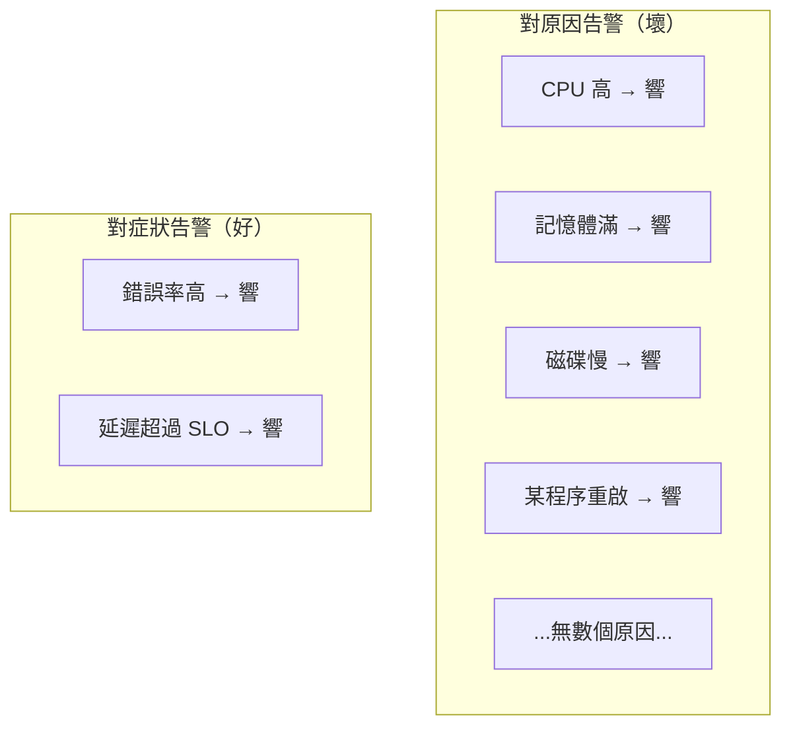

# [sre-4-4] 對「症狀」告警，而不是對「原因」告警

> **本章目標**：理解 SRE 告警設計最核心的原則——對「使用者感受到的症狀」告警，而不是對「每一個可能的內部原因」告警。這能同時減少告警數量、又不漏掉真問題。

## 你會學到

- 「症狀（symptom）」與「原因（cause）」告警的差別
- 為什麼對症狀告警更好
- 這個原則怎麼解決告警疲勞（Part 4-2）
- 什麼時候原因告警還是有用

## 概念說明

### 一個醫療類比

想像你身體不舒服。有兩種監測方式：

- **對「原因」監測**：在身體裡裝幾百個感測器，盯著每一個器官、每一條血管、每一種可能出問題的地方。任何一個有點異常就警報。
- **對「症狀」監測**：盯著幾個關鍵的「你實際感受到的症狀」——發燒、疼痛、呼吸困難。這些一出現，就知道「真的不對勁了」。

第一種會讓你被海量的「某個指標有點波動」警報淹沒（其中大部分根本不影響你）。第二種精準抓住「真的生病了」的時刻。

**SRE 主張用第二種——對症狀告警。**

---

### 症狀 vs 原因

放到系統上：

| | 症狀（Symptom）告警 | 原因（Cause）告警 |
|---|-------------------|------------------|
| 告警對象 | **使用者感受到的問題** | **內部可能的故障原因** |
| 例子 | 「錯誤率高」「延遲變慢」「網站打不開」 | 「CPU 高」「記憶體滿」「某程序掛了」「磁碟慢」 |
| 反映 | 使用者**真的**受影響了 | 可能影響、也可能沒影響 |
| 數量 | **少**（使用者體驗就那幾個面向） | **多到爆**（故障原因有無數種） |

關鍵洞察：

> **症狀很少（使用者在乎的就那幾樣：能不能用、快不快、對不對），但原因有無限多種。**

如果你對每一個「可能的原因」都設告警，你會得到海量告警（Part 4-2 的告警疲勞）。但如果你對「症狀」告警，你只需要少少幾個——而且它們直接反映「使用者真的受影響了」。

---

### 為什麼對症狀告警更好


```mermaid
graph TB
    subgraph CAUSE["對原因告警（壞）"]
        C1["CPU 高 → 響"]
        C2["記憶體滿 → 響"]
        C3["磁碟慢 → 響"]
        C4["某程序重啟 → 響"]
        C5["...無數個原因..."]
    end
    subgraph SYMP["對症狀告警（好）"]
        S1["錯誤率高 → 響"]
        S2["延遲超過 SLO → 響"]
    end
```

**① 數量少，不會告警疲勞**：症狀就那幾個，告警精簡、每個都值得信任。

**② 不漏接「沒想到的原因」**：這點最關鍵。你**不可能預先列出所有故障原因**——總會有你沒想到的新狀況。但不管原因多奇怪，只要它**真的影響了使用者，就一定會反映在症狀上**（錯誤率或延遲會變差）。所以對症狀告警，能抓到「你從沒預料到的問題」。

**③ 直接對應 SLO**：症狀（錯誤率、延遲）就是你的 SLI（Part 2）。對症狀告警 = 對「SLO 即將被違反」告警——完美對齊「使用者可接受的底線」。

**④ 不會「沒事卻響」**：CPU 高但使用者沒受影響？那就不該響（Part 4-1）。對症狀告警天然避免了這種假警報——因為它只在使用者真的受影響時才響。

---

### 那「原因」資訊還有用嗎？當然有

別誤會——CPU、記憶體這些「原因」指標不是沒用，而是**用在不同地方**：

- **告警**：對「症狀」告警（叫人起來）。
- **診斷**：被症狀告警叫起來後，**用「原因」指標來查根因**。

也就是說：症狀告訴你「**出事了、該起來了**」；原因指標告訴你「**為什麼、該修哪裡**」。這正是 Part 3-2 三支柱的精神——症狀（metrics 告警）發現問題，原因指標 + logs + traces 找出根因。

```
症狀告警響：「錯誤率飆到 5%！」（叫你起來）
   ↓ 起來後，用原因指標診斷
查看：CPU? 記憶體? 資料庫連線? → 發現資料庫連線池滿了（找到原因）
```

**所以原則是：對症狀「告警」，用原因「診斷」。** 兩者各司其職。

---

### 例外：有些「原因」值得提早告警

凡事有例外。有些「原因」即使還沒造成症狀，也值得**提早警告（但通常是工單級，不是半夜叫人）**——特別是那些「**有明確趨勢、且修復需要時間**」的：

- 「磁碟再 3 天就滿了」——還沒影響使用者，但如果不提早處理，滿了就出大事，而清理需要時間。這種「**容量預警**」值得提早提醒（但做成工單，隔天處理，不用半夜叫人）。
- 「SSL 憑證 7 天後過期」——同理，提早提醒、從容處理。

判斷標準：**這個原因如果不提早處理，會不會演變成來不及補救的災難？** 會的話，值得提早預警；只是瞬間波動的，就別設。

## 範例：把原因告警改成症狀告警

```
某服務原本的告警（全是「原因」，一天響幾十次）：
  ❌ CPU > 80%
  ❌ 記憶體 > 85%
  ❌ 資料庫連線數 > 90
  ❌ 某背景程序重啟
  ❌ 磁碟 I/O 等待 > 50ms
  → 海量雜訊，大多無需行動 → 嚴重告警疲勞

改成「對症狀告警」：
  ✅ 錯誤率 > 1% 持續 5 分鐘（緊急，叫人）
  ✅ 延遲 p95 > SLO 上限 持續 5 分鐘（緊急，叫人）
  ✅ 健康檢查失敗（服務完全沒回應）（緊急，叫人）
  + 保留少數有趨勢的容量預警（工單級）：
  ⚠️ 磁碟預估 3 天內滿（工單，隔天處理）

結果：
  - 緊急告警從幾十個 → 3 個，但涵蓋了所有「使用者受影響」的情況
  - 那些 CPU/記憶體指標還在儀表板上，被叫起來後用來「診斷」
  - on-call 終於能睡了，而且沒漏掉任何真問題
```

## 小練習

### 練習 1：分辨症狀與原因

下面的告警，是「症狀」還是「原因」？

1. 結帳成功率掉到 92%
2. CPU 使用率 > 90%
3. 首頁 p95 延遲超過 2 秒
4. 資料庫連線池用滿

<details>
<summary>參考解答</summary>

判斷關鍵：它描述的是**使用者感受到的問題（症狀）**，還是**內部可能的故障原因（原因）**？

1. **結帳成功率掉到 92%** → **症狀**。這是使用者直接感受到的體驗（結帳成功與否），直接反映使用者真的受影響了。
2. **CPU 使用率 > 90%** → **原因**。這是機器內部狀態，可能影響使用者、也可能完全沒影響。
3. **首頁 p95 延遲超過 2 秒** → **症狀**。延遲是使用者實際感受到的「快不快」，是典型的 SLI，屬於症狀。
4. **資料庫連線池用滿** → **原因**。這是內部元件的故障原因；它可能導致使用者受影響，但要透過症狀（錯誤率/延遲）才看得出來有沒有真的影響到人。

規律：症狀＝「使用者在乎的：能不能用、快不快、對不對」（1、3）；原因＝「內部零件的狀態」（2、4）。告警要對症狀（1、3）叫人，把原因（2、4）留著被叫起來後診斷用。

</details>

---

### 練習 2：解釋核心優勢

用自己的話回答：為什麼「對症狀告警」能抓到「你從沒預料到的故障原因」，而「對原因告警」做不到？

<details>
<summary>參考解答</summary>

核心差別在於：**原因有無限多種，你不可能事先列完；但症狀就那幾個，而且任何原因只要真的影響使用者，都一定會反映到症狀上。**

- **對原因告警**：你只能對「你想得到的原因」設告警——CPU、記憶體、磁碟、某個程序……但故障原因是無窮的，總會有你從沒預料到的新狀況（某個第三方套件的怪 bug、某種罕見的資源競爭）。這些你沒設告警的原因發生時，原因告警**全都沉默**，因為它們的清單裡根本沒有這一項。

- **對症狀告警**：不管根因多奇怪、多出乎意料，只要它**真的讓使用者受影響**，就一定會表現成「錯誤率上升」或「延遲變慢」——也就是反映到你監控的那少數幾個症狀上。所以症狀告警就像一張「兜底的網」：它不在乎原因是什麼，只要使用者痛了，它就會響。

一句話：**原因告警是「列舉法」，永遠會漏掉沒想到的；症狀告警是「兜底法」，只要影響到使用者就必被抓到。** 這也是為什麼 SRE 主張對症狀告警、用原因診斷。

</details>

---

### 練習 3：重新設計告警

某團隊有 20 個「原因」告警，天天告警疲勞。用本章原則，幫他們設計「3 個症狀告警」來取代大部分，並說明原本那些原因指標該怎麼用（提示：留著診斷用）。

<details>
<summary>參考解答</summary>

思路：使用者在乎的就三件事——**能不能用、快不快、對不對**。所以三個症狀告警剛好各對應一件：

**三個症狀告警（緊急級、叫人）**

1. **錯誤率 > 1% 持續 5 分鐘**（對應「對不對」）
   - 使用者的請求有沒有大量失敗。閾值對照 SLO，加持續時間過濾瞬間尖峰。
2. **延遲 p95 > SLO 上限（例如 2 秒）持續 5 分鐘**（對應「快不快」）
   - 服務有沒有慢到讓使用者受不了。
3. **健康檢查失敗 / 服務完全無回應**（對應「能不能用」）
   - 網站是不是根本打不開，最嚴重的症狀。

這三條就涵蓋了「使用者受影響」的所有情況，卻只有 3 個告警——徹底解決告警疲勞。

**那原本 20 個原因指標（CPU、記憶體、資料庫連線數、磁碟 I/O……）怎麼辦？**

- **從「告警」降級為「診斷」用途**：把它們留在儀表板上，**不再叫人**。當上面三個症狀告警把人叫起來後，再回頭看這些原因指標，追出「為什麼」——例如錯誤率飆高，一看發現是資料庫連線池滿了。這就是「對症狀告警、用原因診斷」。
- **例外：少數有明確趨勢、修復需要時間的原因，保留為「工單級」預警**：例如「磁碟預估 3 天內滿」「SSL 憑證 7 天後過期」——這種提早提醒、隔天從容處理，但**不半夜叫人**。

結果：緊急告警從 20 個 → 3 個，涵蓋所有「使用者受影響」的情況，on-call 終於能睡，而且不漏任何真問題。

</details>

## 課外讀物

> 「對症狀告警」直接對應 SLO，務必先理解 SLO 與錯誤預算（同課程 `sre-2-3`、`sre-2-4`）。下一章把這套原則實作成告警規則（`sre-4-5`）。
