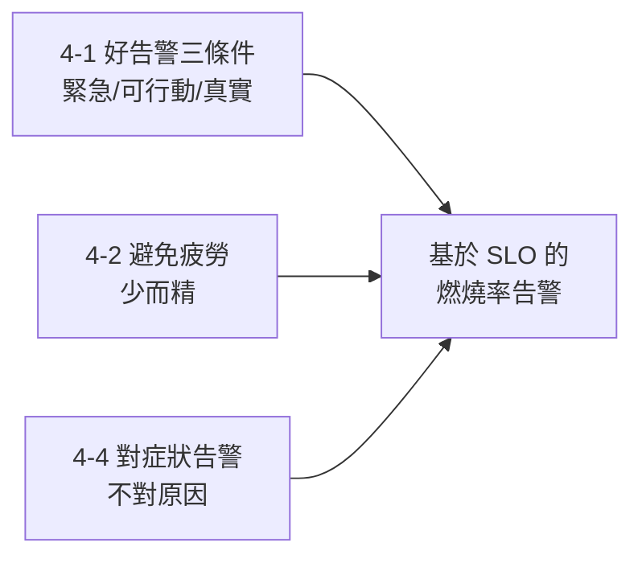
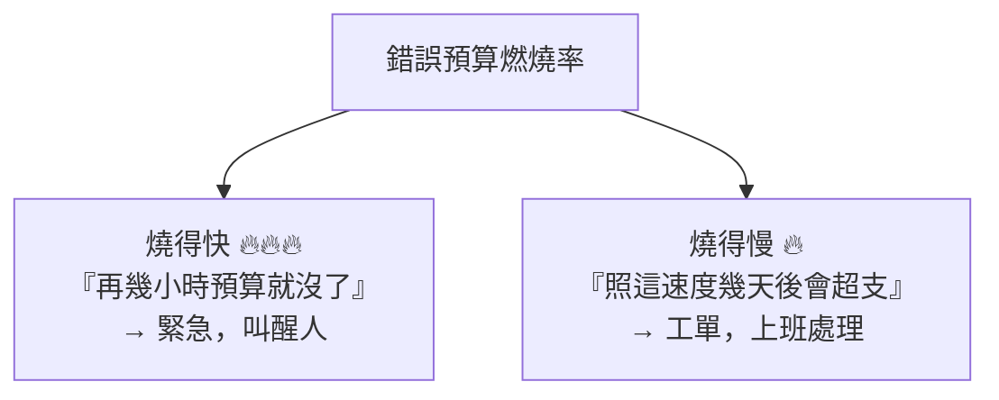

# [sre-4-5] 🔧 動手做：設計「只在該醒來時才響」的告警

> **本章目標**：把 Part 4 的原則全部用上，為一個服務設計一套基於 SLO、對症狀告警、不擾民的告警規則，並了解「錯誤預算燃燒率」這個現代告警的最佳實踐。

## 你會學到

- 把告警原則（4-1~4-4）落地成實際的 Prometheus 告警規則
- 用「持續時間」過濾雜訊
- 「錯誤預算燃燒率（burn rate）」告警是什麼
- 為告警寫上 runbook 連結

## 概念說明

### 這一章把 Part 4 全部整合

你會為服務設計一套告警，每條都通過 Part 4 的檢驗：



> 前提：Part 3-6 的 Prometheus 監控已就緒（指標已收集）。

## 程式碼範例

### 第一步：最基本的症狀告警

Prometheus 用 YAML 寫告警規則。先寫一條最直觀的「錯誤率」告警（對症狀、有持續時間）：

建立 `alert-rules.yml`：

```yaml
groups:
  - name: slo-alerts
    rules:
      - alert: HighErrorRate
        expr: |
          sum(rate(http_requests_total{status=~"5.."}[5m]))
            / sum(rate(http_requests_total[5m]))
          > 0.01
        for: 5m
        labels:
          severity: page
        annotations:
          summary: "錯誤率超過 1% 已持續 5 分鐘"
          runbook: "https://wiki/runbooks/high-error-rate"
```

逐段看怎麼體現 Part 4 原則：

- `expr`：用 Part 3-3 的 PromQL 算「錯誤率」——這是**症狀**（4-4），不是 CPU 之類的原因。
- `> 0.01`：閾值 1%（對照你的 SLO）。
- `for: 5m`：**持續 5 分鐘才觸發**（4-2 過濾瞬間尖峰雜訊）。
- `severity: page`：分級（4-1）——`page` 代表「叫醒人」級。
- `annotations.runbook`：附上 **runbook 連結**（4-3）——被叫醒的人照著處理。

這一條就濃縮了整個 Part 4 的精華：對症狀、有緩衝、分級、附手冊。

---

### 第二步：理解「錯誤預算燃燒率」告警（現代最佳實踐）

上面那條「錯誤率 > 1%」是好的起點，但有個問題：**它無法區分「小問題」和「大災難」**。錯誤率 1.1% 和 50% 都會觸發同一個告警，但嚴重性天差地遠。

現代 SRE 的最佳實踐是**基於「錯誤預算燃燒率（burn rate）」告警**。概念是：

> 不只看「現在錯誤率多少」，而是看「**我正在以多快的速度燒掉這個月的錯誤預算**」。

用類比：你每月有一筆零用錢（錯誤預算，Part 2-4）。重點不是「現在花了多少」，而是「**燒錢的速度**」：

- 慢慢燒（一整月剛好花完）→ 正常，不用緊張。
- **暴燒**（一天就燒掉整月預算）→ 大災難，要立刻處理！

燃燒率告警就是抓「暴燒」的時刻。它能讓你：

- **暴燒（例如 1 小時燒掉 2% 預算）** → 緊急告警，叫醒人（嚴重事故）。
- **慢燒（例如持續略高，幾天才會超支）** → 工單級告警，上班處理就好。



這完美實現了 Part 4-1 的分級理念——**用「多快會違反 SLO」來決定告警的緊急程度**，而不是一刀切。

---

### 第三步：燃燒率告警範例

一個「快速燃燒」的緊急告警（簡化版概念）：

```yaml
- alert: ErrorBudgetBurningFast
  expr: |
    (
      sum(rate(http_requests_total{status=~"5.."}[1h]))
        / sum(rate(http_requests_total[1h]))
    ) > (14.4 * 0.001)
  for: 2m
  labels:
    severity: page
  annotations:
    summary: "錯誤預算正在快速燃燒——數小時內將耗盡"
    runbook: "https://wiki/runbooks/budget-burn"
```

那個 `14.4 * 0.001` 不用背（是業界算好的「快速燃燒」門檻，對應 SLO 0.1%）。重點是理解**精神**：它偵測的不是「有沒有錯」，而是「**錯誤是不是快到會在短時間內燒光整月預算**」——這才是真正值得半夜叫人的事。

---

### 第四步：設定通知與分級路由

告警觸發後要「通知對的人、用對的方式」。在 Alertmanager（或 Grafana 告警）設定**路由**：

```yaml
# 概念示意
routes:
  - match:
      severity: page          # 緊急級
    receiver: oncall-phone    # → 打電話/狂響，叫醒 on-call
  - match:
      severity: ticket        # 工單級
    receiver: slack-channel   # → 發 Slack，上班看
```

這實現了 Part 4-1 的分級——`page` 級叫醒人，`ticket` 級只發訊息。**只有真正緊急的，才會把人從睡夢中挖起來。**

## 小練習

### 練習 1：檢驗一條告警

看回第一步那條 `HighErrorRate` 告警，逐一對照 Part 4 原則：它怎麼做到「對症狀、不疲勞、分級、有手冊」？

---

### 練習 2：理解燃燒率

用「每月零用錢」的類比，解釋為什麼「錯誤預算燃燒率」比「單純看當前錯誤率」更聰明。「燒得快」和「燒得慢」分別該怎麼處理？

---

### 練習 3：設計一套告警

為你 Part 2-6 定義 SLO 的那個服務，設計 2~3 條告警規則（用文字描述即可：對什麼症狀、閾值多少、持續多久、什麼級別、有沒有 runbook）。確保它們都通過 Part 4 的「好告警」檢驗。

> 你現在會「監控（Part 3）+ 告警（Part 4）」了。但告警響了、事故真的發生了，當下該怎麼冷靜處理？事後怎麼學習改進？這就是下一個 Part 5 的主題。

## 課外讀物

> 告警規則跑在 infra 課架設的 Prometheus 上，告警通知由 Alertmanager 處理 → 參見 **infra 課程** Part 7（`lessons/infra/課程大綱.md`）
