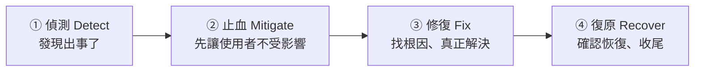

# [sre-5-1] 線上爆炸的當下：偵測、止血、修復、復原

> **本章目標**：學會事故發生當下的標準處理流程，建立「先止血、再治本」的反射，避免在壓力下慌亂、把事情搞得更糟。

## 你會學到

- 事故（incident）的處理為什麼需要「標準流程」
- 四個階段：偵測 → 止血 → 修復 → 復原
- 為什麼「止血」要優先於「找根因」
- 處理事故時的溝通原則

## 概念說明

### 壓力之下，人會做蠢事

線上系統爆炸的當下，是高壓情境：使用者在抱怨、老闆在問、錢在流失、你心跳加速。**人在這種壓力下，最容易做出錯誤決定**——亂改東西、跳過確認、把小事故搞成大災難。

所以 SRE 不靠「臨場英雄式發揮」，而靠**一套事先練好的標準流程**。就像消防員、急診醫生——緊急時刻照 SOP 走，比靠當下急中生智可靠得多。

---

### 事故處理的四個階段



**① 偵測（Detect）**：知道「出事了」。理想情況是你的告警（Part 4）先發現，而不是等使用者來罵。偵測得越早，影響越小。

**② 止血（Mitigate）**：**先讓使用者不再受影響**，哪怕只是臨時手段。這是最關鍵、最該優先的一步（下面詳述）。

**③ 修復（Fix）**：止血之後，從容地找出**根本原因**並真正解決。

**④ 復原（Recover）**：確認服務完全恢復正常、清理臨時手段、記錄事件（為 Part 5-3 的 postmortem 準備）。

---

### 最重要的一課：止血優先於找根因

這是事故處理最反直覺、也最關鍵的原則：

> **事故當下的第一要務，是「止血」（讓使用者恢復正常），不是「找出為什麼」。**

新手的本能是「先搞懂為什麼壞掉」——然後花 30 分鐘埋頭研究根因，而這 30 分鐘裡使用者一直在受苦。**錯。**

正確的順序是：**先用最快的手段讓使用者恢復，之後再慢慢查為什麼。**

用醫療類比：病人大出血送進急診，醫生會**先止血、穩住生命徵象**，而不是先花時間研究「他為什麼會受傷」。命先保住，再慢慢查原因。系統事故也一樣——**先讓使用者能用，再研究根因。**

常見的「止血」手段，往往不需要知道根因就能做：

| 止血手段 | 什麼情況 |
|---------|---------|
| **回滾（rollback）** | 剛上線新版本就出事 → 退回上一個正常版本 |
| **重啟** | 服務卡死 → 重啟讓它恢復（治標但快） |
| **擴容** | 流量爆量撐不住 → 加機器分攤 |
| **切換** | 某元件掛了 → 切到備援（Part 8 的故障轉移） |
| **關閉問題功能** | 某新功能出包 → 先把它關掉（feature flag） |

注意這些手段的共通點：**不需要知道「為什麼壞」，就能讓使用者先恢復。** 這就是止血的精神。

---

### 處理事故時的溝通

事故處理不只是技術，**溝通同樣重要**：

- **同步狀態**：讓相關的人（團隊、主管、客服）知道「現在什麼狀況、誰在處理、預計多久」。資訊空白會讓大家恐慌、互相猜測、甚至重複介入把事情搞亂。
- **誠實**：別隱瞞、別過度樂觀。「我們已知問題、正在處理」比假裝沒事好。
- **留下時間軸**：邊處理邊記錄「幾點發生什麼、做了什麼」。這在事後 postmortem（5-3）超級重要——事後回想常常會記錯。

這些溝通職責，在大事故中會由專門的角色負責——這就是下一章「事故指揮」的主題。

## 範例：一次事故處理的時間軸

```
14:32  🔔 告警響：結帳錯誤率飆到 30%（偵測 - 告警先發現，good）
14:33  on-call 確認：使用者真的無法結帳，這是真事故
14:34  同步：在事故頻道貼「結帳異常，正在處理」（溝通）
14:35  快速判斷：14:20 剛上線新版本 → 高度懷疑是它
14:37  ✅ 止血：回滾到上一版本（不需要知道確切 bug 是什麼！）
14:40  確認：錯誤率降回正常，使用者能結帳了（止血成功）
14:42  同步：「已回滾，服務恢復，將調查根因」
──────── 使用者已經沒事了，以下從容進行 ────────
15:30  修復：在測試環境重現，找到新版本的一個 null 處理 bug
16:00  修好、測試、重新安全上線
16:30  復原：確認一切正常，整理時間軸，排 postmortem
```

注意 14:37 的關鍵決定——**回滾，而不是花時間查 bug**。從出事到使用者恢復只花了 8 分鐘，因為先止血。真正的根因（那個 null bug）是在使用者已經沒事之後，才從容查出來的。這就是「止血優先」的威力。

## 小練習

### 練習 1：四階段

不看上面，說出事故處理的四個階段，並解釋為什麼順序是這樣。

---

### 練習 2：止血優先

用「急診止血」的類比，解釋為什麼事故當下要「先止血」而不是「先找根因」。如果反過來會怎樣？

---

### 練習 3：選擇止血手段

下面的事故，你會用什麼「止血」手段（不需要先知道根因）？

1. 剛上線新版本，錯誤率暴增
2. 流量突然暴增 10 倍，伺服器撐不住變超慢
3. 某個新功能一直出錯，但其他功能正常

## 課外讀物

> 事故的「止血手段」很多來自 infra 的能力（回滾、擴容、故障轉移）→ 參見 **infra 課程** Part 8、Part 9（`lessons/infra/課程大綱.md`）
