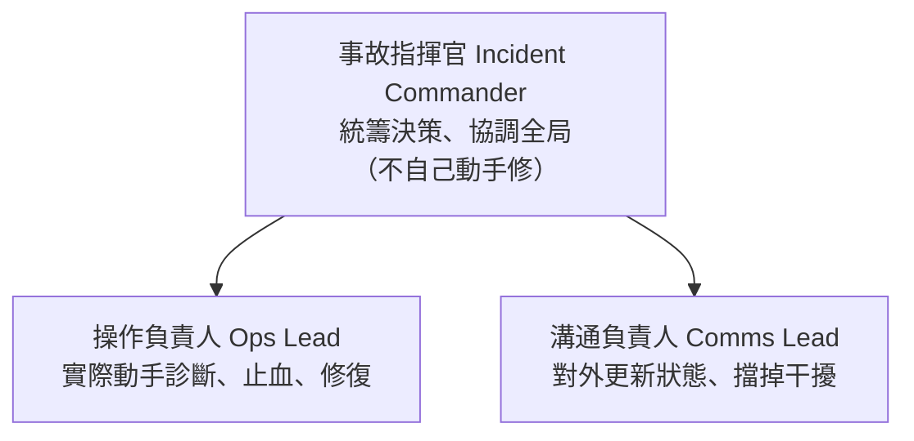

# [sre-5-2] 事故指揮：誰決策、誰溝通、誰動手

> **本章目標**：理解大型事故為什麼需要明確的角色分工（事故指揮系統），知道幾個關鍵角色各自負責什麼，避免「一群人擠在一起亂成一團」。

## 你會學到

- 為什麼大事故需要「指揮系統」
- 三個核心角色：指揮官、溝通負責人、操作負責人
- 為什麼「指揮官不該自己動手修」
- 小事故與大事故的差別處理

## 概念說明

### 小事故一個人搞定，大事故會亂成一團

Part 5-1 的流程，小事故一個 on-call 就能跑完。但**大事故**不一樣——當系統大規模崩潰，會發生這種混亂場面：

- 五個工程師同時登入，各自亂改東西，互相踩到腳。
- 老闆、客服、業務不斷來問「好了沒？」，打斷正在處理的人。
- 沒有人知道「現在誰在做什麼、整體狀況如何」。
- 大家忙著救火，沒有人記錄發生了什麼。

結果：人很多，但效率極低，甚至因為互相干擾把事情搞得更糟。

這就是為什麼需要**事故指揮系統（Incident Command System, ICS）**——一套借鑑自消防、災難應變的角色分工制度。

---

### 核心觀念：分清角色，各司其職

事故指揮的精髓是：**明確分工，每個人只專注自己的角色，不互相干擾。**



**① 事故指揮官（Incident Commander, IC）**

整場事故的**總指揮**。職責是：

- 統籌全局、做關鍵決策（要不要回滾？要不要升級？）
- 協調各角色、確保事情有條不紊
- **但不自己埋頭去修**（這點很重要，下面講）

IC 像戰場上的指揮官、或電影裡的「現場總指揮」——他綜觀全局、下決策，而不是衝第一線開槍。

**② 操作負責人（Ops Lead）**

實際**動手的人**——診斷、執行止血、修復。他專注技術操作，不用分心去應付老闆的詢問（那是溝通負責人的事）。

**③ 溝通負責人（Comms Lead）**

負責**對外溝通**——定期更新狀態給主管、客服、使用者；同時**擋掉外界的干擾**，讓操作的人能專心。

---

### 為什麼「指揮官不該自己動手修」

這是最反直覺、也最重要的一點。通常 IC 是團隊裡最資深、技術最強的人——直覺上他應該衝去修啊？

**錯。如果指揮官埋頭去修，就沒有人在綜觀全局了。**

一個人專注修某個技術細節時，視野會收窄到那個細節上，看不到「整體狀況、其他線索、該不該換方向」。如果最該綜觀全局的人陷進了技術細節，整場事故就群龍無首、各自為政。

用類比：消防現場的總指揮，不會自己抓水管衝進火場——他要站在外面，綜觀整棟樓的火勢、調度所有消防員、決定戰術。一旦他衝進去，就沒人指揮了。

所以 IC 的價值在於**抽離、綜觀、決策、協調**。動手的事，交給操作負責人。

---

### 小事故 vs 大事故

不是每個事故都要搬出全套角色——那會太重。實務上看規模：

| | 小事故 | 大事故 |
|---|--------|--------|
| 規模 | 單一服務、影響有限 | 大範圍、多服務、影響嚴重 |
| 角色 | 一個 on-call 全包（自己當 IC + 操作） | 啟動完整指揮系統，角色分開 |
| 何時升級 | 處理不來、影響擴大 → 升級成大事故 | — |

關鍵是**有一條清楚的「升級」線**（呼應 Part 4-3 的 escalation）：當 on-call 發現「這個我一個人搞不定 / 影響在擴大」，就該宣告「這是重大事故」，啟動指揮系統、找人來分擔角色。**及早承認「我需要幫忙」，是專業，不是失敗。**

---

### 一個常被忽略的角色：記錄

大事故中，最好還有人專門**記錄時間軸**——幾點發生什麼、做了什麼決定、結果如何。因為：

- 事故當下大家都在忙，事後回想常常記錯、漏掉。
- 這份時間軸是 Part 5-3 寫 postmortem 的命脈。

如果人手不夠，至少 IC 要確保「有在記錄」——可以是大家在事故頻道隨手貼，事後再整理。

## 範例：一次大事故的角色運作

```
🔥 重大事故：整個網站無法存取，使用者大量回報

on-call（小美）快速判斷：影響全站、自己搞不定
→ 宣告「重大事故」，啟動指揮系統，並擔任 IC（指揮官）

小美（IC）：
  - 拉相關工程師進事故頻道
  - 指派阿明當「操作負責人」
  - 指派小華當「溝通負責人」
  - 自己綜觀全局、做決策、不動手

阿明（操作）：專心診斷
  → 發現是資料庫主節點掛了
  → 在 IC 同意下，執行「切換到備援資料庫」止血

小華（溝通）：
  → 每 15 分鐘更新狀態給主管和客服
  → 擋掉老闆「好了沒」的反覆詢問，讓阿明專心
  → 在狀態頁貼「我們發現問題，正在處理」

小美（IC）全程：
  - 確認阿明的方向對不對、要不要換策略
  - 決定「切換備援」這個有風險的操作可以執行
  - 記錄關鍵時間點

結果：分工清楚，沒人互相干擾，30 分鐘恢復。
事後小美整理時間軸 → 進入 postmortem（5-3）。
```

對比沒有指揮系統的世界：5 個工程師同時亂改、老闆一直打斷、沒人記錄……同樣的事故可能拖兩小時還理不清。**角色分工，就是大事故能否快速收拾的關鍵。**

## 小練習

### 練習 1：三個角色

不看上面，說出事故指揮系統的三個核心角色，並各用一句話解釋職責。

---

### 練習 2：為什麼 IC 不動手

用「消防總指揮」的類比，解釋為什麼事故指揮官不該自己埋頭去修。如果他陷進技術細節，會發生什麼？

---

### 練習 3：判斷該不該升級

你是 on-call，遇到下面狀況，哪些該「宣告重大事故、啟動指揮系統」？

1. 某個邊緣小功能壞了，少數使用者受影響，你正在查
2. 整個網站掛了，使用者大量湧入抱怨，你一個人理不清
3. 你修了 20 分鐘沒進展，影響範圍還在擴大

## 課外讀物

> 事故升級的概念，和 on-call 的 escalation 機制一脈相承（同課程 `sre-4-3`）。
