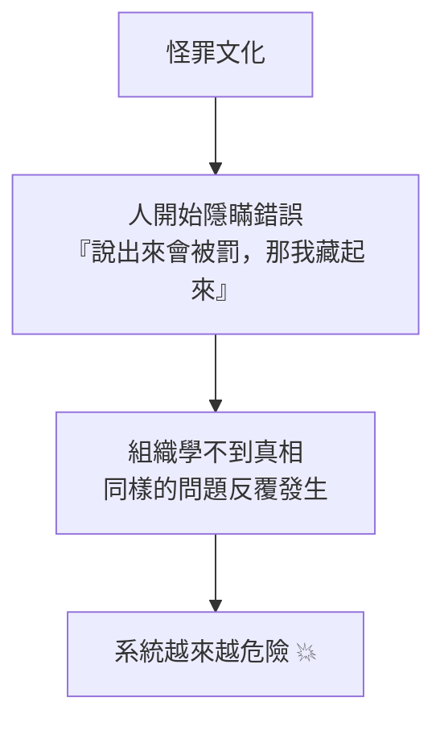

# [sre-5-3] 無咎事後檢討：對事不對人，才學得到東西

> **本章目標**：理解「無咎事後檢討（blameless postmortem）」的精神，知道為什麼「怪罪個人」會讓組織學不到教訓，以及一份好的 postmortem 該包含什麼。

## 你會學到

- Postmortem（事後檢討）是什麼、為什麼重要
- 「無咎（blameless）」文化的核心精神
- 為什麼「怪罪個人」反而讓系統更不安全
- 一份好 postmortem 的結構

## 概念說明

### 事故的真正價值：學習

事故很痛，但它有一個珍貴的副產品——**它暴露了系統的弱點**。一個成熟的組織，會把每次事故當成**免費的學習機會**：找出根本原因、改善系統，讓同樣的事不再發生。

承載這個學習的工具，就是 **Postmortem（事後檢討報告，直譯是「驗屍」）**——事故平息後，團隊一起回顧「發生了什麼、為什麼、學到什麼、怎麼改善」。

但 postmortem 能不能發揮價值，取決於一個關鍵的文化：**它必須是「無咎」的。**

---

### 無咎（Blameless）：對事不對人

**無咎事後檢討**的核心精神：

> **檢討的目標是「找出系統哪裡可以更好」，而不是「找出該怪誰」。**

當事故發生，最直覺的反應是找戰犯：「是誰下錯指令？」「是誰沒測好？」。但 SRE 認為，**怪罪個人是有害的，而且通常找錯了重點。**

為什麼？因為——

> **如果一個人犯的錯，能造成這麼大的事故，那真正的問題是「系統允許這個錯誤發生」，而不是那個人。**

舉例：某工程師打錯一個指令，刪掉了正式資料庫。

- **怪罪式思維**：「都是他害的！處分他！」
- **無咎式思維**：「為什麼我們的系統，讓『一個手滑的指令』就能刪掉正式資料庫？為什麼沒有確認步驟？為什麼沒有權限保護？為什麼備份沒測過？」

第二種思維才能真正讓系統變安全——因為**人永遠會犯錯，但系統可以被設計成「即使有人犯錯也不會釀災」。**

---

### 為什麼「怪罪」會讓系統更不安全

這是最反直覺、也最重要的一點。怪罪個人不只沒用，還會**主動傷害**安全：



當人因為犯錯被懲罰，他們學到的不是「別犯錯」（人本來就會犯錯），而是「**別讓人知道我犯錯**」。於是：

- 出了事，第一反應是掩蓋、甩鍋，而不是趕快通報處理。
- 沒有人敢誠實說出「我做了什麼」，事故的真相永遠拼不出來。
- 大家不敢嘗試、不敢創新（怕出錯被罰），組織停滯。

反之，**無咎文化**讓人敢於誠實：「我下了這個指令、我以為會 X 結果 Y」。只有當大家敢說真話，你才能拿到完整的真相，才能真正修好系統。

**安全的系統，建立在「人敢於誠實面對錯誤」之上。** 這就是無咎文化的價值。

---

### 一份好 postmortem 的結構

一份 postmortem 通常包含這幾塊：

| 區塊 | 內容 |
|------|------|
| **摘要** | 一句話：發生什麼、影響多大、多久恢復 |
| **影響** | 多少使用者受影響、損失多少、違反 SLO 多少 |
| **時間軸** | 幾點發生什麼、做了什麼（來自 5-2 的記錄）|
| **根本原因** | 為什麼會發生（往深處挖，不停在表面）|
| **怎麼偵測 / 處理的** | 告警有沒有及時？止血順利嗎？哪裡可以更快？ |
| **行動項目（action items）** | **最重要**：要做哪些改善，避免再發生（Part 5-5 深入）|
| **學到的教訓** | 這次學到什麼 |

寫的時候，全程用**對事不對人**的語言：

- ❌「小明粗心打錯指令」
- ✅「部署流程缺少二次確認，使得單一指令就能影響正式環境」

注意差別：右邊不提是誰、聚焦在「系統的缺陷」上——而那才是真正能修的東西。

---

### 找「根本原因」要往深挖（5 Whys）

寫根因時，別停在表面。一個常用技巧是「**5 個為什麼（5 Whys）**」——連續追問，挖到系統層面：

```
網站掛了。
  為什麼？→ 資料庫被一個指令刪了。
  為什麼指令能刪正式資料庫？→ 因為任何人都有正式環境的完整權限。
  為什麼任何人都有完整權限？→ 因為從沒設過權限分級。
  為什麼沒設權限分級？→ 因為當初趕上線，省略了。
  為什麼趕上線就能省略安全措施？→ 因為沒有上線檢查清單。
  
根因：缺乏權限管理與上線檢查機制（系統問題）
而不是：「某人手滑」（個人問題）
```

看到了嗎？一路追問下去，「某人手滑」的表象底下，是「系統根本沒有防呆機制」這個真正的根因。修好系統（加權限、加確認、加檢查清單）才有意義；處分那個人毫無幫助。

## 範例：兩種 postmortem 的對比

```
❌ 怪罪式 postmortem：
  「事故原因：工程師 A 在部署時操作失誤，誤刪資料庫。
   處置：對 A 進行懲處，要求他以後更小心。」
  → 結果：A 以後不敢通報錯誤，其他人也學到「別出錯、出錯要藏」
   真正的系統漏洞（誰都能刪正式庫）原封不動 → 遲早再發生

✅ 無咎式 postmortem：
  「事故原因：部署流程允許直接對正式資料庫執行刪除指令，
   且無二次確認、無權限隔離、備份未經還原驗證。
   行動項目：
   1. 正式環境刪除操作加入二次確認（負責人：X，期限：兩週）
   2. 實施權限分級，限制正式環境的危險操作（負責人：Y）
   3. 建立並定期演練備份還原流程（負責人：Z）」
  → 結果：系統真的變安全了，同類事故不會再發生
   大家也更敢誠實通報問題
```

兩份報告面對同一個事故，但一份在找戰犯、一份在修系統。哪一份讓組織真正進步，一目了然。

## 小練習

### 練習 1：無咎的精神

用自己的話回答：「無咎事後檢討」為什麼把焦點放在「系統」而非「個人」？這背後的核心信念是什麼？

---

### 練習 2：為什麼怪罪有害

解釋：為什麼「懲罰犯錯的人」反而會讓系統長期變得**更不安全**？

---

### 練習 3：練習 5 Whys

某事故：「使用者付了錢但訂單沒成立」。試著用「5 個為什麼」往下追問至少 4 層，看看能不能從表面挖到系統層面的根因。然後練習：把根因寫成「對事不對人」的句子。

## 課外讀物

> 事故應變與檢討的方法論，和資安事件的處理思維相通 → [課外讀物 E-10-1：Web 安全總覽 — OWASP Top 10](../../../課外讀物/E-10-security/E-10-1-web-security-overview.md)
