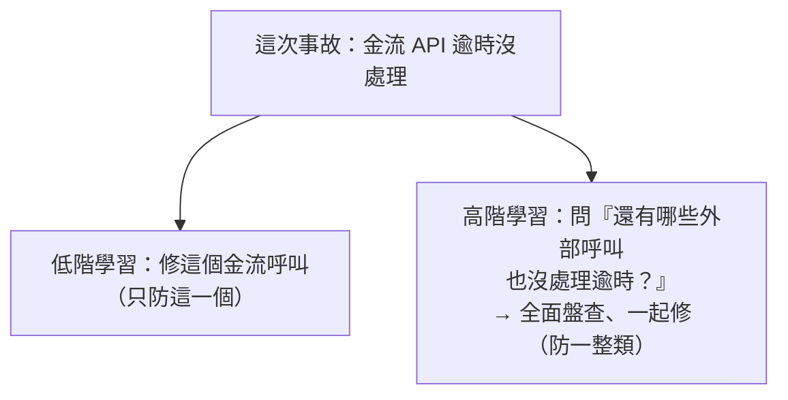

# [sre-5-5] 從事故中學習：讓行動項目真正落地

> **本章目標**：理解 postmortem 最常見的失敗——行動項目寫完就忘，並學會怎麼讓「事故的教訓」真正轉化成系統的改善。

## 你會學到

- 為什麼大部分 postmortem 的行動項目沒被執行
- 好的行動項目該長什麼樣
- 怎麼追蹤行動項目到完成
- 把「個案修復」提升為「整類問題的防範」

## 概念說明

### Postmortem 最大的失敗：寫完就忘

很多團隊認真寫了 postmortem，開了檢討會，然後……**那些行動項目就躺在文件裡，沒人執行，直到同樣的事故再次發生。**

這是 postmortem 最常見、也最可惜的失敗。因為——

> **事故的價值，100% 來自「行動項目有沒有被執行」。** 一份分析再透徹的 postmortem，如果沒有帶來任何實際改變，那這次事故就白痛了。

所以這一章的重點：怎麼讓行動項目從「文件裡的待辦」變成「真的被做完的改善」。

---

### 好的行動項目：具體、有主、有期、可追蹤

爛的行動項目長這樣：「以後要更小心」「加強監控」「改善流程」——這些**全是空話**，沒人知道具體要做什麼、誰做、何時做完。

好的行動項目要符合四個條件：

| 條件 | 說明 | 反例 → 正例 |
|------|------|------------|
| **具體** | 明確「做什麼」 | 「加強監控」→「為金流 API 加上逾時告警」 |
| **有負責人** | 明確「誰做」 | （沒人）→「負責人：小明」 |
| **有期限** | 明確「何時完成」 | （沒期限）→「期限：6/30」 |
| **可追蹤** | 進到正式的工作系統 | （躺在文件裡）→「建成 Jira ticket」 |

最關鍵的是最後一點——**行動項目必須進到團隊平常在用的工作追蹤系統**（Jira、GitHub Issues 等），和其他工作一起排優先級、被定期 review。**留在 postmortem 文件裡的行動項目，注定被遺忘。**

---

### 把行動項目當「真正的工作」對待

很多團隊把「修 postmortem 的行動項目」當成「有空再做」的次要任務，結果永遠排不到。這是錯的。

SRE 的觀點：**從事故學到的改善，是高優先級的工作**，因為它直接關係到「同類事故會不會再發生」。這正是 Part 2-4「錯誤預算」機制能幫上忙的地方：

> 當錯誤預算被事故燒掉、觸發「凍結新功能」時——**那段時間正好拿來做這些行動項目**。把「修穩定性」變成名正言順、有時間做的事。

這樣，錯誤預算、事故、postmortem、行動項目就串成一個閉環：事故燒掉預算 → 觸發凍結 → 用這段時間執行行動項目 → 系統變可靠 → 預算回穩。

---

### 從「修個案」提升到「防整類」

更高階的學習，是從一次事故，看出「**一整類問題**」，然後系統性地防範。



低階學習只修「這次出事的那一個」；高階學習會問：

- 「這個問題**還可能出現在哪裡**？」（其他外部呼叫是不是也沒處理逾時？）
- 「能不能用一個**機制**，讓這整類問題不再發生？」（例如統一的呼叫框架，預設就有逾時處理）

用類比：一個地方淹水，低階做法是把那裡的水掃掉；高階做法是問「為什麼會淹？是不是整個排水系統都有問題？」然後修整個系統。**頂尖的 SRE，從每次事故學到的不只是補一個洞，而是讓一整類洞都消失。**

---

### 追蹤：定期回顧行動項目

最後，要有人定期檢查「行動項目做完了沒」。常見做法：

- 每週或每兩週的團隊會議，過一遍「未完成的 postmortem 行動項目」。
- 把它們和一般工作一樣排進 sprint、給優先級。
- 逾期未做的，要討論「為什麼沒做、是不是優先級判斷錯了」。

這個「定期追蹤」的紀律，是行動項目會不會落地的最後一道保險。

## 範例：行動項目的好壞對比

```
同一個事故（金流逾時），兩種行動項目：

❌ 沒用的行動項目：
  - 「以後部署要更小心」
  - 「加強測試」
  - 「改善監控」
  → 空泛、沒人負責、沒期限、躺在文件裡 → 三個月後同樣事故再來

✅ 會落地的行動項目：
  - [Jira-1234] 為金流 API 加逾時處理（負責人：A，6/22）
  - [Jira-1235] 盤查所有外部呼叫、補上逾時處理（負責人：B，6/30）
    ← 注意這條：從「修個案」提升到「防整類」
  - [Jira-1236] 建立外部依賴失敗的測試規範（負責人：C，7/10）
  - 每週團隊會議追蹤以上進度
  → 具體、有主、有期、進了工作系統、有人追 → 真的會被做完
```

差別不在「分析得多深」，而在「**有沒有變成真正會被執行的工作**」。這就是讓事故產生價值的最後一哩路。

## 小練習

### 練習 1：為什麼行動項目會被遺忘

回答：為什麼很多 postmortem 的行動項目最後沒被執行？要怎麼避免？

---

### 練習 2：改造爛的行動項目

把下面這些空泛的行動項目，改寫成「具體、有負責人、有期限、可追蹤」的版本（負責人和期限自己假設）：

1. 「以後要更注意資料庫」
2. 「加強系統穩定性」

---

### 練習 3：練習高階學習

承上一章你寫的 postmortem。針對那個根因，除了「修這次出事的地方」，試著想出一條「防範一整類問題」的行動項目。

> 你現在走完了「事故的完整生命週期」：處理（5-1）→ 指揮（5-2）→ 檢討（5-3、5-4）→ 學習落地（5-5）。接下來 Part 6 進入主動面——與其一直處理事故，不如「消除 toil、用自動化讓問題不再需要人」。

## 課外讀物

> 把行動項目落實成自動化，是消除 toil 的具體手段，正是下一個 Part 6 的主題（同課程 `sre-6-1`）。
