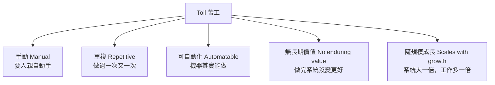

# [sre-6-1] 什麼是 Toil？該被消滅的維運苦工

> **本章目標**：精確定義 Toil（苦工），學會辨認它，並理解為什麼 SRE 把「消滅 toil」當成一件嚴肅、有指標的事。

## 你會學到

- Toil 的精確定義（不是「所有討厭的工作」）
- Toil 的幾個特徵
- 為什麼 toil 必須被嚴格控制、甚至設上限
- Toil 和「真正的工程工作」「日常雜事」的差別

## 概念說明

### Toil 不是「所有討厭的工作」

Part 1-3 介紹過 toil 的概念，這一章精確定義它。很多人誤以為 toil = 「無聊的工作」或「我不想做的事」。**不對。** SRE 對 toil 有精確的定義：

> **Toil = 跟「跑一個服務」直接相關，但具備以下特徵的工作：手動、重複、可自動化、無長期價值、且隨服務規模線性成長。**

注意——toil 不是「沒價值的工作」籠統的代稱。有些討厭的工作（例如規劃架構）很燒腦，但它不是 toil，因為它有長期價值。判斷是不是 toil，要看下面這幾個特徵。

---

### Toil 的特徵

一個工作越符合這些特徵，它就越是 toil：



| 特徵 | 說明 |
|------|------|
| **手動** | 要人親自去做（執行某個步驟、點某個按鈕） |
| **重複** | 同一件事一再地做，不是一次性的 |
| **可自動化** | 機器其實做得來——如果需要人的判斷力，就不算 |
| **無長期價值** | 做完之後，服務狀態沒有變更好（只是維持原狀） |
| **隨規模線性成長** | 使用者多一倍、機器多一倍，這工作也多一倍 |

最後一個特徵特別關鍵——**會隨規模成長的 toil 最危險**，因為它意味著「系統長大，人力負擔就跟著長大」，遲早人力追不上。

---

### 判斷練習：是不是 toil？

| 工作 | 是 toil 嗎？ | 為什麼 |
|------|:---:|--------|
| 每次部署都手動重啟 10 台機器 | ✅ 是 | 手動、重複、可自動化、無長期價值、隨機器數成長 |
| 每週手動清理一次磁碟 | ✅ 是 | 同上 |
| 設計一套新的監控架構 | ❌ 不是 | 有長期價值、需要創造力，不重複 |
| 處理一個全新、沒遇過的疑難事故 | ❌ 不是 | 需要判斷力，不是重複的 |
| 每次新人入職手動開一堆帳號 | ✅ 是 | 手動、重複、可自動化 |
| 寫一個工具把上面的開帳號自動化 | ❌ 不是 | 這是「消滅 toil」的工程工作，有長期價值 |

注意最後兩行的對比——**「手動開帳號」是 toil，「寫工具自動開帳號」是消滅 toil 的工程**。前者越做越多，後者做一次永久受益。

---

### 為什麼 toil 必須被嚴格控制

Part 1-3 說過 toil 的危害，這裡再強調為什麼 SRE 對它如此認真：

**① Toil 會吃光時間、排擠工程**

每天忙著做 toil，就沒時間做「讓系統更好」的工程。結果系統永遠不會進步，你永遠在原地踏步、疲於奔命。

**② Toil 隨規模成長，人力終將崩潰**

這是最致命的。如果維運靠 toil，那「系統成長」就等於「toil 成長」就等於「要請更多人」。但好的工程，應該讓「系統成長，但維運負擔幾乎不變」（靠自動化）。靠 toil 撐的團隊，遲早被自己的成功壓垮。

**③ Toil 消磨人、導致離職**

重複無聊的工作做久了，工程師會失去動力、職業倦怠、離職。優秀的人才不會想整天做機器就能做的事。

---

### Google 的硬規定：toil 上限 50%

正因為 toil 這麼危險，Google SRE 有一條著名的硬規定（Part 1-4 提過）：

> **每個 SRE 花在 toil 的時間，上限是 50%。超過，就是系統的警訊。**

這條規則的精妙在於——它**強制**團隊去自動化。如果 toil 超過 50%，不是「叫大家加班把 toil 做完」，而是「停下來，投資自動化把 toil 砍掉」。它逼著團隊跳出「越忙越做不完」的惡性循環。

要管理 toil，第一步是**量化它**——記錄團隊花多少時間在 toil 上。你無法管理你沒衡量的東西（Part 2 的精神）。量出來之後，才能設目標、追蹤、改善。

## 範例：辨認並量化一個團隊的 toil

```
某 SRE 團隊記錄一週的工作，標出哪些是 toil：

工作項目                          時間    是 toil 嗎
─────────────────────────────────────────────
手動處理使用者密碼重設請求          8h     ✅ toil
每次部署手動跑 checklist + 重啟      6h     ✅ toil
手動清理客戶的測試資料              4h     ✅ toil
設計新的告警系統                    10h    ❌ 工程
處理一個新型態的疑難事故            5h     ❌ 需判斷
回覆團隊技術問題                    3h     ❌ 不算 toil
─────────────────────────────────────────────
toil 總計：18h / 36h = 50%  ⚠️ 剛好踩線！

行動：
  最大的 toil 是「密碼重設」（8h）
  → 做一個自助密碼重設功能，讓使用者自己處理
  → 下週這 8h toil 就消失了，換成投資其他自動化
```

注意這個流程：**先量化（哪些是 toil、各佔多少）→ 找最大的 toil → 優先自動化它**。這就是 SRE 系統性消滅 toil 的方法。

## 小練習

### 練習 1：精確定義

不看上面，說出 toil 的至少 4 個特徵。並回答：「燒腦但有價值的架構設計」是 toil 嗎？為什麼？

---

### 練習 2：辨認 toil

判斷下面哪些是 toil：

1. 每天手動檢查並重啟掛掉的服務
2. 研究一個新框架該不該採用
3. 每次有新客戶就手動建立一套環境
4. 寫一個自動建立客戶環境的腳本

---

### 練習 3：量化你的 toil

回想你（或你想像的維運工作）的一週，列出哪些是 toil、估計各佔多少時間。如果 toil 超過一半，你會優先自動化哪一個？為什麼？

## 課外讀物

> 消滅 toil 的具體手段是自動化，infra 課的腳本與 Ansible 是很好的工具基礎 → 參見 **infra 課程** Part 6（`lessons/infra/課程大綱.md`）
