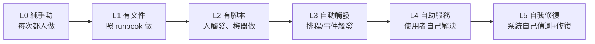

# [sre-6-2] 自動化的層級：從腳本到自我修復

> **本章目標**：理解自動化不是「有或沒有」的二分，而是有層級的——從一次性腳本，一路到「系統自己修自己」，並知道怎麼一步步往上爬。

## 你會學到

- 自動化的幾個層級
- 每一層解決什麼、還剩什麼問題
- 「自我修復系統」是什麼
- 怎麼判斷一個 toil 該自動化到哪一層

## 概念說明

### 自動化是一道光譜，不是開關

新手常以為自動化是「有 vs 沒有」。其實它是**一道層層遞進的光譜**——同一件事，可以自動化到不同程度。理解這些層級，你才知道「現在在哪、下一步往哪走」。



---

### 逐層拆解

**L0：純手動**

每次都靠人從頭做。最原始，完全是 toil。例：每次服務掛了，人去手動重啟。

**L1：有文件（runbook）**

還是人做，但有 Part 4-3 的 runbook 照著走。**進步**：任何人都能做、不易出錯。**還剩的問題**：還是要人花時間做，仍是 toil。

**L2：有腳本（人觸發）**

把步驟寫成腳本（infra Part 6-1），人下一個指令，機器執行整套。**進步**：快、不會手滑。**還剩的問題**：還是要「人記得去觸發」。

**L3：自動觸發**

腳本不靠人觸發，而是由**排程**（infra Part 6-2 的 cron）或**事件**自動跑。例：磁碟用量超標 → 自動觸發清理腳本。**進步**：人完全不用管了。**還剩的問題**：邏輯固定，遇到沒設想的狀況還是要人。

**L4：自助服務（self-service）**

把「需要別人幫忙的事」做成「使用者自己能解決」。例：與其讓 SRE 手動幫人重設密碼，不如做一個「自助密碼重設」功能。**進步**：整類請求的 toil 直接歸零——因為根本不需要 SRE 介入了。

**L5：自我修復（self-healing）**

系統**自己偵測問題、自己修復**，全程不用人。例：某台機器掛了 → 系統自動偵測 → 自動把它換掉、流量導到健康的機器（呼應 infra Part 9-2 的故障轉移、systemd 的自動重啟）。**這是自動化的最高境界**——系統像有免疫系統一樣，自己對抗故障。

---

### 你其實已經見過各層級

別覺得這些很遙遠——你在 infra 課已經實作過好幾層了：

| 層級 | 你在 infra 課做過的 |
|------|-------------------|
| L1 文件 | Part 4-3 的 runbook、Part 8-4 的災難復原計畫 |
| L2 腳本 | Part 6-1 的健康檢查腳本、Part 8-2 的備份腳本 |
| L3 自動觸發 | Part 6-2 的 cron 排程備份、certbot 自動續期 |
| L5 自我修復（局部） | Part 4-2 的 `Restart=always`、Part 9-1 Nginx 自動跳過壞掉的後端 |

所以你不是從零開始——你已經在自動化的階梯上爬了一段。SRE 要做的是**有意識地往更高層推進**。

---

### 該自動化到哪一層？

不是每件事都要做到 L5（那成本太高）。判斷依據：

| 考量 | 往高層推的時機 |
|------|--------------|
| **頻率** | 越常發生的 toil，越值得往高層自動化 |
| **影響** | 越緊急（如半夜會出事），越值得做到 L5 自我修復 |
| **成本** | 做到 L5 很貴，要評估「省下的 toil」值不值得 |

實用原則：**先把高頻、高痛的 toil 從 L0/L1 推到 L2/L3（腳本化、自動觸發），這通常 CP 值最高**。L4 自助服務適合「大量重複的使用者請求」。L5 自我修復留給「最關鍵、最不能等人的故障」。

> 重點是「**持續往上爬**」，而不是「一步到位」。每往上一層，就少一點 toil、多一點可靠。

## 範例：把一個 toil 逐層往上推

```
痛點：服務偶爾會記憶體洩漏，導致變慢，需要重啟才能恢復

L0（現況）：使用者抱怨變慢 → 人手動 SSH 進去重啟
            → 慢、被動、半夜會被叫醒

L1：寫一份 runbook「收到變慢告警時，怎麼重啟」
    → 任何人都能處理，但還是要人做

L2：寫一個重啟腳本，一個指令搞定
    → 快多了，但還是要人觸發

L3：設定「記憶體 > 90% 時自動執行重啟腳本」
    → 不用人了！但這是治標

L5（理想）：用 systemd / 容器編排做到
    「記憶體超標自動重啟，且重啟期間流量導到其他實例」
    → 使用者完全無感，半夜再也不會被叫醒
    （同時，根本解法是去修那個記憶體洩漏的 bug！）
```

注意最後一句——自動化是「止血」，但別忘了也要「治本」（修那個洩漏的 bug）。**最高境界是讓問題根本不發生，而不只是自動處理它。**

## 小練習

### 練習 1：排出層級

不看上面，把自動化的層級從低到高排出來，並各用一句話說明。

<details>
<summary>參考解答</summary>

從低到高共六層：

- **L0 純手動**——每次都靠人從頭做，完全是 toil。
- **L1 有文件（runbook）**——還是人做，但照著寫好的步驟走，任何人都能做、不易出錯。
- **L2 有腳本（人觸發）**——步驟寫成腳本，人下一個指令、機器執行整套，快又不會手滑。
- **L3 自動觸發**——腳本由排程（cron）或事件自動跑，人完全不用管。
- **L4 自助服務**——把「需要別人幫忙的事」做成使用者自己能解決，整類請求的 toil 歸零。
- **L5 自我修復**——系統自己偵測問題、自己修復，全程不用人，是自動化的最高境界。

要記的關鍵是「越往上，人介入越少」：人做（L0/L1）→ 人觸發機器做（L2）→ 機器自己觸發（L3）→ 使用者自助（L4）→ 系統自癒（L5）。

</details>

---

### 練習 2：判斷你做過的屬於哪層

回想 infra 課你做過的自動化（備份腳本、cron、systemd 自動重啟…），各屬於哪個層級？

<details>
<summary>參考解答</summary>

對照本章「你其實已經見過各層級」那張表：

| infra 課做過的 | 層級 | 為什麼 |
|------|:---:|------|
| Part 4-3 的 runbook、Part 8-4 的災難復原計畫 | **L1 文件** | 是照著文件走的人工步驟 |
| Part 6-1 的健康檢查腳本、Part 8-2 的備份腳本（手動執行時）| **L2 腳本** | 寫成腳本，但要人下指令觸發 |
| Part 6-2 的 cron 排程備份、certbot 自動續期 | **L3 自動觸發** | 由 cron/排程自動跑，不用人 |
| Part 4-2 的 `Restart=always`、Part 9-1 Nginx 自動跳過壞掉的後端 | **L5 自我修復（局部）** | 系統自己偵測故障並自動處理 |

觀察重點：**同一個備份腳本，你手動跑它是 L2，掛上 cron 讓它自動跑就變 L3**——層級不是看「有沒有腳本」，而是看「還需不需要人、需要人做到哪一步」。你其實早就爬在自動化的階梯上了。

</details>

---

### 練習 3：往上推一層

挑一個你想像的 toil（例如「每次有新員工就手動開帳號」），設計它從 L0 一路往上推到 L4（自助服務）的路徑。每一層解決了什麼、還剩什麼？

<details>
<summary>參考解答</summary>

以「每次有新員工就手動開帳號」為例，逐層往上推：

```
L0 純手動（現況）：
    HR 通知 SRE → SRE 手動在各系統一個一個開帳號、設權限
    → 慢、容易漏系統、容易設錯權限，且隨招人數線性成長（最危險）

L1 有文件：
    寫一份 runbook「新人入職要在哪 8 個系統開帳號、各設什麼權限」
    → 解決：任何人照著做都不會漏、不易出錯
    → 還剩：還是要人一步步手動做，一樣花時間

L2 有腳本（人觸發）：
    寫一個腳本，輸入員工資料 → 自動在 8 個系統開好帳號、設好權限
    → 解決：快、不會手滑、權限一致
    → 還剩：還是要「SRE 記得去執行這個腳本」

L3 自動觸發：
    HR 系統新增員工這個「事件」自動觸發開帳號腳本
    → 解決：SRE 完全不用管了，新人一入職帳號就自動開好
    → 還剩：邏輯固定，遇到特殊職位/特殊權限需求還是要人處理

L4 自助服務：
    做一個表單，HR 自己填員工資料與角色 → 系統自動開好一切
    → 解決：這整類請求的 toil 對 SRE 歸零，HR 自助完成，
      SRE 根本不用介入
```

重點是**每往上一層，人的介入就少一點、toil 就少一點**。不一定每件事都要推到 L5 自我修復（開帳號也不需要），推到 L4 自助服務，這類 toil 就已經對 SRE 歸零了——選「剛好夠用」的層級即可。

</details>

## 課外讀物

> 自動化的實作工具（腳本、cron、systemd、Ansible）在 infra 課有完整動手做 → 參見 **infra 課程** Part 6（`lessons/infra/課程大綱.md`）
