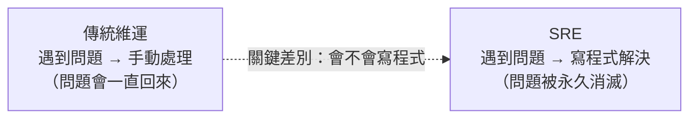

# [sre-6-3] 為什麼 SRE 一定要會寫程式

> **本章目標**：理解「把維運當成軟體工程來做」這句話的真正含義，以及為什麼「會寫程式」是 SRE 和傳統維運最根本的分野。

## 你會學到

- 「維運即軟體工程」是什麼意思
- 為什麼會寫程式是 SRE 的核心能力
- SRE 寫的程式都是些什麼
- 「把基礎設施當成軟體產品」的思維

## 概念說明

### 回到 SRE 的起點

還記得 Part 1-1 嗎？SRE 誕生於一個問題：「**如果讓軟體工程師來做維運會怎樣？**」答案是——他會用**寫程式**的方式解決問題，而不是手動硬撐。

這一章把這個核心講透：**「會寫程式」不是 SRE 的加分項，而是它的根本。** 這是 SRE 和傳統維運最根本的分野。



---

### 「維運即軟體工程」是什麼意思

SRE 有個核心主張：

> **把「維運」這件事，當成一個「軟體工程問題」來解決。**

意思是——當你面對一個維運挑戰（系統會掛、要擴容、要部署、要監控），你不是問「我要怎麼手動做這件事」，而是問「**我要寫什麼程式，讓這件事自動發生**」。

這個思維轉換，呼應了你整個 Part 6 學的：

- 看到 toil（6-1）→ 寫程式消滅它
- 往自動化的高層爬（6-2）→ 靠的就是寫程式
- 事故的行動項目（5-5）→ 很多是「寫個機制防止再發生」

**沒有寫程式的能力，這一切都做不到。** 你只能停在「手動處理」的傳統維運層次。

---

### SRE 都寫些什麼程式？

SRE 寫的程式，和應用開發者不太一樣——它們是「**讓系統可靠、讓維運自動**」的程式：

| 類型 | 例子 |
|------|------|
| **自動化腳本與工具** | 部署、備份、清理、批次操作（infra Part 6）|
| **基礎設施即代碼** | Ansible、Terraform——把基礎設施寫成程式（infra Part 6、9）|
| **監控與告警** | 自訂的監控邏輯、告警規則、儀表板（Part 3、4）|
| **自我修復機制** | 偵測故障並自動處理的程式（6-2 的 L5）|
| **內部平台與工具** | 給開發團隊用的自助服務工具（6-2 的 L4）|

注意這些的共通點——它們都是為了「**讓系統運轉得更可靠、更自動**」，而不是「實作給使用者的功能」。SRE 是用軟體工程的能力，去解決基礎設施的問題。

---

### 「把基礎設施當成軟體產品」

更高階的思維：頂尖的 SRE 團隊，會**把「基礎設施 / 維運平台」當成一個軟體產品來經營**。

什麼意思？他們服務的「使用者」是**公司內部的開發者**。他們做的「產品」是讓開發者能輕鬆部署、監控、擴展的**平台與工具**。他們像產品團隊一樣，關心：

- 開發者用我們的工具順不順？（使用者體驗）
- 怎麼讓部署這件事變得自助、不用來找我們？（6-2 的 L4 自助服務）
- 我們的工具夠不夠可靠？（連工具本身都要 SLO）

這就是現在很紅的「**平台工程（Platform Engineering）**」的精神——SRE 能力的一種延伸。它把「維運」從「幫人擦屁股」提升為「打造讓大家自助的優質平台」。

---

### 這對你的學習意味著什麼

好消息是——**你已經在學寫程式了**（basic 課程、各種腳本）。SRE 不要求你成為頂尖的演算法高手，而是要你能：

- 寫腳本把重複工作自動化（你在 infra Part 6 做過）
- 用 IaC 把基礎設施寫成程式（infra Part 6、9）
- 看懂、修改、整合各種工具
- 用程式的思維看待維運問題

所以你的路線很清楚：**basic 打好程式基礎 → infra 學會把它用在基礎設施 → SRE 用這個能力去經營可靠性。** 三者環環相扣。

## 範例：同一個問題，會不會寫程式的差別

```
問題：公司每招一個新員工，就要在 8 個系統裡開帳號、設權限

不會寫程式的維運：
  每來一個新人，手動在 8 個系統一個一個開
  → 一次 30 分鐘、容易漏、容易設錯權限
  → 公司成長 → 招人變多 → 這個 toil 線性暴增（6-1 最危險的特徵）

會寫程式的 SRE：
  寫一個工具：輸入新員工資料 → 自動在 8 個系統開好帳號、設好權限
  → 更進一步，做成自助：HR 自己在表單填一下就完成（6-2 的 L4）
  → 公司再怎麼成長，這個 toil 都是「零」
```

同一個問題，會寫程式的人把它**永久消滅**，不會的人則被它**永遠纏住、還越纏越緊**。這就是為什麼「會寫程式」是 SRE 不可妥協的核心能力。

## 小練習

### 練習 1：根本分野

用自己的話回答：為什麼說「會不會寫程式」是 SRE 和傳統維運最根本的差別？

---

### 練習 2：SRE 寫的程式

回答：SRE 寫的程式，和應用開發者寫的程式，目的上有什麼不同？舉兩個 SRE 會寫的程式類型。

---

### 練習 3：理解平台工程思維

「把基礎設施當成軟體產品」——如果 SRE 團隊的「使用者」是公司內部的開發者，那他們該關心哪些事？（提示：想想產品團隊關心什麼，套用到「給開發者的工具」上。）

## 課外讀物

> SRE 寫的程式同樣要遵守良好的工程實踐（命名、結構、版本控制）→ [課外讀物 E-8-7：Git Flow 與 GitHub Flow](../../../課外讀物/E-8-git/E-8-7-git-flow.md)
