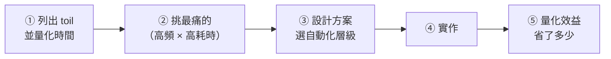

# [sre-6-4] 🔧 動手做：找出一個 toil 並自動化掉

> **本章目標**：走完一次「辨認 toil → 量化 → 設計自動化 → 實作 → 驗證效益」的完整流程，把 Part 6 的觀念變成實際的 toil 消滅行動。

## 你會學到

- 系統化地找出最值得自動化的 toil
- 設計自動化方案、選對自動化層級
- 實作一個消滅 toil 的工具/腳本
- 量化「自動化省下了多少」

## 概念說明

### 這一章在做什麼

Part 6-1~6-3 建立了觀念，這一章你要當一次「toil 殺手」——挑一個 toil，把它真的消滅掉，並算出省了多少。流程：



> 實作部分會用到 infra 課的腳本/cron 技能，在 WSL 或你的伺服器上練都可以。

## 範例：完整走一遍

我們用一個常見的 toil 來示範：**「每天要手動檢查幾個服務的健康狀態，並把結果回報到團隊群組」**。

### 第一步：列出並量化 toil（6-1）

```
盤點我這週的 toil：
  每天手動檢查服務健康並回報    → 每天 20 分鐘 × 5 = 100 分鐘/週
  手動清理測試資料             → 每週 30 分鐘
  手動處理某類重複請求          → 每週 60 分鐘
```

### 第二步：挑最痛的

「每天檢查服務健康」最值得做——因為它**每天都要做（高頻）**、而且**完全是機械性動作（可自動化）**。這正是 6-1 說的「高頻 toil」，CP 值最高。

### 第三步：設計方案，選層級（6-2）

```
現況：L0（純手動，每天人去看）
目標：L3（自動觸發——排程自動檢查 + 自動回報）

設計：
  寫一個腳本，自動檢查各服務健康、把結果格式化，
  用 cron 每天定時跑、自動把結果送到團隊群組
```

選 L3 而非更高的 L5，是因為「每日健康回報」這件事，自動排程就解決了，不需要做到自我修復那麼複雜。**選對層級——剛好夠用，不過度工程。**

### 第四步：實作

寫一個健康檢查 + 回報腳本（延伸 infra Part 6-1 的健康檢查腳本）：

```bash
#!/bin/bash
# health-report.sh — 自動檢查服務健康並回報
set -e

SERVICES=("nginx" "myapp" "postgres")
REPORT="📊 每日健康報告 $(date '+%Y-%m-%d %H:%M')\n"

for svc in "${SERVICES[@]}"; do
  if systemctl is-active --quiet "$svc"; then
    REPORT="$REPORT\n✅ $svc 正常"
  else
    REPORT="$REPORT\n⚠️ $svc 異常！"
  fi
done

# 把報告送到團隊群組（用 webhook，概念示意）
curl -s -X POST "$SLACK_WEBHOOK_URL" \
  -H "Content-Type: application/json" \
  -d "{\"text\": \"$REPORT\"}"
```

這個腳本把「人去看每個服務 + 打字回報」整套自動化了。用 cron 每天定時跑（infra Part 6-2）：

```bash
# crontab -e，每天早上 9 點自動執行
0 9 * * * /home/deploy/health-report.sh >> /home/deploy/logs/health-report.log 2>&1
```

### 第五步：量化效益（6-1 的「衡量」精神）

```
自動化前：每天 20 分鐘 × 22 工作日 = 440 分鐘/月（約 7.3 小時）
自動化後：0 分鐘（腳本自己做）

投入成本：寫腳本 + 設定 ≈ 2 小時（一次性）

回本時間：2 小時 ÷ 7.3 小時/月 ≈ 不到一個月就回本
之後每個月淨省 7.3 小時，永久受益
```

**這就是消滅 toil 的威力**——一次性投入 2 小時，換來「每個月省 7 小時、且這個 toil 永遠消失」。而且省下的時間，可以拿去自動化下一個 toil，形成正向循環。

---

### 別忘了：自動化本身也要可靠

一個小提醒——你寫的自動化，本身也是要維護的程式。確保它：

- **失敗時會通知你**（別讓它默默掛掉，結果你以為有在檢查、其實沒有）
- **有記錄日誌**（出問題能查，infra Part 6-2 的 `>> log 2>&1`）
- **進版本控制**（Git 管起來，6-3 的工程實踐）

否則你只是把「做 toil 的負擔」換成「維護壞掉的自動化的負擔」。

## 小練習

### 練習 1：找出你的 toil

列出你（或你想像的維運工作）的 toil，估計各佔多少時間。挑出「最值得自動化」的一個——通常是「高頻 × 高耗時 × 純機械」的那個。

---

### 練習 2：設計自動化方案

針對你挑的 toil：

1. 它現在在哪個自動化層級（L0~L5）？
2. 你想把它推到哪一層？為什麼是那一層（剛好夠用）？
3. 大概要寫什麼樣的程式/腳本？

---

### 練習 3：實作並量化

如果可行，實際寫出那個自動化（哪怕簡化版），並算出：投入多少時間做、每月省多少時間、多久回本。

> 你完成了 SRE 的「主動面」——不只被動處理事故，而是主動消滅問題。接下來 Part 7、8 進入「為失敗而設計」：怎麼讓系統在容量、效能、故障面前都站得住。

## 課外讀物

> 這章的腳本與 cron 自動化，技能來自 infra 課 → 參見 **infra 課程** Part 6-1、6-2（`lessons/infra/課程大綱.md`）
