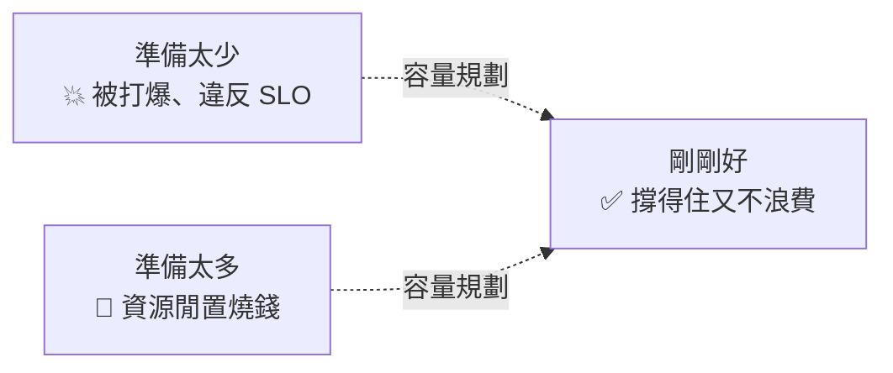

# [sre-7-1] 容量規劃：要準備多少資源才剛剛好

> **本章目標**：理解容量規劃在做什麼，學會用「需求預測 + 安全邊際」來準備資源，避免「被流量打爆」和「資源閒置浪費」這兩個極端。

## 你會學到

- 容量規劃（Capacity Planning）是什麼、為什麼重要
- 「被打爆」和「過度配置」兩種失敗
- 容量規劃的基本步驟
- 為什麼要留「安全邊際（headroom）」

## 概念說明

### 一個兩難：準備多少資源？

你的服務需要多少機器、多少資源？這個問題有兩個糟糕的答案：

- **準備太少** → 流量一來就被打爆，服務變慢甚至掛掉（違反 SLO）。
- **準備太多** → 大部分時間資源閒置，**白白燒錢**。

**容量規劃（Capacity Planning）** 就是回答「**準備多少才剛剛好**」——足以應付需求、又不浪費錢。這呼應了 SRE「擁抱風險、剛剛好」的精神（Part 1-3）——不是越多越安全，而是要找到平衡點。



---

### 容量規劃的基本步驟

**① 了解現況**

先知道「現在的系統，能扛多少」。這要靠 Part 3 的監控數據——目前的流量（黃金訊號的「流量」）、資源使用率（「飽和度」）。沒有監控數據，容量規劃就是瞎猜。

**② 預測未來需求**

未來流量會長多少？依據：

- **自然成長**：使用者數的成長趨勢（看歷史數據外推）。
- **可預期的尖峰**：行銷活動、雙 11、跨年——這些「已知會爆」的時刻。
- **季節性**：例如電商旺季、串流平台的晚間尖峰。

**③ 換算成資源需求**

把「預測的需求」換算成「需要多少資源」。例如：「現在 1000 RPS 用 5 台機器，預測尖峰會到 3000 RPS」→ 大約需要 15 台（再加安全邊際）。

**④ 留安全邊際（headroom）**

這是關鍵——**不要把資源配到剛好等於預測值，要留緩衝**。下面詳述。

---

### 為什麼要留「安全邊際」

新手會想：「我預測尖峰 3000 RPS，那我準備能扛 3000 的資源就好啦？」**不行。** 你要準備能扛**更多**的資源，留一段「安全邊際（headroom）」。

理由：

1. **預測會失準**：實際流量可能比預測高（行銷比預期成功、突發爆紅）。
2. **要容許故障**：如果你 15 台機器剛好扛滿 3000 RPS，那**掛掉一台**，剩下的就扛不住、雪崩。要留餘裕，讓「掛幾台也還撐得住」（呼應 infra Part 9-2 的冗餘）。
3. **資源不是瞬間能加的**：就算用雲端自動擴容，也需要時間。沒有緩衝，等你擴容完，使用者已經受影響了。

用類比：一座橋的載重標示「上限 10 噸」，但它**實際能承受遠超過 10 噸**——這個差距就是安全邊際，為了應付突發超載、材料老化、計算誤差。系統也一樣，要留餘裕應付意外。

常見的做法是讓平常的資源使用率**維持在某個水位以下**（例如 CPU 平均不超過 60-70%），剩下的就是你的安全邊際。

---

### 兩種容量策略：預先配置 vs 自動擴縮

準備資源有兩種思路：

| 策略 | 做法 | 適合 |
|------|------|------|
| **預先配置** | 事先準備好足夠的固定資源 | 流量穩定可預測；或自架環境 |
| **自動擴縮（auto-scaling）** | 依即時負載自動增減資源 | 流量起伏大；雲端環境 |

雲端時代，**自動擴縮**越來越主流——平常用少少資源省錢，流量來了自動加、退了自動減。這是 Part 7-3 和 AWS 課程的重點。但即使有自動擴縮，**容量規劃還是必要的**——你得設定「最多擴到幾台」（避免暴衝爆帳）、「擴容速度夠不夠快」，這些都要規劃。

## 範例：一次容量規劃

```
情境：電商網站，下個月有雙 11 大促

① 了解現況（看 Part 3 監控數據）：
   平日尖峰約 2,000 RPS，用 10 台機器，CPU 約 50%

② 預測需求：
   - 去年雙 11 流量是平日的 8 倍 → 預估約 16,000 RPS
   - 今年使用者成長了 30% → 再上修到約 21,000 RPS

③ 換算資源：
   現在 10 台扛 2,000 RPS（CPU 50%）
   → 扛 21,000 RPS 約需 100 台（線性外推）

④ 留安全邊際：
   - 預測可能失準 + 要容許故障 → 多備 30%
   → 準備 130 台的擴容上限
   - 設定自動擴縮，平日維持少量，接近活動時提前擴容
   - 設定「最多 130 台」的上限，避免異常流量把帳單打爆

⑤ 活動前演練：
   用 Part 7-2 的負載測試，驗證「130 台真的扛得住 21,000 RPS」
   （別等雙 11 當天才發現估錯！）
```

注意最後一步——**規劃完要驗證**，這就是下一章「負載測試」的主題。光紙上計算不夠，要實際壓測確認。

## 小練習

### 練習 1：兩種失敗

回答：容量規劃要避免哪兩種極端的失敗？各會造成什麼後果？

---

### 練習 2：為什麼要安全邊際

用「橋的載重」類比，解釋為什麼資源不能「配到剛好等於預測值」。至少給兩個要留緩衝的理由。

---

### 練習 3：做一次簡單規劃

某 API 現在用 4 台機器扛尖峰 800 RPS（CPU 約 50%）。預估三個月後尖峰會到 2,400 RPS。

1. 大約需要幾台機器（線性外推）？
2. 加上 25% 安全邊際後是幾台？
3. 你會用「預先配置」還是「自動擴縮」？為什麼？

## 課外讀物

> 容量規劃和「規模化架構」息息相關，想了解大型系統怎麼擴展 → [課外讀物 E-13-4：Monolith vs Microservices](../../../課外讀物/E-13-scaling/E-13-4-monolith-vs-microservices.md)
