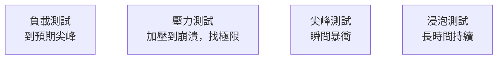

# [sre-7-2] 負載測試：在使用者之前先把系統壓爆

> **本章目標**：理解負載測試的目的與類型，學會用「主動壓測」找出系統的極限與瓶頸，而不是等真實流量來幫你發現問題。

## 你會學到

- 負載測試（Load Testing）是什麼、為什麼要做
- 幾種測試類型：負載測試、壓力測試、尖峰測試、浸泡測試
- 怎麼設計一次負載測試
- 從結果讀出系統的「天花板」與瓶頸

## 概念說明

### 核心思想：自己先把系統壓爆

容量規劃（7-1）算出「應該要能扛 21,000 RPS」。但這是**紙上計算**——系統實際扛不扛得住？你有兩種方式知道：

1. **等雙 11 當天，讓真實使用者幫你測**——如果估錯，就是大事故。
2. **自己先模擬大量流量壓測**——在安全的環境發現問題，從容修正。

SRE 當然選第二種。**負載測試（Load Testing）** 就是「**用工具模擬大量使用者，主動把流量灌進系統，看它表現如何、在哪裡先撐不住**」。

用類比：負載測試像**橋樑啟用前的載重測試**——工程師會開一堆卡車上去壓，確認它真的能承重，而不是等通車後讓真實車流來「測試」。沒有人會拿真實使用者的命去賭。

---

### 幾種測試類型

「負載測試」其實是一類測試的統稱，依目的分幾種：

| 類型 | 做什麼 | 回答什麼問題 |
|------|--------|------------|
| **負載測試（Load）** | 灌到「預期的尖峰流量」 | 「正常尖峰扛得住嗎？」 |
| **壓力測試（Stress）** | 一直加壓直到系統崩潰 | 「極限在哪？崩潰時怎麼崩？」 |
| **尖峰測試（Spike）** | 流量瞬間暴衝 | 「突然爆量（如秒殺）撐得住嗎？」 |
| **浸泡測試（Soak）** | 中等流量持續很久 | 「長時間跑會不會記憶體洩漏、慢慢累死？」 |



**壓力測試**特別重要——它告訴你「系統的天花板在哪、以及它崩潰時是『優雅地慢下來』還是『瞬間整個爆掉』」。後者很危險（Part 8 會講怎麼讓系統「優雅降級」而非雪崩）。

**浸泡測試**也常被忽略但很關鍵——有些問題（記憶體洩漏、連線沒釋放）只有「跑很久」才會浮現，短時間測不出來（呼應 Part 6-2 那個記憶體洩漏的例子）。

---

### 怎麼設計一次負載測試

**① 定義目標**：你想驗證什麼？「能扛 21,000 RPS 嗎」還是「找出極限」？

**② 選工具**：常用的有 `k6`、`Apache JMeter`、`Locust`、`wrk` 等。它們能模擬大量虛擬使用者、發送請求、收集結果。

**③ 設計真實的測試情境**：別只打一個 API。要模擬**真實使用者行為**——例如「登入 → 瀏覽 → 加購物車 → 結帳」的完整流程。不真實的測試會給你假的信心。

**④ 在「像正式環境」的地方測**：在和正式環境規格相近的測試環境測，結果才有參考價值。

**⑤ 邊測邊看監控**：壓測時盯著 Part 3 的監控——延遲、錯誤率怎麼變？哪個資源（CPU/記憶體/資料庫）先飽和？這能直接定位瓶頸。

> ⚠️ **千萬別對正式環境亂壓測**，尤其是會影響真實使用者的時候。要測正式環境得非常小心、選離峰、且有控制。

---

### 從結果讀出「天花板」與瓶頸

負載測試最有價值的產出，是找到**天花板**和**瓶頸**：

- **天花板**：流量加到多少時，系統開始撐不住（延遲飆高、錯誤出現）？這個數字直接驗證/修正你的容量規劃。
- **瓶頸**：撐不住時，是**哪個資源**先到極限？這就是你要優化或擴充的地方。

關鍵觀察「**崩潰的方式**」：

```
健康的系統：流量超過極限時，延遲逐漸變高、優雅地拒絕部分請求
            （Part 8 的「優雅降級」）
危險的系統：流量超過極限的瞬間，整個雪崩、全部請求都失敗
            → 這種要趕快修，加上保護機制（Part 8 的限流、斷路器）
```

## 範例：一次負載測試與發現

```
目標：驗證「結帳服務能扛雙 11 預估的 5,000 RPS」

用 k6 設計測試情境（模擬真實流程）：
  虛擬使用者：登入 → 瀏覽商品 → 加購物車 → 結帳
  逐步加壓：1,000 → 3,000 → 5,000 → 7,000 RPS

邊測邊看監控（Part 3），結果：
  1,000 RPS：延遲 p95 = 150ms ✅ 一切正常
  3,000 RPS：延遲 p95 = 280ms ✅ 還行
  5,000 RPS：延遲 p95 = 1,200ms ⚠️ 開始變慢！
             → 看監控：資料庫 CPU 已達 95%（瓶頸找到了！）
  7,000 RPS：錯誤率飆到 30% 💥 系統開始崩

發現：
  - 天花板：約在 5,000 RPS 開始劣化（剛好踩到雙 11 預估值，危險！）
  - 瓶頸：資料庫 CPU（不是應用伺服器）
  
行動：
  - 光加應用伺服器沒用（瓶頸在資料庫）→ 要優化資料庫或加讀取副本
  - 在達到天花板前，加上「優雅降級」保護（Part 8）
  
→ 在雙 11 之前就發現並修正了，而不是當天爆炸才知道
```

注意這個發現的價值——**如果沒測，雙 11 當天才會發現「加了一堆應用伺服器卻沒用，因為瓶頸在資料庫」**。負載測試讓你提前看到真相、找對要優化的地方。

## 小練習

### 練習 1：為什麼要主動壓測

用「橋樑載重測試」的類比，解釋為什麼要「自己先把系統壓爆」，而不是等真實流量。

---

### 練習 2：配對測試類型

下面的問題，該用哪種測試（負載/壓力/尖峰/浸泡）？

1. 「我們的系統極限到底在哪？」
2. 「秒殺活動開始那一瞬間的暴衝撐得住嗎？」
3. 「連續跑一週會不會有記憶體洩漏？」
4. 「預估的雙 11 尖峰扛得住嗎？」

---

### 練習 3：讀懂測試結果

某負載測試發現：流量加到 4,000 RPS 時延遲開始飆高，此時監控顯示「應用伺服器 CPU 只有 40%，但資料庫 CPU 達 98%」。

1. 瓶頸在哪？
2. 「再多加幾台應用伺服器」能解決問題嗎？為什麼？
3. 你會往哪個方向優化？

## 課外讀物

> 負載測試常發現「快取能大幅降低後端壓力」，這是效能優化的關鍵手段 → [課外讀物 E-11-3：Redis 與快取策略](../../../課外讀物/E-11-performance/E-11-3-redis-cache.md)
