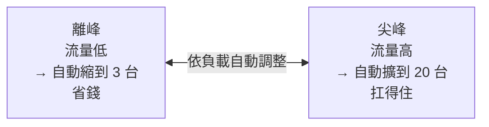

# [sre-7-3] 擴展策略：垂直、水平與自動擴縮

> **本章目標**：複習垂直/水平擴展（infra Part 9），並從 SRE 的角度理解「自動擴縮」如何服務於可靠性與成本目標。

## 你會學到

- 垂直擴展 vs 水平擴展（從 SRE 視角複習）
- 自動擴縮（auto-scaling）怎麼運作
- 擴縮的指標該選什麼
- 為什麼「能擴展」是可靠性的基礎

## 概念說明

### 複習：兩種擴展（infra Part 9-1）

擴展（scaling）就是「讓系統能處理更多負載」。infra Part 9-1 學過兩種，這裡快速複習並接到 SRE 的角度：

| | 垂直擴展（Scale Up） | 水平擴展（Scale Out） |
|---|---------------------|----------------------|
| 做法 | 把單台機器升級得更強 | 加開更多台機器 |
| 比喻 | 小貨車換大卡車 | 多派幾台貨車 |
| 上限 | 有硬體天花板 | 理論上無限 |
| 對可靠性 | 還是單台（單點故障）| 多台，天然有冗餘 |

**SRE 偏好水平擴展**，因為它不只能擴容，還**天然帶來冗餘**（Part 8-3）——多台機器，掛一台還有別台。這同時服務了「容量」和「可靠性」兩個目標。但水平擴展的前提是應用要設計成「**無狀態（stateless）**」——任何一台都能處理任何請求，這樣才能自由增減。

---

### 自動擴縮（Auto-scaling）

容量規劃（7-1）的難題是：流量是**波動**的。白天高、半夜低；平日低、活動高。如果你按「最高尖峰」配置固定資源，那離峰時段就大量浪費（燒錢）。

**自動擴縮（Auto-scaling）** 解決這個——**依即時負載，自動增減資源**：



它的好處完美對應 SRE 目標：

- **可靠性**：流量來了自動加機器，不會被打爆（守住 SLO）。
- **成本**：流量退了自動減機器，不浪費（呼應 Part 1-3「剛剛好」）。

這就是雲端最迷人的能力之一（AWS 課程 Part 3 Auto Scaling 會深入）。

---

### 自動擴縮依什麼指標？

自動擴縮要設定「**依據什麼來決定加減機器**」。常見指標：

| 指標 | 適合 |
|------|------|
| **CPU 使用率** | 最常見（如「平均 CPU > 70% 就加機器」） |
| **記憶體使用率** | 吃記憶體的服務 |
| **每秒請求數（RPS）** | 流量驅動的服務 |
| **佇列長度** | 處理背景任務的 worker |
| **自訂指標** | 例如「每個機器處理的連線數」 |

選指標的關鍵：**選一個「真正反映負載」的指標**。最好和你的瓶頸對齊——如果你的瓶頸是 CPU，就依 CPU 擴縮；如果是別的，依 CPU 擴縮可能沒用（呼應 7-2 找瓶頸）。

---

### 自動擴縮的陷阱

自動擴縮很強，但有幾個 SRE 要注意的陷阱：

**① 擴容需要時間**：開一台新機器、啟動服務要時間（幾十秒到幾分鐘）。如果流量暴衝得比擴容快，還是會短暫扛不住。所以要：**提前擴容**（預測性）、或**留安全邊際**（7-1）撐過擴容的空窗。

**② 要設上限（避免爆帳）**：一定要設「最多擴到幾台」。否則遇到異常流量（或被攻擊），它可能瘋狂擴容，給你一張天價帳單。這是 7-1 提過的重點。

**③ 縮容要保守**：縮太快可能「剛縮完流量又來、又得擴」，來回震盪。通常縮容會設得比擴容慢、保守一點。

**④ 別擴縮到下游崩潰**：你的應用層自動擴到 50 台，結果全部去打同一個資料庫，把資料庫打爆了——擴錯了地方。要確認「擴展的是真正的瓶頸」，且下游撐得住（呼應 7-2 找對瓶頸）。

---

### 為什麼「能擴展」是可靠性的基礎

把這章接回可靠性：**一個無法擴展的系統，註定會在某個流量點崩潰、違反 SLO。** 能擴展（尤其自動擴縮），意味著：

- 面對成長和尖峰，系統能跟上，守住 SLO。
- 面對故障，水平擴展的冗餘讓「掛幾台」不致命（Part 8-3）。
- 面對成本壓力，自動縮容讓你不浪費。

所以「擴展能力」不只是「能扛更多」，它是**系統可靠性與成本效率的共同基礎**。這就是為什麼 SRE 這麼重視它。

## 範例：設計一個自動擴縮策略

```
服務：一個 API，流量白天高、半夜低，偶有活動尖峰

策略設計：
  擴縮依據：平均 CPU 使用率
  規則：
    - CPU > 70% 持續 3 分鐘 → 加機器
    - CPU < 30% 持續 10 分鐘 → 減機器（縮容較保守）
  邊界：
    - 最少 3 台（保證基本冗餘，半夜也不低於 3，Part 8-3）
    - 最多 30 台（避免異常流量爆帳，7-1 的上限）
  安全邊際：
    - 用 70%（而非 90%）當擴容門檻 → 留時間給擴容完成（本章陷阱①）

驗證：
  用 Part 7-2 負載測試，確認「擴容速度跟得上流量上升」
  且「30 台真的扛得住目標尖峰，資料庫等下游也撐得住」
```

注意這個設計怎麼綜合了前面所學：最少台數保冗餘（Part 8）、最多台數防爆帳（7-1）、70% 門檻留安全邊際（7-1）、用負載測試驗證（7-2）。這就是 SRE 把各種考量整合成一個務實策略。

## 小練習

### 練習 1：為什麼 SRE 偏好水平擴展

回答：從「可靠性」的角度，為什麼水平擴展比垂直擴展更受 SRE 青睞？

---

### 練習 2：自動擴縮的兩個必要邊界

回答：設定自動擴縮時，為什麼一定要設「最少台數」和「最多台數」？各防範什麼問題？

---

### 練習 3：診斷一個擴縮問題

某團隊設了「CPU > 80% 自動擴容」，但流量暴衝時系統還是掛了。

1. 可能的原因之一是「擴容來不及」——怎麼改善？
2. 如果監控顯示「應用 CPU 不高，但資料庫被打爆」，問題出在哪？自動擴應用層有用嗎？

## 課外讀物

> 自動擴縮在雲端的實作（AWS Auto Scaling），是 AWS 課程的主題 → 參見 **AWS 課程** Part 3（`lessons/aws/課程大綱.md`）；想複習擴展概念 → 參見 **infra 課程** Part 9-1
