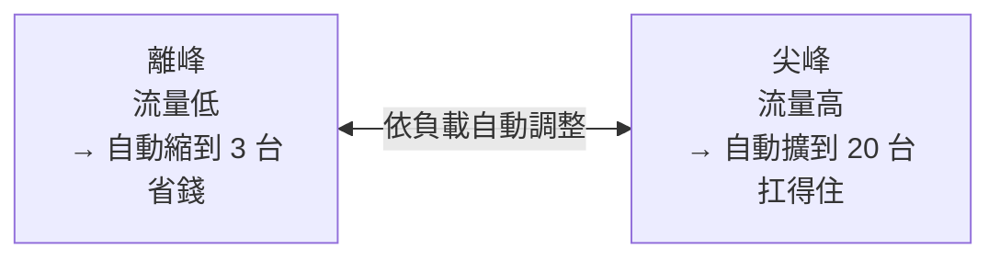

# [sre-7-3] 擴展策略：垂直、水平與自動擴縮

> **本章目標**：複習垂直/水平擴展（infra Part 9），並從 SRE 的角度理解「自動擴縮」如何服務於可靠性與成本目標。

## 你會學到

- 垂直擴展 vs 水平擴展（從 SRE 視角複習）
- 自動擴縮（auto-scaling）怎麼運作
- 擴縮的指標該選什麼
- 為什麼「能擴展」是可靠性的基礎

## 概念說明

### 複習：兩種擴展（infra Part 9-1）

擴展（scaling）就是「讓系統能處理更多負載」。infra Part 9-1 學過兩種，這裡快速複習並接到 SRE 的角度：

| | 垂直擴展（Scale Up） | 水平擴展（Scale Out） |
|---|---------------------|----------------------|
| 做法 | 把單台機器升級得更強 | 加開更多台機器 |
| 比喻 | 小貨車換大卡車 | 多派幾台貨車 |
| 上限 | 有硬體天花板 | 理論上無限 |
| 對可靠性 | 還是單台（單點故障）| 多台，天然有冗餘 |

**SRE 偏好水平擴展**，因為它不只能擴容，還**天然帶來冗餘**（Part 8-3）——多台機器，掛一台還有別台。這同時服務了「容量」和「可靠性」兩個目標。但水平擴展的前提是應用要設計成「**無狀態（stateless）**」——任何一台都能處理任何請求，這樣才能自由增減。

---

### 自動擴縮（Auto-scaling）

容量規劃（7-1）的難題是：流量是**波動**的。白天高、半夜低；平日低、活動高。如果你按「最高尖峰」配置固定資源，那離峰時段就大量浪費（燒錢）。

**自動擴縮（Auto-scaling）** 解決這個——**依即時負載，自動增減資源**：


```mermaid
graph LR
    LOW["離峰<br/>流量低<br/>→ 自動縮到 3 台<br/>省錢"]
    PEAK["尖峰<br/>流量高<br/>→ 自動擴到 20 台<br/>扛得住"]
    LOW <-->|"依負載自動調整"| PEAK
```

它的好處完美對應 SRE 目標：

- **可靠性**：流量來了自動加機器，不會被打爆（守住 SLO）。
- **成本**：流量退了自動減機器，不浪費（呼應 Part 1-3「剛剛好」）。

這就是雲端最迷人的能力之一（AWS 課程 Part 3 Auto Scaling 會深入）。

---

### 自動擴縮依什麼指標？

自動擴縮要設定「**依據什麼來決定加減機器**」。常見指標：

| 指標 | 適合 |
|------|------|
| **CPU 使用率** | 最常見（如「平均 CPU > 70% 就加機器」） |
| **記憶體使用率** | 吃記憶體的服務 |
| **每秒請求數（RPS）** | 流量驅動的服務 |
| **佇列長度** | 處理背景任務的 worker |
| **自訂指標** | 例如「每個機器處理的連線數」 |

選指標的關鍵：**選一個「真正反映負載」的指標**。最好和你的瓶頸對齊——如果你的瓶頸是 CPU，就依 CPU 擴縮；如果是別的，依 CPU 擴縮可能沒用（呼應 7-2 找瓶頸）。

---

### 自動擴縮的陷阱

自動擴縮很強，但有幾個 SRE 要注意的陷阱：

**① 擴容需要時間**：開一台新機器、啟動服務要時間（幾十秒到幾分鐘）。如果流量暴衝得比擴容快，還是會短暫扛不住。所以要：**提前擴容**（預測性）、或**留安全邊際**（7-1）撐過擴容的空窗。

**② 要設上限（避免爆帳）**：一定要設「最多擴到幾台」。否則遇到異常流量（或被攻擊），它可能瘋狂擴容，給你一張天價帳單。這是 7-1 提過的重點。

**③ 縮容要保守**：縮太快可能「剛縮完流量又來、又得擴」，來回震盪。通常縮容會設得比擴容慢、保守一點。

**④ 別擴縮到下游崩潰**：你的應用層自動擴到 50 台，結果全部去打同一個資料庫，把資料庫打爆了——擴錯了地方。要確認「擴展的是真正的瓶頸」，且下游撐得住（呼應 7-2 找對瓶頸）。

---

### 為什麼「能擴展」是可靠性的基礎

把這章接回可靠性：**一個無法擴展的系統，註定會在某個流量點崩潰、違反 SLO。** 能擴展（尤其自動擴縮），意味著：

- 面對成長和尖峰，系統能跟上，守住 SLO。
- 面對故障，水平擴展的冗餘讓「掛幾台」不致命（Part 8-3）。
- 面對成本壓力，自動縮容讓你不浪費。

所以「擴展能力」不只是「能扛更多」，它是**系統可靠性與成本效率的共同基礎**。這就是為什麼 SRE 這麼重視它。

## 範例：設計一個自動擴縮策略

```
服務：一個 API，流量白天高、半夜低，偶有活動尖峰

策略設計：
  擴縮依據：平均 CPU 使用率
  規則：
    - CPU > 70% 持續 3 分鐘 → 加機器
    - CPU < 30% 持續 10 分鐘 → 減機器（縮容較保守）
  邊界：
    - 最少 3 台（保證基本冗餘，半夜也不低於 3，Part 8-3）
    - 最多 30 台（避免異常流量爆帳，7-1 的上限）
  安全邊際：
    - 用 70%（而非 90%）當擴容門檻 → 留時間給擴容完成（本章陷阱①）

驗證：
  用 Part 7-2 負載測試，確認「擴容速度跟得上流量上升」
  且「30 台真的扛得住目標尖峰，資料庫等下游也撐得住」
```

注意這個設計怎麼綜合了前面所學：最少台數保冗餘（Part 8）、最多台數防爆帳（7-1）、70% 門檻留安全邊際（7-1）、用負載測試驗證（7-2）。這就是 SRE 把各種考量整合成一個務實策略。

## 小練習

### 練習 1：為什麼 SRE 偏好水平擴展

回答：從「可靠性」的角度，為什麼水平擴展比垂直擴展更受 SRE 青睞？

<details>
<summary>參考解答</summary>

關鍵在於**冗餘（redundancy）**。

- **垂直擴展（Scale Up）** 是把單台機器升級得更強（小貨車換大卡車）。但無論它多強，**還是只有一台**——這台掛了，整個服務就掛了，是個單點故障（single point of failure）。而且它有硬體天花板，升不上去。
- **水平擴展（Scale Out）** 是加開更多台機器（多派幾台貨車）。這不只增加容量，還**天然帶來冗餘**——有很多台在分攤流量，掛掉其中一台，還有別台可以頂著，服務不會整個倒。

所以水平擴展**同時服務了「容量」和「可靠性」兩個目標**：既能扛更多，又讓「掛幾台」不致命，這正是守住 SLO 的基礎，因此 SRE 特別偏好它。

（前提提醒：水平擴展要求應用設計成**無狀態（stateless）**——任何一台都能處理任何請求，才能自由增減機器。）

</details>

---

### 練習 2：自動擴縮的兩個必要邊界

回答：設定自動擴縮時，為什麼一定要設「最少台數」和「最多台數」？各防範什麼問題？

<details>
<summary>參考解答</summary>

**最少台數（下限）——防止「冗餘不足」與「反應不及」**

離峰時（例如半夜）流量很低，自動擴縮可能想把機器縮到剩 1 台甚至更少。但這樣有兩個問題：一是**沒有冗餘**，這唯一一台掛了服務就整個掛（違反 Part 8-3 的冗餘原則）；二是萬一流量**突然回升**，從太少的機器開始擴容會來不及。所以要設一個下限（例如「最少 3 台」），保證任何時候都有基本的冗餘與承載力。

**最多台數（上限）——防止「爆帳」**

自動擴縮會依負載自動加機器。萬一遇到**異常流量**——被 DDoS 攻擊、程式 bug 造成的流量暴衝、或某個爬蟲失控——它可能瘋狂地一直擴容，機器越開越多，最後給你一張**天價帳單**。設一個上限（例如「最多 30 台」）就像保險絲，讓失控的流量最多也只燒到這個額度，不會無限擴下去。

一句話總結：**下限保可靠性（冗餘），上限保成本（防爆帳）**，兩端都要守。

</details>

---

### 練習 3：診斷一個擴縮問題

某團隊設了「CPU > 80% 自動擴容」，但流量暴衝時系統還是掛了。

1. 可能的原因之一是「擴容來不及」——怎麼改善？
2. 如果監控顯示「應用 CPU 不高，但資料庫被打爆」，問題出在哪？自動擴應用層有用嗎？

<details>
<summary>參考解答</summary>

**1. 「擴容來不及」怎麼改善？**

問題出在**擴容需要時間**——開一台新機器、啟動服務要幾十秒到幾分鐘，如果流量暴衝得比擴容還快，門檻設在 80% 時往往「等機器開好，系統已經被打爆了」。改善方向：

- **調低擴容門檻**：把「CPU > 80% 才擴」改成例如「> 70% 就擴」，更早開始加機器，用**安全邊際**撐過擴容的空窗（本章陷阱①、7-1）。
- **提前擴容（預測性擴容）**：對於已知會爆的時刻（活動、雙 11），依排程或預測**提前**把機器加好，不要等即時指標觸發。
- **加快擴容速度**：用預先烤好的機器映像檔、預熱的資源池等，縮短新機器上線的時間。

**2. 「應用 CPU 不高，但資料庫被打爆」——問題在哪？擴應用層有用嗎？**

問題出在**資料庫才是瓶頸**，不是應用層。應用 CPU 不高代表應用伺服器根本沒滿、不是它撐不住。

**自動擴應用層沒有用，甚至更糟。** 因為你依「應用 CPU」設的擴縮規則根本不會觸發（應用 CPU 不高），就算硬擴應用層，新開的機器最後還是全部去打**同一個已經爆掉的資料庫**，只會讓資料庫更慘——這正是本章陷阱④「別擴縮到下游崩潰」。

正確做法：**擴縮要對準真正的瓶頸**。瓶頸在資料庫，就該從資料庫下手（優化慢查詢、加讀取副本、加快取），或改用「反映真正負載」的指標來驅動擴縮，而不是盲目地依應用 CPU 擴應用層（呼應 7-2 找對瓶頸）。

</details>

## 課外讀物

> 自動擴縮在雲端的實作（AWS Auto Scaling），是 AWS 課程的主題 → 參見 **AWS 課程** Part 3（`lessons/aws/課程大綱.md`）；想複習擴展概念 → 參見 **infra 課程** Part 9-1
