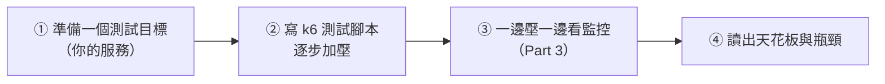

# [sre-7-4] 🔧 動手做：對服務做負載測試，找出瓶頸

> **本章目標**：用負載測試工具實際對一個服務壓測，邊壓邊看監控，找出它的「天花板」與「瓶頸」，把 Part 7 的觀念變成實際操作。

## 你會學到

- 用 `k6` 寫並執行一次負載測試
- 設計「逐步加壓」的測試情境
- 一邊壓測一邊看 Part 3 的監控找瓶頸
- 從結果判斷天花板、瓶頸與下一步

## 概念說明

### 這一章在做什麼

Part 7-1 規劃了容量、7-2 講了負載測試的觀念、7-3 講了擴展。這一章你要**實際壓一次**——對一個服務逐步加壓，找出它撐到哪裡、卡在哪裡。

流程：



> 在 WSL 或測試環境做，**別對正式環境壓測**（7-2 的警告）。用你 infra/SRE 前面部署的測試服務當靶子。

## 程式碼範例

### 第一步：安裝 k6

`k6` 是一個現代、好用的負載測試工具，用 JavaScript 寫測試腳本（你熟悉的語言）：

```bash
# Ubuntu / WSL
sudo apt update
sudo apt install k6 -y
# 或參考官方安裝方式
```

### 第二步：寫一個逐步加壓的測試腳本

建立 `loadtest.js`：

```javascript
import http from "k6/http";
import { check, sleep } from "k6";

// 測試設定：逐步加壓（7-2 的「逐步加壓」）
export const options = {
  stages: [
    { duration: "1m", target: 50 },   // 1 分鐘內，爬升到 50 個虛擬使用者
    { duration: "2m", target: 50 },   // 維持 50 個 2 分鐘
    { duration: "1m", target: 200 },  // 爬升到 200
    { duration: "2m", target: 200 },  // 維持 200
    { duration: "1m", target: 500 },  // 爬升到 500（加壓找極限）
    { duration: "2m", target: 500 },  // 維持 500
    { duration: "1m", target: 0 },    // 緩降結束
  ],
};

export default function () {
  // 模擬使用者請求（換成你的服務 URL）
  const res = http.get("http://localhost:3000/api/notes");

  // 檢查回應（這會被 k6 統計成成功率）
  check(res, {
    "狀態 200": (r) => r.status === 200,
    "延遲 < 300ms": (r) => r.timings.duration < 300,
  });

  sleep(1); // 模擬使用者操作間的停頓
}
```

幾個重點：

- `stages` 定義「逐步加壓」——從 50 → 200 → 500 個虛擬使用者，正是 7-2 的測試設計。
- `check()` 定義「什麼算成功」——對應你的 SLO（狀態 200、延遲 < 300ms）。
- 真實測試應模擬完整流程（登入→瀏覽→…），這裡簡化成單一請求示範。

### 第三步：執行並一邊看監控

跑測試：

```bash
k6 run loadtest.js
```

**關鍵：一邊跑，一邊開著 Part 3-6 建的 Grafana 儀表板看四個黃金訊號。** 你要同時觀察兩邊：

- **k6 的輸出**：每個階段的延遲（p95）、成功率、RPS。
- **你的監控儀表板**：延遲、錯誤率怎麼變？**哪個資源（CPU/記憶體/資料庫）先飆高、先飽和**？——這就是找瓶頸的關鍵。

### 第四步：讀懂 k6 的結果

測試結束，k6 會給一份摘要：

```
     http_req_duration..............: p(95)=850ms   ← 整體 p95 延遲
     http_req_failed................: 3.2%          ← 失敗率
     http_reqs......................: 45000  (約 250 RPS)
     ✓ 狀態 200 ... 96.8%
     ✗ 延遲 < 300ms ... 62%          ← 只有 62% 達到延遲目標！
```

對照各階段，你會看到類似 7-2 範例的結果——某個負載之後，延遲開始飆、失敗率上升。**那個轉折點就是你的天花板**。再對照當時監控上「哪個資源先飽和」，就是你的瓶頸。

---

### 第五步：產出結論

把發現寫成結論，這才是負載測試的價值：

```
負載測試結論：
- 天花板：約在 350 RPS（200 個虛擬使用者）後延遲開始劣化
- 瓶頸：資料庫 CPU 先到 95%（不是應用伺服器）
- 對照容量規劃：目前配置撐得住平日，但雙 11 預估會超過天花板
- 行動：
  1. 優化那個拖慢資料庫的查詢（或加讀取副本）
  2. 加上「優雅降級」保護（Part 8）防止超過天花板時雪崩
  3. 設定自動擴縮，並再壓測一次驗證（7-3）
```

## 小練習

### 練習 1：跑一次負載測試

對你 infra/SRE 前面部署的測試服務，用 k6 寫一個逐步加壓的測試並執行。觀察 k6 的輸出。

---

### 練習 2：邊壓邊找瓶頸

壓測時，同時看你的 Grafana 監控（Part 3-6）。記錄：當延遲開始劣化時，是哪個資源（CPU/記憶體/資料庫/連線）先飽和？那就是你的瓶頸。

---

### 練習 3：寫出結論

根據你的測試，寫出：

1. 這個服務的「天花板」大約在多少 RPS / 多少使用者？
2. 瓶頸是什麼資源？
3. 如果要提升容量，你會優先做什麼？（提示：針對瓶頸，不是盲目加機器）

> 你現在會「容量規劃 + 負載測試 + 擴展」了——能讓系統面對成長站得住。接下來 Part 8 進入「為失敗而設計」：怎麼讓系統面對各種故障也不倒。

## 課外讀物

> 負載測試常驗證「快取能大幅減輕後端壓力」，是突破瓶頸的常見手段 → [課外讀物 E-11-8：多層次快取全景：瀏覽器到資料庫](../../../課外讀物/E-11-performance/E-11-8-cache-layers.md)
