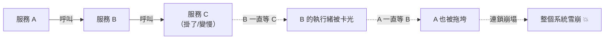
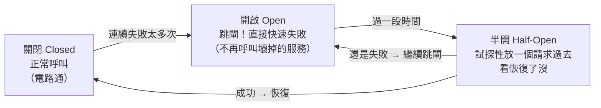

# [sre-8-1] 失敗一定會發生：重試、逾時、斷路器

> **本章目標**：建立「為失敗而設計」的核心思維，並學會三個最基本的韌性模式——重試、逾時、斷路器，讓你的系統面對局部故障時不會跟著一起垮。

## 你會學到

- 「為失敗而設計（Design for Failure）」的核心思維
- 逾時（Timeout）：別無止境地等
- 重試（Retry）：聰明地再試一次
- 斷路器（Circuit Breaker）：別一直去敲一個壞掉的門

## 概念說明

### 核心假設：失敗一定會發生

傳統思維是「想辦法不要出錯」。SRE 的思維更現實：

> **失敗是必然的，不是意外。** 網路會斷、機器會掛、依賴的服務會逾時、磁碟會壞——這些不是「會不會」，而是「什麼時候」。

所以與其妄想「永不失敗」，不如**假設失敗一定會發生，並設計成「即使某個部分失敗，整體還能撐住」**。這叫「為失敗而設計（Design for Failure）」，是 Part 8 的核心精神。

這呼應了你 Part 5-5 寫 postmortem 時的領悟——很多事故的根因是「沒處理好失敗情境」（例如那個金流逾時沒處理的例子）。這一章就是教你「該怎麼處理失敗」。

---

### 連鎖故障：一個小失敗如何拖垮全部

先理解「不為失敗設計」會發生什麼。在微服務裡，服務之間互相呼叫。如果不處理失敗，一個小故障會像骨牌一樣連鎖崩塌：



C 只是變慢，但因為 B 傻傻地一直等 C、A 又一直等 B……最後**一個小故障拖垮了整個系統**。這叫「**連鎖故障（cascading failure）**」。下面三個模式就是用來阻斷這種連鎖。

---

### 模式一：逾時（Timeout）——別無止境地等

最基本、也最常被忘記的——**呼叫別的服務時，一定要設逾時**。

如果 C 變慢，B 不該無止境地等下去。設一個逾時（例如「等 2 秒，沒回應就放棄」），B 就能及時抽身、不被 C 拖死。

> **沒設逾時，是連鎖故障最常見的原因。** Part 5-4 那個金流事故，根因就是「沒處理逾時」。永遠為外部呼叫設逾時——這是韌性的第一課。

---

### 模式二：重試（Retry）——但要聰明地重試

很多失敗是**暫時的**（網路抖一下、服務剛好在重啟）。這種情況，**重試一下**往往就成功了。

但重試要聰明，否則會幫倒忙：

- **要有上限**：別無限重試。試 3 次還不行，就放棄、回報失敗。
- **要用「指數退避（exponential backoff）」**：別立刻、密集地重試。第一次等 1 秒、第二次等 2 秒、第三次等 4 秒……越退越久。

為什麼要退避？因為——**如果服務是因為「過載」而失敗，你還立刻瘋狂重試，等於火上加油，把它徹底壓垮**。退避給它喘息的空間。

> 還有個進階技巧叫「**抖動（jitter）**」——在退避時間加一點隨機。避免「所有客戶端同時重試」造成新的尖峰。

---

### 模式三：斷路器（Circuit Breaker）——別一直敲壞掉的門

如果一個服務**持續失敗**（不是偶爾抖一下，而是真的掛了），那繼續呼叫它（甚至重試）只是浪費資源、拖慢自己。

**斷路器（Circuit Breaker）** 借用電路的「跳閘」概念：當偵測到「某個依賴持續失敗」，就**「跳閘」——暫時停止呼叫它，直接快速失敗**，過一陣子再試探它有沒有恢復。

用類比：家裡電線短路，**保險絲會跳閘切斷電路**，保護整棟房子不被燒掉。斷路器一樣——它「切斷」對壞掉服務的呼叫，保護你自己不被拖垮。

斷路器有三個狀態：



斷路器的好處：當依賴掛了，你**立刻快速失敗（給使用者一個降級回應），而不是讓大量請求卡在那裡等逾時**——這就阻斷了連鎖故障。

---

### 三者怎麼配合

這三個模式是一組組合拳，一起對抗失敗：

```
呼叫外部服務時：
  → 設「逾時」：等太久就放棄（別被拖死）
  → 失敗了「重試」（指數退避）：給暫時性故障一個機會
  → 持續失敗就「斷路器跳閘」：別再敲壞掉的門，快速失敗
```

有了這三層保護，一個依賴的故障，就被「圍堵」在局部，不會擴散成全系統雪崩。

## 範例：加上韌性前後的對比

```
情境：你的服務要呼叫「推薦服務」，但推薦服務突然掛了

❌ 沒有韌性設計：
  - 你的服務呼叫推薦服務，沒設逾時 → 一直等
  - 大量請求都卡在「等推薦服務」→ 執行緒被占滿
  - 你的服務也沒法處理「其他正常功能」了 → 跟著一起掛
  → 推薦服務掛掉，連累整個網站掛掉（連鎖故障）

✅ 有韌性設計：
  - 設了 1 秒逾時 → 推薦服務沒回應，1 秒後放棄
  - 重試 2 次（指數退避）→ 還是不行
  - 斷路器跳閘 → 之後直接快速失敗，不再呼叫
  - 降級處理 → 「推薦區塊」顯示熱門商品（或乾脆不顯示）
  → 推薦服務掛了，但網站其他功能正常，使用者頂多看不到推薦
```

差別巨大——同樣是「推薦服務掛掉」，沒設計的讓整站陪葬，有設計的只損失一個小區塊。這就是「為失敗而設計」的價值。

## 小練習

### 練習 1：核心思維

用自己的話解釋「為失敗而設計」的核心假設。它和傳統「想辦法不要出錯」的思維差在哪？

---

### 練習 2：三個模式

不看上面，說明逾時、重試、斷路器各解決什麼問題。為什麼「重試要用指數退避」？

---

### 練習 3：診斷連鎖故障

某系統：服務 A 呼叫服務 B，B 呼叫資料庫。資料庫變慢後，整個系統都掛了。

1. 這是什麼現象？
2. 在 A→B、B→資料庫 的呼叫上，加哪些模式能阻止這種連鎖崩塌？

## 課外讀物

> 韌性設計常和快取搭配——快取能在後端故障時提供降級資料 → [課外讀物 E-11-3：Redis 與快取策略](../../../課外讀物/E-11-performance/E-11-3-redis-cache.md)
