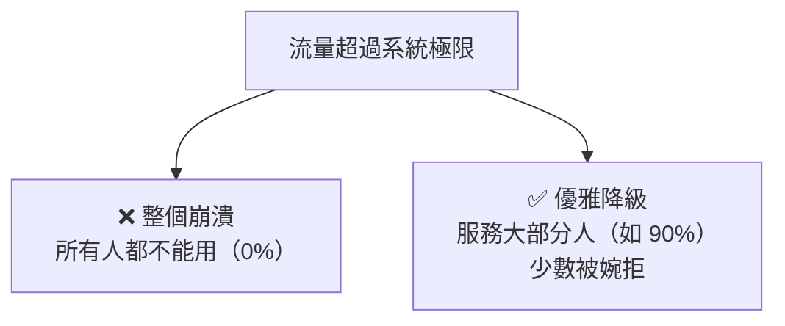

# [sre-8-2] 優雅降級與保命機制：限流與負載卸除

> **本章目標**：學會「過載時怎麼保命」——優雅降級、限流、負載卸除，讓系統在壓力超過極限時「部分服務」而不是「整個崩潰」。

## 你會學到

- 優雅降級（Graceful Degradation）是什麼
- 限流（Rate Limiting）：保護系統不被請求淹沒
- 負載卸除（Load Shedding）：過載時主動丟棄部分請求
- 為什麼「服務 90% 的人」遠勝「0% 的人都不能用」

## 概念說明

### 核心抉擇：崩潰 vs 降級

Part 7-2 的負載測試讓你看過：系統超過極限時，有兩種「死法」：



- **崩潰**：系統被壓垮，**所有人都不能用**。最糟。
- **優雅降級（Graceful Degradation）**：系統主動「**犧牲一部分，保住大部分**」——服務 90% 的人，少數被暫時婉拒或降級體驗。

SRE 的核心智慧：

> **「服務 90% 的使用者」遠勝「系統崩潰、0% 的人能用」。**

過載時，與其「大家一起死」，不如「主動保住大多數」。這就是優雅降級的精神。下面是實現它的幾個機制。

---

### 機制一：優雅降級——關掉次要功能保住核心

當系統壓力大，**主動關閉「次要功能」，把資源留給「核心功能」**。

例如電商在大促爆量時：

- 核心功能（瀏覽、下單、結帳）→ 全力保住。
- 次要功能（個人化推薦、「猜你喜歡」、評論區）→ 暫時關掉或顯示簡化版。

使用者也許注意到「推薦不見了」，但他**還是能買東西**——核心體驗保住了。等流量退去再恢復次要功能。這比「為了顯示推薦，結果整站崩潰、連買都不能買」好太多。

用類比：醫院急診爆滿時，會**檢傷分類**——先救命危的，輕症的等一下。資源有限時，優先保住最重要的。

---

### 機制二：限流（Rate Limiting）——別讓人灌爆你

**限流（Rate Limiting）** 是「**限制每個使用者/來源，在單位時間內能發多少請求**」。超過就婉拒（回傳 429 Too Many Requests）。

它保護系統不被「異常大量的請求」淹沒，來源可能是：

- **惡意攻擊**：有人想用海量請求打垮你（DoS）。
- **失控的程式**：某個客戶端 bug，瘋狂重試（呼應 8-1 沒做好退避的後果）。
- **單一大戶**：某個使用者用量異常大，影響其他人。

用類比：限流像**夜店門口的人數管制**——一次只放一定數量進場，維持裡面的體驗，而不是讓所有人一次擠爆、誰都玩不了。

限流保護的是「**公平**」和「**穩定**」——不讓少數來源吃掉所有資源，保障多數人的體驗。

---

### 機制三：負載卸除（Load Shedding）——過載時主動丟棄

**負載卸除（Load Shedding）** 比限流更激進：當系統**整體**快過載時，**主動丟棄一部分請求**，保住處理其他請求的能力。

差別：

- **限流**：針對「單一來源」設上限（你發太多，擋你）。
- **負載卸除**：針對「系統整體」——當整體要撐不住了，**犧牲一部分請求**（可能依優先級丟棄），確保剩下的能被好好處理。

用類比：負載卸除像**超載的救生艇**——與其讓所有人都上船、然後船沉、大家一起淹死，不如控制人數，保住船上的人能活。殘酷但理性——**部分獲救，遠勝全部沉沒**。

進階做法會**依優先級卸除**：先丟棄低優先的請求（如背景任務、非付費用戶），保住高優先的（如結帳、付費用戶）。

---

### 這些機制怎麼配合 8-1

Part 8-1（重試、逾時、斷路器）保護你「**呼叫別人**」時不被拖垮；這一章的機制保護你「**被別人呼叫**」時不被淹沒。一個對外、一個對內，合起來讓系統在各種壓力下都能站穩：

```
別人呼叫你 → 限流（擋住異常來源）+ 負載卸除（整體過載時保命）
你呼叫別人 → 逾時 + 重試 + 斷路器（8-1，別被拖垮）
壓力過大時 → 優雅降級（關次要功能，保核心）
```

## 範例：大促時的層層保護

```
情境：電商雙 11，流量是平日的 10 倍，超過系統極限

系統的層層保命機制啟動：

① 限流：
   每個 IP 每秒最多 10 次請求 → 擋掉搶購機器人的瘋狂請求

② 優雅降級：
   偵測到高負載 → 自動關閉「個人化推薦」「商品評論」
   把資源全力留給「瀏覽 + 結帳」

③ 負載卸除：
   系統整體仍逼近極限 → 對「非結帳流程」的請求開始部分婉拒
   （顯示「人潮眾多，請稍候」），保住「正在結帳」的人能順利付款

結果：
  - 部分使用者體驗降級（看不到推薦、偶爾要重試）
  - 但「核心的買東西、結帳」對大多數人保持可用
  - 系統沒有崩潰 → 公司賺到了大促的錢
  
對比：如果沒有這些 → 系統被打爆 → 全站崩潰 → 誰都不能買 → 大促變大災難
```

## 小練習

### 練習 1：核心抉擇

用自己的話解釋：為什麼 SRE 說「服務 90% 的人，遠勝系統崩潰、0% 的人能用」？

---

### 練習 2：分清限流與負載卸除

回答：

1. 限流和負載卸除的差別是什麼？（提示：針對「單一來源」vs「系統整體」）
2. 各舉一個適合用它的情境。

---

### 練習 3：設計降級策略

幫一個「線上影音平台」設計優雅降級策略：當系統過載時，哪些是「核心功能」要保住、哪些是「次要功能」可以先關？

> 提示：使用者最核心的需求是「能播放影片」，那哪些是可以犧牲的？

## 課外讀物

> 優雅降級常靠「快取的舊資料」來提供降級體驗（後端掛了還能給快取內容）→ [課外讀物 E-11-3：Redis 與快取策略](../../../課外讀物/E-11-performance/E-11-3-redis-cache.md)
