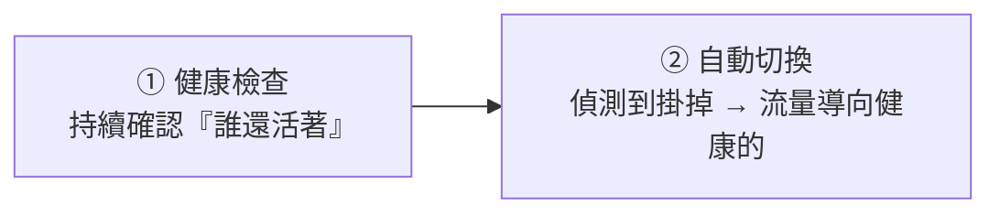
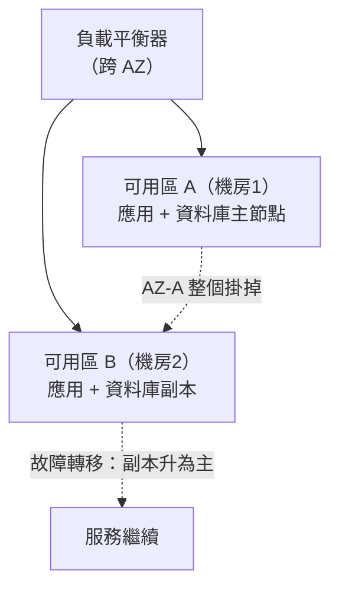

# [sre-8-3] 冗餘與故障轉移：單點掛掉也不致命

> **本章目標**：複習冗餘的概念（infra Part 9-2），深入「故障轉移」怎麼運作，並理解 Multi-AZ、Multi-Region 這些把「故障影響」隔離開來的設計。

## 你會學到

- 冗餘（Redundancy）與故障轉移（Failover）怎麼配合
- 故障轉移的關鍵：健康檢查 + 自動切換
- Multi-AZ：跨機房的冗餘
- Multi-Region：跨地區的冗餘，以及它的代價

## 概念說明

### 複習：冗餘消除單點故障（infra Part 9-2）

infra Part 9-2 學過：**單點故障（SPOF）** 是「掛了就全完」的環節，而**冗餘（Redundancy）** 是消除它的方法——關鍵環節都準備備份，一個掛了另一個頂上。

這一章從 SRE 角度深入：光有「備份」還不夠，關鍵是**怎麼在故障時自動切換過去**——這就是故障轉移。

---

### 故障轉移（Failover）：怎麼自動切換

**故障轉移（Failover）** 是「**當主要的元件掛掉時，自動切換到備援**」的機制。它需要兩個要素：



**① 健康檢查（Health Check）**：持續地、自動地確認每個元件「還活著、還健康」。例如負載平衡器每幾秒對每台後端發一個健康檢查請求（呼應 infra Part 9-1 Nginx 會跳過壞掉的後端）。

**② 自動切換**：一旦健康檢查發現某個元件掛了，**自動把流量導向健康的備援**，不需要人介入。

關鍵是這整個過程要**快、且自動**——慢了或要人手動切，使用者就會受影響。理想是使用者完全無感（呼應 infra Part 9-2 的「高可用」目標）。

---

### Multi-AZ：跨機房的冗餘

光「同一個機房裡放兩台機器」還不夠——如果**整個機房**出事（斷電、火災、網路中斷）呢？兩台一起掛。

**Multi-AZ** 解決這個。AZ 是 **Availability Zone（可用區）**——可以理解為「**獨立的機房**」，有各自的電力、網路、冷卻。把資源**分散到多個 AZ**，就算一個 AZ 整個掛掉，其他 AZ 的還在。



用類比：別把所有雞蛋放在同一個籃子（機房）——分散到多個籃子，摔破一個還有其他的。

Multi-AZ 是雲端高可用的**標準做法**，而且雲端讓它很容易實現（AWS 課程 Part 4 會深入）。例如 AWS RDS 的「Multi-AZ」選項，會自動在另一個 AZ 維護資料庫副本，主節點掛了自動切換。

---

### Multi-Region：跨地區的冗餘

比 Multi-AZ 更進一步的是 **Multi-Region**——把資源分散到**不同的地理區域**（例如台灣、東京、美國）。

它防範的是「**整個區域級的災難**」：大地震、大範圍斷電、區域性的雲端服務中斷。即使整個「台灣區」都掛了，「東京區」還能服務。

但 Multi-Region 的**代價高很多**：

| 挑戰 | 說明 |
|------|------|
| **資料同步難** | 資料要跨地區複製，物理距離造成延遲，還有「資料一致性」的難題 |
| **複雜度高** | 跨區的流量導向、故障轉移都更複雜 |
| **成本高** | 多個區域的資源都要錢 |

所以 Multi-Region 不是人人都需要——它呼應 Part 1-3「擁抱風險、剛剛好」：**只有「區域級災難真的無法承受」的關鍵服務（如全球金融、大型平台），才值得這個成本。** 大多數服務做好 Multi-AZ 就夠了。

---

### 冗餘也要花成本——回到「剛剛好」

這章要連回 SRE 的核心智慧：**冗餘不是越多越好，要對應你的 SLO 和可承受的風險**。

```
單台          → 便宜，但單點故障（適合：不重要的內部工具）
Multi-AZ      → 防機房級故障，成本適中（適合：大多數正式服務）
Multi-Region  → 防區域級災難，成本高（適合：絕不能停的關鍵服務）
```

選哪一層，取決於「**這個服務掛掉的後果有多嚴重、值不值得那個成本**」——這正是 Part 2 的 SLO 和 Part 1-3 的「擁抱風險」在指導你做決策。

## 範例：依重要性選擇冗餘層級

```
某公司的不同服務，依重要性選不同冗餘：

內部 Wiki：
  → 單一 AZ 就好（掛了員工等一下，影響小，不值得多花錢）

主要的電商網站：
  → Multi-AZ（一個機房掛掉也要能繼續賣，但區域級災難可接受短暫中斷）
  → 資料庫用 Multi-AZ 自動故障轉移

全球金流核心：
  → Multi-Region（這個絕對不能停，區域災難也要扛住）
  → 接受高成本與複雜度，換取最高可靠性

決策依據：每個服務「掛掉的後果」× SLO 要求 → 選對應的冗餘層級
```

注意——**不是全部都上 Multi-Region**。那會浪費大量成本在「其實沒那麼關鍵」的服務上。依 SLO 和後果嚴重性，選「剛剛好」的冗餘——這才是成熟的 SRE 判斷。

## 小練習

### 練習 1：故障轉移的兩要素

回答：故障轉移要能運作，需要哪兩個要素？為什麼這個過程要「快且自動」？

---

### 練習 2：AZ vs Region

用「雞蛋與籃子」的類比，解釋 Multi-AZ 和 Multi-Region 各防範什麼。為什麼大多數服務做 Multi-AZ 就夠，不一定需要 Multi-Region？

---

### 練習 3：選擇冗餘層級

幫下面的服務各選一個合理的冗餘層級（單台 / Multi-AZ / Multi-Region）並說明理由：

1. 一個給內部測試用的環境
2. 一個正式的線上購物網站
3. 一個處理全球即時交易的證券系統

## 課外讀物

> Multi-AZ、故障轉移在雲端的實作，是 AWS 課程的核心 → 參見 **AWS 課程** Part 4（`lessons/aws/課程大綱.md`）；冗餘的基礎概念 → 參見 **infra 課程** Part 9-2
