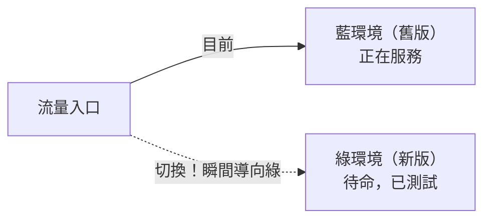
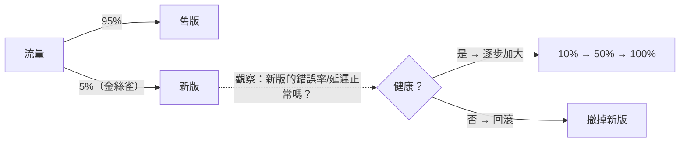

# [sre-8-4] 安全發布：藍綠、金絲雀、漸進式

> **本章目標**：理解「上線」是事故的最大來源，學會用藍綠部署、金絲雀發布、漸進式 rollout 把「上線」變成低風險的操作。

## 你會學到

- 為什麼「部署/上線」是最常見的事故來源
- 藍綠部署（Blue-Green）：瞬間切換、瞬間回滾
- 金絲雀發布（Canary）：先放一小部分流量試水溫
- 漸進式 rollout 與快速回滾的重要性

## 概念說明

### 殘酷的事實：大部分事故來自「改動」

回想 Part 1-1 那個 Dev 與 Ops 的對立——維運想「少改動」是有道理的，因為：

> **絕大多數的線上事故，是由「改動」造成的——尤其是「部署新版本」。**

系統穩穩跑著好好的，往往是「上線了一個有問題的新版本」之後才爆炸（Part 5-4 那個金流事故就是）。

但我們又不能「不上線」（那就沒有進步，違反 Part 2-4 錯誤預算的精神）。所以 SRE 的答案不是「少上線」，而是——**把「上線」這個動作本身，設計成低風險、可控、可快速回滾的。** 這就是「安全發布」。

---

### 為什麼「一次全部換掉」很危險

最原始的部署方式是「**直接把所有機器的舊版本換成新版本**」。這很危險：

- 如果新版本有問題，**所有使用者立刻全部受影響**（炸全部人）。
- 要回滾也慢——又要把所有機器換回去。

下面三種方法，核心都是**「別一次換全部、別讓所有人同時承受風險」**。

---

### 方法一：藍綠部署（Blue-Green）

準備**兩套一模一樣的環境**：「藍」（目前正在服務的舊版）和「綠」（部署好新版、但還沒接流量）。



流程：在「綠」環境部署新版、測試好 → 把流量**瞬間從藍切到綠** → 新版上線。

最大的好處是**回滾極快**：如果綠（新版）出問題，**瞬間把流量切回藍（舊版）就好**——舊環境還完整地在那。回滾從「重新部署」變成「切一下開關」，幾秒搞定（呼應 Part 5-1 的「止血優先、回滾」）。

代價：要維持兩套環境，成本較高。

---

### 方法二：金絲雀發布（Canary）

名字來自礦工的典故——以前礦工帶**金絲雀**下礦坑，金絲雀對毒氣敏感，如果牠出事，礦工就知道該撤了。**金絲雀發布**就是用「一小部分流量」當那隻金絲雀。



流程：先讓**一小部分流量（如 5%）**走新版，**其餘走舊版** → **盯著新版的監控**（錯誤率、延遲——Part 3 黃金訊號）→ 如果健康，逐步加大（10% → 50% → 100%）；如果出問題，立刻撤掉，**只有那 5% 受影響**。

最大好處：**把「新版出包」的影響，限制在一小部分使用者**。你用 5% 的人試水溫，而不是拿 100% 的人賭。

---

### 方法三：漸進式 rollout

金絲雀的概念延伸——**不要一次部署到所有機器，而是分批慢慢來**：先 1 台、觀察；再 10%、觀察；再 50%；最後 100%。每一批之間都盯著監控，有問題就停。

這和金絲雀的精神一致：**逐步擴大、持續觀察、隨時能停**。差別是金絲雀強調「用流量比例試水溫」，漸進式強調「分批推進」，實務上常結合使用。

---

### 共同的命脈：快速回滾 + 監控

不管用哪種方法，兩件事是安全發布的命脈：

1. **快速回滾**：任何發布都必須「能快速退回上一個正常版本」。回滾是上線時的「安全氣囊」（Part 5-1 最常用的止血手段）。
2. **發布時緊盯監控**：上線過程中，眼睛要盯著黃金訊號（Part 3）。新版讓錯誤率/延遲變差了嗎？這就是「金絲雀健不健康」的判斷依據。理想上甚至能**自動化**——監控偵測到新版指標惡化，自動回滾。

> 這些安全發布手段，通常整合在 CI/CD 流程裡自動執行（AWS 課程 Part 9、infra 的自動化）。SRE 的工作是設計這套「讓上線變安全」的流程。

## 範例：一次金絲雀發布

```
要上線結帳服務的新版 v3.0

① 部署 v3.0，先導 5% 流量過去（金絲雀）
   → 盯著監控：v3.0 的錯誤率、延遲 vs v2.9（舊版）
   
② 觀察 15 分鐘：
   v3.0 錯誤率 0.05%、延遲 p95 180ms → 和舊版一樣健康 ✅
   
③ 逐步加大：5% → 25% → 50%，每階段都觀察
   → 一路正常
   
④ 100%，v3.0 完全上線

────────────────────────────────────
對比：如果 v3.0 有 bug 會怎樣？

直接全量上線：100% 使用者立刻中招 → 大事故
金絲雀發布：只有那 5% 受影響 → 監控發現異常 → 立刻回滾
            → 95% 的使用者全程無感
```

這就是安全發布的價值——**把「上線」這個高風險動作，變成「可控、影響有限、隨時能撤」的操作**。讓你既能快速迭代（Dev 想要的），又不會炸到使用者（Ops 想要的）——完美調和了 Part 1-1 的那個對立。

## 小練習

### 練習 1：為什麼上線要小心

回答：為什麼說「部署新版本」是最常見的事故來源？SRE 的對策是「少上線」嗎？

---

### 練習 2：三種方法的差別

用一句話分別說明藍綠部署、金絲雀發布、漸進式 rollout 的核心做法。藍綠部署最大的優勢是什麼？

---

### 練習 3：設計發布流程

你要上線一個重要功能的新版本。設計一個安全的發布流程：用哪種方法？怎麼觀察？發現問題怎麼辦？

> 提示：結合金絲雀（小流量試水溫）+ 盯黃金訊號 + 快速回滾。

## 課外讀物

> 安全發布通常整合在 CI/CD 自動部署流程中 → 參見 **AWS 課程** Part 9（`lessons/aws/課程大綱.md`）
