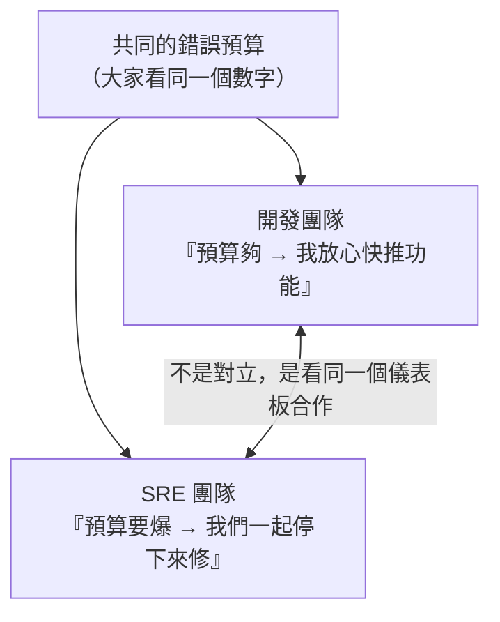

# [sre-9-1] 可靠性是團隊運動：開發與 SRE 如何協作

> **本章目標**：理解可靠性不是 SRE 一個團隊的責任，而是整個組織的共同事業，並學會 error budget policy 怎麼成為開發與 SRE 協作（而非對立）的制度基礎。

## 你會學到

- 為什麼「可靠性是大家的事」，不是 SRE 一個人扛
- Error Budget Policy 怎麼讓 Dev 與 SRE 協作
- 「你建的，你顧」（You build it, you run it）
- SRE 如何「賦能」開發團隊，而非「代為受罪」

## 概念說明

### 回到最初的對立

整門課從 Part 1-1 那個「開發 vs 維運」的世仇開始。走到這裡，你已經學了一整套工具（SLO、錯誤預算、監控、事故處理、韌性設計）。最後這個 Part，我們談**怎麼讓這一切在真實組織裡運作起來**——因為再好的工具，沒有對的文化也是白搭。

核心訊息：

> **可靠性不是「SRE 團隊的責任」，而是「整個組織的共同事業」。**

如果開發只管「寫功能、丟給 SRE 顧」，SRE 只能在後面疲於救火——這又回到了那個對立。真正的可靠性，需要開發和 SRE **站在同一邊**。

---

### Error Budget Policy：協作的制度基礎

還記得 Part 2-4 的錯誤預算嗎？它不只是個數字，更是**讓 Dev 和 SRE 協作的制度**。重新理解它的文化意義：



關鍵在於——**錯誤預算把「要快還是要穩」從「兩個團隊的拔河」變成「一個數字的客觀事實」**：

- 預算充足 → 開發有「本錢」冒險，SRE 沒理由阻擋。
- 預算耗盡 → 觸發政策（凍結上線），**開發團隊自己也同意**該停了，因為規則是事先一起定的。

沒有人是「煞車的壞人」或「衝太快的肇事者」——大家都服從同一個事先講好的規則。這就是制度化的協作。

---

### 「你建的，你顧」（You build it, you run it）

現代一個重要的文化轉變：

> **寫程式的人，也要為它的線上運作負責——「你建的，你顧」。**

傳統模式是「開發寫完丟給維運，出事是維運的事」。這造成開發**沒有動力把東西寫可靠**（反正出事不是我顧）。

「你建的，你顧」改變了這個誘因——當開發團隊**自己也要 on-call、自己也要半夜被自己的 bug 叫醒**，他們就會：

- 寫程式時認真考慮可靠性（因為痛的是自己）。
- 主動加上監控、處理失敗情境（Part 8）。
- 把「可靠性」當成自己的事，而不是別人的負擔。

這不代表 SRE 沒用了——而是**責任變成共享的**。開發為自己的服務負起運維責任，SRE 則提供平台、工具、專業，讓他們做得到。

---

### SRE 的真正角色：賦能，而非代受罪

這帶出 SRE 角色的成熟理解：

> **SRE 的目標，不是「替開發團隊承受所有維運痛苦」，而是「賦能開發團隊，讓他們能自己把服務跑得可靠」。**

如果 SRE 變成「開發闖禍、SRE 擦屁股」，那 SRE 就只是換了名字的傳統維運，而且會被無止境的 toil 淹沒（Part 6）。

成熟的 SRE 是這樣運作的：

| SRE 不該做的 | SRE 該做的 |
|------------|-----------|
| 替開發承受所有 on-call | 建立好的 on-call 制度與工具，大家共同承擔 |
| 手動幫開發處理重複問題 | 做自助平台，讓開發自己能解決（Part 6-2 的 L4）|
| 默默擦屁股 | 用數據（SLO、錯誤預算）讓問題透明、推動改善 |
| 當唯一懂可靠性的人 | 把可靠性的知識、工具推廣給整個組織 |

SRE 像「教練」和「平台提供者」——不是替球員上場打球，而是讓整支球隊都變強。這也呼應 Part 6-3「把基礎設施當產品、服務內部開發者」的思維。

---

### 文化才是真正的關鍵

最後要強調：這門課教的所有技術（SLO、監控、告警、事故處理、韌性）都是**工具**。但工具能不能發揮價值，取決於**文化**：

- 有沒有「無咎」的文化，讓人敢誠實面對錯誤（Part 5-3）？
- 有沒有「共同負責」的文化，讓開發和 SRE 站在一起？
- 有沒有「用數據決策」的文化，讓爭論被錯誤預算化解？
- 有沒有「持續改善」的文化，讓每次事故都帶來進步？

**技術可以買、可以學，但文化要慢慢建。** 一個有好文化、普通工具的團隊，往往比「頂尖工具、糟糕文化」的團隊可靠得多。這是 SRE 最深的一課。

## 範例：協作文化 vs 對立文化

```
❌ 對立文化：
  開發：「我功能寫完了，上線出事是 SRE 的事。」
  SRE：「又是你們的爛 code！我不準你上線！」
  → 互相甩鍋、SRE 疲於救火、開發不管可靠性 → 系統越來越糟

✅ 協作文化（用本章的制度與文化）：
  - 大家看同一個錯誤預算儀表板
  - 預算還夠 → SRE：「沒問題，放心上線」
  - 預算快爆 → 開發：「那我們這週先別推新功能，一起修穩定性」
  - 開發自己也 on-call，所以寫 code 時就認真考慮可靠性
  - SRE 提供好用的部署/監控平台，讓開發能自助、自己跑得可靠
  - 出事了開無咎檢討，一起找系統的改善點
  → 大家是隊友，可靠性是共同的事 → 系統持續變好
```

## 小練習

### 練習 1：為什麼可靠性是團隊運動

回答：如果「可靠性只是 SRE 的責任」，會發生什麼問題？為什麼需要開發團隊一起參與？

---

### 練習 2：理解「你建的，你顧」

回答：「讓開發團隊也為自己的服務 on-call」這件事，怎麼改變了他們寫程式的誘因？

---

### 練習 3：分辨 SRE 的健康角色

下面哪些是「健康的 SRE 角色」，哪些是「淪為傳統維運」？

1. 替開發團隊承受所有半夜告警
2. 建立自助部署平台，讓開發自己安全上線
3. 手動處理每一個開發團隊丟來的維運請求
4. 用 SLO 數據讓可靠性問題透明、推動全員改善

## 課外讀物

> 「共同負責」的協作文化，也體現在版本控制與程式碼審查的流程上 → [課外讀物 E-8-7：Git Flow 與 GitHub Flow](../../../課外讀物/E-8-git/E-8-7-git-flow.md)
