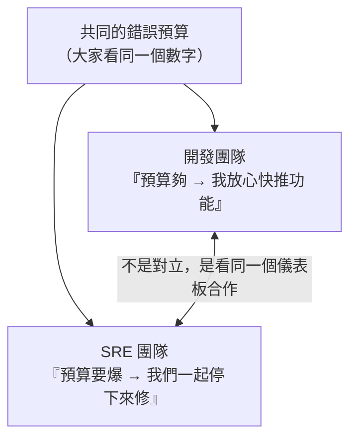

# [sre-9-1] 可靠性是團隊運動：開發與 SRE 如何協作

> **本章目標**：理解可靠性不是 SRE 一個團隊的責任，而是整個組織的共同事業，並學會 error budget policy 怎麼成為開發與 SRE 協作（而非對立）的制度基礎。

## 你會學到

- 為什麼「可靠性是大家的事」，不是 SRE 一個人扛
- Error Budget Policy 怎麼讓 Dev 與 SRE 協作
- 「你建的，你顧」（You build it, you run it）
- SRE 如何「賦能」開發團隊，而非「代為受罪」

## 概念說明

### 回到最初的對立

整門課從 Part 1-1 那個「開發 vs 維運」的世仇開始。走到這裡，你已經學了一整套工具（SLO、錯誤預算、監控、事故處理、韌性設計）。最後這個 Part，我們談**怎麼讓這一切在真實組織裡運作起來**——因為再好的工具，沒有對的文化也是白搭。

核心訊息：

> **可靠性不是「SRE 團隊的責任」，而是「整個組織的共同事業」。**

如果開發只管「寫功能、丟給 SRE 顧」，SRE 只能在後面疲於救火——這又回到了那個對立。真正的可靠性，需要開發和 SRE **站在同一邊**。

---

### Error Budget Policy：協作的制度基礎

還記得 Part 2-4 的錯誤預算嗎？它不只是個數字，更是**讓 Dev 和 SRE 協作的制度**。重新理解它的文化意義：


```mermaid
graph TB
    EB["共同的錯誤預算<br/>（大家看同一個數字）"]
    EB --> DEV["開發團隊<br/>『預算夠 → 我放心快推功能』"]
    EB --> SRE["SRE 團隊<br/>『預算要爆 → 我們一起停下來修』"]
    DEV <-->|"不是對立，是看同一個儀表板合作"| SRE
```

關鍵在於——**錯誤預算把「要快還是要穩」從「兩個團隊的拔河」變成「一個數字的客觀事實」**：

- 預算充足 → 開發有「本錢」冒險，SRE 沒理由阻擋。
- 預算耗盡 → 觸發政策（凍結上線），**開發團隊自己也同意**該停了，因為規則是事先一起定的。

沒有人是「煞車的壞人」或「衝太快的肇事者」——大家都服從同一個事先講好的規則。這就是制度化的協作。

---

### 「你建的，你顧」（You build it, you run it）

現代一個重要的文化轉變：

> **寫程式的人，也要為它的線上運作負責——「你建的，你顧」。**

傳統模式是「開發寫完丟給維運，出事是維運的事」。這造成開發**沒有動力把東西寫可靠**（反正出事不是我顧）。

「你建的，你顧」改變了這個誘因——當開發團隊**自己也要 on-call、自己也要半夜被自己的 bug 叫醒**，他們就會：

- 寫程式時認真考慮可靠性（因為痛的是自己）。
- 主動加上監控、處理失敗情境（Part 8）。
- 把「可靠性」當成自己的事，而不是別人的負擔。

這不代表 SRE 沒用了——而是**責任變成共享的**。開發為自己的服務負起運維責任，SRE 則提供平台、工具、專業，讓他們做得到。

---

### SRE 的真正角色：賦能，而非代受罪

這帶出 SRE 角色的成熟理解：

> **SRE 的目標，不是「替開發團隊承受所有維運痛苦」，而是「賦能開發團隊，讓他們能自己把服務跑得可靠」。**

如果 SRE 變成「開發闖禍、SRE 擦屁股」，那 SRE 就只是換了名字的傳統維運，而且會被無止境的 toil 淹沒（Part 6）。

成熟的 SRE 是這樣運作的：

| SRE 不該做的 | SRE 該做的 |
|------------|-----------|
| 替開發承受所有 on-call | 建立好的 on-call 制度與工具，大家共同承擔 |
| 手動幫開發處理重複問題 | 做自助平台，讓開發自己能解決（Part 6-2 的 L4）|
| 默默擦屁股 | 用數據（SLO、錯誤預算）讓問題透明、推動改善 |
| 當唯一懂可靠性的人 | 把可靠性的知識、工具推廣給整個組織 |

SRE 像「教練」和「平台提供者」——不是替球員上場打球，而是讓整支球隊都變強。這也呼應 Part 6-3「把基礎設施當產品、服務內部開發者」的思維。

---

### 文化才是真正的關鍵

最後要強調：這門課教的所有技術（SLO、監控、告警、事故處理、韌性）都是**工具**。但工具能不能發揮價值，取決於**文化**：

- 有沒有「無咎」的文化，讓人敢誠實面對錯誤（Part 5-3）？
- 有沒有「共同負責」的文化，讓開發和 SRE 站在一起？
- 有沒有「用數據決策」的文化，讓爭論被錯誤預算化解？
- 有沒有「持續改善」的文化，讓每次事故都帶來進步？

**技術可以買、可以學，但文化要慢慢建。** 一個有好文化、普通工具的團隊，往往比「頂尖工具、糟糕文化」的團隊可靠得多。這是 SRE 最深的一課。

## 範例：協作文化 vs 對立文化

```
❌ 對立文化：
  開發：「我功能寫完了，上線出事是 SRE 的事。」
  SRE：「又是你們的爛 code！我不準你上線！」
  → 互相甩鍋、SRE 疲於救火、開發不管可靠性 → 系統越來越糟

✅ 協作文化（用本章的制度與文化）：
  - 大家看同一個錯誤預算儀表板
  - 預算還夠 → SRE：「沒問題，放心上線」
  - 預算快爆 → 開發：「那我們這週先別推新功能，一起修穩定性」
  - 開發自己也 on-call，所以寫 code 時就認真考慮可靠性
  - SRE 提供好用的部署/監控平台，讓開發能自助、自己跑得可靠
  - 出事了開無咎檢討，一起找系統的改善點
  → 大家是隊友，可靠性是共同的事 → 系統持續變好
```

## 小練習

### 練習 1：為什麼可靠性是團隊運動

回答：如果「可靠性只是 SRE 的責任」，會發生什麼問題？為什麼需要開發團隊一起參與？

<details>
<summary>參考解答</summary>

如果把可靠性只丟給 SRE，會出現幾個連鎖問題：

1. **回到「開發 vs 維運」的對立**：開發只管「寫功能、丟給 SRE 顧」，SRE 在後面疲於救火。這正是整門課一開始那個世仇的翻版。
2. **開發沒有動力把東西寫可靠**：反正出事不是我顧，那我為什麼要花心思處理失敗情境、加監控？誘因錯了，程式品質就上不去。
3. **SRE 被 toil 淹沒**：開發闖禍、SRE 擦屁股，SRE 就只是換了名字的傳統維運，被無止境的重複勞動淹沒。
4. **可靠性知識集中在少數人身上**：只有 SRE 懂可靠性，整個組織的可靠性能力就永遠長不大。

所以需要開發一起參與——因為**真正影響可靠性的，是「東西怎麼被寫出來」**。可靠性問題往往在寫程式那一刻就種下了，SRE 在後面再怎麼救也是治標。唯有開發把可靠性當成自己的事（Dev 與 SRE 站在同一邊、看同一個錯誤預算），才能從源頭把系統寫穩。可靠性因此是「整個組織的共同事業」，不是一個團隊扛得動的。

</details>

---

### 練習 2：理解「你建的，你顧」

回答：「讓開發團隊也為自己的服務 on-call」這件事，怎麼改變了他們寫程式的誘因？

<details>
<summary>參考解答</summary>

關鍵在於**把「痛」還給了寫程式的人**——這就是「你建的，你顧」（You build it, you run it）的精髓。

傳統模式下，開發寫完丟給維運，出事是別人半夜被叫醒，所以開發沒有切身之痛，也就沒有動力把東西寫可靠。

一旦開發自己也要 on-call、自己也要半夜被自己的 bug 叫醒，誘因就整個翻轉：

- **寫程式時會認真考慮可靠性**——因為寫爛了，痛的是自己。
- **主動加上監控、處理失敗情境**——因為這樣半夜才不會被叫醒、被叫醒時才查得到原因。
- **把「可靠性」當成自己的事**，而不是丟給別人的負擔。

一句話：**當後果會回到自己身上，人自然會把事情做對。** 這不是靠道德勸說，而是靠對齊誘因。要注意的是，這不代表 SRE 沒用了，而是責任變成共享——開發為自己的服務負運維責任，SRE 提供平台、工具與專業，讓他們做得到。

</details>

---

### 練習 3：分辨 SRE 的健康角色

下面哪些是「健康的 SRE 角色」，哪些是「淪為傳統維運」？

1. 替開發團隊承受所有半夜告警
2. 建立自助部署平台，讓開發自己安全上線
3. 手動處理每一個開發團隊丟來的維運請求
4. 用 SLO 數據讓可靠性問題透明、推動全員改善

<details>
<summary>參考解答</summary>

用「賦能 vs 代受罪」這條線來分：

| 項目 | 判定 | 理由 |
|------|------|------|
| 1. 替開發承受所有半夜告警 | ❌ 淪為傳統維運 | 這是「替球員上場打球」——開發闖禍、SRE 擦屁股，SRE 只是換名字的維運，遲早被 toil 淹沒。健康做法是建立共同承擔的 on-call 制度。 |
| 2. 建立自助部署平台，讓開發自己安全上線 | ✅ 健康的 SRE 角色 | 這是「賦能」——做自助平台讓開發自己能安全解決（呼應 Part 6 把基礎設施當產品）。 |
| 3. 手動處理每一個開發丟來的維運請求 | ❌ 淪為傳統維運 | 手動、重複、幫別人擦屁股，正是 toil。應該做成自助工具讓開發自己解決。 |
| 4. 用 SLO 數據讓問題透明、推動全員改善 | ✅ 健康的 SRE 角色 | 用數據讓問題透明、推動整個組織改善，是 SRE「教練 + 平台提供者」的角色。 |

**心法**：健康的 SRE 是「讓整支球隊變強」（賦能、建工具、用數據推動改善），不健康的 SRE 是「一個人替大家扛」（默默承受、手動擦屁股）。

</details>

## 課外讀物

> 「共同負責」的協作文化，也體現在版本控制與程式碼審查的流程上 → [課外讀物 E-8-7：Git Flow 與 GitHub Flow](../../../課外讀物/E-8-git/E-8-7-git-flow.md)
