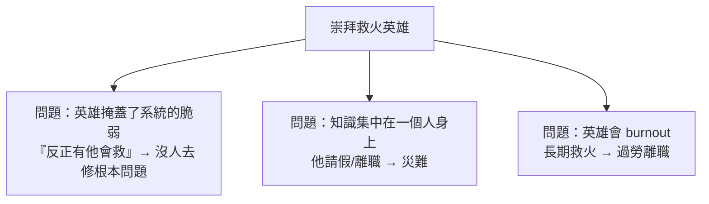

# [sre-9-2] SRE 的反模式：英雄主義、過度監控、虛榮指標

> **本章目標**：認識幾個常見的 SRE 反模式，這些是「看起來很努力、實際上有害」的陷阱，知道它們才能避開。

## 你會學到

- 英雄主義（hero culture）為什麼有害
- 過度監控、過度告警的陷阱（複習並深化）
- 虛榮指標（vanity metrics）：看起來漂亮卻沒意義
- 為可靠性而可靠性的迷思

## 概念說明

### 什麼是反模式

**反模式（anti-pattern）** 是「**乍看是好的做法、實際上會帶來壞結果**」的陷阱。它們之所以危險，是因為它們**看起來很合理、甚至很努力**——所以人會不自覺地掉進去。這一章幫你認出幾個 SRE 最常見的反模式。

---

### 反模式一：英雄主義（Hero Culture）

**症狀**：團隊裡有個「救火英雄」——每次系統爆炸，他總是挺身而出、熬夜搶修、力挽狂瀾。大家讚揚他、依賴他。

**為什麼這是反模式**：聽起來很棒，但它其實是**團隊失敗的徵兆**：



- **它掩蓋了系統的問題**：因為「總有人會救」，組織就不去解決「為什麼一直要救火」的根本問題。英雄的存在，反而讓系統的脆弱被容忍。
- **它製造單點故障（人的）**：所有救火知識在一個人腦袋裡，他一離開就崩。這違反了 SRE「把知識變成 runbook、變成自動化」的精神（Part 4-3、6）。
- **它消耗人**：英雄遲早 burnout。

**健康的做法**：與其崇拜「救火」，不如崇拜「**讓火不再發生**」。真正該被表揚的，不是熬夜搶修的人，而是「**寫了自動化讓這類事故不再需要人處理**」的人（Part 6）。把英雄行為當成「系統需要改善的訊號」，而不是值得慶祝的事。

---

### 反模式二：過度監控與過度告警

**症狀**：「監控越多越好、告警越多越安全」，於是儀表板塞了幾百個圖、告警設了上百條。

**為什麼這是反模式**：這你在 Part 3-4、Part 4-2 已經學過了，這裡再強調它是個**常見且有害**的反模式：

- **過度監控**：50 個圖的儀表板，沒人看得懂、看不出重點（Part 3-4）。
- **過度告警**：告警疲勞，人對所有告警麻木，真正的危機被淹沒（Part 4-2）。

**健康的做法**：**少即是多**。監控聚焦黃金訊號（Part 3-1）、告警只留「緊急、可行動、真實」的（Part 4-1）。質遠勝於量。

---

### 反模式三：虛榮指標（Vanity Metrics）

**症狀**：追蹤、炫耀一些「**數字很漂亮、但沒有實際意義**」的指標。

**為什麼這是反模式**：虛榮指標讓你**自我感覺良好，卻誤導決策**。例子：

| 虛榮指標（看起來漂亮但無意義） | 有意義的指標 |
|----------------------------|------------|
| 「我們有 99.99% 的『伺服器存活率』」 | 「使用者實際成功完成操作的比例」（真 SLI）|
| 「我們處理了 10 億個請求！」 | 「有多少請求是『成功且夠快』的」 |
| 「我們的 CPU 使用率很健康」 | 「使用者體驗到的延遲和錯誤」 |

關鍵問題：**這個指標反映「使用者的真實體驗」嗎？還是只是個好看的大數字？**

「伺服器 99.99% 存活」聽起來很棒，但如果使用者因為 bug 一直結帳失敗，那這個數字毫無意義（呼應 Part 2-1「機器視角 vs 使用者視角」）。**好的指標對應使用者體驗（你的 SLI），虛榮指標只是裝飾。**

---

### 反模式四：為可靠性而可靠性

**症狀**：把可靠性當成「越高越好」的終極目標，不計成本地追求更多的 9。

**為什麼這是反模式**：這直接違反 Part 1-3「擁抱風險」和 Part 2-3「剛剛好的 SLO」。盲目追求可靠性會：

- **浪費資源**：從 99.9% 追到 99.999% 成本暴增，但使用者多半無感。
- **扼殺創新**：過度保守、不敢上線（錯誤預算用不完，Part 2-4 說過這也是浪費）。
- **走火入魔**：忘了「可靠性是為了服務使用者和業務」，把手段當成了目的。

**健康的做法**：可靠性要**對應 SLO、對應業務需求、對應成本效益**——剛剛好，不多不少。可靠性是服務於更大目標的工具，不是目標本身。

---

### 反模式的共同根源

仔細看，這些反模式有個共同的根源：**搞錯了「目的」**。

- 英雄主義：把「救火」當目的（其實目的是「讓系統不需要救」）。
- 過度監控告警：把「監控的量」當目的（其實目的是「快速發現真問題」）。
- 虛榮指標：把「漂亮數字」當目的（其實目的是「反映真實體驗」）。
- 為可靠而可靠：把「更多 9」當目的（其實目的是「剛好滿足使用者和業務」）。

**避開反模式的心法：時時問自己「我做這件事，真正的目的是什麼？這樣做有達成那個目的嗎？」** 不要被「看起來很努力、很專業」的表象迷惑。

## 範例：辨認並修正反模式

```
某團隊的狀況，逐一診斷：

現象：小王是團隊救火英雄，每次出事都靠他熬夜搞定，大家很佩服他
診斷：英雄主義反模式
修正：把小王的救火知識寫成 runbook、做成自動化；
      表揚「消除事故」而非「搶修事故」

現象：團隊很自豪「我們的伺服器可用率 99.99%」
診斷：可能是虛榮指標——「伺服器活著」≠「使用者用得好」
修正：改追蹤「使用者成功完成關鍵操作的比例」（真 SLI）

現象：有 150 條告警，on-call 每晚被吵醒 5 次
診斷：過度告警 → 告警疲勞
修正：砍到只剩「症狀型、緊急」的告警（Part 4）

現象：老闆要求所有服務都做到 99.999%
診斷：為可靠而可靠
修正：依各服務的業務重要性，設「剛剛好」的差異化 SLO
```

## 小練習

### 練習 1：為什麼英雄是警訊

用自己的話解釋：為什麼「團隊有個救火英雄」其實是個壞徵兆，而不是好事？該表揚什麼樣的行為？

---

### 練習 2：辨認虛榮指標

下面哪些比較像「虛榮指標」、哪些是「有意義的指標」？

1. 「我們今天處理了 5 億個請求」
2. 「95% 的使用者結帳在 2 秒內成功完成」
3. 「我們的 CPU 平均使用率只有 30%」
4. 「使用者遇到錯誤的比例是 0.05%」

---

### 練習 3：找出共同根源

這四個反模式有個共同根源——「搞錯目的」。挑兩個反模式，說說它們各自「把什麼手段誤當成了目的」、真正的目的應該是什麼。

## 課外讀物

> 避開反模式的核心是「回到使用者體驗」，這是 Part 2-1 的根本思想（同課程 `sre-2-1`）。
