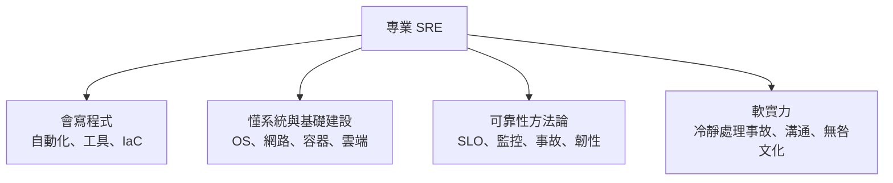
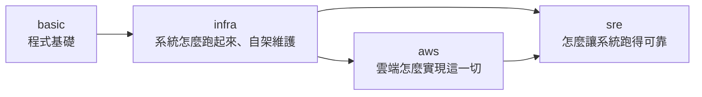

# [sre-9-3] 從這裡到哪裡：SRE 的職涯與持續精進

> **本章目標**：盤點成為專業 SRE 需要的能力組合，理解 SRE 的職涯路線與相鄰角色，並規劃你接下來該往哪裡精進。

## 你會學到

- 一個專業 SRE 的能力組合
- SRE 與相鄰角色（平台工程、DevOps、雲端架構）的關係
- 持續精進的方向
- 三本書（infra / aws / sre）怎麼共同撐起你的能力

## 概念說明

### 一個專業 SRE 的能力組合

走到這裡，你已經學完了 SRE 的核心知識。回顧一下，一個專業 SRE 的能力其實是幾個面向的組合：

| 能力 | 你在哪學的 |
|------|-----------|
| **會寫程式** | basic 課程 + 各課的自動化實作 |
| **懂系統與基礎建設** | **infra 課程**（OS、網路、服務、容器、自動化）|
| **懂雲端** | **AWS 課程**（雲端服務、擴展、託管）|
| **可靠性方法論** | **這門 SRE 課**（SLO、監控、告警、事故、韌性）|
| **軟實力** | SRE 課的事故處理、無咎文化、團隊協作 |

注意——**SRE 不是單一技能，而是「程式 + 系統 + 可靠性 + 軟實力」的綜合體**。這也是為什麼這條路需要 basic、infra、aws、sre 四本書一起撐。

---

### SRE 與相鄰角色

SRE 周圍有一些關係密切、常常重疊的角色。理解它們，有助於你規劃方向：

| 角色 | 重點 | 與 SRE 的關係 |
|------|------|--------------|
| **SRE** | 系統的可靠性 | （你在學的）|
| **平台工程（Platform Engineering）** | 打造讓開發者自助的內部平台 | SRE 能力的延伸（Part 6-3 提過）|
| **DevOps 工程師** | 自動化、CI/CD、部署流程 | 理念相通，SRE 是其具體實作（Part 1-2）|
| **雲端架構師** | 設計雲端系統架構 | SRE 常需要這方面知識（AWS 課程）|
| **基礎設施工程師** | 基礎建設本身 | SRE 的基礎（infra 課程）|

這些角色在不同公司界線模糊、常常重疊。好消息是——**你學的這套能力（尤其 infra + aws + sre）能讓你勝任其中好幾種**。你不必執著於某個頭銜，而是培養「讓系統可靠運轉」的綜合能力，這在哪個角色都搶手。

---

### 持續精進的方向

SRE 是一個需要持續學習的領域。學完這門課的基礎後，可以往這些方向深化：

**① 深化技術廣度與深度**

- **容器編排**：Kubernetes（容器多到要跨機器管理時的標準，課外讀物 E-13-3、AWS 課程）。
- **雲端深入**：把這門課的可靠性概念，落實到 AWS 的真實服務（AWS 課程）。
- **可觀測性工具**：深入 OpenTelemetry、各種追蹤/日誌系統（Part 3-5）。
- **IaC 進階**：Terraform、GitOps（infra 課程 Part 6、9）。

**② 讀經典**

SRE 領域有幾本「聖經」——Google 的《Site Reliability Engineering》（俗稱 SRE Book）和《The Site Reliability Workbook》。這門課給你的是體系化的入門，這些書能讓你看到大規模實踐的細節與案例。

**③ 實戰累積**

可靠性工程最終要靠實戰。把這門課學的，用在你自己的專案、你的伺服器、你的工作上——定 SLO、架監控、做混沌實驗、寫 postmortem。**每處理一次真實事故、每消除一個真實 toil，你的功力就深一層。**

**④ 培養軟實力**

技術之外，SRE 的事故指揮、跨團隊溝通、無咎文化推動，這些軟實力同樣關鍵，而且更難取代。

---

### 三本書如何共同撐起你

最後，把你的學習地圖串起來——這門 SRE 課不是孤立的，它和另外兩本書環環相扣：

- **basic** 給你寫程式的能力（SRE 的根本，Part 6-3）。
- **infra** 讓你懂「系統怎麼跑起來、怎麼自架維護」（SRE 的基礎）。
- **aws** 讓你懂「雲端怎麼實現這些，並提供擴展、託管、高可用的能力」。
- **sre**（這門課）讓你懂「怎麼用數據和工程，讓這一切跑得可靠」。

四者合起來，你就具備了「**能讓系統又跑得起來、又跑得可靠、又能規模化**」的完整能力——這正是一個專業 SRE 的價值所在。

## 小練習

### 練習 1：盤點你的能力

對照本章的「SRE 能力組合」（程式、系統、雲端、可靠性、軟實力），誠實評估自己每一項目前的程度。哪些已經有基礎、哪些還要加強？

---

### 練習 2：規劃精進路線

根據上一題的盤點，列出你接下來最想精進的 2~3 個方向，以及打算怎麼學（讀書？做專案？學某個工具？）。

---

### 練習 3：理解角色的彈性

回答：為什麼說「不必執著於某個頭銜（SRE / DevOps / 平台工程）」？你學的這套能力，能讓你勝任哪些角色？

## 課外讀物

> 想往「規模化、容器編排」方向深化 → [課外讀物 E-13-3：Kubernetes 概念入門](../../../課外讀物/E-13-scaling/E-13-3-kubernetes-intro.md)；想把可靠性落地到雲端 → 參見 **AWS 課程**（`lessons/aws/課程大綱.md`）
