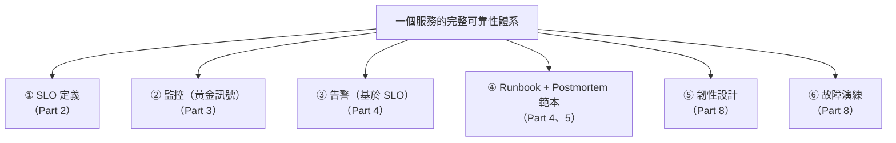

# [sre-9-4] 🏆 總整理專案：為服務建立完整的可靠性體系

> **本章目標**：把整門 SRE 課學的全部整合成一個專案——為一個服務建立完整的可靠性體系：SLO、監控、告警、runbook、postmortem 範本、故障演練。這是你成為專業 SRE 的畢業考。

## 你會學到

- 把 Part 1~8 的所有能力整合成一套完整的可靠性體系
- 一個真實服務該有的可靠性「全套配備」
- 怎麼驗收「我具備專業 SRE 的能力了」
- 你的下一步

## 概念說明

### 你的 SRE 畢業專案

恭喜你走到 SRE 課的最後。回顧這趟旅程：你從「什麼叫可靠」開始，學會用數據定義它（Part 2）、觀測它（Part 3）、為它告警（Part 4）、處理事故（Part 5）、消除苦工（Part 6）、規劃容量（Part 7）、為失敗而設計（Part 8）、建立文化（Part 9）。

這一章，把所有東西**組裝成一個完整的「可靠性體系」**。目標是：拿一個服務，為它配齊一個專業 SRE 該建立的一切。



> 用你前面 infra/SRE 部署過的服務當對象，在 WSL/測試環境 + AWS 上做。

## 範例：完整的可靠性體系

針對一個服務（例如你的筆記 App API），逐項配齊。這就是一個專業 SRE 交付的「全套」：

### ① SLO 文件（Part 2）

```markdown
# 可靠性目標
- 可用率 SLO：99.9%（錯誤預算：每月約 43 分鐘 / 0.1% 請求）
- 延遲 SLO：p95 < 300ms
- Error Budget Policy：
  - 預算用 > 75% → 放慢上線、加強測試
  - 預算用光 → 凍結新功能，全員修穩定性
```

### ② 監控（Part 3）

```
依「四個黃金訊號」設計的 Grafana 儀表板：
- 延遲（p95，標出 300ms SLO 線）
- 流量（RPS）
- 錯誤率（標出 0.1% SLO 線）
- 飽和度（CPU / 記憶體 / 資料庫連線）
資料來源：Prometheus（應用輸出指標 + node_exporter）
```

### ③ 告警（Part 4）

```
基於 SLO、對症狀告警、分級：
- [page] 錯誤率 > 1% 持續 5 分鐘（叫醒人）
- [page] 延遲 p95 > 300ms 持續 5 分鐘
- [page] 錯誤預算快速燃燒（burn rate）
- [ticket] 磁碟預估 3 天內滿（工單，不叫人）
每條都附 runbook 連結。
```

### ④ Runbook + Postmortem 範本（Part 4、5）

```
- 每個 page 級告警，都有對應 runbook：
  「收到這個告警 → 怎麼判斷 → 怎麼止血 → 怎麼診斷 → 何時升級」
- 一份標準 postmortem 範本（摘要/影響/時間軸/根因/行動項目）
- on-call 制度：輪值表、升級路徑
```

### ⑤ 韌性設計（Part 8）

```
- 對外部呼叫：逾時 + 重試（指數退避）+ 斷路器
- 過載保護：限流 + 優雅降級（過載時關閉次要功能）
- 冗餘：Multi-AZ 部署 + 自動故障轉移
- 安全發布：金絲雀發布 + 快速回滾機制
```

### ⑥ 故障演練（Part 8）

```
定期的混沌實驗計畫：
- 砍掉一個實例 → 驗證負載平衡與自動重啟
- 模擬資料庫故障 → 驗證故障轉移與斷路器
- 每季演練一次，每次寫成記錄、找改善點
```

---

### 完整交付：一個 Git repo

把以上全部，整理成一個 repo（呼應 infra 課的「一切皆程式碼」）：

```
my-service-reliability/
├── slo.md                      ← SLO 與 error budget policy
├── monitoring/
│   ├── dashboards/             ← Grafana 儀表板定義
│   └── prometheus-rules.yml    ← 告警規則
├── runbooks/                   ← 各告警的處理手冊
│   └── high-error-rate.md
├── postmortem-template.md      ← 事後檢討範本
├── chaos/                      ← 混沌實驗腳本與記錄
└── README.md                   ← 整體說明
```

這個 repo 就是這個服務「可靠性的單一事實來源」——任何人接手，都能從這裡看懂「這個服務的可靠性是怎麼被經營的」。

---

### 驗收清單：你成為專業 SRE 了嗎？

對照這份清單，每項都能做到，你就具備了專業 SRE 的核心能力：

- [ ] 能從使用者角度定義可靠性、設定合理的 SLO（Part 2）
- [ ] 理解錯誤預算，能用它平衡開發速度與穩定性（Part 2-4）
- [ ] 能依四個黃金訊號設計監控、寫 PromQL（Part 3）
- [ ] 能設計「不擾民」的告警——對症狀、基於 SLO（Part 4）
- [ ] 能冷靜處理事故：止血優先、事故指揮（Part 5）
- [ ] 能寫無咎的 postmortem、讓行動項目落地（Part 5）
- [ ] 能辨認並消除 toil、用程式自動化（Part 6）
- [ ] 能做容量規劃與負載測試、找出瓶頸（Part 7）
- [ ] 能為失敗而設計：韌性模式、冗餘、安全發布（Part 8）
- [ ] 能做混沌工程、主動驗證韌性（Part 8）
- [ ] 理解可靠性是團隊文化，能避開反模式（Part 9）

---

### 你的下一步

你完成了 basic、infra、sre 的學習旅程（aws 大綱也備好了）。接下來：

| 方向 | 去哪 |
|------|------|
| **把可靠性落地到雲端** | **AWS 課程**（`lessons/aws/課程大綱.md`）|
| **深化容器編排** | 課外讀物 E-13-3 Kubernetes |
| **讀 SRE 經典** | Google 的 SRE Book / Workbook |
| **實戰累積** | 把這套體系用在你真實的專案與伺服器上 |

最重要的是——**去實踐**。可靠性工程的功力，是在一次次定 SLO、處理事故、消除 toil、做演練中長出來的。你現在有了完整的地圖和工具，剩下的就是上路。

## 小練習

### 練習 1：建立完整可靠性體系

為一個服務（你的專案或前面部署的測試服務），配齊本章的六項：SLO、監控、告警、runbook、韌性設計、故障演練。整理成一個 Git repo。

---

### 練習 2：對照驗收清單

誠實對照上面的驗收清單，哪幾項你還不夠熟？回去重看對應的 Part，補強它。

---

### 練習 3：（終極挑戰）跑一次完整演練

對你建立的服務，做一次完整的「可靠性演練」：

1. 用負載測試找出它的天花板（Part 7）
2. 做一次混沌實驗，驗證韌性（Part 8）
3. 針對演練中發現的問題，寫一份 postmortem 風格的改善計畫（Part 5）

能順利做到這些，你就通過了專業 SRE 的畢業考。🎓

> 恭喜你完成整門 SRE 課程！你從「什麼叫可靠」開始，到能為一個服務建立完整的可靠性體系。你現在不只會讓系統「跑起來」（infra），更會讓它「跑得可靠」（SRE）。這是非常珍貴的能力——去把它用在你的系統、你的職涯上吧。

## 課外讀物

> 把這套可靠性體系落地到雲端真實服務，是你的下一段旅程 → 參見 **AWS 課程**（`lessons/aws/課程大綱.md`）
