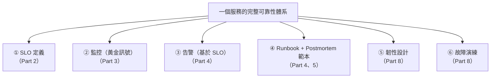

# [sre-9-4] 🏆 總整理專案：為服務建立完整的可靠性體系

> **本章目標**：把整門 SRE 課學的全部整合成一個專案——為一個服務建立完整的可靠性體系：SLO、監控、告警、runbook、postmortem 範本、故障演練。這是你成為專業 SRE 的畢業考。

## 你會學到

- 把 Part 1~8 的所有能力整合成一套完整的可靠性體系
- 一個真實服務該有的可靠性「全套配備」
- 怎麼驗收「我具備專業 SRE 的能力了」
- 你的下一步

## 概念說明

### 你的 SRE 畢業專案

恭喜你走到 SRE 課的最後。回顧這趟旅程：你從「什麼叫可靠」開始，學會用數據定義它（Part 2）、觀測它（Part 3）、為它告警（Part 4）、處理事故（Part 5）、消除苦工（Part 6）、規劃容量（Part 7）、為失敗而設計（Part 8）、建立文化（Part 9）。

這一章，把所有東西**組裝成一個完整的「可靠性體系」**。目標是：拿一個服務，為它配齊一個專業 SRE 該建立的一切。


```mermaid
graph TB
    SVC["一個服務的完整可靠性體系"]
    SVC --> SLO["① SLO 定義<br/>（Part 2）"]
    SVC --> MON["② 監控（黃金訊號）<br/>（Part 3）"]
    SVC --> ALERT["③ 告警（基於 SLO）<br/>（Part 4）"]
    SVC --> RUN["④ Runbook + Postmortem 範本<br/>（Part 4、5）"]
    SVC --> RESIL["⑤ 韌性設計<br/>（Part 8）"]
    SVC --> CHAOS["⑥ 故障演練<br/>（Part 8）"]
```

> 用你前面 infra/SRE 部署過的服務當對象，在 WSL/測試環境 + AWS 上做。

## 範例：完整的可靠性體系

針對一個服務（例如你的筆記 App API），逐項配齊。這就是一個專業 SRE 交付的「全套」：

### ① SLO 文件（Part 2）

```markdown
# 可靠性目標
- 可用率 SLO：99.9%（錯誤預算：每月約 43 分鐘 / 0.1% 請求）
- 延遲 SLO：p95 < 300ms
- Error Budget Policy：
  - 預算用 > 75% → 放慢上線、加強測試
  - 預算用光 → 凍結新功能，全員修穩定性
```

### ② 監控（Part 3）

```
依「四個黃金訊號」設計的 Grafana 儀表板：
- 延遲（p95，標出 300ms SLO 線）
- 流量（RPS）
- 錯誤率（標出 0.1% SLO 線）
- 飽和度（CPU / 記憶體 / 資料庫連線）
資料來源：Prometheus（應用輸出指標 + node_exporter）
```

### ③ 告警（Part 4）

```
基於 SLO、對症狀告警、分級：
- [page] 錯誤率 > 1% 持續 5 分鐘（叫醒人）
- [page] 延遲 p95 > 300ms 持續 5 分鐘
- [page] 錯誤預算快速燃燒（burn rate）
- [ticket] 磁碟預估 3 天內滿（工單，不叫人）
每條都附 runbook 連結。
```

### ④ Runbook + Postmortem 範本（Part 4、5）

```
- 每個 page 級告警，都有對應 runbook：
  「收到這個告警 → 怎麼判斷 → 怎麼止血 → 怎麼診斷 → 何時升級」
- 一份標準 postmortem 範本（摘要/影響/時間軸/根因/行動項目）
- on-call 制度：輪值表、升級路徑
```

### ⑤ 韌性設計（Part 8）

```
- 對外部呼叫：逾時 + 重試（指數退避）+ 斷路器
- 過載保護：限流 + 優雅降級（過載時關閉次要功能）
- 冗餘：Multi-AZ 部署 + 自動故障轉移
- 安全發布：金絲雀發布 + 快速回滾機制
```

### ⑥ 故障演練（Part 8）

```
定期的混沌實驗計畫：
- 砍掉一個實例 → 驗證負載平衡與自動重啟
- 模擬資料庫故障 → 驗證故障轉移與斷路器
- 每季演練一次，每次寫成記錄、找改善點
```

---

### 完整交付：一個 Git repo

把以上全部，整理成一個 repo（呼應 infra 課的「一切皆程式碼」）：

```
my-service-reliability/
├── slo.md                      ← SLO 與 error budget policy
├── monitoring/
│   ├── dashboards/             ← Grafana 儀表板定義
│   └── prometheus-rules.yml    ← 告警規則
├── runbooks/                   ← 各告警的處理手冊
│   └── high-error-rate.md
├── postmortem-template.md      ← 事後檢討範本
├── chaos/                      ← 混沌實驗腳本與記錄
└── README.md                   ← 整體說明
```

這個 repo 就是這個服務「可靠性的單一事實來源」——任何人接手，都能從這裡看懂「這個服務的可靠性是怎麼被經營的」。

---

### 驗收清單：你成為專業 SRE 了嗎？

對照這份清單，每項都能做到，你就具備了專業 SRE 的核心能力：

- [ ] 能從使用者角度定義可靠性、設定合理的 SLO（Part 2）
- [ ] 理解錯誤預算，能用它平衡開發速度與穩定性（Part 2-4）
- [ ] 能依四個黃金訊號設計監控、寫 PromQL（Part 3）
- [ ] 能設計「不擾民」的告警——對症狀、基於 SLO（Part 4）
- [ ] 能冷靜處理事故：止血優先、事故指揮（Part 5）
- [ ] 能寫無咎的 postmortem、讓行動項目落地（Part 5）
- [ ] 能辨認並消除 toil、用程式自動化（Part 6）
- [ ] 能做容量規劃與負載測試、找出瓶頸（Part 7）
- [ ] 能為失敗而設計：韌性模式、冗餘、安全發布（Part 8）
- [ ] 能做混沌工程、主動驗證韌性（Part 8）
- [ ] 理解可靠性是團隊文化，能避開反模式（Part 9）

---

### 你的下一步

你完成了 basic、infra、sre 的學習旅程（aws 大綱也備好了）。接下來：

| 方向 | 去哪 |
|------|------|
| **把可靠性落地到雲端** | **AWS 課程**（`lessons/aws/課程大綱.md`）|
| **深化容器編排** | 課外讀物 E-13-3 Kubernetes |
| **讀 SRE 經典** | Google 的 SRE Book / Workbook |
| **實戰累積** | 把這套體系用在你真實的專案與伺服器上 |

最重要的是——**去實踐**。可靠性工程的功力，是在一次次定 SLO、處理事故、消除 toil、做演練中長出來的。你現在有了完整的地圖和工具，剩下的就是上路。

## 小練習

### 練習 1：建立完整可靠性體系

為一個服務（你的專案或前面部署的測試服務），配齊本章的六項：SLO、監控、告警、runbook、韌性設計、故障演練。整理成一個 Git repo。

<details>
<summary>參考解答</summary>

這是畢業專案，成果因人而異，但這裡給你一份**解題大綱 + 檢查清單**，照著走就不會漏。目標是產出本章那個 `my-service-reliability/` repo 結構。

**動手步驟（建議順序）**：

1. **先挑一個服務當對象**：用你 infra/SRE 部署過的服務（例如筆記 App API）。範圍別貪大，一個服務配齊，勝過五個服務只做一半。
2. **① 寫 SLO 文件（`slo.md`）**：定可用率 SLO（如 99.9%）、延遲 SLO（如 p95 < 300ms）、把錯誤預算換算成具體數字（99.9% ≈ 每月 43 分鐘），並寫下 Error Budget Policy（預算用 > 75% 放慢上線、用光凍結新功能）。
3. **② 架監控（`monitoring/`）**：依四個黃金訊號（延遲、流量、錯誤、飽和度）做 Grafana 儀表板，資料來源 Prometheus（應用指標 + node_exporter），並在圖上標出 SLO 線。
4. **③ 設告警（`prometheus-rules.yml`）**：基於 SLO、對症狀告警、分級（page vs ticket），每條附 runbook 連結。
5. **④ 寫 runbook + postmortem 範本**：每個 page 級告警都有一份「怎麼判斷 → 怎麼止血 → 怎麼診斷 → 何時升級」的手冊；一份標準 postmortem 範本。
6. **⑤ 加韌性設計**：對外部呼叫加逾時 + 重試（指數退避）+ 斷路器；過載保護（限流 + 優雅降級）；冗餘（Multi-AZ + 故障轉移）；安全發布（金絲雀 + 回滾）。
7. **⑥ 排故障演練（`chaos/`）**：寫下混沌實驗計畫（砍實例、模擬 DB 故障），每次演練留記錄。
8. **寫 `README.md`**：串起全部，讓任何人接手都看得懂「這個服務的可靠性是怎麼被經營的」。

**自我檢查清單**：

- [ ] 六項（SLO / 監控 / 告警 / runbook + postmortem / 韌性 / 演練）都有實際產出，不是只寫「待辦」。
- [ ] SLO 有換算成具體錯誤預算數字，且有 Error Budget Policy。
- [ ] 監控是「黃金訊號」而非塞一堆虛榮指標（避開 9-2 反模式）。
- [ ] 告警是「症狀型、基於 SLO、分級」，不是上百條擾民告警。
- [ ] 每個 page 告警都連到一份 runbook。
- [ ] 韌性設計四類（逾時重試斷路器 / 過載保護 / 冗餘 / 安全發布）都有涵蓋。
- [ ] 全部收進一個 Git repo，README 能讓外人看懂——這就是「可靠性的單一事實來源」。

</details>

---

### 練習 2：對照驗收清單

誠實對照上面的驗收清單，哪幾項你還不夠熟？回去重看對應的 Part，補強它。

<details>
<summary>參考解答</summary>

這是自我盤點題，關鍵是**誠實**——騙自己說「都會了」對你沒好處。作法是把驗收清單十一項逐項打勾，把「打不下勾」的那幾項對應回它的 Part 去補。這是清單與對應章節的地圖：

| 能力項 | 不熟就回去看 |
|--------|------------|
| 從使用者角度定義 SLO | Part 2 |
| 用錯誤預算平衡速度與穩定 | Part 2-4 |
| 依黃金訊號設計監控、寫 PromQL | Part 3 |
| 設計不擾民、基於 SLO 的告警 | Part 4 |
| 冷靜處理事故、事故指揮 | Part 5 |
| 寫無咎 postmortem、行動項目落地 | Part 5 |
| 辨認並消除 toil、自動化 | Part 6 |
| 容量規劃與負載測試 | Part 7 |
| 為失敗而設計：韌性、冗餘、安全發布 | Part 8 |
| 混沌工程、主動驗證韌性 | Part 8 |
| 團隊文化、避開反模式 | Part 9 |

**判斷「熟不熟」的標準**：不是「看過、有印象」，而是「**能不能實際做出來**」。例如「會寫 PromQL」的標準不是認得它，而是能對著一個真實服務寫出查 p95 延遲的查詢。用這個嚴一點的標準去打勾，找出的短板才是真短板。補強時，別只重讀——**動手把那一項在你 9-4 的 repo 裡真的做一遍**，才算補起來。

</details>

---

### 練習 3：（終極挑戰）跑一次完整演練

對你建立的服務，做一次完整的「可靠性演練」：

1. 用負載測試找出它的天花板（Part 7）
2. 做一次混沌實驗，驗證韌性（Part 8）
3. 針對演練中發現的問題，寫一份 postmortem 風格的改善計畫（Part 5）

能順利做到這些，你就通過了專業 SRE 的畢業考。🎓

<details>
<summary>參考解答</summary>

這是終極實作題，這裡給你一份**演練大綱 + 檢查清單**，把三步串成一個完整的可靠性循環：「找極限 → 破壞驗證 → 檢討改善」。

**第 1 步：負載測試找天花板（Part 7）**
- 用負載測試工具（如 k6、Locust）逐步加壓，觀察黃金訊號在哪個 RPS 開始劣化（延遲飆高 / 錯誤率上升 / 飽和度爆表）。
- 產出：這個服務的「天花板」數字，以及先撐不住的瓶頸（CPU？DB 連線？記憶體？）。

**第 2 步：混沌實驗驗證韌性（Part 8）**
- 挑一個你設計過韌性的地方主動破壞它，例如：砍掉一個實例（驗證負載平衡 + 自動重啟）、模擬 DB 故障（驗證故障轉移 + 斷路器）。
- 產出：韌性機制「有沒有如預期生效」的觀察結果——重點是**驗證假設**，發現「以為會自動轉移、其實沒有」正是演練的價值。

**第 3 步：寫 postmortem 風格的改善計畫（Part 5）**
- 把前兩步發現的問題，用 postmortem 格式寫下來：摘要 / 影響 / 時間軸 / 根因 / 行動項目。
- 重點是**無咎**（對事不對人）且**行動項目要能落地**（具體、有負責人、可追蹤）。

**檢查清單**：

- [ ] 負載測試有跑出具體的天花板數字與瓶頸，不是憑感覺。
- [ ] 混沌實驗是「先講好預期、再破壞、再對照結果」，而不是亂砍一通。
- [ ] 演練中若發現韌性沒如預期生效，有誠實記下來（這才是重點）。
- [ ] 改善計畫用 postmortem 格式，無咎、行動項目可落地。
- [ ] 整個循環（找極限 → 破壞 → 檢討）都留下記錄，收進你的 repo。

做到這裡，你就完整跑了一遍真實 SRE 的核心工作流——恭喜，畢業考通過！🎓

</details>

> 恭喜你完成整門 SRE 課程！你從「什麼叫可靠」開始，到能為一個服務建立完整的可靠性體系。你現在不只會讓系統「跑起來」（infra），更會讓它「跑得可靠」（SRE）。這是非常珍貴的能力——去把它用在你的系統、你的職涯上吧。

## 課外讀物

> 把這套可靠性體系落地到雲端真實服務，是你的下一段旅程 → 參見 **AWS 課程**（`lessons/aws/課程大綱.md`）
