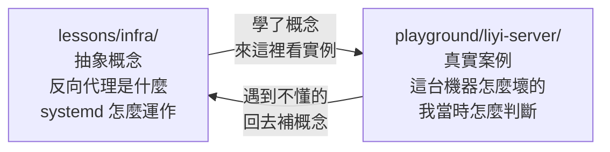
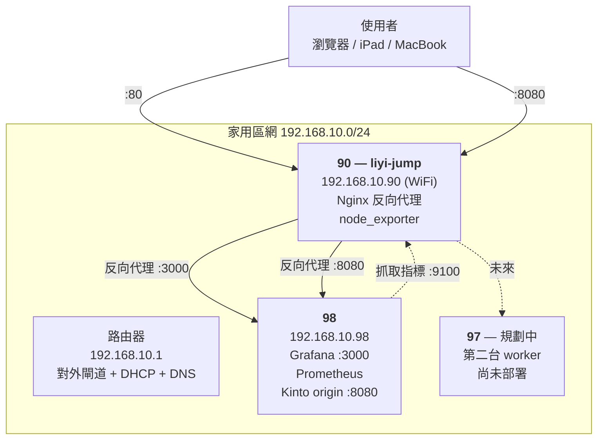

# Liyi Server — 自架伺服器實戰誌

> **這裡是什麼**：一個真實的、會壞掉的家用伺服器環境。所有折騰過程、誤判、決策都記在這裡。
> **為什麼要記**：`lessons/infra/` 教的是「概念」，這裡記的是「概念撞上現實時發生什麼事」。

---

## 這份筆記跟課程的分工



這張圖說明兩邊的關係：課程可以重複讀、適用任何機器；實戰誌有時間軸、只屬於這幾台機器，但**它保留了「當時我不知道答案」的狀態**——那才是學習真正發生的地方。

舉個具體差別：

| | 課程會這樣寫 | 實戰誌會這樣寫 |
|---|---|---|
| 內容 | `systemd-networkd-wait-online` 會等待網路就緒後才放行 `network-online.target` | 我一開始猜是 WiFi 慢，**猜錯了**。日誌顯示 WiFi 10 秒就好，真兇是一張沒插線的網卡讓它硬等滿 120 秒逾時 |
| 你會記住 | 大概不會 | 大概會 |

---

## 機器清單



這張圖是目前的流量走向：**所有請求都先到 90，再由它轉發到後端**。
90 自己不跑應用服務——**它是純粹的門，只有 proxy，沒有內容**。
內網 DNS 已移除，所以多個服務用不同的 port 區分（見 [ADR-004](決策紀錄/ADR-004-移除區網DNS改回IP直連.md)）：

| 網址 | 是什麼 |
|---|---|
| `http://192.168.10.90/` | Grafana |
| `http://192.168.10.90:8080/` | Kinto Gaming 官網（2026-08-28 新增） |

| 機器 | 位址 | 角色 | 狀態 |
|---|---|---|---|
| **90** `liyi-jump` | `192.168.10.90` (WiFi) | **門**：跳板機 + 反向代理（唯一對外入口，不放內容） | 運作中 |
| **98** | `192.168.10.98` | **打雜**：服務主機（Grafana、Prometheus、Kinto origin）、未來的 CI runner | 運作中 |
| **97** | `192.168.10.97` | 第二台 worker | 🚧 規劃中 ⚠️ 見下方警告 |

> 📌 **「門 vs 打雜」是這組機器的職責分界**（2026-08-28 定案，繞了兩圈才確定）。
> 加新東西時照這個問：是入口／路由 → 90；是實際的服務、會 build 會吃資源 → 打雜機，90 加一段 proxy。
> 推導過程（包含兩次想錯）見 [實戰 04](實戰筆記/04-兩台機器的部署分工與三個綠燈陷阱.md)。

> ⚠️ **已知地雷**：90 的有線網卡 `enp1s0f0` 目前被設定成 `192.168.10.97`（安裝時 subiquity 留下的），跟未來第三台機器的規劃 IP 撞號。因為沒插線所以還沒爆炸。詳見 [ADR-003](決策紀錄/ADR-003-網路介面與IP規劃.md)。

---

## 90 上面跑了什麼

| 服務 | 埠 | 開機自啟 | 用途 |
|---|---|---|---|
| `nginx` | 80 | ✅ | 反向代理 → Grafana（統一入口） |
| `nginx` | 8080 | ✅ | 反向代理 → 98 的 Kinto origin（2026-08-28 新增） |
| `node_exporter` | 9100 | ✅ | 給 98 的 Prometheus 抓主機指標 |
| `chrome-remote-desktop@liyi` | — | ✅ | 遠端桌面（XFCE 虛擬 X session on `:20`） |
| `sshd` | 22 | ✅ | 遠端登入 |

防火牆（`ufw`）預設拒絕所有進入連線，只開這幾道門：

```
22/tcp    ALLOW IN   Anywhere              # SSH
80/tcp    ALLOW IN   192.168.10.0/24       # Nginx gateway
9100/tcp  ALLOW IN   192.168.10.98         # node_exporter ← Prometheus
```

> 注意 80 和 9100 都限制了來源，但 **22 沒有**——這是目前最鬆的一環。待辦事項見下方。

---

## 索引

### 📓 實戰筆記（依時間排序）

| # | 標題 | 一句話 | 對應課程 |
|---|---|---|---|
| 01 | [開機慢了兩分鐘的追查](實戰筆記/01-開機慢兩分鐘的追查.md) | 從「Grafana 連不上」一路挖到一張沒插線的網卡；實測 2min11s → 10.4s | `infra-1-2`、`infra-4-1` |
| 02 | [一台機器上的三套 DNS](實戰筆記/02-三套DNS與自架區網解析.md) | systemd-resolved vs dnsmasq，以及一個會製造間歇性故障的設定陷阱 ⚠️ 這套 DNS 已於 2026-08-12 移除 | `infra-3-1`、`infra-3-4` |
| 03 | [VPN 一開，內網名字就死了](實戰筆記/03-VPN蓋掉內網DNS.md) | 伺服器沒答錯，是客戶端問錯人；macOS 的 `/etc/resolver` 網域分流 | `infra-3-1`、`infra-3-4` |
| 04 | [兩台機器的部署分工與三個綠燈陷阱](實戰筆記/04-兩台機器的部署分工與三個綠燈陷阱.md) | 職責分配連想錯兩次；`set -e` 吃掉 reload、reload 換不掉 listen 位址、proxy 讓 gzip 靜默失效 | `infra-4-3`、`infra-9-1`、`cache-3-5` |

### 📐 決策紀錄（ADR）

| # | 決策 | 結論 |
|---|---|---|
| 001 | [路徑式路由 vs 子網域路由](決策紀錄/ADR-001-路徑式vs子網域路由.md) | 改用子網域 ⛔ 已由 004 取代 |
| 002 | [要不要給自動化工具 sudo 權限](決策紀錄/ADR-002-sudo權限策略.md) | askpass 逐次確認 |
| 003 | [網路介面與 IP 規劃](決策紀錄/ADR-003-網路介面與IP規劃.md) | 待處理 |
| 004 | [移除區網 DNS，改回 IP 直連](決策紀錄/ADR-004-移除區網DNS改回IP直連.md) | 拆掉 dnsmasq，回到 `http://192.168.10.90/` |

### 📋 現況文件

- [架構現況.md](架構現況.md) — 活文件，每次改動後更新
- [grafana/](grafana/) — Dashboard 定義備份（可攜格式，Grafana 重建後也 import 得回來）

---

## 待辦清單

依「爆炸半徑 ÷ 修復成本」排序：

- [x] **WiFi 密碼隔離** — `.gitignore` 排除，只追蹤去識別化的 `.example`
- [x] **修 `.97` 衝突** — 見 ADR-003
- [ ] **SSH 加固** — ufw 已限區網；**關閉密碼登入待金鑰驗證**（對應 `infra-2-6`）
- [x] **設定檔納入版控** — `~/infra` repo，已推 GitHub private（對應 `infra-6-3`）
- [x] ~~**路徑式 → 子網域路由** — dnsmasq + `.liyibass.internal`，見 ADR-001~~
      **已回退**（08-11 決策，08-12 移除完成）：拆掉 dnsmasq，改回 `http://192.168.10.90/` 直連。
      原因是 ADR-001 的前提（分流規則會長到 10 條以上）一直沒有成立，見 ADR-004
- [ ] **90 改走有線** — 提升可靠度，同時解決 `.97` 衝突
- [ ] **98 的資料備份** — Grafana / Prometheus volumes 目前只有一份（對應 `infra-8-1`、`infra-8-2`）
- [ ] **TLS** — 目前 Grafana 帳密在區網上是明文（對應 `infra-4-4`）
- [ ] **k3s** — 未來在 98 上跑，97 加入為第二節點（不要先搬監控進去）

---

## 怎麼用這份筆記

1. **遇到問題時**：先看實戰筆記有沒有類似症狀
2. **看到奇怪設定時**：查 ADR，通常會寫「當初為什麼這樣決定」
3. **想學背後原理時**：每篇筆記結尾都有連到 `lessons/infra/` 的對應章節
4. **每次動這幾台機器後**：補一篇筆記或更新架構現況——**趁還記得的時候**

> 這門課的正式教材 → [Infra 課程大綱](../../lessons/infra/課程大綱.md)
> 想學怎麼讓系統更可靠 → [SRE 課程大綱](../../lessons/sre/課程大綱.md)
