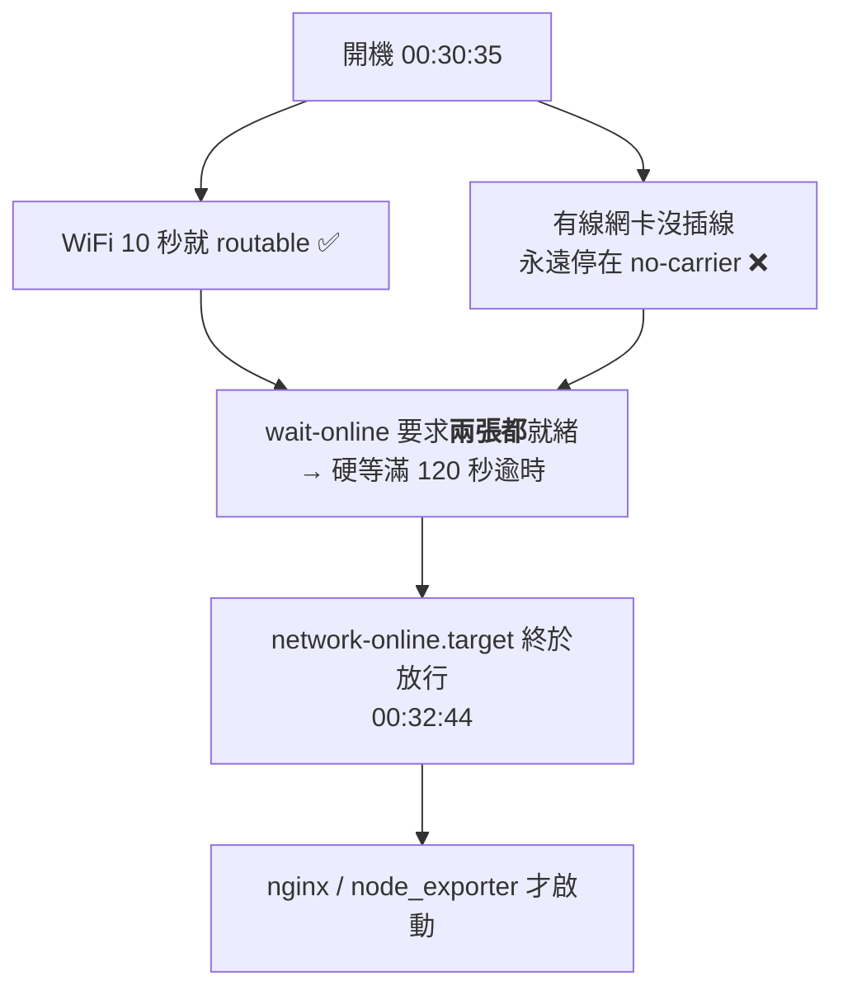

# [實戰 01] 開機慢了兩分鐘的追查

> **本篇目標**：完整重現一次真實的故障排查——包含**我一開始猜錯的那個假設**——並學會「先量測，再下結論」的除錯紀律。
> **發生時間**：2026-08-01 凌晨　**機器**：`90` (`liyi-jump`)　**耗時**：約 20 分鐘

## 你會學到

- 怎麼用 `systemd-analyze` 找出「開機到底慢在哪」
- `network-online.target` 是什麼，為什麼它會拖累其他服務
- 為什麼「一張沒插網路線的網卡」可以讓整台機器慢兩分鐘
- 除錯時「合理的猜測」跟「量測到的事實」差多遠
- 什麼是**依賴鏈（dependency chain）**，以及怎麼把它印出來看

---

## 症狀

重開機之後，從別台電腦連 `http://192.168.10.90/grafana/` 連不上。等了一陣子又自己好了。

當事人的第一直覺是：

> 「重開機以後 Grafana 是不是就沒有啟動了？」

這個直覺**方向錯了，但錯得很有價值**——後面會說明為什麼。

---

## 第一次轉彎：Grafana 根本不在這台機器上

先查有沒有 Grafana：

```bash
systemctl is-enabled grafana-server   # → not-found
docker ps -a                          # → command not found
ls /etc/grafana /var/lib/grafana      # → No such file or directory
```

三個都是空的。再看這台機器實際在聽哪些埠：

```bash
ss -tlnp
```

```
LISTEN  192.168.10.90:9100     ← node_exporter
LISTEN        0.0.0.0:80       ← nginx
LISTEN        0.0.0.0:22       ← sshd
```

沒有 3000（Grafana 的預設埠）。**Grafana 在 98 那台**，90 只是用 Nginx 把 `/grafana/` 的流量轉發過去。

> 💡 **第一個教訓**：症狀出現的地方，常常不是問題發生的地方。「看不到 Grafana」有至少三種可能——Grafana 掛了、**轉發的那台掛了**、網路不通。要先確定自己在查哪一段。

所以問題被改寫成：**為什麼重開機後，90 的 Nginx 有一段時間不能轉發？**

---

## 第二次轉彎：我猜是 WiFi，猜錯了

看到這台是走 WiFi 的（`wlp2s0b1`），我當下的假設是：

> 「WiFi 開機後要花時間關聯 AP、跑 DHCP，所以網路慢，nginx 自然晚。」

這個假設**非常合理**。合理到如果不查日誌，很容易就這樣結案了。

於是去挖時間軸驗證：

```bash
uptime -s                                  # 開機時間
systemctl show nginx -p ActiveEnterTimestamp   # nginx 何時起來
journalctl -b -o short-iso | grep -i wlp2s0b1  # WiFi 事件
```

結果打臉：

```
00:30:35   開機
00:30:45   WiFi 關聯完成、連上 AP           ← 只花 10 秒
00:31:05   已取得 192.168.10.90
00:32:44   nginx 才 active                  ← 比網路晚了 99 秒
```

**WiFi 完全無辜**，10 秒就搞定了。nginx 自己晚了將近兩分鐘。

> 💡 **第二個教訓**：這就是「先量測，再下結論」的價值。我的假設在技術上完全說得通，但事實不是那樣。除錯時最貴的成本，往往是**花時間去修一個根本沒壞的東西**。
>
> 資深工程師跟新手的差別，常常不是「猜得比較準」，而是**知道要去驗證自己的猜測**。

---

## 量測：把開機時間攤開來看

systemd 內建了開機分析工具。先看總覽：

```bash
systemd-analyze
```

```
Startup finished in 698ms (kernel) + 4.057s (initrd) + 2min 6.580s (userspace)
                                                       ^^^^^^^^^^^^^^^^^^^^^^^
```

Kernel 和 initrd 加起來不到 5 秒，但 **userspace 花了 2 分 6 秒**。問題在服務啟動階段。

再看哪個服務最慢：

```bash
systemd-analyze blame
```

```
2min 155ms   systemd-networkd-wait-online.service   ← 第一名
    4.492s   sys-devices-virtual-misc-rfkill.device
    3.876s   dev-ttyS0.device
    ...
```

第一名 **2 分 0.155 秒**，第二名只有 4.5 秒。差距懸殊到不用懷疑——就是它。

而且 `2min 0.155s` 這個數字很有意思：它**極度接近整數 120 秒**。這是個強烈訊號——正常的等待不會剛好停在整數，**這是逾時（timeout）**。

> 💡 **第三個教訓**：看到「剛好 30 秒」「剛好 120 秒」這種整數耗時，先假設是逾時而不是真的在做事。逾時代表**它在等一個永遠不會來的東西**。

---

## 依賴鏈：nginx 為什麼被拖下水

`systemd-analyze` 還能印出「某個服務在等誰」：

```bash
systemd-analyze critical-chain nginx.service
```

```
nginx.service +69ms
└─network-online.target @2min 4.692s
  └─network.target @4.511s
    └─systemd-networkd.service @4.021s +488ms
      └─ ...
```

讀法是這樣：

- `@` 後面是「這個單元**何時**變成 active」
- `+` 後面是「它**自己**花了多久」

所以 **nginx 自己只花了 69 毫秒**，完全無辜。它是在等 `network-online.target`，而那個 target 到 `2min 4.692s` 才就緒。

用日常語言描述這條鏈：

```
nginx 說：「我要等網路真的通了才啟動」
    ↓
network-online.target 說：「我要等 wait-online 說 OK」
    ↓
wait-online 說：「我在等所有網卡就緒……」
    ↓
（等了 120 秒，逾時，放棄）
    ↓
大家才終於開始跑
```

> 💡 **第四個教訓**：一個服務很慢，不代表**它**有問題。systemd 的服務之間有依賴關係，慢的往往是它等待的對象。`critical-chain` 就是用來把這條鏈攤開的工具。

---

## 真兇：一張沒插線的網卡

看 `wait-online` 到底在等什麼：

```bash
systemctl cat systemd-networkd-wait-online.service | grep ExecStart
```

```
ExecStart=/lib/systemd/systemd-networkd-wait-online -i wlp2s0b1:degraded -i enp1s0f0:degraded
                                                                          ^^^^^^^^^^^^^^^^^^^
```

`-i` 是「要等這個介面」。這行要求 **`wlp2s0b1`（WiFi）和 `enp1s0f0`（有線）都**要就緒。

再看兩張網卡的實際狀態：

```bash
networkctl list
```

```
IDX LINK       TYPE      OPERATIONAL   SETUP
  2 enp1s0f0   ether     no-carrier    configuring   ← 沒插網路線
  3 wlp2s0b1   wlan      routable      configured    ← 正常
```

`no-carrier` 的意思是「網路孔沒有偵測到訊號」——**就是沒插線**。

真相拼起來了：



這張圖說明整個因果：**一張根本沒在用的網卡，讓整台機器的所有網路服務晚了兩分鐘。**

而這正好回答了最初的症狀——那兩分鐘裡，任何人連 `http://192.168.10.90/grafana/` 都會被拒絕連線，因為 nginx 還沒開始監聽。**98 上的 Grafana 從頭到尾都是好的。**

---

## 修法

設定是 netplan 在開機時自動產生的：

```
/run/systemd/generator.late/systemd-networkd-wait-online.service.d/10-netplan.conf
```

`/run` 底下的東西**每次開機都會重新產生**，改了也沒用。要從 netplan 的來源設定下手，把沒插線的網卡標成 `optional`：

```yaml
# /etc/netplan/99-wait-online-fix.yaml
network:
  version: 2
  ethernets:
    enp1s0f0:
      optional: true      # ← 開機不用等我
```

> **為什麼另開一個檔，而不是改原本的 `00-installer-config.yaml`？**
> netplan 會把同一張網卡的設定**跨檔案合併**。另開檔案的好處是原始設定保持原樣，而且要還原只要刪掉這個檔——這是「最小改動」原則。

套用並驗證：

```bash
sudo netplan generate      # 重新產生 systemd 單元（注意：不是 apply）
grep ExecStart /run/systemd/generator.late/systemd-networkd-wait-online.service.d/10-netplan.conf
```

```diff
- ExecStart=...wait-online -i wlp2s0b1:degraded -i enp1s0f0:degraded
+ ExecStart=...wait-online -i wlp2s0b1:degraded
```

`enp1s0f0` 消失了。預期 userspace 時間從 2 分 6 秒降到約 10 秒——**實測結果見下方。**

> ⚠️ **為什麼只跑 `generate` 不跑 `apply`？**
> `netplan apply` 會重新套用網路設定，而當時的遠端桌面連線正是走這條 WiFi——`apply` 有把自己踢掉的風險。而這個修改本來就只影響**開機流程**，不需要立即生效。
>
> 這是很實用的判斷：**動網路設定前，先想清楚「我現在是不是正透過它連線」。** 遠端維運最經典的翻車方式，就是改防火牆或網路設定時把自己鎖在門外。

---

---

## 實測驗證（2026-08-01 03:41 重開機）

**沒有實測就不算修好。** 推算再合理，也只是推算。

| | 修正前 | 修正後 | |
|---|---|---|---|
| **總計** | **2min 11.336s** | **10.358s** | ⚡ 快 12.7 倍 |
| kernel | 698ms | 720ms | 不變 |
| initrd | 4.057s | 3.942s | 不變 |
| **userspace** | **2min 6.580s** | **5.696s** | ⚡ 快 **22 倍** |

原本的頭號元凶從排行榜上**完全消失**：

```diff
- 2min 155ms  systemd-networkd-wait-online.service   ← 修正前第一名
+     5.254s  node_exporter.service                   ← 修正後第一名
+     4.555s  dev-rfkill.device
```

這反過來證實了診斷是對的：那 120 秒**純粹是在等一張沒插線的網卡逾時**，不是任何服務真的在做事。kernel 與 initrd 的時間完全沒變，也符合預期——問題從頭到尾都在 userspace 的服務啟動階段。

### 意外收穫：排行榜第一名不一定是罪魁禍首

修好之後，`node_exporter` 變成最慢的服務（5.254s）。乍看之下像是下一個要修的目標，但查下去發現不是：

```bash
journalctl -b -u node_exporter -o short-monotonic
```

```
[  9.055311] Started node_exporter.service
[  9.213371] Starting node_exporter version=1.9.1     ← 只花了 0.16 秒
```

它在開機第 9 秒才**被啟動**（因為 `After=network-online.target`），程式本身 0.16 秒就跑起來了。`blame` 顯示的 5.254s 是「從被排入佇列到真正 active」的**等待時間**，不是它自己慢。

> 💡 **第五個教訓**：`systemd-analyze blame` 是排行榜，不是罪犯名單。它會把「等別人」的時間也算進去。
>
> 判斷一個服務是「真的慢」還是「在等人」，要配 `critical-chain` 一起看，或直接查日誌看它自己實際跑了多久。只看 blame 就動手，很可能修錯對象——**跟這篇一開始猜 WiFi 是同一種錯誤**。

### 一個時區陷阱

`node_exporter` 的日誌印的是 UTC：

```
time=2026-07-31T19:41:31.353Z          ← Z 結尾 = UTC
```

而系統時區是 CST（+8），所以看起來像「早了 8 小時」。很多容器化或 Go 寫的服務都預設用 UTC。

解法是改用開機後的相對秒數，完全避開時區問題：

```bash
journalctl -b -o short-monotonic     # [    9.055311] 這種格式
```

### 順帶驗證的事

重開機也是所有「開機自啟」設定的真實考驗。這次一併確認了同晚新裝的服務都能自己回來：

```
nginx / dnsmasq / node_exporter / chrome-remote-desktop  →  全部 enabled + active
dnsmasq 成功綁上 192.168.10.90:53
grafana.liyibass.internal → 302 → 200
```

### 又一個發現：dnsmasq 插進了 nginx 的依賴鏈

```
nginx.service +67ms
└─nss-lookup.target @4.633s
  └─dnsmasq.service @4.370s +262ms      ← 修正前這一層不存在
    └─network-online.target @4.347s
```

裝了 dnsmasq 之後，它提供 `nss-lookup.target`，而 nginx 會等這個 target。**兩個服務在同一台機器上，現在有了啟動順序的依賴關係。**

目前完全沒問題（dnsmasq 只花 262ms），但這代表：**萬一哪天 dnsmasq 啟動失敗，nginx 也會被卡住。** 這跟本篇的主題是同一類問題——只是這次是我們自己親手加上去的。

> 💡 **第六個教訓**：每加一個服務，都可能在依賴圖上多一條邊。加之前不會有人提醒你，
> 通常是出事的時候才發現。**裝完新服務後跑一次 `critical-chain`，看看它有沒有插進別人的路徑上。**

---

## 副作用（誠實記錄）

改完之後，`enp1s0f0` **就算插上線，開機也不會等它**了。

對這台機器來說這是對的——它是走 WiFi 的閘道器，有線網孔閒置中。但如果哪天改用有線且開機就必須備妥，要把這個檔刪掉。

> 記錄副作用跟記錄修法一樣重要。半年後看到這個檔案的人（很可能是你自己）需要知道它的代價，而不只是好處。

---

## 這次學到的除錯流程

把整個過程抽象出來，是一套可以重複使用的方法：

```
1. 確認症狀出現的位置 ≠ 問題發生的位置
     「Grafana 連不上」→ 其實 Grafana 好好的

2. 形成假設
     「大概是 WiFi 慢」

3. 【關鍵】驗證假設，不要跳過
     查日誌 → WiFi 只花 10 秒 → 假設被推翻

4. 用工具量測，不要用猜的
     systemd-analyze blame → 找到 2min 的元凶

5. 追依賴鏈，找真正的源頭
     critical-chain → nginx 只是受害者

6. 找到根因才動手
     沒插線的網卡 → 標成 optional

7. 【關鍵】實測驗證，不要只靠推算
     重開機 → 2min 11s 變成 10.4s，且元凶從排行榜消失

8. 記錄副作用，以及新產生的依賴
```

第 3 步和第 7 步是最容易被跳過、也最值錢的兩步——它們是同一件事的兩端：**動手前驗證假設，動手後驗證結果。**

中間跳過任何一個，你都只是「覺得」自己修好了。

---

## 指令速查

這次用到的工具，值得記起來：

| 指令 | 用途 |
|---|---|
| `systemd-analyze` | 開機總耗時（kernel / initrd / userspace 分開算） |
| `systemd-analyze blame` | 哪個服務最慢（排行榜） |
| `systemd-analyze critical-chain <unit>` | 某服務在等誰（依賴鏈） |
| `systemctl cat <unit>` | 看單元的完整設定（含所有 drop-in 覆寫與來源檔） |
| `systemctl show <unit> -p <屬性>` | 查單一屬性，例如 `ActiveEnterTimestamp` |
| `networkctl list` | 各網卡的 operational 狀態 |
| `journalctl -b -o short-iso` | 本次開機的日誌，ISO 時間格式方便排時序 |
| `journalctl -b -o short-monotonic` | 同上，但顯示**開機後的相對秒數**——排啟動時序時最好用，且完全不受時區干擾 |
| `journalctl -b -u <unit>` | 只看某個服務的日誌，用來判斷它是「真的慢」還是「在等人」 |

---

## 課外讀物與課程對照

> 想搞懂開機流程的完整五個階段 → [infra-1-2：一台伺服器的一生](../../../lessons/infra/part-1/infra-1-2-life-of-a-server.md)

> 想學 systemd 怎麼把程式變成服務 → **[infra-4-1] systemd 是什麼？**（規劃中，見 [Infra 課程大綱](../../../lessons/infra/課程大綱.md)）

> 想複習 IP / DNS / 封包怎麼找到伺服器 → [課外讀物 E-3-1：網際網路是怎麼運作的？](../../../課外讀物/E-3-network/E-3-1-how-internet-works.md)

> 想知道「觀測」為什麼是一門專業 → [課外讀物 E-14-1：什麼是可觀測性？](../../../課外讀物/E-14-observability/E-14-1-what-is-observability.md)

---

## 小練習

1. 在你自己的機器（或 WSL）上跑 `systemd-analyze blame`，找出最慢的三個服務。它們是真的在做事，還是在等逾時？
2. 挑一個你熟悉的服務（例如 `sshd` 或 `nginx`），用 `systemd-analyze critical-chain` 看它在等誰。畫出那條依賴鏈。
3. **進階**：`systemd-analyze plot > boot.svg` 會產生一張開機時序圖。打開它，找出圖上那條「長長的空白等待」。
