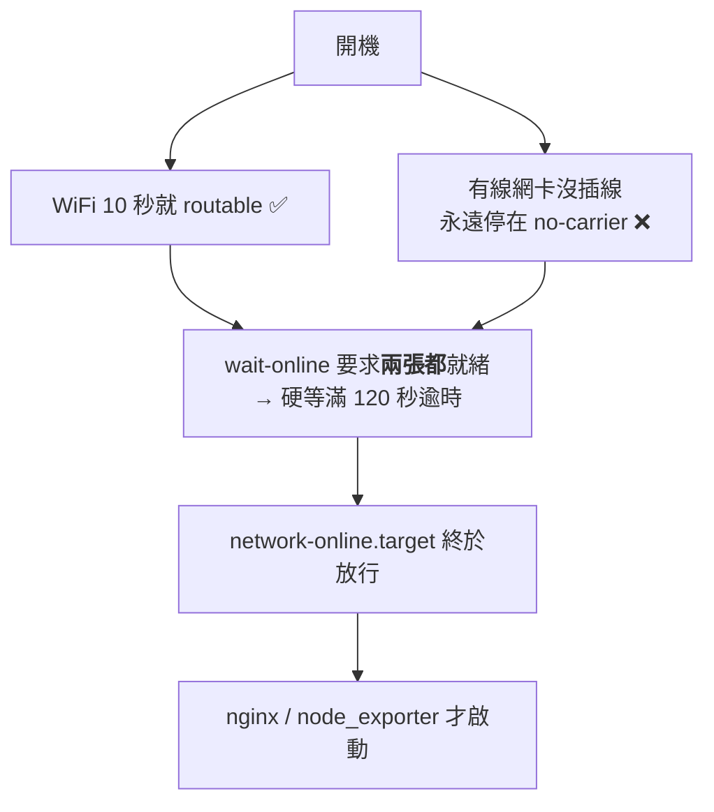

# [實戰 01] 開機慢了兩分鐘的追查

> **本篇目標**：完整重現一次真實的故障排查——包含**一開始猜錯的那個假設**——並學會「先量測，再下結論」的除錯紀律。
> **發生時間**：2026-08-01　**機器**：`90` (`liyi-jump`)、`98` (`liyi-linux-01`)
> **成果**：兩台開機時間皆從約 2 分鐘降到約 10 秒

## 你會學到

- 怎麼用 `systemd-analyze` 找出「開機到底慢在哪」，以及它的**數字容易被誤讀在哪裡**
- 什麼是**依賴鏈（dependency chain）**，以及一個服務慢為什麼常常不是它的錯
- 為什麼「一張沒插網路線的網卡」可以讓整台機器慢兩分鐘
- 除錯時「合理的猜測」跟「量測到的事實」差多遠
- 為什麼同一個修改在兩台機器上會觸發**完全不同的機制**，以及怎麼避免被騙

---

## 症狀

重開機之後，從別台電腦連 `http://192.168.10.90/grafana/` 連不上。等一陣子又自己好了。

第一直覺是：

> 「重開機以後 Grafana 是不是就沒有啟動了？」

這個直覺**方向錯了，但錯得很有價值**。

---

## 第一次轉彎：Grafana 根本不在這台機器上

先確認 Grafana 在不在（`systemctl is-enabled grafana-server` → `not-found`、沒有 docker、沒有 `/etc/grafana`），再看這台實際在聽哪些埠：

```
$ ss -tlnp
LISTEN  192.168.10.90:9100     ← node_exporter
LISTEN        0.0.0.0:80       ← nginx
LISTEN        0.0.0.0:22       ← sshd
```

**沒有 3000。** Grafana 在 98 那台，90 只是用 Nginx 把 `/grafana/` 轉發過去。

> 💡 **教訓一：症狀出現的地方，常常不是問題發生的地方。**
> 「看不到 Grafana」至少有三種可能——Grafana 掛了、**轉發的那台掛了**、網路不通。
> 動手前要先確定自己在查哪一段，否則會在沒壞的東西上花掉大把時間。

問題因此被改寫成：**為什麼重開機後，90 的 Nginx 有一段時間不能轉發？**

---

## 第二次轉彎：猜是 WiFi，猜錯了

這台走 WiFi（`wlp2s0b1`），當下的假設是：

> 「WiFi 開機後要花時間關聯 AP、跑 DHCP，所以網路慢，nginx 自然晚。」

這個假設**在技術上完全說得通**。合理到如果不查日誌，很容易就這樣結案。

於是拉出時間軸驗證（`uptime -s`、`systemctl show nginx -p ActiveEnterTimestamp`、`journalctl -b | grep wlp2s0b1`）：

```
00:30:35   開機
00:30:45   WiFi 關聯完成、連上 AP        ← 只花 10 秒
00:31:05   已取得 192.168.10.90
00:32:44   nginx 才 active               ← 比網路晚了 99 秒
```

**WiFi 完全無辜。** nginx 自己晚了將近兩分鐘。

> 💡 **教訓二：合理的猜測也可能是錯的，所以要驗證。**
> 除錯最貴的成本，往往是**花時間去修一個根本沒壞的東西**。
> 資深工程師跟新手的差別，常常不是「猜得比較準」，而是**知道要去驗證自己的猜測**。

---

## 量測：把開機時間攤開

```
$ systemd-analyze
Startup finished in 698ms (kernel) + 4.057s (initrd) + 2min 6.580s (userspace)
                                                       ^^^^^^^^^^^^^^^^^^^^^^^
```

kernel 和 initrd 加起來不到 5 秒，問題全在 **userspace 的服務啟動階段**。

```
$ systemd-analyze blame
2min 155ms   systemd-networkd-wait-online.service   ← 第一名
    4.492s   sys-devices-virtual-misc-rfkill.device ← 第二名
```

第一名 2 分 0.155 秒，第二名只有 4.5 秒。差距懸殊到不用懷疑。

而 `2min 0.155s` 這個數字本身就是線索：它**極度接近整數 120 秒**。

> 💡 **教訓三：看到「剛好 30 秒」「剛好 120 秒」這種整數耗時，先假設是逾時。**
> 真的在做事的程序不會剛好停在整數。逾時代表**它在等一個永遠不會來的東西**。

---

## 依賴鏈：nginx 為什麼被拖下水

`systemd-analyze` 還能印出「某個服務在等誰」：

```
$ systemd-analyze critical-chain nginx.service
nginx.service +69ms
└─network-online.target @2min 4.692s
  └─network.target @4.511s
    └─systemd-networkd.service @4.021s +488ms
```

讀法：`@` 是「這個單元**何時**變成 active」，`+` 是「它**自己**花了多久」。

所以 **nginx 只花了 69 毫秒**，完全無辜。它在等 `network-online.target`，而那個 target 到 `2min 4.692s` 才就緒。

用日常語言描述這條鏈：

```
nginx：「我要等網路真的通了才啟動」
  ↓
network-online.target：「我要等 wait-online 說 OK」
  ↓
wait-online：「我在等網卡就緒……」
  ↓
（等滿 120 秒，逾時，放棄）
  ↓
大家才終於開始跑
```

> 💡 **教訓四：一個服務很慢，不代表「它」有問題。**
> systemd 的服務之間有依賴關係，慢的往往是它等待的對象。
> `critical-chain` 就是用來把這條鏈攤開的工具。

---

## 真兇：一張沒插線的網卡

```
$ systemctl cat systemd-networkd-wait-online.service | grep ExecStart
ExecStart=.../systemd-networkd-wait-online -i wlp2s0b1:degraded -i enp1s0f0:degraded
                                                                   ^^^^^^^^^^^^^^^^^
```

`-i` 是「要等這個介面」。這行要求**兩張網卡都**就緒。而實際狀態是：

```
$ networkctl list
  2 enp1s0f0   ether   no-carrier   ← 沒插網路線
  3 wlp2s0b1   wlan    routable     ← 正常
```

`no-carrier` 就是「網路孔沒偵測到訊號」。真相拼起來了：



**一張根本沒在用的網卡，讓整台機器的所有網路服務晚了兩分鐘。**

這也回答了最初的症狀——那兩分鐘裡 nginx 還沒開始監聽，所以任何人連 `/grafana/` 都會被拒絕。**98 上的 Grafana 從頭到尾都是好的。**

---

## 修法

設定是 netplan 在開機時產生的，放在 `/run/systemd/generator.late/` 底下——**`/run` 每次開機重新產生，改了也沒用**。要從 netplan 的來源設定下手：

```yaml
# /etc/netplan/99-wait-online-fix.yaml
network:
  version: 2
  ethernets:
    enp1s0f0:
      optional: true      # ← 開機不用等我
```

> **為什麼另開一個檔，而不是改原本的 `00-installer-config.yaml`？**
> netplan 會把同一張網卡的設定**跨檔案合併**。另開檔案讓原始設定保持原樣，
> 要還原只要刪掉這個檔——這是「最小改動」原則。

套用後**一定要看實際產生了什麼**：

```diff
$ sudo netplan generate
$ grep ExecStart /run/systemd/generator.late/systemd-networkd-wait-online.service.d/10-netplan.conf
- ExecStart=...wait-online -i wlp2s0b1:degraded -i enp1s0f0:degraded
+ ExecStart=...wait-online -i wlp2s0b1:degraded
```

> ⚠️ **為什麼只跑 `generate` 不跑 `apply`？**
> `netplan apply` 會重新套用網路設定，而當時的遠端連線正是走這條 WiFi——有把自己踢掉的風險。
> 這個修改本來就只影響**開機流程**，不需要立即生效。
>
> **動網路設定前，先想清楚「我現在是不是正透過它連線」。**
> 遠端維運最經典的翻車方式，就是改防火牆或網路設定時把自己鎖在門外。

---

## 實測驗證

**沒有實測就不算修好。** 推算再合理，也只是推算。

| | 修正前 | 修正後 | |
|---|---|---|---|
| **總計** | **2min 11.336s** | **10.358s** | ⚡ 快 12.7 倍 |
| kernel | 698ms | 720ms | 不變 |
| initrd | 4.057s | 3.942s | 不變 |
| **userspace** | **2min 6.580s** | **5.696s** | ⚡ 快 **22 倍** |

原本的頭號元凶從排行榜上**完全消失**。kernel 與 initrd 完全沒變，也符合「問題只在 userspace」的判斷。

重開機同時也是所有「開機自啟」設定的真實考驗——這次一併確認了 nginx、dnsmasq、node_exporter 都能自己回來。

### 陷阱：排行榜第一名不一定是罪魁禍首

修好之後 `node_exporter` 變成最慢（5.254s）。乍看像下一個要修的目標，但查日誌發現不是：

```
$ journalctl -b -u node_exporter -o short-monotonic
[  9.055311] Started node_exporter.service
[  9.213371] Starting node_exporter version=1.9.1     ← 只花了 0.16 秒
```

它在開機第 9 秒才**被啟動**（因為 `After=network-online.target`），程式本身 0.16 秒就跑起來了。`blame` 的 5.254s 是「從排入佇列到真正 active」的**等待時間**。

> 💡 **教訓五：`systemd-analyze blame` 是排行榜，不是罪犯名單。**
> 它會把「等別人」的時間也算進去。判斷一個服務是「真的慢」還是「在等人」，
> 要配 `critical-chain` 一起看，或直接查日誌看它自己跑了多久。
>
> 只看 blame 就動手，很可能修錯對象——**跟本篇一開始猜 WiFi 是同一種錯誤。**

### 新增的依賴：dnsmasq 插進了 nginx 的啟動鏈

同一晚在 90 上裝了 dnsmasq，重開機後發現：

```
nginx.service +67ms
└─nss-lookup.target @4.633s
  └─dnsmasq.service @4.370s +262ms      ← 裝 dnsmasq 之前沒有這一層
    └─network-online.target @4.347s
```

dnsmasq 提供 `nss-lookup.target`，而 nginx 會等它。目前只花 262ms，但**萬一 dnsmasq 啟動失敗，nginx 也會被卡住**——跟本篇的主題是同一類問題，只是這次的兇手是我們自己。

> 💡 **教訓六：每加一個服務，都可能在依賴圖上多一條邊。**
> 加之前不會有人提醒你，通常是出事才發現。
> **裝完新服務跑一次 `critical-chain`，看它有沒有插進別人的路徑上。**

---

## 同一個病，第二台機器：98

修好 90 之後順手查了 98。它也慢（userspace `2min 4.143s`），`blame` 第一名同樣是 `wait-online`。但**成因不一樣**：

```
$ systemctl cat systemd-networkd-wait-online.service | grep ExecStart
ExecStart=.../systemd-networkd-wait-online -i enp1s0f0:degraded
                                              ^^^^^^^^ 只有這一張
```

90 的清單裡有**兩張**網卡，至少 WiFi 能就緒。98 的清單裡**只有那張沒插線的**，WiFi 根本不在裡面——所以它是 **100% 必定逾時**，沒有任何僥倖的可能。

### 同一個修法，卻觸發了完全不同的機制

套用一模一樣的 YAML，然後照慣例去看產生的結果——**而這一步救了這次的判斷**：

```ini
# /run/systemd/generator.late/systemd-networkd-wait-online.service.d/10-netplan.conf
[Unit]
ConditionPathIsSymbolicLink=/run/systemd/generator/network-online.target.wants/systemd-networkd-wait-online.service
```

**完全沒有 `ExecStart`。** netplan 換了一套機制。

原因是 98 的 WiFi 本來就標了 `optional`，把有線也標成 optional 之後，**一張需要等的介面都不剩**。netplan 這時不會產生「等一個空清單」的指令，而是加一個條件——指向一個它不會建立的符號連結。條件不成立，systemd 就**直接跳過整個服務**：

```
$ systemctl show systemd-networkd-wait-online -p ConditionResult -p Result
ConditionResult=no      ← 條件不成立
Result=success          ← 跳過不算失敗
```

| | 90 | 98 |
|---|---|---|
| 修正前的等待清單 | `-i wlp2s0b1 -i enp1s0f0` | `-i enp1s0f0`（WiFi 不在清單） |
| 標 optional 後 | 還剩 WiFi 要等 | **沒有任何介面要等** |
| netplan 的處理 | 縮短 `-i` 清單 | 改用 `ConditionPathIsSymbolicLink` |
| 實際行為 | 等 WiFi，262ms | **整個服務被跳過** |

> 💡 **教訓七：同一個修改，在不同機器上可能觸發完全不同的機制。**
>
> 如果直接照抄 90 的結論、假設 98 也會產生 `-i wlp2s0b1`，就不會發現它走了另一條路。
> 更糟的是——**如果 netplan 在這種情況產生的是「沒有 `-i` 就等所有介面」，
> 問題不但沒解決還會變糟，而你會以為自己修好了。**
>
> 套用設定後去看「實際產生了什麼」，成本只有一行 `cat`，
> 但它是「我以為」跟「我知道」的分界線。

⚠️ 這個修法對 98 有個取捨：它現在**完全不等網路就緒**就啟動所有服務。這對它合適，因為服務都是 Docker 容器（`restart: unless-stopped` 會自己重試）。但若將來裝了「啟動時就必須有網路、否則直接失敗」的服務，就得把 WiFi 改回 `optional: false`。

### 第二個發現：設定的「生效層級」

修好之後 98 是 19.229s，但 90 只有 10.358s。差在 `kdump-tools.service`（10.181s）——90 **從未安裝**這個套件。

`kdump` 的用途是核心崩潰時把記憶體 dump 出來供分析。它的代價有兩個，第二個很容易被忽略：

```
$ grep -o 'crashkernel=[^ ]*' /proc/cmdline
crashkernel=2G-4G:320M,4G-32G:512M,...     ← 永久保留 512MB 記憶體
```

移除時有個關鍵判斷：

| 做法 | 開機時間 | 記憶體 |
|---|---|---|
| `systemctl disable kdump-tools` | ✅ 省下 10s | ❌ **512MB 仍被保留** |
| `apt purge kdump-tools` | ✅ 省下 10s | ✅ 拿回 512MB |

> 💡 **教訓八：先確認一個設定是在哪一層生效的。**
> `crashkernel=` 是**核心開機參數**，在 kernel 極早期就把記憶體切走了，
> 跟服務有沒有在跑完全無關。只停服務等於「保留了記憶體卻沒人用」——最差的組合。
>
> 同樣的道理：改核心參數要重開機才生效，改服務設定 reload 就好。
> **搞錯層級，你會做一個看起來有效、實際上沒解決問題的修改。**

`crashkernel=` 是套件自己裝的 GRUB 片段（`/etc/default/grub.d/kdump-tools.cfg`）帶進來的，所以 `apt purge` 會連它一起移除，不用手動編輯 GRUB。

### 98 的完整軌跡

| 階段 | 總計 | userspace | 記憶體 |
|---|---|---|---|
| 原始 | 2min 8.245s | 2min 4.143s | 7.2Gi |
| 修 wait-online | 19.229s | 15.074s | 7.2Gi |
| **移除 kdump** | **10.859s** | **6.576s** | **7.7Gi** |

最後 `blame` 第一名只剩 `dev-rfkill.device`（4.756s）這種硬體裝置探測——**沒有任何服務在拖慢開機了**。這就是「已經沒得優化」的樣子。

兩台最終對齊：90 是 10.358s / 7.7Gi，98 是 10.859s / 7.7Gi。

---

## 副作用（誠實記錄）

改完之後，`enp1s0f0` **就算插上線，開機也不會等它**了。

對這兩台來說這是對的——有線網孔目前閒置。但哪天改用有線且開機就必須備妥，要把這個檔刪掉。

> 記錄副作用跟記錄修法一樣重要。半年後看到這個檔案的人（很可能是你自己）
> 需要知道它的代價，而不只是好處。

---

## 可以帶走的除錯流程

```
1. 確認症狀出現的位置 ≠ 問題發生的位置
2. 形成假設
3. 【關鍵】驗證假設，不要跳過
4. 用工具量測，不要用猜的
5. 追依賴鏈，找真正的源頭
6. 找到根因才動手
7. 【關鍵】實測驗證，不要只靠推算
8. 記錄副作用，以及新產生的依賴
```

第 3 步和第 7 步是最容易被跳過、也最值錢的兩步——它們是同一件事的兩端：**動手前驗證假設，動手後驗證結果。**

中間跳過任何一個，你都只是「覺得」自己修好了。

---

## 指令速查

| 指令 | 用途 |
|---|---|
| `systemd-analyze` | 開機總耗時（kernel / initrd / userspace 分開算） |
| `systemd-analyze blame` | 哪個服務最慢（**排行榜，含等待時間**） |
| `systemd-analyze critical-chain <unit>` | 某服務在等誰（依賴鏈） |
| `systemd-analyze plot > boot.svg` | 產生開機時序圖 |
| `systemctl cat <unit>` | 單元的完整設定（含所有 drop-in 與來源檔） |
| `systemctl show <unit> -p <屬性>` | 查單一屬性，如 `ActiveEnterTimestamp` |
| `systemctl show <unit> -p ConditionResult` | 服務是「跑失敗」還是「條件不成立被跳過」 |
| `networkctl list` | 各網卡的 operational 狀態 |
| `cat /proc/cmdline` | 核心開機參數（停服務不會影響它） |
| `journalctl -b -u <unit>` | 只看某服務的日誌，判斷它是真的慢還是在等人 |
| `journalctl -b -o short-monotonic` | 顯示**開機後的相對秒數**，排時序最好用且不受時區干擾 |

> 💡 很多服務（尤其 Go 寫的、容器化的）日誌預設印 UTC，跟系統時區對不上。
> 用 `short-monotonic` 完全避開這個問題。

---

## 課外讀物與課程對照

> 想搞懂開機流程的完整五個階段 → [infra-1-2：一台伺服器的一生](../../../lessons/infra/part-1/infra-1-2-life-of-a-server.md)

> 想學 systemd 怎麼把程式變成服務 → **[infra-4-1] systemd 是什麼？**（規劃中，見 [Infra 課程大綱](../../../lessons/infra/課程大綱.md)）

> 想知道「觀測」為什麼是一門專業 → [課外讀物 E-14-1：什麼是可觀測性？](../../../課外讀物/E-14-observability/E-14-1-what-is-observability.md)

---

## 小練習

1. 在你的機器（或 WSL）上跑 `systemd-analyze blame`，找出最慢的三個服務。用 `journalctl -b -u <unit>` 判斷它們是**真的在做事**，還是**在等別人**。
2. 挑一個服務用 `systemd-analyze critical-chain` 看它在等誰，把那條依賴鏈畫出來。
3. 找一個你系統上的設定（例如某個核心參數、某個環境變數），判斷它是在**哪一層**生效的：核心開機時？服務啟動時？還是每次請求時？改它需要重開機、重啟服務、還是 reload 就好？
4. **進階**：`systemd-analyze plot > boot.svg` 產生開機時序圖，找出圖上那條「長長的空白等待」。
