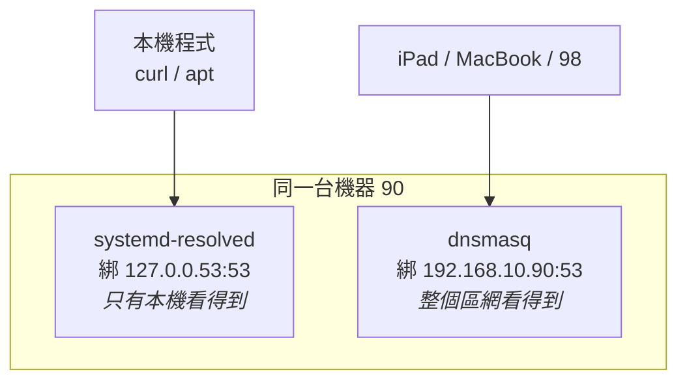
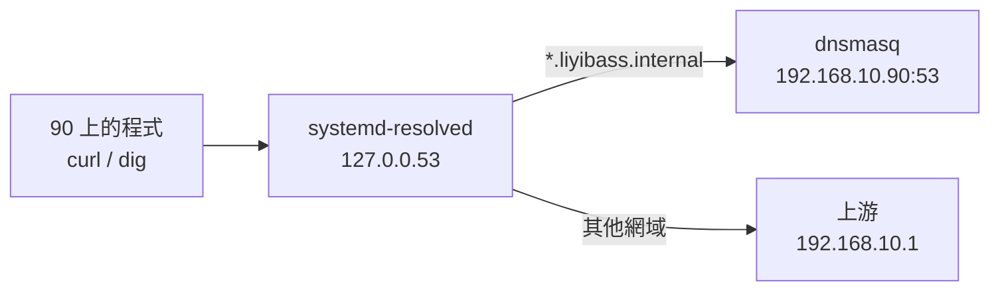

# [實戰 02] 一台機器上的三套 DNS

> **本篇目標**：搞懂 `systemd-resolved` 與 `dnsmasq` 的分工，並在區網裡自架一套「名字 → 內網 IP」的解析。
> **發生時間**：2026-08-01 凌晨　**機器**：`90` (`liyi-jump`)

---

> ⚠️ **後記（2026-08-11 決策，2026-08-12 移除完成）：本篇架起來的這套區網 DNS 已經移除了。**
>
> 起因是一台 Windows 連不上 `grafana.liyibass.internal`——排查後發現路由器根本沒有把
> `192.168.10.90` 下發給區網裝置，先前能用的 Mac 是**手動設過** DNS。也就是說這套解析
> 從來沒有真正對整個區網生效過。加上服務數量 10 天後仍然只有 1 個，維持一個額外的
> daemon 不划算，於是改回 `http://192.168.10.90/` 直連。決策見
> [ADR-004](../決策紀錄/ADR-004-移除區網DNS改回IP直連.md)。
>
> **本篇內容刻意保留原樣。** 裡面講的東西沒有一項因為這次移除而失效：
> `systemd-resolved` 與 `dnsmasq` 的分工、「埠被佔用」判斷的是 IP + 埠的組合、
> 服務名稱要指向反向代理而不是後端——這些都還是對的，而且下次要再架 DNS 時還會用到。
>
> 唯一要注意的是：**照著本篇操作前先看 ADR-004**，確認你真的需要這套東西。
>
> 另外，本篇當初**漏記了一個步驟**（讓 90 自己也能解析內部名稱的 resolved drop-in），
> 移除當天才發現。已補在下方〈[讓 90 自己也查得到](#補記讓-90-自己也查得到)〉，
> 那個缺漏造成了什麼 → [ADR-004 後記](../決策紀錄/ADR-004-移除區網DNS改回IP直連.md#後記於實作一天後才發現沒做完)。

## 你會學到

- 程式呼叫 `google.com` 時，作業系統實際上做了什麼
- `systemd-resolved` 為什麼存在、以及它**不能**做什麼
- `dnsmasq` 跟它的根本差別在哪
- 「埠被佔用」判斷的其實是 **IP + 埠**的組合，不是單看埠號
- 為什麼在反向代理架構下，服務的名字要指向**代理**而不是後端
- 一個會製造間歇性故障的 DNS 設定陷阱

---

## 起點：一個很合理的問題

要讓區網裝置用 `grafana.liyibass.internal` 而不是 `192.168.10.90/grafana/` 存取服務，需要一台 DNS 伺服器來回答這個名字。

第一個念頭是：**路由器不是本來就有 DNS 嗎？**

實際查證（TP-Link Archer BE230）的結果是：韌體裡跟 DNS 有關的設定共四類——上游 DNS 指定、DHCP 下發的 DNS、DDNS（公網 IP → 外網主機名，方向相反）、VPN/IPv6 的 DNS 欄位。**沒有任何一類能做「名字 → 內網 IP」的對應。**

> 💡 有趣的是，**大多數家用路由器內部跑的就是 dnsmasq**——只是韌體沒把這個功能的設定介面開放出來。
> 所以接下來要做的事本質上是：在 90 上跑一個功能完整的版本，取代路由器閹割過的那個。

---

## 先搞懂：程式怎麼知道 google.com 的 IP？

當 `curl google.com` 執行時，它自己不查 DNS。它問作業系統：「這個名字的 IP 是多少？」作業系統就去看 **`/etc/resolv.conf`**——幾十年來的 Unix 慣例，裡面寫著「要問哪台 DNS 伺服器」。

在 `90` 上是這樣：

```bash
cat /etc/resolv.conf
```

```
nameserver 127.0.0.53
```

**`127.0.0.53` 是本機位址。** 也就是說，所有程式問的不是外面的 DNS，而是**這台機器自己跑的一個服務**。

---

## systemd-resolved：這台機器自己的查號小幫手

### 它為什麼存在？

以前 `/etc/resolv.conf` 就是一份靜態清單，直接寫 `nameserver 8.8.8.8`。簡單，但有幾個治不好的病：

| 問題 | 說明 |
|---|---|
| **被覆寫** | DHCP 每次續約就把你手改的內容洗掉 |
| **多網卡衝突** | 接了 VPN 時，公司內網的名字要問公司 DNS，其他要問一般 DNS——一份清單表達不了 |
| **沒有快取** | 每次都重新查 |
| **沒有現代功能** | DNSSEC、DNS over TLS 都做不到 |

systemd-resolved 的解法很巧妙：**讓 `/etc/resolv.conf` 永遠只寫一行 `nameserver 127.0.0.53`，所有複雜邏輯都搬進 resolved 裡面。**

```bash
ls -l /etc/resolv.conf
```

```
/etc/resolv.conf -> ../run/systemd/resolve/stub-resolv.conf
```

注意它是個**符號連結**，指向 `/run`（開機時重新產生的目錄）。這就是為什麼直接編輯 `/etc/resolv.conf` 沒有用——下次開機就沒了。

### 「多網卡各自有 DNS」在這台機器上是真的

```bash
resolvectl status
```

```
Link 2 (enp1s0f0)              ← 有線
    Current Scopes: none        ← 沒在用
       DNS Servers: 192.168.10.1 8.8.8.8

Link 3 (wlp2s0b1)              ← WiFi
    Current Scopes: DNS         ← 實際在用這條
Current DNS Server: 8.8.8.8
       DNS Servers: 192.168.10.1 8.8.8.8
     Default Route: yes
```

**每張網卡各自帶著自己的 DNS 設定**，resolved 依照哪條線在用、哪條是預設路由，決定把查詢送去哪。傳統的單一 `resolv.conf` 做不到這件事。

### 關鍵限制：它只服務自己

```bash
ss -tulnp | grep ':53 '
```

```
udp  127.0.0.53%lo:53
tcp  127.0.0.53%lo:53
udp  127.0.0.54:53
tcp  127.0.0.54:53
```

**綁的全是 loopback 位址。** iPad、MacBook、98 那台機器，**都不可能問它**。

> systemd-resolved 是「客戶端解析器（stub resolver）」，不是「DNS 伺服器」。
> 這個區別是整篇的關鍵。

（`127.0.0.54` 是另一個入口，功能是單純轉發、不套用 resolved 的本地邏輯，給某些需要繞過的程式用。）

---

## dnsmasq：整個社區的總機

```
systemd-resolved  = 你家裡的查號小幫手
                    你家人問他，他幫你打電話問 104
                    但鄰居打不進來

dnsmasq           = 社區的總機
                    社區所有人都可以打來問
                    而且他還記得住戶名冊：「王小明住 3 樓」
```

它做兩件事：

**1. 對 `.liyibass.internal` 當權威伺服器**——這是我們自己編的名字，全世界沒有任何 DNS 知道它。dnsmasq 內建名冊，問到就直接回答。

**2. 其他名字轉發上游並快取**——`google.com` 不認識，就轉問上游，拿到答案存起來，下次直接回。

---

## 撞埠：一個值得記住的觀念

安裝後第一次啟動就失敗了：

```
dnsmasq: failed to create listening socket for port 53: Address already in use
dnsmasq: FAILED to start up
```

原因是 dnsmasq 預設綁 **`0.0.0.0:53`**——萬用位址（wildcard），意思是「這台機器上**所有**位址的 53 埠都算我的」，其中就包含 resolved 已經佔著的 `127.0.0.53`。

### 解法：綁不同的位址

這裡有個很多人不知道的觀念：

> **「埠被佔用」判斷的是「IP + 埠」這個組合，不是單看埠號。**



兩個服務、同樣是 53 埠、**不同的 IP**，可以和平共存。

### 補記：讓 90 自己也查得到

> 📌 這一小節是 2026-08-12 補寫的。當初架設時做了這一步，但**沒有記進本篇**——
> 一年後（其實只隔一天）要拆除時，它就成了清單上的破口。

綁不同位址解決了撞埠，但立刻帶來一個副作用：

```
except-interface=lo   →  dnsmasq 完全不碰 loopback
本機程式查名字        →  走 127.0.0.53（systemd-resolved）
```

兩條路徑不相交。結果是**這台機器自己**反而查不到 `grafana.liyibass.internal`——
區網上的 iPad 查得到，90 自己 `curl` 卻是 NXDOMAIN。

解法是告訴 resolved：「碰到這個網域，去問 `192.168.10.90`」：

```ini
# /etc/systemd/resolved.conf.d/liyibass.conf
[Resolve]
DNS=192.168.10.90
Domains=~liyibass.internal
```

`Domains=` 前面的 `~` 是關鍵，它把這一項標成**路由網域（routing domain）**：
只把 `*.liyibass.internal` 的查詢送到這台 DNS，其他網域照原本的上游走。
沒有 `~` 的話就變成**搜尋網域（search domain）**——查 `foo` 時會自動試 `foo.liyibass.internal`，
那是完全不同的行為。



這張圖表達的是：resolved 依**網域**分流，內部名稱繞回同一台機器上的 dnsmasq。

> 💡 **拆除時這一步反而最危險**：它讓 90 的 global DNS 指向 dnsmasq。
> 若先停 dnsmasq 而沒先移除這個檔案，這台的 resolver 就指著一個死掉的 server。
> **順序必須是：先拆掉所有「指向它」的設定，最後才停掉它本身。**

---

## 設定：每一行的理由

```conf
# ── 監聽位址 ──
bind-dynamic
interface=wlp2s0b1
except-interface=lo
```

只綁 WiFi 網卡的位址，完全不碰 loopback。

用 `bind-dynamic` 而不是 `bind-interfaces`，是因為**這台走 WiFi**：`bind-interfaces` 在啟動當下就要綁定，若介面還沒就緒會直接啟動失敗；`bind-dynamic` 會在介面上下線時自動重新綁定。

> 這個選擇在重開機時得到驗證——dnsmasq 在 WiFi 就緒後成功綁上，沒有因為啟動順序而失敗。

```conf
# ── 上游 DNS ──
no-resolv
server=192.168.10.1
server=1.1.1.1
```

`no-resolv` 是**不要去讀 `/etc/resolv.conf`**。那個檔案裡寫的是 `nameserver 127.0.0.53`（systemd-resolved），讓 dnsmasq 去問它會繞一圈、行為難預測。明確指定上游更清楚。

```conf
# ── 本地網域 ──
local=/liyibass.internal/
domain=liyibass.internal
```

`local=` 表示這個網域由本機權威回答，查不到就回 NXDOMAIN，**絕不往上游轉發**——避免內部主機名稱洩漏到公共 DNS。

### 網域怎麼選？

選擇標準只有一個：**確定不會跟公網衝突**。你自己編的名字如果哪天變成真實的頂級域名，你的內網就會開始出現詭異的解析結果。

| 域名 | 評價 |
|---|---|
| `.local` | ❌ 被 mDNS（Bonjour / Avahi）保留，會跟 Apple 裝置打架 |
| `.lan`、`.home` | ⚠️ 沒有正式標準，只是「大家習慣這樣用」 |
| `.dev`、`.app` | ❌ **是真的頂級域名**，且在 HSTS preload 清單裡，瀏覽器強制 HTTPS |
| `.home.arpa` | ✅ RFC 8375 保留給家用網路 |
| **`.internal`** | ✅ **ICANN 於 2024 年保留給私有網路 ← 本次採用** |

> `.dev` 那個坑值得記住：它曾經是最流行的本機開發域名，直到 Google 買下 `.dev`
> 並加進 HSTS preload 清單——全世界的 `.dev` 開發環境一夜之間被瀏覽器強制導向 HTTPS，
> 全部爆炸。**這就是為什麼要用有標準保障的保留域名。**

`.home.arpa` 和 `.internal` 兩者的保障是等價的（都是標準明文規定「永遠不會委派給任何人」，性質等同 `192.168.x.x` 之於 IP）。**最後選 `.internal` 純粹是可讀性**——它允許你在中間放自己的識別：

```
grafana.home.arpa            ← 每個人的內網都長一樣
grafana.liyibass.internal    ← 一看就知道是誰的
```

> 💡 這次的改名也順便示範了**零停機遷移**的標準手法：
> dnsmasq 同時保留兩組 `host-record`、nginx 的 `server_name` 同時列兩個名字，
> 兩者並存確認無誤後，才移除舊的。
>
> **改名字時永遠先並存，再切換，最後才清理。** 雖然本次其實沒有東西依賴舊名稱
> （它只存在約一小時、僅被 `curl` 測試過），照標準流程做才會變成習慣。

```conf
# ── 名稱對應 ──
host-record=jump.liyibass.internal,192.168.10.90
host-record=services.liyibass.internal,192.168.10.98
host-record=grafana.liyibass.internal,192.168.10.90     # ← 注意這一行
```

---

## 最容易搞錯的一點：名字要指向誰？

直覺會覺得「`grafana.liyibass.internal` 當然要指向 Grafana 真正住的地方，也就是 `192.168.10.98`」。

**這是錯的。**（本次規劃文件一開始就寫錯了，後來才修正。）


服務名稱必須指向 **`192.168.10.90`（反向代理）**。流量要先進 nginx，才輪得到它依 `server_name` 分流。若 DNS 直接指向 98：

- 瀏覽器繞過反向代理，這個架構就失去意義
- 還得自己在網址列打 `:3000`，因為沒有東西幫你轉埠
- 未來要加 TLS、存取控制、統一日誌時，全部沒有著力點

> 💡 **教訓**：在反向代理架構下，**對外的門牌號碼是代理的位址，不是後端的位址**。
> 「名字指向服務真正住的地方」這個直覺，在有代理層的時候要反過來想。

---

## 驗證

```bash
dig +short @192.168.10.90 grafana.liyibass.internal      # → 192.168.10.90
dig +short @192.168.10.90 google.com             # → 142.250.196.206（轉發成功）
dig @192.168.10.90 nosuch.liyibass.internal | grep status
                                                 # → status: NXDOMAIN（未外洩上游）
```

三種情境分別驗證了：**權威回答**、**上游轉發**、**不存在時不外流**。

---

## 一台機器上其實有三套 DNS

設定完之後，當事人問了一個很好的問題：

> 「其實只有使用者要看 Grafana 才會使用到 DNS 對吧？90 98 這些內部 call API 應該不會用到？」

前半對，後半不完全對——因為這套系統裡**同時有三套不同的 DNS 在運作**：

| | 誰在用 | 解析什麼 | 由誰回答 |
|---|---|---|---|
| **①** | 使用者的瀏覽器 | `*.liyibass.internal` | 90 的 dnsmasq |
| **②** | 98 上的容器之間 | `prometheus`、`grafana` | Docker 內建 DNS `127.0.0.11` |
| **③** | 兩台機器本身 | 公網域名（`apt`、`docker pull`） | 各自的 systemd-resolved |

第 ② 條正是「內部呼叫也在用 DNS」的實例：

```yaml
# 98: grafana/provisioning/datasources/prometheus.yml
url: http://prometheus:9090        ← 這是名字，不是 IP
```

Grafana 容器要連 Prometheus 時，會把 `prometheus` 丟給 Docker 的內建 DNS 解析成容器在 `172.18.0.0/16` 裡的位址。**這是一次真實的 DNS 查詢**，只是完全發生在 98 的 Docker 網路內部，跟我們架的 dnsmasq 毫無關係。

### 真正不用 DNS 的是這兩條

```
nginx → 後端        upstream { server 192.168.10.98:3000; }   ← 寫死 IP
Prometheus → 目標   targets: ['192.168.10.90:9100', ...]      ← 寫死 IP
```

這是刻意的取捨。用名字的話，未來換 IP 只要改 dnsmasq 一個地方；但代價是**新增一個失敗模式**（dnsmasq 掛了全家死），而且 **nginx 的 upstream 預設只在啟動時解析一次**，IP 變了不會自動跟上。

2 台機器的規模，用一份 checklist 管更划算——見 [架構現況.md](../架構現況.md) 的「IP 遷移 checklist」。等機器與服務變多，再導入服務發現（service discovery）。

---

## ⚠️ 一個會製造間歇性故障的陷阱

要讓區網裝置自動使用 90 當 DNS，得在路由器的 DHCP 設定裡指定。直覺會想這樣填：

```
主要 DNS：192.168.10.90
次要 DNS：8.8.8.8          ← 「當備援」
```

**千萬不要。**

原因是：**DNS 客戶端不保證「主要失敗才問次要」**。不少作業系統（含 macOS / iOS）會並行查詢，或在主要回應較慢時直接改問次要。

只要有一次查詢跑到 `8.8.8.8`，`grafana.liyibass.internal` 就是 NXDOMAIN。症狀是**時好時壞、重試一次又好了**——屬於最難查的那一類故障。

正確做法：**次要留空**，或同樣填 `192.168.10.90`。公網名稱的解析交給 dnsmasq 自己往上游轉發。

> 💡 **教訓**：「備援」只有在**故障切換的規則明確**時才是備援。
> 規則不明確的備援，會把「乾脆的失敗」變成「隨機的失敗」——而後者難查得多。

---

## 代價：新的單點故障

這個方案讓 90 從「只轉發流量」變成「還負責名字解析」。而且次要 DNS 留空之後，**dnsmasq 掛掉的後果從「名字失效」升級成「連公網 DNS 也斷」**。

重開機後還發現一個沒預料到的依賴：

```
nginx.service +67ms
└─nss-lookup.target @4.633s
  └─dnsmasq.service @4.370s +262ms      ← 裝 dnsmasq 之前沒有這一層
    └─network-online.target @4.347s
```

**dnsmasq 把自己插進了 nginx 的啟動依賴鏈。** 目前只花 262ms，但若 dnsmasq 啟動失敗，nginx 也會被卡住。

> 💡 **教訓**：每加一個服務，都可能在依賴圖上多一條邊。加之前不會有人提醒你，通常是出事才發現。
> **裝完新服務後跑一次 `systemd-analyze critical-chain`**，看看它有沒有插進別人的路徑上。

備援方式仍是 IP 直連：`http://192.168.10.98:3000/`。

---

## 指令速查

| 指令 | 用途 |
|---|---|
| `resolvectl status` | 看 systemd-resolved 的每張網卡各用哪個 DNS |
| `resolvectl query <名字>` | 用 resolved 查一個名字（含它的快取） |
| `ss -tulnp \| grep ':53 '` | 看誰在聽 53 埠、綁在哪個 IP |
| `dig @<伺服器> <名字>` | **指定**某台 DNS 來查，除錯必備 |
| `dig +short @... <名字>` | 只印答案 |
| `dnsmasq --test` | 檢查設定檔語法（改完必跑） |
| `journalctl -u dnsmasq` | 看它為什麼起不來 |

> `dig` 的 `@伺服器` 參數是這類問題的核心工具——它讓你**繞過本機的解析設定**，
> 直接問特定一台 DNS。分辨「是伺服器答錯」還是「客戶端問錯人」全靠它。

---

## 課外讀物與課程對照

> 想從頭理解 DNS 的階層與遞迴查詢 → [課外讀物 E-3-5：DNS 是什麼？](../../../課外讀物/E-3-network/E-3-5-dns.md)

> 想複習封包怎麼找到伺服器 → [課外讀物 E-3-1：網際網路是怎麼運作的？](../../../課外讀物/E-3-network/E-3-1-how-internet-works.md)

> 想理解區網位址與 NAT → [課外讀物 E-3-8：NAT 是什麼？](../../../課外讀物/E-3-network/E-3-8-nat.md)

> 這次改動的決策背景 → [ADR-001：路徑式 vs 子網域路由](../決策紀錄/ADR-001-路徑式vs子網域路由.md)

> 為什麼服務要用 systemd 管理、依賴鏈怎麼讀 → [實戰筆記 01：開機慢了兩分鐘的追查](01-開機慢兩分鐘的追查.md)

---

## 小練習

1. 在你的機器上跑 `cat /etc/resolv.conf`。它是符號連結嗎？裡面寫的是 `127.0.0.53` 還是真實的 DNS 位址？
2. 用 `dig @8.8.8.8 你的網域` 和 `dig 你的網域`（不指定伺服器）各查一次，比較 `Query time` 有沒有差別。差別代表什麼？
3. 用 `ss -tulnp | grep ':53 '` 看你的機器上誰在聽 53 埠。它綁的是 `0.0.0.0` 還是特定位址？這代表別台機器能不能問它？
4. **進階**：查一下 `.arpa` 這個頂級域名的來歷。它跟 ARPANET 有什麼關係，為什麼反向解析（IP → 名字）要用 `in-addr.arpa`？
