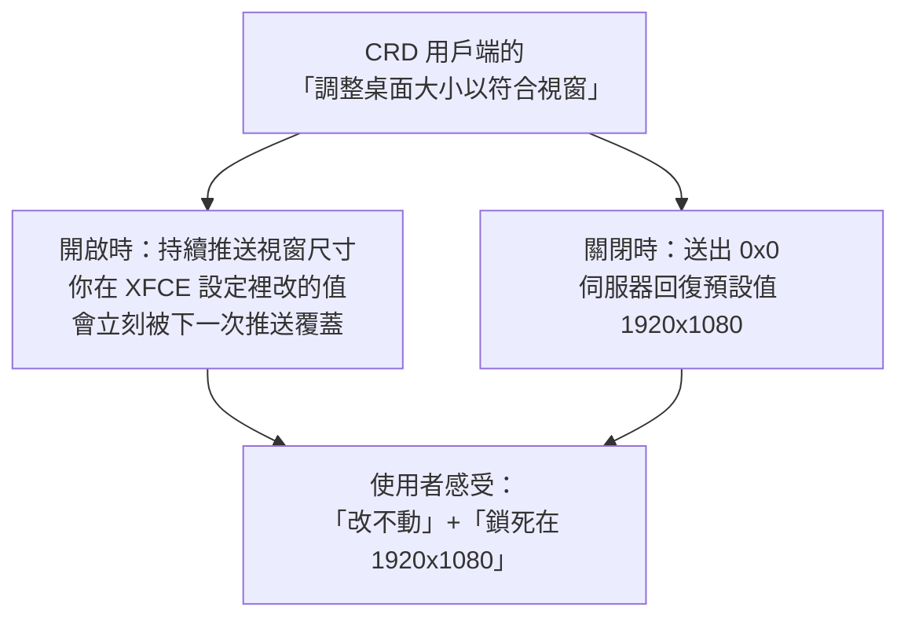

# [實戰 02] 「解析度鎖死了」——其實是有人一直在偷改

> **本篇目標**：搞懂遠端桌面的解析度是誰在決定，以及為什麼「字變大了但標題列沒變高」。
> **發生時間**：2026-08-01 凌晨　**機器**：`90` (`liyi-jump`)　**工具**：Chrome Remote Desktop + XFCE

## 你會學到

- 遠端桌面的解析度是由**客戶端**決定的，不是伺服器
- 怎麼從日誌看出「是誰把我的設定改掉了」
- X11 的 RANDR 是什麼，`xrandr` 怎麼手動建立顯示模式
- 高 DPI 為什麼會「字變大但介面沒變大」——以及 Xft.DPI 與 Window Scaling 的差別
- XPM 圖檔的「符號色」如何讓一個佈景主題自動跟著深色/淺色走

---

## 症狀

用 Chrome Remote Desktop（以下簡稱 CRD）連進 `90` 的 XFCE 桌面，當事人的描述是：

> 「是不是現在解析度就鎖死在 1920x1080 了？我發現我切換其他的解析度都沒辦法正確更換？」

「鎖死」是個很自然的描述——你在顯示設定裡選了別的解析度，畫面閃一下，然後**變回去**。看起來就像被鎖住。

---

## 第一步：先確認這是什麼樣的遠端桌面

CRD 在 Linux 上有兩種模式，行為完全不同，所以要先分清楚：

| 模式 | 畫面來源 | 解析度 |
|---|---|---|
| **接管實體螢幕** | 真的顯示卡 + 實體螢幕 | 受實體螢幕支援的模式限制 |
| **虛擬 session** | 一個假的 X server（dummy driver） | **可以是任何尺寸** |

查一下實際跑的是哪種：

```bash
ps aux | grep -E 'Xorg|chrome-remote'
```

```
/usr/lib/xorg/Xorg :20 -auth /home/liyi/.Xauthority -nolisten tcp -noreset ...
```

`:20` 這個 display 編號、加上 dummy driver，代表是**虛擬 session**。所以「螢幕硬體不支援」這個可能性直接排除了——它根本沒有螢幕。

```bash
DISPLAY=:20 xrandr
```

```
Screen 0: current 1920 x 1080
DUMMY0 connected 1920x1080+0+0
   1920x1080_60  60.00*
   2560x1440_60  60.00
   3840x2160_60  60.00
   CRD_78        60.00      ← 這個名字很可疑
```

注意最後那個 `CRD_78`。**預設模式清單裡不會有這種名字**，它是被動態建立出來的。這是第一條線索：**有東西在執行期間新增顯示模式。**

---

## 關鍵證據：日誌顯示「有人一直在改」

```bash
journalctl -b -t chrome-remote-desktop | grep -E 'ClientResolution|Resizing|Restoring'
```

```
00:36:32  Received ClientResolution (width=1366, height=824, x_dpi=96, y_dpi=96)
          Resizing monitor ID 282 to 1366x824 [96, 96]
          Resizing RANDR Output 78 to 1366x824          ← CRD_78 的來源

00:36:43  Received ClientResolution (width=0, height=0, x_dpi=0, y_dpi=0)
          Restoring monitor ID 282 to 1920x1080          ← 「鎖死在 1920x1080」的真相
```

真相大白，而且跟「鎖死」完全相反——**解析度不是被鎖住，是被改得太勤快。**

### 兩個訊息的意義

**`ClientResolution (1366, 824)`**：CRD 用戶端在說「我的視窗現在是 1366x824，請把桌面改成這個大小」。`1366x824` 這種怪尺寸一看就知道是**瀏覽器視窗扣掉網址列之後的可用區域**。

**`ClientResolution (0, 0)`**：用戶端在說「我不管了，你自己決定」。伺服器收到後執行 `Restoring`——回到**預設值**。

所以症狀的完整解釋是：



**同一個設定，開跟關造成了兩種不同的錯誤印象。**

> 💡 **第一個教訓**：使用者描述的症狀是「現象」，不是「原因」。
> 「鎖死」聽起來像某個東西被固定住了，但實際上是**有另一個角色以更高的頻率在寫入同一個值**。
> 這類「我改了但它變回去」的問題，第一個該問的是：**還有誰在寫這個值？**

---

## 那個 1920x1080 是哪來的？

```bash
cat /etc/systemd/system/chrome-remote-desktop@.service.d/override.conf
```

```ini
[Service]
Environment=CHROME_REMOTE_DESKTOP_DEFAULT_DESKTOP_SIZES=1920x1080,2560x1440,3840x2160
```

**清單的第一項就是預設值與還原值。** 所以 `Restoring ... to 1920x1080` 不是巧合。

驗證一下「真的沒有鎖死」——直接用 `xrandr` 換一個：

```bash
DISPLAY=:20 xrandr --output DUMMY0 --mode 2560x1440_60
DISPLAY=:20 xrandr | grep -E 'Screen 0|\*'
```

```
Screen 0: current 2560 x 1440
   2560x1440_60  60.00*
```

換成功，而且**沒有被彈回去**（因為當下「調整桌面大小以符合視窗」是關閉的）。假設得證。

---

## 設定成想要的尺寸

目標是 MacBook Air 13.6"（M2/M3/M4）的預設縮放解析度 **1470x956**。這個模式不存在，要自己建。

### 產生時序參數

```bash
cvt 1470 956 60
```

```
# 1472x956 59.91 Hz (CVT) hsync: 59.43 kHz; pclk: 116.00 MHz
Modeline "1472x956_60.00"  116.00  1472 1560 1712 1952  956 959 969 992 -hsync +vsync
```

注意 `cvt` 把 **1470 進位成了 1472**——因為傳統顯示硬體要求水平解析度是 8 的倍數。但我們是虛擬螢幕，沒有這個限制，所以手動改回精確值：

```bash
DISPLAY=:20 xrandr --newmode "1470x956_60" 116.00 1470 1560 1712 1952 956 959 969 992 -hsync +vsync
DISPLAY=:20 xrandr --addmode DUMMY0 "1470x956_60"
DISPLAY=:20 xrandr --output DUMMY0 --mode "1470x956_60"
```

三個步驟分別是：**定義**模式、把它**掛到**某個輸出上、**切換**過去。這是 X11 的 RANDR（Resize and Rotate）擴充提供的能力。

### 永久生效

把想要的尺寸放進清單第一項：

```ini
Environment=CHROME_REMOTE_DESKTOP_DEFAULT_DESKTOP_SIZES=1470x956,1366x1024,2732x1848,1920x1080,2560x1440,3840x2160
```

> 這個檔案改完**不需要重啟服務**——重啟 CRD 服務等於登出整個 XFCE session，未存檔的東西會掉。它只影響下次啟動時的初始尺寸。

---

## 第二部分：高 DPI

### 客戶端其實早就在告訴我們了

當事人後來問「iPad Pro 12.9 要設多少」，查日誌時發現一個關鍵訊息：

```
00:52:15  Received ClientResolution (width=2732, height=1848, x_dpi=192, y_dpi=192)
          Resizing monitor ID 282 to 2732x1848 [192, 192]
00:52:22  Received ClientResolution (width=1366, height=924, x_dpi=96,  y_dpi=96)
```

**CRD 用戶端有 HiDPI 開關，而且它會連 DPI 一起送過來。** 開啟時送 `2732x1848 @ 192dpi`（Retina 原生像素），關閉時送 `1366x924 @ 96dpi`（邏輯像素）。

伺服器端也照做了——它把 RANDR 的「實體尺寸（mm）」設成對應值，讓計算出來的 DPI 剛好是 192。

**但畫面上的字完全沒變大。** 為什麼？

```bash
xfconf-query -c xsettings -p /Xft/DPI
```

```
96
```

XFCE 的 `/Xft/DPI` 被寫死成 96，**它不會跟著 RANDR 的實體尺寸走**。所以在 2732x1848 的畫面上，所有字還是照 96dpi 算——小到看不清。

### 兩種放大方式，差別很大

| | `Xft.DPI = 192` | `Gdk/WindowScalingFactor = 2` |
|---|---|---|
| 原理 | 告訴應用程式「每英吋有 192 像素」 | 整個介面以 2 倍繪製 |
| 字體 | ✅ 變大（字級以「點」為單位，會自動換算） | ✅ 變大 |
| 圖示、邊框 | ❌ **不變**（它們以像素為單位） | ✅ 變大且銳利 |
| 生效時機 | 多數程式立即 | 需重啟應用程式 |
| 非 GTK 程式 | 大多支援 | 忽略 |

這解釋了高 DPI 最常見的困惑：**「為什麼字變大了，但按鈕和圖示還是小小的？」** 因為字體大小是**相對單位**（點），會隨 DPI 換算；而圖示是**絕對單位**（像素），DPI 變了它不動。

本次選擇 `Xft.DPI = 192`（立即生效、不用重開程式），再手動補上那些不會自動跟著走的：

```bash
xfconf-query -c xsettings   -p /Xft/DPI                -s 192
xfconf-query -c xsettings   -p /Gtk/CursorThemeSize    -s 48   # 滑鼠指標
xfconf-query -c xfce4-panel -p /panels/panel-1/size    -s 52   # 面板高度
xfconf-query -c xfce4-panel -p /panels/panel-1/icon-size -s 32 # 面板圖示
```

> 字型設定完全不用動。`Sans 10`、視窗標題 `Sans Bold 9`、終端機 `size=15` 都是以**點**為單位，DPI 一翻倍就自動翻倍。

---

## 第三部分：標題列為什麼不跟著變高

改完 DPI 之後，出現一個新症狀：

> 「application 的上方橫幅高度變比較小，不會被文字撐高？」

字變大了，但視窗標題列還是原本的高度，看起來被壓扁。查一下：

```bash
file /usr/share/themes/Greybird-dark/xfwm4/title-1-active.xpm
```

```
X pixmap image text, 2 x 24 x 3
                     ^^^^^^
```

**標題列高度是 24 像素，寫死在圖檔裡。**

xfwm4 的佈景主題不是向量的，是一堆 XPM 點陣圖。標題列有多高，取決於 `title-*.xpm` 這張圖有多高。而 `Sans Bold 9` 在 192dpi 下的文字高度大約就是 24px——剛好塞爆。

> 💡 **第二個教訓**：「以像素為單位寫死」是高 DPI 環境的通病。
> 只要一個東西的尺寸是硬編碼的像素值，它就不會跟著 DPI 縮放。這不是 bug，
> 是那個東西被設計出來的年代還沒有高 DPI 螢幕。

### 解法：找一個 HiDPI 版本的主題

```bash
ls -d /usr/share/themes/*/xfwm4
```

```
Daloa  Default  Default-hdpi  Default-xhdpi  Greybird  Greybird-dark  ...
```

有 `Default-hdpi` 和 `Default-xhdpi`，但沒有 Greybird 的 HiDPI 版本。而 apt 裡也找不到任何深色的 HiDPI xfwm4 主題。

看起來只能在「HiDPI」和「深色」之間二選一——**但其實不用**：

```bash
grep -A6 'static char' /usr/share/themes/Default-hdpi/xfwm4/title-1-active.xpm
```

```
"6 43 2 1",
"       c None",
".      c #C0C0FF s active_mid_2",
                  ^^^^^^^^^^^^^^^
```

`s active_mid_2` 是 XPM 格式的**符號色（symbolic color）**。`#C0C0FF` 只是後備值，實際顯示時 xfwm4 會去 GTK 主題裡查 `active_mid_2` 這個顏色。

`themerc` 也是同樣的寫法：

```
active_text_color=active_text_color_2
inactive_text_color=inactive_text_color_2
```

**所以 `Default-hdpi` / `Default-xhdpi` 沒有自己的配色——它們的顏色完全跟著當前 GTK 主題走。** 只要 GTK 主題是 `Greybird-dark`，標題列就是深色的。

```bash
xfconf-query -c xfwm4 -p /general/theme -s Default-xhdpi
```

標題列高度對照：

| 主題 | 高度 |
|---|---|
| `Greybird-dark` | 24px |
| `Default-hdpi` | 43px |
| `Default-xhdpi` | **58px** ← 採用 |

> 💡 **第三個教訓**：碰到「A 和 B 只能二選一」的時候，先確認那真的是個互斥選擇。
> 這次「深色」跟「HiDPI」看起來是兩個獨立的屬性、必須各自找到支援的主題，
> 實際上其中一個屬性是**繼承來的**，根本不需要主題自己提供。
>
> 查證的成本只是打開一個檔案看它怎麼寫。

---

## 最終設定

| 項目 | 值 |
|---|---|
| CRD 解析度清單 | `1470x956, 1366x1024, 2732x1848, 1920x1080, 2560x1440, 3840x2160` |
| `/Xft/DPI` | 192 |
| 視窗主題 | `Default-xhdpi`（58px 標題列，配色跟隨 GTK） |
| GTK 主題 | `Greybird-dark` |
| 面板 / 圖示 / Dock / 指標 | 52 / 32 / 96 / 48 |

後續實測，MacBook 端開啟 HiDPI + 自動調整後送出的是：

```
Received ClientResolution (width=3420, height=2138, x_dpi=192, y_dpi=192)
```

等效邏輯工作區 1710x1069，在 192 DPI 下大小恰當。

> ⚠️ **一個沒解決的限制**：`/Xft/DPI` 是**整個 X session 共用的單一值**，不是每個連線各自獨立。
> 所以如果有一台裝置用 96dpi 連進來，介面會變成兩倍大。
> 目前是靠「兩台裝置都開 HiDPI」來迴避，不是真正的解法。
> 真要解決得寫一個監聽 RANDR 變化、動態切換 DPI 的小程式。

---

## 指令速查

| 指令 | 用途 |
|---|---|
| `xrandr` | 列出顯示模式與目前狀態 |
| `xrandr --newmode / --addmode / --output --mode` | 定義 / 掛載 / 切換顯示模式 |
| `cvt 寬 高 更新率` | 產生標準的模式時序參數 |
| `xfconf-query -c <channel> -l -v` | 列出 XFCE 某個設定頻道的所有值 |
| `xfconf-query -c <channel> -p <屬性> -s <值>` | 設定（會自動持久化到 `~/.config/xfce4/xfconf/`） |
| `xrdb -query` | 查 X resource database（`Xft.dpi` 等） |
| `file <某個.xpm>` | 快速看出圖檔的像素尺寸 |

> 操作 CRD 的虛擬桌面時，所有指令都要帶 `DISPLAY=:20 XAUTHORITY=~/.Xauthority`，
> 否則會找不到 X server。

---

## 課外讀物與課程對照

> 想理解終端機環境變數（`DISPLAY`、`XAUTHORITY`）的作用 → [課外讀物 E-1-5：環境變數](../../../課外讀物/E-1-terminal/E-1-5-environment-variables.md)

> 想看另一個「以為壞了、其實是有人在覆寫」的案例 → [實戰筆記 01：開機慢了兩分鐘的追查](01-開機慢兩分鐘的追查.md)

> 想學 Linux 的檔案系統與設定檔慣例（`/usr/share` vs `~/.config`）→ **[infra-2-1] 檔案系統與目錄結構**（規劃中，見 [Infra 課程大綱](../../../lessons/infra/課程大綱.md)）

---

## 小練習

1. 在你的機器上跑 `xrandr`，找出目前使用中的模式（有 `*` 的那個）。你的螢幕支援幾種模式？
2. 用 `cvt 1280 720 60` 產生一組時序參數。試著解讀輸出裡的 `pclk`（像素時脈）代表什麼。
3. 找一個你正在用的佈景主題，用 `file` 檢查它的 `title-*.xpm`（或 `.png`）有多高。如果你把 DPI 調成兩倍，這個高度夠用嗎？
4. **進階**：`grep -l 'c None' /usr/share/themes/*/xfwm4/*.xpm` 找出所有使用符號色的主題。它們是不是都會跟著 GTK 配色走？
