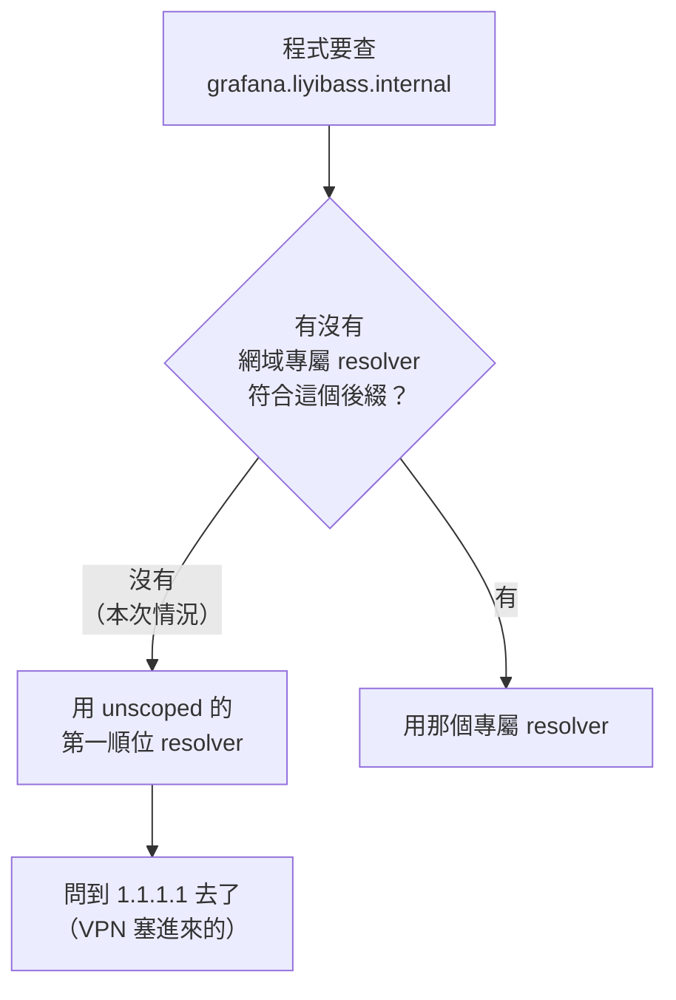
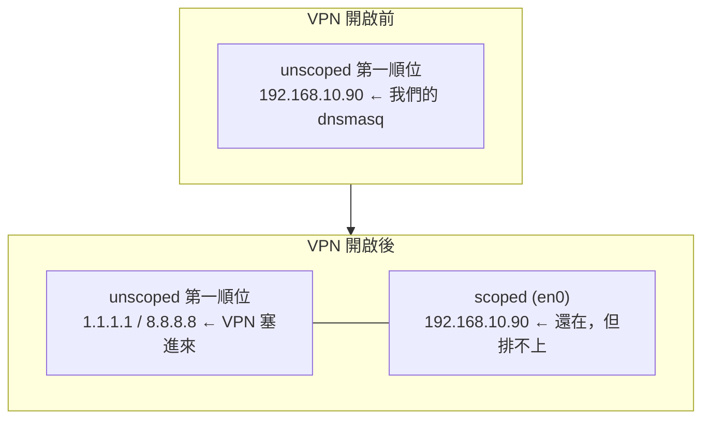

# [實戰 03] VPN 一開，內網名字就死了

> **本篇目標**：搞懂為什麼 DNS 伺服器明明好好的，客戶端卻解析不到，並學會用 macOS 的 `/etc/resolver` 做「網域分流」。
> **發生時間**：2026-08-01 傍晚　**機器**：MacBook（客戶端）、`90`、`98`

## 你會學到

- 排查 DNS 問題的第一刀該切在哪：**是伺服器答錯，還是客戶端問錯人**
- macOS 的 DNS 設定不是一份清單，而是**分層挑選**（scoped vs unscoped）
- VPN 憑什麼能蓋掉你在路由器 DHCP 設好的 DNS
- 為什麼 `ping` 通、`dig` 也查得到，瀏覽器卻說連不上
- `/etc/resolver/` — macOS 特有的「只有這個網域走這台 DNS」
- 一個反直覺的觀察：**這次症狀之所以乾脆，是因為上一篇的網域選對了**

---

## 起點：昨天還好好的

在瀏覽器輸入 `http://grafana.liyibass.internal/`，得到「無法連上這個網站」。

已知條件：

- 上一篇（[實戰 02](02-三套DNS與自架區網解析.md)）才剛在 `90` 上架好 dnsmasq，昨天與當天稍早都正常
- 路由器 DHCP 的主要 DNS 確實填著 `192.168.10.90`，次要留空（正是 02 結論要求的做法）
- 這段期間沒有動過 `90` 和 `98`

第一個念頭很自然：**「是不是我剛剛改了什麼把它弄壞了？」**

這個念頭很危險——它會讓你直接衝去 `90` 上翻設定檔、翻 log、甚至開始亂改。**在動手翻之前，先切一刀。**

---

## 排查 DNS 問題的第一刀：切開伺服器與客戶端

DNS 出問題時，只有兩種可能：

```
① 伺服器答錯了       → 問題在 90 的 dnsmasq
② 客戶端問錯人了     → 問題在你手上這台機器
```

**這兩者的症狀一模一樣**（都是「連不上」），但修的地方天差地遠。分辨它們只需要一個工具，就是上一篇結尾提過的 `dig @伺服器`：

```bash
dig @192.168.10.90 grafana.liyibass.internal
```

```
;; ->>HEADER<<- opcode: QUERY, status: NOERROR, id: 36968
;; flags: qr aa rd ra; QUERY: 1, ANSWER: 1

;; ANSWER SECTION:
grafana.liyibass.internal. 0  IN  A  192.168.10.90
```

**伺服器答得完全正確。** 順帶注意 flags 裡的 `aa` —— authoritative answer（權威回答），這證明 02 設定的 `local=/liyibass.internal/` 正在生效：dnsmasq 是用「我就是這個網域的主人」的身分回答，不是轉發來的。

`@` 這個參數的意義就在這裡：**它繞過本機所有的解析設定，直接把查詢送到指定的那台 DNS**。它答對了，就代表問題不在它身上。

於是第一刀切完，結論明確：**問題在客戶端，`90` 完全無辜。**

### 把伺服器端徹底排除

為了不留懸念，順手把整條鏈路驗完：

```bash
ping -c 3 192.168.10.90                    # 通
ping -c 3 192.168.10.98                    # 通
curl -H "Host: grafana.liyibass.internal" http://192.168.10.90/    # HTTP 302
nc -z 192.168.10.98 3000                   # OPEN
```

| 檢查 | 結果 | 證明了什麼 |
|---|---|---|
| ping `.90` / `.98` | 都通 | 網路層沒事，兩台機器都活著 |
| `dig @.90` | 正確且權威 | dnsmasq 沒事 |
| `curl` 帶 Host 標頭 | 302 | nginx 反向代理沒事（302 是 Grafana 導向 `/login`，正常行為） |
| `.98:3000` | OPEN | Grafana 本體沒事 |

> 💡 **技巧**：`curl -H "Host: ..."` 是「**跳過 DNS 但保留網域名稱**」的手法。
> 你用 IP 直接連上去，但在 HTTP 請求裡假裝自己是用名字來的——這樣就能單獨測試
> 「反向代理的 `server_name` 分流有沒有問題」，不受 DNS 影響。
> 排查有名稱路由的架構時非常好用。

整個伺服器端乾乾淨淨。所以是客戶端。

---

## macOS 的 DNS 不是一份清單，是分層挑選

在 Mac 上跑：

```bash
scutil --dns
```

輸出分成兩大段，這個分段就是答案：

```
DNS configuration                      ← 第一段：unscoped（全域）
  resolver #1
    nameserver[0] : 1.1.1.1
    nameserver[1] : 8.8.8.8
    if_index : 53 (utun30)             ← 一個 VPN 隧道介面

DNS configuration (for scoped queries) ← 第二段：scoped（綁定介面）
  resolver #1
    nameserver[0] : 192.168.10.90      ← DHCP 發下來的、我們自己架的那台
    nameserver[1] : 192.168.10.1
    if_index : 12 (en0)                ← 實體網路卡
    flags : Scoped                     ← 關鍵字
```

`192.168.10.90` **確實在裡面**——DHCP 設定沒有錯，它有被收到。但它落在 **scoped** 那一段。

### 兩段的差別

```
unscoped resolver  = 大門的總機
                     一般程式問名字，都是問他
                     
scoped resolver    = 綁在某張網卡上的分機
                     只有「明確指定要走這張網卡」的查詢才找得到他
                     一般程式不會這樣做
```

macOS 解析一個名字時的挑選順序是：



這張圖說明問題的核心：**沒有任何規則說「`.internal` 要問 `192.168.10.90`」**，所以查詢一路掉到 unscoped 的 resolver #1，而那一格已經被 VPN 佔走了。

綁在 `en0` 上的 `192.168.10.90` 從頭到尾沒被問到——**它不是設錯，是排不上。**

---

## VPN 憑什麼蓋掉你的設定

`if_index : 53 (utun30)` 這個介面是 VPN 建立的隧道。查一下是誰：

```bash
ps aux | grep -iE 'wireguard|vpn'
```

```
root  17767  ... Sat Aug  1 02:12:06 2026
      com.surfshark.vpnclient.macos.direct.PacketTunnel-WireGuard
```

時間對上了：**當天凌晨 02:12 啟動**，正是「昨天還正常」與「現在壞掉」的分界線。後來也確認同時連過公司 VPN，行為完全一樣。

### 這是功能，不是 bug

VPN 強制接管 DNS 有個正式名稱：**DNS leak protection（DNS 洩漏防護）**。

道理很直接：如果你的 DNS 查詢還是送去本地或 ISP 的 DNS，那麼「你造訪過哪些網站」這件事就從 DNS 這一側洩漏出去了，VPN 加密流量的意義就少一半。所以 VPN 客戶端會刻意把自己的 DNS 插進 unscoped 的第一順位。



> 💡 **教訓**：DHCP 下發的 DNS 是**建議**，不是**強制**。
> 客戶端上任何一個有權限改網路設定的東西——VPN、資安代理程式、某些防毒軟體——
> 都可以蓋掉它。**「我在路由器上設好了」不等於「客戶端一定會用」。**

---

## 為什麼壞得這麼乾脆？因為網域選對了

這裡有個反直覺的觀察。

`.internal` 是 [ICANN 保留給私有網路的頂級域名](02-三套DNS與自架區網解析.md)（見 02 的網域選擇表），公網的根 DNS 上**永遠不存在**這個區域。所以 `1.1.1.1` 收到查詢後，回的是明確的 **NXDOMAIN**（查無此網域）——不是逾時、不是變慢，是斬釘截鐵的「沒有這個東西」。瀏覽器立刻報錯。

**上一篇選 `.internal` 的決定，在這裡意外收到了第二份紅利。**

假設當初圖方便用了 `grafana.liyibass.com` 這種真實網域，同樣的 VPN 情境下會發生什麼？

| 網域選擇 | VPN 開啟後的症狀 | 好查嗎 |
|---|---|---|
| `.internal`（保留域） | NXDOMAIN，立刻明確失敗 | ✅ 一眼看出是 DNS |
| 真實網域 | 解析成**某個公網 IP**，連上一個不認識的網站 | ❌ 你會以為是 nginx 設定錯了 |
| `.local` | 跟 mDNS 打架，時好時壞 | ❌❌ 最難查 |

> 💡 **教訓**：**乾脆的失敗比含糊的失敗有價值得多。**
> 這跟 02 結尾「次要 DNS 不要填 8.8.8.8」是同一個道理的兩面——
> 那次是避免製造隨機失敗，這次是保留域幫你把失敗變得明確。

---

## 為什麼 ping 通、dig 也通，瀏覽器卻不通？

這組症狀看起來很矛盾，其實三者走的根本不是同一條路：

| 動作 | 有沒有經過壞掉的那條路徑 |
|---|---|
| `ping 192.168.10.98` | ❌ 直接給 IP，**根本不需要 DNS** |
| `dig @192.168.10.90 ...` | ❌ `@` 明確指定伺服器，**繞過 resolver 挑選邏輯** |
| 瀏覽器打網址 | ✅ 走完整的 resolver 挑選 → 掉到 VPN 的 DNS |

而且區網流量本身沒被 VPN 吃掉：

```bash
route -n get 192.168.10.90 | grep interface
#   interface: en0        ← 走實體網卡，不是隧道
```

這叫 **split tunnel**（分流隧道）：VPN 接管了對外流量（預設路由指向 `utun30`），但保留區網網段走本地。所以封包**送得到** `90`，只是沒人叫它去問 `90`。

> 💡 **這組症狀值得背起來**：
> **「ping 得到 IP、`dig @` 查得到、瀏覽器卻連不上」= 客戶端 resolver 順序被搶走。**
> 下次看到這三個現象同時出現，可以直接跳過伺服器端的排查。

驗證這個判斷只要一行——用系統預設路徑（而非 `dig @`）解析看看：

```bash
dscacheutil -q host -a name grafana.liyibass.internal
# （沒有任何輸出 ← 系統解析失敗，跟 dig @ 的成功形成對照）
```

**一邊成功一邊失敗，兩者的差別就是問題所在。**

---

## 三種解法

| | 做法 | 優點 | 代價 |
|---|---|---|---|
| **A** | `/etc/resolver/` 網域分流 | VPN 可以開著，只有這個網域走內網 DNS | macOS 專屬；強硬的 VPN 可能仍蓋得掉 |
| **B** | VPN 的 split tunneling（Surfshark 叫 Bypasser） | 圖形介面設定 | 治的是**路由**，DNS 未必一起放行 |
| **C** | 寫進 `/etc/hosts` | 最穩，任何 VPN 都蓋不掉 | 每台機器手動維護，IP 一改就要全部改 |

選 **A**。理由是它精準命中問題所在（resolver 挑選順序），而且不用在「要 VPN」和「要內網」之間二選一。

C 留作退路——`/etc/hosts` 在 DNS 查詢**之前**就被攔截，是最後一道保險，但它會讓 02 辛苦架的 dnsmasq 完全失去意義（新增服務又要每台機器手動加一行）。

---

## 解法 A：`/etc/resolver/` 是什麼

macOS 有一個很少人知道的機制：在 `/etc/resolver/` 底下放一個**以網域名稱命名**的檔案，就等於宣告「這個網域請問這台 DNS」。這種規則的優先級**高於** unscoped resolver，VPN 蓋不掉。

```bash
sudo mkdir -p /etc/resolver
echo "nameserver 192.168.10.90" | sudo tee /etc/resolver/liyibass.internal
```

檔名 `liyibass.internal` 就是要分流的網域，內容格式跟傳統的 `/etc/resolv.conf` 一樣。

套用後 `scutil --dns` 多出這一段：

```
domain   : liyibass.internal          ← 網域專屬 resolver
nameserver[0] : 192.168.10.90
reach    : 0x00020002 (Reachable,Directly Reachable Address)
```

回頭看前面那張流程圖——現在「有沒有網域專屬 resolver 符合這個後綴？」這個判斷會走 **有** 那一條，VPN 的 resolver #1 根本輪不到。

> 💡 **不需要重啟 `mDNSResponder`**。網路上很多教學會叫你跑
> `sudo killall -HUP mDNSResponder`，實測 macOS 會自動偵測 `/etc/resolver/` 的變更，
> 寫完檔案立刻生效。
>
> 這也是個提醒：**照抄網路指令之前，先驗證哪些步驟是真的必要的。**

### 這是整個網域生效，不只一台服務

分流的單位是**網域**，不是主機。以後在 `90` 的 dnsmasq 加 `prometheus.liyibass.internal`、`nas.liyibass.internal`，Mac 這邊完全不用再改——**這正是 C 方案（`/etc/hosts`）做不到的事**。

---

## 驗證：要在最嚴格的條件下做

驗證的關鍵是：**必須在 VPN 開著的狀態下測**。關掉 VPN 測成功毫無意義，那本來就會過。

```bash
echo "[unscoped DNS] $(scutil --dns | grep -m1 'nameserver\[0\]')"
echo "[預設路由] $(route -n get default | grep interface)"
echo "[解析] $(dscacheutil -q host -a name grafana.liyibass.internal | grep ip_address)"
echo "[內網 HTTP] $(curl -s -o /dev/null -w '%{http_code}' http://grafana.liyibass.internal/)"
echo "[外網通不通] $(curl -s -o /dev/null -w '%{http_code}' https://1.1.1.1/)"
```

```
[unscoped DNS]   nameserver[0] : 162.252.172.57     ← VPN 的 DNS，確認 VPN 開著
[預設路由]   interface: utun32                       ← 流量走隧道，確認 VPN 生效中
[解析] ip_address: 192.168.10.90                     ← 內網名字解析成功
[內網 HTTP] 302                                       ← Grafana 正常
[外網通不通] 301                                       ← VPN 沒被破壞
```

五行**同一時刻**取得，缺一不可：

- 前兩行證明**測試條件成立**（VPN 真的開著）
- 中間兩行證明**問題解決**
- 最後一行證明**沒有副作用**（沒為了修內網而把 VPN 弄壞）

> 💡 **教訓**：驗證修復時，要同時證明三件事——**條件成立、問題解決、沒有副作用**。
> 只測第二項的話，你不會知道自己是「修好了」還是「剛好 VPN 斷線了」。

---

## 代價與尚未驗證的部分

| 項目 | 狀態 |
|---|---|
| Surfshark | ✅ 實測通過 |
| 公司 VPN | ⚠️ **尚未實測** |
| 其他裝置（iPad / iPhone） | ❌ 無此機制，開 VPN 時只能用 IP 直連 |

公司 VPN 可能用更強硬的手段——把 UDP 53 整個重導向，或推送路由把 `192.168.10.0/24` 也吃進隧道。真是那樣的話 A 方案會失效，退路是 C。下次連上公司 VPN 時跑一次就知道：

```bash
curl -s -o /dev/null -w '%{http_code}\n' http://grafana.liyibass.internal/    # 302 = 正常
```

另外這個修復是**機器本地的**，不會跟著 `~/infra` repo 走。換一台電腦要重做一次——這也是為什麼要寫成這篇筆記。

移除方式：`sudo rm /etc/resolver/liyibass.internal`

---

## 指令速查

| 指令 | 用途 |
|---|---|
| `scutil --dns` | **看 macOS 的完整 resolver 分層**，排查的起點 |
| `dscacheutil -q host -a name <名字>` | 用**系統預設路徑**解析（對照組） |
| `dig @<伺服器> <名字>` | **繞過**系統設定直接問某台 DNS（對照組） |
| `route -n get <IP>` | 看到某個位址走哪張網卡（判斷 split tunnel） |
| `networksetup -getdnsservers <服務名>` | 看某個網路服務的 DNS 設定 |
| `sudo dscacheutil -flushcache` | 清 DNS 快取 |
| `ls /etc/resolver/` | 看有哪些網域被分流了 |

> `dscacheutil -q` 和 `dig @` 這一組是本篇的核心工具：
> **一個走系統預設路徑，一個繞過系統設定**。兩者結果不一致，問題就在客戶端的解析設定。

---

## 這篇與 02 的關係


這張圖說明一件容易被忽略的事：**DNS 是一組雙邊的協議，兩邊都對才會通。** 02 把伺服器端做到滿分，客戶端只要一個 VPN 就能讓整套失效——而且失效的方式讓你第一時間懷疑錯對象。

---

## 課外讀物與課程對照

> 想從頭理解 DNS 的階層與遞迴查詢 → [課外讀物 E-3-5：DNS 是什麼？](../../../課外讀物/E-3-network/E-3-5-dns.md)

> 想複習封包怎麼找到伺服器 → [課外讀物 E-3-1：網際網路是怎麼運作的？](../../../課外讀物/E-3-network/E-3-1-how-internet-works.md)

> 想理解區網位址與路由 → [課外讀物 E-3-8：NAT 是什麼？](../../../課外讀物/E-3-network/E-3-8-nat.md)

> 伺服器端是怎麼架起來的 → [實戰筆記 02：一台機器上的三套 DNS](02-三套DNS與自架區網解析.md)

> 為什麼名字要指向反向代理 → [ADR-001：路徑式 vs 子網域路由](../決策紀錄/ADR-001-路徑式vs子網域路由.md)

---

## 小練習

1. 在你的 Mac 上跑 `scutil --dns`，數數看總共有幾個 resolver。第一段（unscoped）的 `resolver #1` 綁在哪個介面上？那是實體網卡還是隧道？
2. 開啟 VPN 前後各跑一次 `scutil --dns | head -8`，比較 `resolver #1` 有什麼變化。你的 VPN 有沒有做 DNS leak protection？
3. 挑一個公網網域（例如 `github.com`），分別用 `dig @1.1.1.1` 和 `dig @192.168.10.90` 查。兩者都答得出來，但 `Query time` 和 flags 有什麼不同？（提示：回頭看 02 的「上游轉發」段落，以及本篇的 `aa` flag）
4. **進階**：如果你在 `/etc/resolver/` 放一個名為 `com` 的檔案會發生什麼事？想清楚再試，並想想這為什麼是個壞主意。
5. **進階**：`/etc/hosts`、`/etc/resolver/`、unscoped resolver 三者的優先順序是什麼？設計一個實驗來驗證你的答案，而不是查文件。
